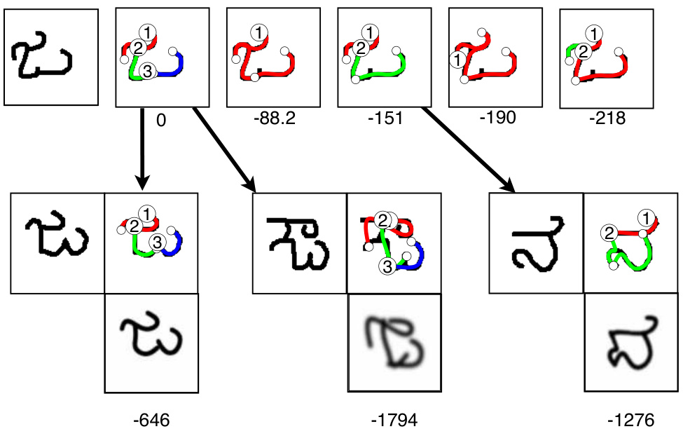
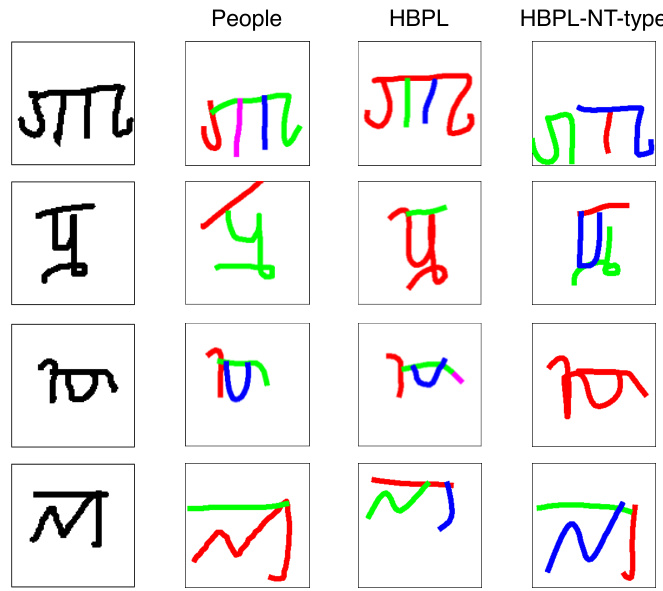
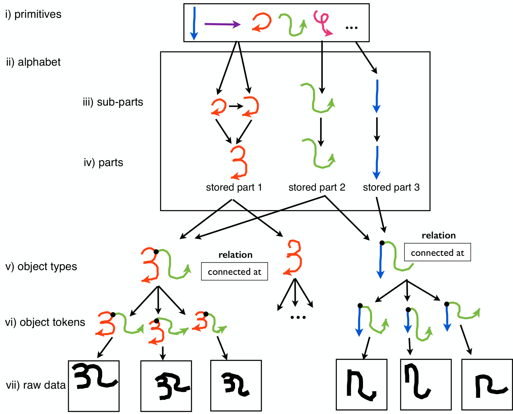
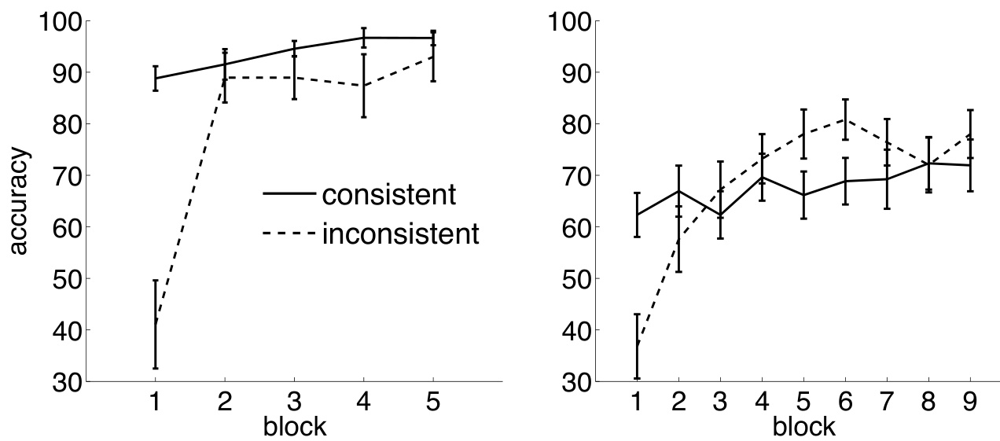

# Towards more human-like concept learning in machines: Compositionality, causality, and learning-to-learn  

by  

Brenden M. Lake  

B.S., Stanford University (2009) M.S., Stanford University (2009)  

Submitted to the Department of Brain and Cognitive Sciences in partial fulfillment of the requirements for the degree of  

Doctor of Philosophy  

at the  

MASSACHUSETTS INSTITUTE OF TECHNOLOGY  

September 2014  

c Massachusetts Institute of Technology 2014. All rights reserved.  

Author Department of Brain and Cognitive Sciences September 4, 2014  

Certified by .  

Joshua B. Tenenbaum Professor of Cognitive Science and Computation Thesis Supervisor  

Accepted by .  

Matthew A. Wilson Sherman Fairchild Professor of Neuroscience and Picower Scholar Director of Graduate Education for Brain and Cognitive Sciences  

Towards more human-like concept learning in machines:  

Compositionality, causality, and learning-to-learn  

by  

Brenden M. Lake  

Submitted to the Department of Brain and Cognitive Sciences on September 4, 2014, in partial fulfillment of the requirements for the degree of Doctor of Philosophy  

# Abstract  

People can learn a new concept almost perfectly from just a single example, yet machine learning algorithms typically require hundreds or thousands of examples to perform similarly. People can also use their learned concepts in richer ways than conventional machine learning systems – for action, imagination, and explanation – suggesting that concepts are far more than a set of features, exemplars, or rules, the most popular forms of representation in machine learning and traditional models of concept learning. For those interested in better understanding this human ability, or in closing the gap between humans and machines, the key computational questions are the same: How do people learn new concepts from just one or a few examples? And how do people learn such abstract, rich, and flexible representations? An even greater puzzle arises by putting these two questions together: How do people learn such rich concepts from just one or a few examples?  

This thesis investigates concept learning as a form of Bayesian program induction, where learning involves selecting a structured procedure that best generates the examples from a category. I introduce a computational framework that utilizes the principles of compositionality, causality, and learning-to-learn to learn good programs from just one or a handful of examples of a new concept. New conceptual representations can be learned compositionally from pieces of related concepts, where the pieces reflect real part structure in the underlying causal process that generates category examples. This approach is evaluated on a number of natural concept learning tasks where humans and machines can be compared side-by-side.  

Chapter 2 introduces a large-scale data set of novel, simple visual concepts for studying concept learning from sparse data. People were asked to produce new examples of over 1600 novel categories, revealing consistent structure in the generative programs that people used. Initial experiments also show that this structure is useful for one-shot classification.  

Chapter 3 introduces the computational framework called Hierarchical Bayesian Program Learning, and Chapters 4 and 5 compare humans and machines on six tasks that cover a range of natural conceptual abilities. On a challenging one-shot classification task, the computational model achieves human-level performance while also outperforming several recent deep learning models. Visual “Turing test” experiments were used to compare humans and machines on more creative conceptual abilities, including generating new category examples, predicting latent causal structure, generating new concepts from related concepts, and freely generating new concepts. In each case, fewer than twenty-five percent of judges could reliably distinguish the human behavior from the machine behavior, showing that the model can generalize in ways similar to human performance.  

A range of comparisons with lesioned models and alternative modeling frameworks reveal that three key ingredients – compositionality, causality, and learning-to-learn – contribute to performance in each of the six tasks. This conclusion is further supported by the results of Chapter 6, where a computational model using only two of these three principles was evaluated on the one-shot learning of new spoken words. Learning programs with these ingredients is a promising route towards more humanlike concept learning in machines.  

Thesis Supervisor: Joshua B. Tenenbaum Title: Professor of Cognitive Science and Computation  

# Acknowledgments  

First and foremost, I thank my advisor, Josh Tenenbaum. Everyone knows that Josh is a brilliant scientist, but fewer know the depth of his dedication to his graduate students. Josh always puts his students first, and I am grateful for all the long conversations at cafés, for all the late night email chains, and for the fun and inspiring lab that he creates. Josh brings excitement to all the research that he touches, and he has profoundly influenced me as a scientist and as a person.  

I am grateful for all the members of my thesis committee, including Jay McClelland, Tommy Poggio, and Nancy Kanwisher. Jay advised my undergraduate research at Stanford, proving that I have had a remarkable streak in finding mentors. Jay’s guidance over many years has proven invaluable. Tommy was always generous with his time and his insights. Nancy encouraged me to search for deeper explanations, and her influence has greatly improved this document.  

I also owe a great deal to Russ Salakhutdinov and Jason Gross. Early in my graduate career, they were in the process of collecting the Omniglot data set, and after seeing what they had, I was tremendously inspired. Following the richness in this data led to much of the work in this thesis, and Russ continues to be a valued collaborator and has had an important influence on this work.  

The CoCoSci lab is a wonderful place to be a graduate student, and I consider all my lab mates to be both my friends and colleagues. Many members, past and present, have contributed to my work, either through direct collaboration, reading a paper draft, or making an insightful comment during lab meetings. I have so many to thank: John McCoy, Tomer Ullman, Andreas Stuhlmüller, Tobias Gerstenberg, Max Siegel, Jon Malmaud, Max Kleiman-Weiner, Tejas Kulkarni, Chris Bates, Chris Baker, Eyal Detcher, Roger Grosse, Frank Jäkel, Katherine Heller, Peter Battaglia, Tim O’Donnell, Pedro Tsividis, Sam Gershman, Noah Goodman, Tejas Kulkarni, Steve Piantadosi, Peter Kraft, Jessica Hamrick, Jacob Steinhardt, Ilker Yildirim, Dan Roy, David Wingate, Josh Hartshorne, and Tao Gao. I am particularly grateful for my past and present office mates: Andreas, for being my debating and ping pong partner; John, for good company on those late nights, usually after dinner at the Royal East; Tobias Gerstenberg and Max Siegel, for making sure there was never a dull moment; Jon, for always knowing how to make code more efficient; and Max Kleiman-Weiner, for bringing a bit of Stanford 09 to MIT. Chris Baker, thanks for answering all my questions cluster and bike related. Tomer, thanks for hiding my wallet and keys in the ceiling that one time.  

Many others were the source of great ideas and great conversations, especially Owen Lewis, Charlie Frogner, Ev Fedorenko, Celeste Kidd, and Jeff Frieden. During my first year, I also benefited greatly from conversations with Aude Oliva, Tim Brady, Talia Konkle, and everyone else in Aude’s lab.  

I also treasure the opportunity I had to collaborate with Jackie Lee and Jim Glass in the CSAIL Spoken Language Systems Group, a collaboration I hope will continue. Jackie taught me a lot about automatic speech recognition, and I found all aspects of our collaboration to be rewarding. The end result appears in Chapter 6 of this thesis, which features a computational model developed in Jackie’s thesis. I also want to thank Peter Graff, Tim O’Donnell, Stefanie Shattuck-Hufnagel, Elizabeth Choi, and Josh McDermott for insightful conversations about one-shot learning and speech.  

During my final year of graduate school, I spent at least half of my time in New York City, and thus a lot of this thesis was written away from MIT. I want to thank Todd Gureckis for hosting me during this past year and making me feel welcome at NYU. Todd provided a desk, great ideas, great advice, and opportunities to speak at NYU. Many others at NYU have become friends and collaborators: Anna Coenen, Alex Rich, David Halpern, Stephanie Chen, Partricia Chan, Doug Markant, Jay Martin, Wojciech Zaremba, Bob Rehder, and Greg Murphy. Wojciech generously provided me with code for a convolutional neural network used in Chapter 4.  

My research was supported by a NSF Graduate Research Fellowship (2011-2014), a Singleton Presidential Fellowship (2009-2010), the Center for Minds, Brains and Machines (CBMM) funded by NSF STC award CCF-1231216, and ARO MURI contract W911NF-08-1-0242. Like all of the graduate students in the department, I owe a lot to Denise Heintze and Kris Kipp, who work so hard on behalf of all of us. I was responsible for more than my share of administrative tangles, but they always knew the way out. I am also grateful to the more than 2000 people who participated in my experiments. This thesis would not have been possible without the participation of so many, nor without the existence of Mechanical Turk.  

I will be forever grateful to Gary Cottrell for introducing me to cognitive science. One summer, long ago in high school, I was looking for an engineering internship. Gary donated his time to teach me how to train neural networks, how to program, and how to do research. This was quite a gift, and I have no idea what I would be doing now if it wasn’t for Gary.  

Nathan Pflueger, congratulations on your victory in the race.  

Nana, thank you for all your love and encouragement. I always look forward to your phone calls, and I fondly remember you visiting us in Cambridge.  

My grandparents, Sam and Sylvia, always encouraged me to find something that I love doing. I still find lessons in their wisdom. They did not live long enough to learn that I was pursuing a doctorate, but I hope they would have been proud.  

I am lucky to have the most wonderful brother, Dylan; parents, Wendy and David; and wife, Tammy. I treasured living in the same city as Dylan these past years, and I will miss spending so much time together. Love and support emanate from everything my mom does: helping us move across the country, furnishing our first place, weekly Skype calls, organizing summer getaways in Cape Cod, and always thinking about what we might need. Dad always wanted to know the latest about life and about work, and he always seems to impart his best advice as we jacuzzi back in San Diego. He is the perfect role model as a scientist and a father. Most of all, I am indebted to my wife Tammy, who moved with me across the country so that I could write this thesis. Her love, guidance, and encouragement were the things that mattered most. This thesis is dedicated to her.  

# Contents  

# 1 Introduction 27  

1.1 The computational problem of concept learning 28   
1.2 The puzzle of human concept learning 29   
1.3 Tradition 1: Learning from one or a few examples 31   
1.4 Tradition 2: Learning rich conceptual representations 34   
1.5 Deep learning: An alternative . 37   
1.6 Towards more human-like concept learning in machines . 39  

# Simple visual concepts as generative programs 49  

2.1 Basic empirical phenomena . 50   
2.2 Category production experiment . 54   
2.2.1 Omniglot 54   
2.2.2 The number of parts 56   
2.2.3 The shape of the parts 56   
2.2.4 The direction of the parts 60   
2.2.5 The order of the parts 60   
2.2.6 General structure and biases . 61   
2.3 One-shot classification 62   
2.3.1 People 63   
2.3.2 Models 63   
2.3.3 Results 64   
2.4 General discussion 64  

# 3 Hierarchical Bayesian Program Learning 67  

3.1 Generating a character type 70  

3.1.1 Strokes . 72   
3.1.2 Relations 76   
3.2 Generating a character token . 77   
3.2.1 Pen trajectories 78   
3.2.2 Image 79   
3.3 Learning high-level knowledge of motor programs 80   
3.3.1 Learning primitives . 81   
3.3.2 Learning start positions 83   
3.3.3 Learning relations and token variability 84   
3.3.4 Learning image parameters . 84   
3.4 Inference for discovering motor programs from images 85   
3.4.1 Discrete approximation . 85   
3.4.2 Extracting the character skeleton 87   
3.4.3 Generating random parses 87   
3.4.4 Searching for sub-strokes . 88   
3.4.5 Optimization and fine-tuning 89   
3.4.6 MCMC to estimate local variance 90   
3.5 Inference for one-shot classification 90   
3.6 Variants of the modeling approach 91   
3.6.1 Affine model . 91   
3.6.2 No Type-level Transfer Learning 93   
3.6.3 No Token-level Transfer Learning 95   
3.6.4 One spline model . 96   
3.6.5 Simple strokes model 100  

# 4 Classification, exemplar generation, and structure prediction 103  

4.1 Behavioral experiments on Amazon’s Mechanical Turk 104   
4.1.1 Participants . 104  

4.1.2 Instruction checks . 105  

4.1.3 Quality checks . 105  

4.2 One-shot classification 106   
4.2.1 Stimuli 106   
4.2.2 People 107   
4.2.3 Models . 107   
4.2.4 Results . 113   
4.2.5 Discussion 114   
4.3 One-shot generation of new examples 116   
4.3.1 People 116   
4.3.2 Models 118   
4.3.3 Visual Turing test 120   
4.3.4 Results . 123   
4.3.5 Discussion 126   
4.4 One-shot generation of new examples: Direct model comparison 127   
4.4.1 Method 127   
4.4.2 Results and discussion 128   
4.5 One-shot dynamic generation of new examples 129   
4.5.1 People 129   
4.5.2 Models . 130   
4.5.3 Visual Turing test . 131   
4.5.4 Results . 132   
4.5.5 Discussion 134   
4.6 Predicting latent dynamic structure 136   
4.6.1 Stimuli . 137   
4.6.2 Models . 137   
4.6.3 Comparing predictions to ground truth 139   
4.6.4 Results . 140   
4.6.5 Discussion 142   
4.7 General Discussion 143  

# 5 Generating new concepts  

5.1 Hierarchical Bayesian Program Learning 147   
5.1.1 Generating at set of related concepts 148   
5.1.2 Global constraints 151   
5.1.3 Inference . 154   
5.2 Generating new concepts from related concepts 157   
5.2.1 People . 157   
5.2.2 Models . 158   
5.2.3 Visual Turing test 161   
5.2.4 Results . 163   
5.2.5 Discussion 166   
5.3 Generating new concepts from related concepts: Capturing style . . 166   
5.3.1 Method 167   
5.3.2 Results and discussion 168   
5.4 Free generation of new concepts 168   
5.4.1 People 169   
5.4.2 Models . 169   
5.4.3 Visual Turing test . 172   
5.4.4 Results . 172   
5.4.5 Discussion 173   
5.5 General discussion 175  

# One-shot learning of generative speech concepts 177  

6.1 Model 179   
6.2 One-shot classification 183   
6.2.1 Stimuli . 183   
6.2.2 Humans 183   
6.2.3 Hierarchical Bayesian models 184   
6.2.4 Lesioned models 185   
6.2.5 Dynamic Time Warping 185   
6.2.6 Results and discussion 186   
6.3 One-shot generation 186   
6.3.1 Humans 187   
6.3.2 Hierarchical Bayesian models 187   
6.3.3 Evaluation procedure . 188   
6.3.4 Results and discussion 188   
6.3.5 Replication 189   
6.4 General Discussion 190   
6.5 Author contributions 191  

# 7 Conclusion 193  

7.1 Summary of main results . 194   
7.2 Implications for models of concept learning . 195   
7.3 Causality and learning new spoken words . 198   
7.4 Cultural evolution, neural recycling, and other forces in conceptual   
structure . 199   
7.5 Learning more sophisticated types of programs . 201   
7.6 Deep neural networks and human concept learning . 202   
7.7 Naive theories of artificial intelligence . 204   
7.8 Beyond simple generative concepts 206  

# A Supporting information 209  

A.1 Derivation of Bayesian classification score . 209   
A.2 Judging real versus reversed dynamics 210   
A.2.1 Visual Turing test . 210   
A.2.2 Results and discussion 210  

# References  

# List of Figures  

1-1 People can learn a new concept such as a “Segway” from just one example, grasping the concept well enough to discriminate new Segways from other similar looking types of objects. .  

1-2 Illustration of learning simple concepts through a compositional causal process. Handwritten characters are on the right and spoken words are on the left. Color coding highlights the re-use of primitive structure (motor actions or phonemes) across different objects. The speech primitives are shown as spectrograms, where the x-axis is time, the y-axis is frequency, and the shading is amplitude.  

1-3 A sample of simple visual concepts from the Omniglot dataset. . 45  

1-4 Five of the tasks used to compare people and the computational models developed in this thesis. All tasks except one-shot classification evaluated model performance with a visual Turing test, where the aggregate percent correct is shown. Images outlined in red are training data and the other images are either human or model generalizations. In this figure, the human productions are always on the left.  

2-1 The top row shows example characters from our dataset in the original printed form. Below are three example drawings from participants. . 53  

2-2 For two concepts (out of the 1600 total), each box shows the motor data produced by human drawers (left) or simple drawers (right). “Canonical” drawers are in the dotted boxes, and their distances (Equation 2.1) to the other examples are the numbers below each frame. Stroke color shows correspondence to the canonical, circles indicate the beginning of each stroke, and numbers inside circles denote stroke order. .  

2-3 A histogram analysis of the consistency in the motor data, comparing human drawers (red) with a parallel dataset of simple drawers (blue) designed as a null hypothesis. Humans are strikingly consistent across a range of statistics compared to the simple model. As labeled, some histograms pool data from characters with different numbers of strokes (e.g., {2,3} includes 2- and 3-stroke characters).  

2-4 Contour plots comparing human participants (left) vs. the parallel dataset from the simple drawing model (right). Compared to the simple drawer, participants showed a strong top-left bias for the first point of contact (top), and certain mouse velocities were strongly favored (bottom).  

2-5 One-shot classification performance based on one example of 20 different characters. Test instances were compared to each class, and the best match was selected. 6  

3-1 Illustrating the generative process behind handwritten characters. New types are generated by choosing primitive actions from a library (i), combining these sub-parts (ii) to make parts (iii), and combining parts to define simple programs (iv). These programs can be run multiple times to create different tokens, which are exemplars of the underlying concept (v). Exemplars are rendered as binary images (vi). . .  

3-2 An illustration of the HBPL model generating two character types (left and right), where the dotted line separates the type-level from the token-level variables. Legend: number of strokes $$ , relations $$ , primitive id $$ (color-coded to highlight sharing), control points $$ (open circles), scale $$ , start locations $$ , trajectories $$ , transformation $$ , noise $$ and $$ , and image $$ .  

3-3 Empirical frequency of the number of strokes in a character. 72  

3-4 Empirical frequency of the number of sub-strokes within a stroke. This variable was modeled conditional on the total number of strokes in the character.  

3-5 Illustration of likely primitive sequences. The leftmost column show the start seeds, which are individual primitives in image space. The next five columns show the most likely continuations when the next primitive is added. The primitives were plotted using the mean of their shape and scale distributions.  

3-6 Empirical distribution of the start position of strokes, binned over a 2D image grid. The distribution is modeled conditional on the stroke index in the character, where stroke 1 and stroke 2 are sampled from different distributions and all further strokes are sampled from the same collapsed distribution.  

3-7 Samples from distribution on global scale and translation transformations, where the original program is at the top left of the grid. . . 7  

3-8 A subset of primitives. The top row shows the ten most common ones, and the other rows show an additional random subset. Each primitive is a Gaussian distribution on the control points of a spline. The first control point (circle) is shown as filled, and thus the most common primitives favor drawing down and to the right.  

3-9 Size selectivity in the action primitives. The empirical histograms on size for eight otherwise identical actions (horizontal movements). The units on the x-axis are the fraction of the image canvas spanned by the movement. Primitives are arranged from most frequent (back) to least (front), where smaller actions were more frequent.  

3-10 Illustration of extracting the character skeleton. a) Original image. b) Thinned image. c) Zoom highlights the imperfect detection of critical points (red pixels). d) Maximum circle criterion applied to the spurious critical points. e) Character graph after merging.  

3-11 Illustration of the random walk choosing between three potential moves, after drawing the topmost vertical edge (in the direction of the black arrow) and reaching a new decision point. The three potential trajectories are fit with the smoothest spline that stays within the image ink and does not deviate more than 3 pixels in any direction from the original trajectory (thick yellow line). Given these smoothed trajectory options, move a) has a local angle of 0 degrees (computed between the blue and purple vectors), move b) is 28 degrees, and move c) is 47 degrees.  

3-12 Illustration of HBPL inference for parsing and then one-shot classification. a) The raw image (i) is processed by a thinning algorithm (Lam, Lee, & Suen, 1992) (ii) and then analyzed as an undirected graph (Liu, Huang, & Suen, 1999) (iii) where parses are guided random walks (Section 3.4). b) The five best parses found for that image (top row) are shown with their $$ (Eq. 3.7), where numbers inside circles denote stroke order and starting position, and smaller open circles denote sub-stroke breaks. These five parses were re-fit to three different raw images of characters (left in image triplets), where the best parse (top right) and its associated image reconstruction (bottom right) are shown above its score (approximate $$ in Eq. 3.13).  

3-13 Illustration of the affine model performing classification. HBPL parses for one character were fit to three others (left in image triplets), where the best parse (top) and its associated image reconstruction (bottom) are shown above its score (approximate $$ in Eq. 3.17).  

3-14 A set of programs with the same prior probability, under a model with no type-level transfer learning. . 95  

3-15 Conditional distributions used to generate characters from the one stroke model. a) Distribution on the number of control points in a spline. b) Position of the first control point. c) Contour plot of the transition model describing where the next control point should be placed given that the current control point is located at point $$ . .  

3-16 Illustration of the one stroke model performing classification. For description and comparison with other models, see Figures 3-12 and 3-13. 99  

3-17 The generative process behind the simple strokes model, where a character concept is defined by a set of parts with no relations. At the character token level, strokes can vary in position but not in their shape or scale. . 101  

3-18 Examples of the “simple strokes” model fitting stroke decompositions to images. 102  

4-1 Where are the other examples of the new character concepts shown in red? Answers are row 4 column 3 (a) and row 2 column 4 (b). . . . . 106  

4-2 Ten alphabets from the Omniglot dataset, each with 20 characters drawn by four different people. . 109  

4-3 HBPL performing classification. The five best parses found for that image (top row) are shown with their normalized log posterior probability ( $$ Eq. 3.7). The numbers inside circles denote stroke order and starting position, and smaller open circles denote sub-stroke breaks. These five parses were re-fit to three different raw images of characters (left in image triplets), where the best parse (top right) and its associated image reconstruction (bottom right) are shown above its score (approximate $$ in Eq. 4.1).  

109   
4-4 Error rate ( $$ ) on one-shot classification. Five different classes of models are compared with human performance. . 114   
4-5 Error rate ( $$ ) on one-shot classification. Six variants of the HBPL approach are compared with human performance. . 114   
4-6 Visual Turing test for generating new examples of a new concept, where an example image of the new concept is shown above each pair of grids. One grid was generated by 9 people and the other is 9 samples from the HBPL model. Which grid in each pair (A or B) was generated by the machine? Answers by column moving left to right: A,B,A; B,A,A 117   
4-7 Generating new examples from just a single “target” image (left). Each grid shows nine new examples synthesized by various computational models. 121   
4-8 Generating new examples with the HD model. 123   
4-9 Percent correct for human judges in a visual Turing test. Lower values indicate better model performance. Five different computational models were tested. Error bars are standard error. . 124   
4-10 Percent of human judges significantly better than chance in a visual Turing test. Lower values indicate better model performance. . 124   
4-11 Accuracy across blocks in the visual Turing test for exemplar generation. Error bars are standard error. The red dotted line indicates chance performance. 126   
4-12 Preference for HBPL ( $$ ) according to human judges in a direct comparison of two computational models. Error bars show standard error. 129   
4-13 Examples trials in the dynamic visual Turing test. The display for a trial consisted of the example image (left column), one human drawing, and one machine drawing (either HBPL, HBPL-NT-type, or another model). Dynamic movies were shown to judges, and this figure only shows the last frame. 132  

4-14 Percent correct for human judges in a visual Turing test. Lower values indicate better model performance. Five different computational models were tested. Error bars are standard error. 133  

4-15 Percent of human judges significantly better than chance in a visual Turing test. Lower values indicate better model performance. . . 133  

4-16 Illustration of interaction between transfer learning and dynamics their influence on visual Turing test performance. Error bars are standard error. 135  

4-17 Accuracy over time in the dynamic visual Turing tests. Error bars are standard error. 135  

4-18 Columns from left to right: original image, ground truth strokes, the predicted parse from HBPL, and the predicted parse from HBPL-NTtype-dyn-random. The numbers below each parse is the distance to ground truth (Equation 4.4). Stroke color shows the correspondence to the ground truth strokes, circles indicate the beginning of each stroke, and numbers inside circles denote stroke order. . 137  

4-19 Average distance between ground truth parses and predicted parses. Lower numbers indicate more accurate predictions. Four computational models were compared. Error bars are standard error. . 141  

5-1 The hierarchy behind Hierarchical Bayesian Program Learning. This chapter introduces the top arrow. 147  

5-2 The generative process for producing multiple characters from a particular alphabet. New parts (strokes) are generated by choosing primitive actions from a library (i) and combining these sub-parts (iii) to make parts (iv). Objects belonging to an alphabet are created by recombining parts to define simple programs (v). These programs can be run multiple times to create different tokens, which are exemplars of the underlying concept (vi). Exemplars are rendered as binary images (vii).  

148   
5-3 Computing the stroke overlap statistic. Original image (a) and the type-level footprint of its parse (b). Image footprints of the two strokes (c). Overlap image (d). . 152   
5-4 Distribution on stroke overlap and coverage, comparing characters in the background set (empirical) with programs sampled from the prior (theoretical). Gamma distribution fits are shown. 153   
5-5 Visual Turing test for generating new concepts from related concepts. Each pair of grids (A and B) were generated from the alphabet above it, either by people or the HBPL computational model. Which grids were generated by the machine? Answers by column moving left to right: A,B;A,B;B,B. . 158   
5-6 Generating new characters from related characters with HBPL. Each larger grid is based on the set of 10 examples above it. 159   
5-7 Illustration of the four different computational models (bottom) generating new concepts given a set of related concepts (top). 162   
5-8 Percent correct for human judges in a visual Turing test. Lower values indicate better model performance. Four different computational models were tested. Error bars are standard error. 163   
5-9 Percent of human judges significantly better than chance in a visual Turing test. Lower values indicate better model performance. . . 163   
5-10 Accuracy over time in the visual Turing tests. Error bars show standard error. 165  

5-11 Percent correct for human participants in an alphabet classification task, using test characters generated by either humans or HBPL. Error bars show standard error. 168  

5-12 Visual Turing test for generating new concepts without constraints, comparing people with HBPL-alphabet. Which grid in each pair (A or B) was generated by the machine? Answers by column moving left to right: B,A;A,B 169  

5-13 Illustration of the four different computational models generating new concepts. . 171  

5-14 Accuracy over time in the visual Turing tests. Error bars show standard error. 173  

5-15 Percent correct for human judges in a visual Turing test. Lower values indicate better model performance. Four different computational models were tested. Error bars are standard error. . 174  

5-16 Percent of human judges significantly better than chance in a visual Turing test. Lower values indicate better model performance. . . 174  

6-1 Reprint of Figure 1-2. Hierarchical Bayesian modeling as applied to handwritten characters and speech (this chapter). Color coding highlights the re-use of primitive structure (motor actions or phonemes) across different objects. The speech primitives are shown as spectrograms, where the x-axis is time, the y-axis is frequency, and the shading is amplitude. 1  

6-2 The model jointly segments the speech, clusters the segments $$ , discovers a set of units $$ , and learns the transition probability between the units $$ . Note that only speech data ( $$ ) was given to the model; the text a cat, a kite and the pronunciation are only for illustration.  

6-3 Percent of synthesized examples that human judges classified into the correct spoken word category. Parentheses indicate the language the model was trained on. Error bars are 95% binomial proportion confidence intervals based on the normal approximation. 189  

7-1 The relationship between key model ingredients and task performance. Check marks indicate the ingredient was necessary for achieving the highest level of performance. . 197   
7-2 The relationship between learning-to-learn at different levels of the model hierarchy and task performance. Check marks indicate that the ingredient was necessary for achieving the highest level of performance. Light gray cells are plausible guesses that were not formally evaluated. 197   
7-3 Performance over time in detecting machines that were “consistent” (solid lines) or “inconsistent” (dotted lines) with commonsense notions of artificial intelligence. The left plot shows a visual Turing test for exemplar generation and the right plot shows one for character generation. Error bars are standard error. Chance performance was $$ . . 205  

# List of Tables  

6.1 One-shot classification error rates 186  

# Chapter 1  

# Introduction  

How are people so smart, and how can we develop machines that learn and think in a more human-like way? Over the last several decades, there have been remarkable advances in the study of intelligence. Computer programs have beaten chess masters, painted original artwork, defeated Jeopardy champions, driven autonomous cars, and shattered records for object recognition and speech recognition. Progress has been remarkable, and yet, the best example of intelligence is still natural intelligence. The human mind is the best known solution to a diverse array of difficult computational problems that people seem to solve every day: concept learning, object recognition, scene understanding, language acquisition, speech recognition, amongst many others. Machines also struggle to reproduce many general features of human intelligence, including creativity, general purpose problem solving, and commonsense reasoning.  

Several academic disciplines with different yet overlapping goals are actively working to uncover the computational underpinnings of these abilities. For researchers interested in engineering more intelligent systems, these human cognitive abilities are some of the most challenging engineering problems in computer science, sitting at the research frontier of artificial intelligence and machine learning. For researchers interested in building a deeper computational understanding of the mind, especially in the fields of cognitive psychology, neuroscience, and cognitive science, these abilities rank amongst the greatest mysteries of the mind and brain.  

While the computer sciences and the basic sciences may bring differing goals and methodologies to the study of intelligence, there is a unique opportunity to make joint progress through a shared enterprise: reverse engineering the human solutions to everyday cognitive problems that currently elude machine solutions. By attempting to replicate these abilities in machines, we may better understand the key ingredients of human intelligence.  

# 1.1 The computational problem of concept learning  

This thesis focuses on concept learning – a core aspect of human intelligence that is difficult to reproduce in machines. Concepts are the mental representations that allow people to divide a continuously varying world into discrete categories of things. A person walking through a park will effortlessly recognize “trees,” “picnic tables,” “dogs,” “fountains,” etc., even if he or she has never seen that particular tree (or type of tree) or that particular fountain before. This piece of cognition operates so frequently and so effortlessly that it may seem mundane, but upon closer inspection, it is also quite remarkable since trees, tables, dogs, and fountains vary widely in their physical properties from one example to another. Nonetheless, people have managed to learn concepts that glue each diverse set together, as well as more abstract concepts such as all trees are “alive” or that couple in the park is in “love.”  

Children are the most practiced concept learners, acquiring an estimated ten new words per day from the age of one through high school (Bloom, 2000). Concept learning is an inductive problem, where the inferences that children and adults make seem to go far beyond the data they are given. In a typical scenario, a child may receive just a small number of positive examples of a “cat” or a “truck,” yet, remarkably, this is often enough to acquire the beginnings of the concept (E. M. Markman, 1989; Landau, Smith, & Jones, 1988; Xu & Tenenbaum, 2007). From just a handful of examples, children seem to make plausible guesses on where to draw the boundaries between concepts, carving out the infinite set of possible cats from the infinite set of all possible objects.  

The problem of learning classifiers from examples is also an active area of research in machine learning and cognitive modeling. The classifier is given a training set of objects $$ , usually represented as vectors in a features space, and category labels $$ such that $$ . The goal is to find a function $$ $$ that maps objects to category labels. The challenge is that the function must not only correctly classify the training examples, but it must also generalize well to new examples for which the labels are unknown. The best method for learning classifiers is still a matter of debate, but leading approaches include support vector machines, neural networks, decision trees, logistic regression, Bayesian networks, etc.  

# 1.2 The puzzle of human concept learning  

Despite a vast toolkit of learning algorithms and recent progress in areas like object and speech recognition, machine learning is still far from capturing the human ability to learn new concepts, at least for most interesting kinds of natural and man-made categories. Machines struggle with two of the most remarkable aspects of humanlevel concept learning. First, people can grasp the boundaries of a new concept from just one or a few examples, and even young children can make meaningful generalizations via “one-shot learning.” In contrast, the standard algorithms in machine learning require tens, hundreds, or thousands of examples to perform similarly. Furthermore, some of the most successful algorithms are the most data hungry, including recent “deep learning” neural network models that have achieved exciting new levels of performance on object and speech recognition benchmarks (Geman, Bienenstock, & Doursat, 1992; LeCun, Bottou, Bengio, & Haffner, 1998; Krizhevsky, Sutskever, & Hinton, 2012; Hinton et al., 2012).  

Second, people learn more sophisticated concepts than machines do. Far more than just a boundary in perceptual space (Solomon, Medin, & Lynch, 1999; A. B. Markman & Ross, 2003), human concepts are representationally rich, useful for not only classification, but also action, explanation, and imagination. Concepts can be used to  

make predictions about unknown properties (Rips, 1975; Murphy & Ross, 1994),  

imagine or design new exemplars (J. Feldman, 1997), ∙ parse objects into parts and relations (Biederman, 1987), provide explanations (Lombrozo, 2009; Williams & Lombrozo, 2010), ∙ communicate with others (A. B. Markman & Makin, 1998), ∙ plan actions through ad hoc categories (Barsalou, 1983), ∙ design new abstract categories of objects (Ward, 1994; Jern & Kemp, 2013), ∙ and create complex concepts through conceptual combination (Murphy, 1988). In contrast, the standard approach in machine learning is to study different functions as separate tasks with separate algorithms and separate representations, to the extent that some functions are studied at all. For people, concepts provide the unity between these functions, whereby performing a new task can change the underlying representations (Solomon et al., 1999).  

For a scientist interested in reverse engineering the mind, or for an engineer interested in building a more human-like learning capacity in machines, the key computational questions are the same: How do people learn new concepts from just one or a few examples? And how do people learn such abstract, rich, and flexible representations? Each of those two questions has spawned a largely separate tradition of research that spans multiple decades and multiple disciplines. In the sections (1.3 and 1.4) that follow, I will review the important contributions these two traditions have made to our computational understanding of concept learning. But I will also suggest that we are still far from a satisfying computational account of either question, particularly in light of the greater puzzle that arises from putting the two questions together: How is it possible that people learn such rich representations from just one or a few examples?  

As if one-shot learning was not hard enough, under any theory of learning, learning more complex representations requires more data, not less, in order to achieve some measure of good generalization (Valiant, 1984; Geman et al., 1992; McAllester,  

1998; Vapnik, 1999). Whether model complexity is measured by the number of hypotheses, the flexibility of the decision boundary, or the diffusion of prior probability, complexity always comes at the price of generalization. A simpler model will always be expected to generalize better than a more complex model, as measured by the expected difference in error rate on training examples versus new examples. The puzzle is that people seem to navigate this dilemma with remarkable agility, successfully learning rich concepts that generalize well from sparse data. How do people do it?  

# 1.3 Tradition 1: Learning from one or a few examples  

The puzzle of human concept learning has spawned two different traditions of research, focused either on computational principles for learning from sparse data (Section 1.3) or structured representations that might explain the richness of human concepts (Section 1.4). The next two sections summarize the contributions these traditions have made towards understanding concept learning; while they leave us far from a complete computational account, they do suggest three ingredients that might be central to the human ability: compositionality, causality, and learning-to-learn.  

Adults can learn a new concept from just one or a handful of examples. Imagine a person seeing an image of a “Segway” for the first time such as the image in Fig. 1-1. The raw image is just one data point in a very high dimensional space of all possible pixel images – far too little information, one might think, to learn anything about the meaning of the word. Does the word “Segway” pick out all objects that are the same color, the same size, the same material, or the same shape? Does it mean objects on a white background? Does it mean objects with a motor? Does it mean objects with two circles at the bottom with a T-shaped component floating above them? All of these meanings – and many more – are logically possible definitions for the word “Segway.” Yet people have strong expectations about how to generalize and use a new word (N. Goodman, 1954; Quine, 1960), even after just one exposure, indicating that they acquired the basics of the concept. This includes the ability to discriminate new examples of Segways from other examples of vehicles, like scooters or unicycles, ruling out many plausible yet wrong definitions of the new concept (Fig. 1-1). Although the need to learn new classes of vehicles may be uncommon, people learn new concepts all the time, whether the concept is a new type of sporting equipment, cooking contraption, workshop tool, gesture, or dance move. In each of those domains, people’s intuitions are finely tuned, in that they only seriously entertain a small subset of all possible hypotheses for any new concept.  

Children may be the most practiced one-shot learners. For a child learning language, the world is full of new concepts, and one-shot learning may play an important role in the pace of language development. Although the acquisition of each new word requires solving a difficult and highly under-constrained induction problem, a developing child knows approximately 14,000 words by the age of six, meaning that he or she acquires about nine or ten new words per day (Carey, 1978; Bloom, 2000). Borrowing a phrase from Carey (1978), this “word-learning wizardry” strongly suggests that children must be learning at least some new words from just a few examples (although see Horst and Samuelson (2008)), and research has found there are a variety of scenarios in which children can do one-shot word learning, making meaningful generalizations that go far beyond the observed data (Carey & Bartlett, 1978; Landau et al., 1988; E. M. Markman, 1989; Xu & Tenenbaum, 2007).  

What is the computational basis for one-shot learning? If the data is not enough to constrain the hypothesis, then prior knowledge must make up the difference. Bayesian analyses have shown how one-shot learning is possible with appropriately constrained hypothesis spaces and priors (Shepard, 1987; J. Feldman, 1997; Tenenbaum & Griffiths, 2001; Xu & Tenenbaum, 2007), but where does this prior knowledge come from?  

Empirical and computational work suggests that learning-to-learn – also called transfer learning or representation learning – is an important contributor to oneshot learning, the idea that prior knowledge can itself be learned over the course of learning previous concepts. Thus, an agent must learn how to learn effectively.  

  
Figure 1-1: People can learn a new concept such as a “Segway” from just one example, grasping the concept well enough to discriminate new Segways from other similar looking types of objects.  

Prior experience may highlight the most relevant features or dimensions for whole classes of concepts, such as the “shape bias” in word learning, the fact that objects with the same name tend to have the same shape, compared to other dimensions like color, texture, or size (Landau et al., 1988; L. B. Smith, Jones, Landau, GershkoffStowe, & Samuelson, 2002; Perry & Samuelson, 2011). Learning-to-learn via the shape bias has been formalized in connectionist models (Colunga & Smith, 2005) as well as learning overhypotheses in hierarchical Bayesian models (Kemp, Perfors, & Tenenbaum, 2007), which are generative models that sample multiple concepts from a common prior distribution. Learning-to-learn in hierarchical Bayesian models occurs through inferring the shared prior from previous concepts and applying it to the learning of new concepts. Not only does this class of models help to explain phenomena in word learning and inductive generalization more broadly, but they have also proven useful in machine learning applications (e.g., Salakhutdinov, Torralba, & Tenenbaum, 2011; Salakhutdinov, Tenenbaum, & Torralba, 2012; Jia, Abbott, Austerweil, Griffiths, & Darrell, 2013).  

One limitation of these models is that the relevant features and dimensions must be defined in advance, whereas people learn new features as they learn new concepts (Schyns, Goldstone, & Thibaut, 1998; Austerweil & Griffiths, 2013). Several computer vision architectures can adapt previously learned features (Bart & Ullman, 2005) or use previously learned feature priors (Fei-Fei, Fergus, & Perona, 2006) to reduce the amount of training data they need to recognize new object classes. Recently, the hierarchical Bayesian approach has been combined with neural networks models to jointly learn a feature vocabulary, while also learning different priors for different superordinate object classes (like mammals vs. vehicles) (Salakhutdinov, Tenenbaum, & Torralba, 2013).  

Learning-to-learn and hierarchical Bayesian modeling shows how one-shot learning is possible with the right constraints, and that the constraints themselves can be learned from previous experience. Nonetheless, many aspects of one-shot learning remain unexplained. These models have only been applied to the simplest types of conceptual representations – usually prototypes in a feature space (Rosch, Simpson, & Miller, 1976). Other approaches have been applied to one-shot learning such as explanation-based learning (e.g., Mitchell, Keller, & Kedar-cabelli, 1986), but the limitations are similar; these models learn logical definitions for concepts (Bruner, Goodnow, & Austin, 1956) which are too simple to explain the vast majority of natural concepts (Murphy, 2002). More sophisticated types of representations have been beyond the scope of one-shot learning, but they have been the focus of a second tradition of research on concept learning.  

# 1.4 Tradition 2: Learning rich conceptual representations  

A different tradition of research has focused on the format of conceptual representation rather than the speed of concept learning. As mentioned in Section 1.2, one indicator of the representational complexity is the variety of functions that concepts support (Solomon et al., 1999; A. B. Markman & Ross, 2003). Concepts are not just for classification – they support action (Barsalou, 1983), communication (A. B. Markman & Makin, 1998), imagination (Ward, 1994; Jern & Kemp, 2013), explanation (Lombrozo, 2009; Williams & Lombrozo, 2010), and composition (Murphy, 1988). These abilities are not independent, rather they hang together and interact (Solomon et al., 1999), coming for free with the acquisition of the underlying concept. After one exposure to a Segway (Figure 1-1), people could sketch a range of new instances, infer missing or occluded parts, parse a Segway into its necessary components (wheels, handlebars, motor, etc.), reason about the concept in unfamiliar situations (underwater), and even create new complex concepts through conceptual combination (“apartment Segway” vs. “mountain Segway”).  

Another indicator of representational complexity is the interaction between concepts and background knowledge. A review by Murphy (2002) found that these “knowledge effects” have surfaced in seemingly every conceptual function that researchers have checked. While the effects are broad, they can be particularly pronounced when learning new concepts, with background influence flowing from previously learned features (Schyns & Rodet, 1997), previously learned concepts (Wattenmaker, Dewey, Murphy, & Medin, 1986), and more abstract conceptual schemas that explain why certain features hang together (Pazzani, 1991; Murphy & Allopenna, 1994). Furthermore, causality – knowledge of the underlying causal process that produces examples of a category – has been shown to influence the learning of new concepts. Experiments show that providing a learner with different types of causal knowledge changes how they learn and generalize, whether it is by manipulating the causal network that underlies the features of objects (Rehder & Hastie, 2001; Rehder, 2003) or the causal prescription for drawing a new type of handwritten character (Freyd, 1983).  

Given the demanding role that any theory of conceptual representation must fill, it is clear that concepts are far more than a collection of features, exemplars, prototypes or rules, as was popular in early cognitive models (Rosch et al., 1976; Medin & Schaffer, 1978; Nosofsky, Palmeri, & McKinley, 1994) and in conventional machine learning (e.g., support vector machines and Kernel density estimators). One way of capturing richer conceptual structure is to build compositional representations, a seemingly necessary ingredient for capturing abilities like conceptual combination and imagination. Structural description models (e.g., Winston, 1975; Hummel & Biederman, 1992) capture key notions of parts and relations that may play important roles in the perception, learning, and organization of concepts (Tversky & Hemenway, 1984; Biederman, 1987; Augustine, Smith, & Jones, 2011). In this framework, a Segway might be represented as two wheels connected by a platform, which supports a motor and a post with handlebars, etc. This type of representation may also serve to facilitate learning-to-learn. Previous learning about the parts and relations common to many similar types of concepts, such as other vehicles like scooters and unicycles (Figure 1-1), could help to construct a good representation for Segways from existing primitives elements.  

The influence of causality on learning and representation has been more difficult to operationalize computationally. Concepts have been likened to intuitive theories or causal explanations that give meaning to concepts (Murphy & Medin, 1985), “gluing” features to objects that let core features stick while other equally applicable features wash away. Borrowing examples from Murphy and Medin (1985), the feature “flammable” is more closely attached to wood than money due to the underlying causal roles of the concepts, even though the feature is equally applicable to both based strictly on the definition. Features can also be glued to other features, such as “can fly,” “has wings,” and “has feathers,” again supported by their underlying causal role in flying. Something like an intuitive theory could also explain how categorization judgments can follow from observing previously unassociated features. For instance, a man that jumps into a pool with his clothes on can be identified as “drunk,” even if the features “in pool” and “has clothes on” were not previously associated with that category. A related view holds that concepts are simulators, capable of bottom-up perceptual inference and top-down simulation (Barsalou, 1999); “if a simulator for a category can produce a satisfactory simulation of a perceived entity, the entity belongs to the category” (p. 587).  

Like in concept learning, causality has been influential in theories of perception as well, relating to the classic “analysis-by-synthesis” idea that sensory data can be more richly represented by modeling the process that generated it. The canonical examples of this approach are speech and visual perception (Bever & Poeppel, 2010). For instance, some have argued that the richness of speech perception is best explained by inverting the production plan, at the level of vocal tract movements, in order to explain the large amounts of acoustic variability and the blending of cues across adjacent phonemes (Liberman, Cooper, Shankweiler, & Studdert-Kennedy, 1967). While analysis-by-synthesis is typically applied to perception, there has been recent interest in learning generative conceptual representations from experience. While these models are still far simpler than needed to learn complete causal theories, they are beginning to grapple with the types of compositional and causal representations needed for generating real world complexity. For instance, something like a generative grammar (Tu, Chen, Yuille, & Zhu, 2005; S.-C. Zhu & Mumford, 2006; L. Zhu, Chen, & Yuille, 2009; Savova, Jakel, & Tenenbaum, 2009) or a generative program (Stuhlmuller, Tenenbaum, & Goodman, 2010) may be needed to capture concepts like “houses” (Koning & Eizenberg, 1981) that can vary in both the number and configuration of their parts (windows, doors, chimneys, etc.), much like syntactic structure in language. But it takes children years to induce the grammars of their native languages, and formal analyses in linguistics typically study the problem as the number of examples approaches infinity rather than one. Given the scope of the challenge, there have been few successes in learning grammars or programs for natural concepts from just one or a handful of training examples.  

# 1.5 Deep learning: An alternative  

Deep learning – a leading machine learning approach – seems to eschew both of the traditions outlined above, focused instead on scaling-up models to learn from larger and larger datasets while maintaining the classic representational commitments of neural network models in cognitive science (e.g., Rumelhart, McClelland, & the PDP research Group, 1986). The typical form of representation involves multiple layers of neuron-like processing units and their connection weights, and the standard mode of learning involves a gradual adaptation of those weights to many training examples. Recently, there has been remarkable progress from this class of models on various machine learning benchmarks; progress that has been so swift that it has captured the attention of much of the field of machine learning, the tech industry, and the even popular press. For example, a recent deep convolutional neural network nearly halved the error rate of the previous state-of-the-art on the most challenging object recognition task to date (Krizhevsky et al., 2012).  

What was the secret to this success? While there have been important architectural and training advancements, deep networks are not new; the basic architecture for convolutional networks – like the network used to substantially improve object recognition (Krizhevsky et al., 2012) – was proposed in Fukushima (1980) and its learning algorithm was developed at least twenty-five years ago (LeCun et al., 1989). While there have been a number of technical developments since then, the progress seems to be driven primarily by scaling up. Computational advancements have greatly expanded the size of trainable deep learning models, where the Krizhevsky et al. (2012) network had 8 layers of simple neuron-like units and 60 million trainable parameters. Since bigger models require bigger data sets, recent datasets for training models now include millions of example images across thousands of categories.  

As these models continue to grow, is human-level concept learning just beyond the horizon? Is more data, more parameters, deeper models, and more Graphics Processing Units (GPUs) all that will be needed to reach human-level concept learning, as some of the hype around these models may suggest? We do not know the answer yet, but if the previous analysis of human concept learning is correct, there is still far to go and there is still difficult conceptual work to be done. A focus on learning bigger neural networks using bigger data has been narrowing the gap between human and machines in classification performance, but it runs the risk of ignoring or widening the gap in other respects, including the two places previously mentioned as key computational challenges. (1) Learning with bigger data is unlikely to help explain how people learn from just one or a few examples, and (2) learning better classifiers may not naturally lead to general purpose conceptual representation that generalize flexibly to new tasks (see Szegedy et al., 2014).  

This is not to say that deep learning will not play an important role in understanding human concept learning. But its current direction may not be ideally suited for capturing some of the most remarkable aspects of human-level concept learning. Also, while deep learning provides a natural platform for learning-to-learn and developing hierarchical representations, it is a less elegant interface to other principles that may play an important role in human concept learning, such as the notions of compositionality or causality developed in Sections 1.3 and 1.4. Thus, deep learning can help test the necessity of these principles, which is one of the roles these models play in this thesis. If these principles are indeed as important as they seem prima facie, their incorporation into deep learning could fruitfully develop and ultimately strengthen the approach.  

# 1.6 Towards more human-like concept learning in machines  

There has been real progress in understanding human concept learning, spanning multiple approaches and multiple disciplines, but we are still far from a unified computational account. Models of one-shot learning have been developed for the simplest types of representations such as sets of features, rules, or prototypes; they have not yet been developed for more sophisticated types of representations like structural descriptions, grammars, or programs. Deep learning methods have led to exciting progress on tasks such as object classification and speech recognition, but it is unclear how this progress translates to one-shot learning or others tasks that rely on conceptual knowledge.  

This thesis has two goals. The first goal is to develop a set of challenging concept learning tasks that allow humans and multiple computational approaches to be compared side-by-side. In this thesis, humans and machines are compared on multiple natural forms of generalization such as one-shot classification, one-shot exemplar generation, predicting latent structure, and generating new types of concepts. This is a more diverse set of evaluations than is typically used in machine learning or in evaluating cognitive models of concept learning. For models to be successful, they must both learn from sparse data and learn sophisticated task-general representations, two aspects of human concept learning that are not often studied together.  

The second goal is to develop a new computational framework that performs better on these problems than existing approaches. Chapter 3 introduces Hierarchical Bayesian Program Learning (HBPL), a model that utilizes compositionality, causality, and learning-to-learn to rapidly acquire generative models from just one example. It brings together multiple computational ideas from the different traditions of research on concept learning (Sections 1.3 and 1.4). When tasked with one-shot concept learning, the model aims to explain the raw sensory data by finding a casual generative process that could have produced it, where the causal process is the operationalization of a concept.  

While analysis-by-synthesis has been influential in perception, there are difficulties in adopting this approach to one-shot concept learning. The structure of the computational problem makes it far more challenging. Perceptual classification of sensory data $$ (e.g., a handwritten digit) involves selecting a category $$ (the categories “0” through “9”). The analysis-by-synthesis framework uses a generative model $$ that describes how each class generates its exemplars by defining a probability distribution over the space of exemplars. The generative models $$ , which could be complex causal process with multiple steps and and multiple layers of structured representations, have already been learned, perhaps from a very large number of examples (e.g., Hinton & Nair, 2006). Classification just requires an evaluation of the posterior distribution using Bayes’ rule  

$$

$$  

If each category has equal prior probability $$ , a simple decision rule that chooses  

the best category reduces to  

$$

$$  

Even though the likelihood $$ may be hiding substantial complexity and that makes it difficult to evaluate, the perceptual classification problem assumes much of the hard work has already been done – in terms of acquiring the generative model for each class.  

There are good reasons to think an analysis-by-synthesis approach would not be successful for one-shot concept learning. Learning of a generative process from one example $$ can be formulated as the selection of an unknown causal model $$  

$$

$$  

Similarly, if the goal is to choose the most likely structure, rather than the more ambitious goal of maintaining a distribution over all possible structures, the learning problem becomes  

$$

$$  

Rather than just considering $$ discrete possibilities, as in classification, the search process must consider a large, combinatorial, and potentially infinite space of structured causal models (graphs, grammars, programs, etc.). Not only are there computational challenges in searching this space, but even if an effective search can be conducted, learning might still require many training examples in order to generalize well to new examples (Section 1.2).  

Nonetheless, people seem to learn rich conceptual representations from just one or a few examples. How do they do it? This thesis is a case study of concept learning as Bayesian program induction – the idea that concepts can be represented by structured procedures for generating examples. How can good programs be learned from one example? This thesis introduces an approach called Hierarchical Bayesian Program Learning (HBPL) that defines a prior distribution over a space of programlike concepts; in other words, it is a generative model for generative models. The specific models developed in this thesis implement domain specific knowledge and would require modification to be applied more generally. But this type of domain specific knowledge may be necessary to capture the knowledge that people bring to bear when learning a new concept, and beyond any particular domain, the approach is committed to three key ingredients for learning good programs.  

Compositionality applies to representations that are constructed through a combination of parts. As discussed in Section 1.4, the idea of decomposing perceptual observations into primitive elements has been influential and widely applicable: objects can be decomposed into natural parts (e.g., Hoffman & Richards, 1984; Tversky & Hemenway, 1984; Biederman, 1987), spoken words can be decomposed into phonemes, and handwritten characters can be decomposed into strokes of the pen. Not all part decompositions are equally good – a sentence can be composed into a series of words or a series of characters – and this definition of compositionality aims for the most general sense, agnostic to the type and quality of the parts.  

Causality is a feature of some generative models that captures, at an abstract level, aspects of the real causal process that produces examples of a category. For a handwritten character, a causal model could be a motor program that produces new examples, and for a spoken word, a causal model could be a sequence of articulatory gestures that defines a word. Not all causal processes are equally tractable to learn, and one-shot learning might only be a sensible goal for a special subset of causal conceptual representations – ones that capture a generative process at just the right level of abstraction. If a human or machine was trying to learn the concept “tree” from just a single example, it would be hopeless to try to learn or even represent a fully-detailed process of biological growth, beginning with the tree genome and ending with the set of all possible trees. But at the right level of abstraction, the essence of a tree could be captured by a simple stochastic program, starting with one branch and then recursively splitting until the tree terminates. Different types of concepts may have more or less transparent causal processes for the purposes of learning; nonetheless, causality seems to play a wide role in conceptual representation, particularly through mechanisms such as essentialism (S. A. Gelman, 2003) and intuitive causal theories (Murphy & Medin, 1985).  

Learning-to-learn is a term going back to Harlow (1949) and often used interchangeably with “transfer learning” or “representation learning.” It is the idea that parameters, constraints, parts, features, etc. are learned through previous experience with related concepts and then applied to the task of learning new concepts. For one-shot concept learning to be possible at all, the hypothesis space would have to be strongly constrained by prior knowledge, and learningto-learn is one route to building finely tuned priors (Section 1.3). In hierarchical Bayesian modeling (A. Gelman, Carlin, Stern, $$ Rubin, 2004), the prior on concepts is shared by multiple concepts, where the prior itself is learned over the course of learning the concepts. For discriminative models such as convolutional networks and classic object recognition approaches, learning-to-learn can occur through the sharing of features between the classifiers learned for old objects and the classifiers learned for new objects (Torralba, Murphy, & Freeman, 2007; Salakhutdinov et al., 2011; Srivastava & Salakhutdinov, 2013; Zeiler & Fergus, 2013). For the models developed in this thesis, learning-to-learn occurs through multiple routes at multiple levels of the hierarchical generative process, where previously learned primitive actions (Chapter 3) and larger generative pieces (Chapter 5) can be re-used and re-combined to define new generative models. Further transfer occurs by learning about the typical level of variability in exemplars, providing the model with knowledge of how far to generalize from one example.  

These ingredients also combine synergistically where the whole may be larger than the sum of its parts. People seem to be able to learn rich causal generative models or programs from one example, but as discussed, there are major theoretical and practical issues when trying to develop this ability in machines (Section 1.2). But generative models do not need to be learned from scratch, and learning-to-learn may play an important role in overcoming these obstacles through the development of prior knowledge. Previously learned generative pieces can be re-used and re-combined compositionally to define new generative models, providing a foundation of strong yet flexible prior knowledge for one-shot learning. This idea is illustrated in Figure 1-2 for handwritten characters and spoken words, where the generative pieces of handwritten characters are strokes and sub-strokes and the generative pieces of spoken words are phonemes or primitive articulatory gestures.  

  
Figure 1-2: Illustration of learning simple concepts through a compositional causal process. Handwritten characters are on the right and spoken words are on the left. Color coding highlights the re-use of primitive structure (motor actions or phonemes) across different objects. The speech primitives are shown as spectrograms, where the x-axis is time, the y-axis is frequency, and the shading is amplitude.  

In this thesis, the primary avenue for evaluating these ideas is through an in depth case study of learning simple visual concepts, specifically handwritten characters from alphabets around the world. This domain offers a large number of novel, high-dimensional, and cognitively natural stimuli (Figure 1-3). The objects are significantly more complex than the simple artificial stimuli most often modeled in psychological studies of concept learning, yet they remain simple enough to hope that a computational model could perceive most of the structure that people do, unlike domains such as natural scenes.  

People can learn a new handwritten character from just one example, yet handwritten character recognition in machine learning is typically studied after hundreds or thousands of examples, such as the well-known MNIST benchmark for digit recognition that uses 6000 examples per class (e.g., LeCun et al., 1998). In order to study how people and machines learn many possible concepts from just one or a few examples each, we collected a dataset called “Omniglot” (Lake, Salakhutdinov, & Tenenbaum, 2012; Salakhutdinov et al., 2013). While similar in spirit to MNIST, rather than having 10 characters with 6000 examples each, it has over 1600 characters with 20 examples each – making it more like the “transpose” of MNIST. Chapter 2 uses the Omniglot data set to conduct a large scale empirical study of the category production. The results suggest that people learned new concepts with a surprisingly consistent internal structure, and this finding directly inspired the computational models that follow in later chapters.  

  
Figure 1-3: A sample of simple visual concepts from the Omniglot dataset.  

The hierarchical Bayesian models that we develop learn to represent these visual concepts as simple stochastic programs from one example composed of pen strokes and their spatial relations. Pen strokes are operationalized as sequences of stochastic motor primitives (Fig. 1-2-i), which can be re-used and combined in new ways to define a new generative model of a character (Fig. 1-2-iii). A learned generative model for a character is a stochastic motor program that can produce a different example of a character every time it run (Fig. 1-2a-iv).  

Six different tasks were used to compare people and various different types of computational models, spanning a range of natural ways to generalize these simple visual concepts: one-shot classification, one-shot exemplar generation, one-shot exemplar generation with dynamic predictions, latent dynamic structure prediction, new concept generation from related concepts, and free generation of new concepts. Figure 1-4 illustrates five of these tasks and foreshadows the results. First, the model is able to perform a one-shot classification task at human-level performance. Second, it was evaluated on four “visual Turing tests” inspired by Turing’s famous criterion for the assessment of artificial intelligence (Turing, 1950; French, 2002). We asked people and the computational models to perform the same task and then judges were asked to discriminate the human responses from machine responses. In each task, less than 25% of judges were significantly better than chance performance, suggesting that in many cases, the model can generalize in ways indistinguishable from human performance.  

Chapters 4 and 5 investigate each of these tasks in detail, showing that our approach can fool judges in ways that other models do not. What cognitive and computational principles are responsible for the differences? A combination of model comparisons and lesion analyses reveal that all three principles – compositionality, causality, and learning-to-learn – impact model performance across the tasks. In fact, each principle has some role to play in each of the six tasks, where the specific roles are discussed after the results of each task. Also, as detailed in Chapters 4 and 5, the role of learning-to-learn is the most complex, and our investigations show that transfer across different levels of the model hierarchy can become more or less important depending on the task demands.  

This is the outline for the rest of the thesis. Chapter 2 reviews a range of empirical evidence for the type of models introduced in later chapters, and it also covers a large-scale behavioral study of one-shot category production that reveals some of the basic structure to the programs that produce handwritten characters. Chapter 3 introduces the compositional causal model that attempts to capture this structure by modeling one-shot learning as program induction. Chapter 4 compares humans and machines on the tasks of one-shot classification, one-shot exemplar generation, and latent structure prediction. Chapter 5 investigates more creative tasks that involve  

  

Figure 1-4: Five of the tasks used to compare people and the computational models developed in this thesis. All tasks except one-shot classification evaluated model performance with a visual Turing test, where the aggregate percent correct is shown. Images outlined in red are training data and the other images are either human or model generalizations. In this figure, the human productions are always on the left.  

generating new types of concepts. Chapter 6 describes some related investigations into the one-shot learning of spoken words, and Chapter 7 offers some concluding remarks.  

# Chapter 2  

# Simple visual concepts as generative programs  

Douglas Hofstadter wrote that “The central problem of Artificial Intelligence is the question: what is the letter ‘ $$ ’ ?” (Hofstadter, 1985). He went on to postulate that for a computer program to truly understand the letter $$ , so that it can recognize it in all possible fonts and handwriting styles and learn new fonts from just a few letters, that program would likely have to be AI complete. Whether or not this will turn out to be the case, building a complete computational understanding of letters is a remarkable challenge.  

Six tasks with handwritten characters are studied in the chapters that follow, which are important sub-problems of Hosftadter’s larger challenge that encompasses both handwritten characters, typed characters, and concepts of font (McGraw, 1995; Hofstadter, 1996; Rehling, 2001). The approach we take is to learn characters as simple programs that are causal, dynamic, and compositional, akin to a motor program consisting of multiple pen strokes. This is in contrast to leading theories of letter perception Grainger, Rey, and Dufau (2008) and leading machine learning algorithms (LeCun et al., 1998; Salakhutdinov & Hinton, 2009) that identify letters through the extraction of features. While there is certainly still a role for featurebased approaches, and the program-like knowledge may serve to complement rather than replace other sources of knowledge, these programs play an essential role in the  

tasks that follow.  

This chapter begins by reviewing behavioral and neuroimaging results that suggest simple programs as a plausible form of representation for these simple visual concepts. This chapter also presents a large-scale empirical study of concept production with novel characters, serving to identify the key structure these programs have. These findings inform the computational models introduced in later chapters.  

# 2.1 Basic empirical phenomena  

Is there empirical evidence that people represent characters by sophisticated causal representations, and do these representations play a role in perception and learning? There are a number of ways in which knowing how to produce (write) a character can influence perception. An early study by Freyd (1983) documented the influence of writing knowledge on classification, directly testing an analysis-by-synthesis theory of character recognition. Participants were shown videos of characters being drawn, where participants saw the final stroke drawn either upwards or downward. In a subsequent classification task with distorted static examples, participants were faster at classifying examples that were distorted in a way consistent with their production knowledge. Similarly, this type of prior production knowledge about stroke direction can influence apparent motion if a character appears stroke-by-stroke on a screen, even overriding perceptual grouping cues (Tse & Cavanagh, 2000).  

While those studies showed that production influences perception, Babcock and Freyd (1988) showed that perception influences production, and that people can infer latent causal representations from static images. A first group of participants performed a speeded drawing task, using instructions A or B that specify different pen directions (up vs. down) for the final stroke. The most distorted participant in each condition was chosen for the second stage of the experiment. Another group of participants learned to classify the characters drawn previously, viewing static examples from either condition A (up) or B (down). In a later production task, participants were asked to draw these characters from memory, and they tended to draw the final strokes consistent with the learned examples, either up or down, despite having never written the character before or even seen it written.  

James and Atwood (2009) proposed that production knowledge might interact with perception through changes in the functional specificity in visual cortex. Adults received training that was either visual only, typing, or writing based with pseudoletters over several sessions. In a fMRI scanner, they performed a one-back matching task with trained novel letters vs. untrained ones, before and after training. For two critical letter regions in visual cortex including the left posterior fusiform near the visual word form area (Cohen et al., 2000), only writing training increased the BOLD response when comparing trained versus untrained letters. Another study with children from four to five years old showed that writing experience changes the letter-specialization of visual cortex (James, 2010). Children received either visual or motor training with Latin letters over several sessions. Only the motor training increased the response of the left posterior fusiform regions.  

Taken together, these studies show two important and inter-related results that support the computational model to be described in Chapter 3: features of the latent causal dynamics can be automatically inferred through the process of learning (Babcock & Freyd, 1988), and these features can go on to influence classification and other aspects of perception such as classification and apparent motion (Freyd, 1983; Tse & Cavanagh, 2000).  

Other results suggest the intriguing possibility that the brain uses partially overlapping neural representations for both the production and perception of characters. James and Gauthier (2009) found interference effects between writing and perception, suggesting a shared resource account. Participants were asked to visually identify letters under noise while concurrently writing different letters. The authors found evidence for specific interference effects, where identifying letters with curvy strokes was more difficult while writing curvy letters compared to straight letters, and vice versa for identifying letters with straight strokes.  

Supporting this behavioral evidence, neuroimaging studies have confirmed that motor systems are active during the perception of static characters. To study this potential link, researchers have typically compared characters that participants have experience drawing (such as Latin characters) with another type of object they have no (or much less) experience drawing. In one of the first of these studies, Longcamp, Anton, Roth, and Velay (2003) showed participants printed Latin characters, pseudocharacters that look like letters from a foreign alphabet, and a control character that was three parallel lines. Using a region of interest (ROI) defined from activation during a writing task, the authors found stronger activity in left premotor cortex for the Latin characters compared to either pseudo-characters or the control. In a related design, James and Gauthier (2006) looked at the same ROI when participants viewed letters, faces, and objects. They found this region responded stronger to letters when compared to faces or objects.  

While the two studies mentioned used printed characters rather than handwritten characters, and it is possible that these different types of stimuli could show different neural signatures. Two studies found that the hand region of left primary motor cortex responded more to static handwritten than static printed characters, using both MEG (Longcamp, Tanskanen, & Hari, 2006) and fMRI (Longcamp, Hlushchuk, & Hari, 2010).  

While this neuroimaging evidence does not establish a causal relationship on its own, it is suggestive when paired with the previous evidence that production knowledge has behavioral signatures during perception. Additional supporting evidence comes from a lesion study by S. W. Anderson, Damasio, and Damasio (1990). The authors describe a patient with a surgical lesion to a left premotor area that resulted in impaired performance for reading and writing of letters. This suggests that this region, near the ROI of Longcamp et al. (2003), plays an active role in both perceptual and motor processes. Interestingly, however, numbers rather than letters were unimpaired in the patient for both reading and writing measures.  

Thus, there are many sources of evidence for the idea that dynamic causal representations play an important role in perception and learning. Most of these studies focused on familiar characters, such as a person’s native alphabet (e.g., James & Gauthier, 2009; Longcamp et al., 2003) or novel characters after extensive training (e.g., Freyd, 1983; James & Atwood, 2009). It is still unclear whether similar types of representations might be used when learning characters that are completely novel with no directly relevant writing experience.  

  
Figure 2-1: The top row shows example characters from our dataset in the original printed form. Below are three example drawings from participants.  

A notable exception is Babcock and Freyd (1988), which as discussed, showed that participants inferred the direction of the last stroke in a completely novel character. But by only studying the direction of one stroke, Babcock and Freyd (1988) did not investigate the full depth and richness of these causal inferences nor the full structure of these inferred motor programs. This chapter presents a large-scale experiment conducted on Amazon Mechanical Turk designed to study the scope of these inferences. Participants drew novel character concepts after seeing just a single example, a task we refer to as “one-shot category production" that follows a long tradition of using the generation of category exemplars as a window into conceptual representation (e.g., Battig $$ Montague, 1969; Rosch et al., 1976; J. Feldman, 1997; Jern & Kemp, 2013). Our large-scale study produced about 32,000 images of characters across a set of 1600 concepts, and the on-line drawing trajectories were recorded for each image.  

From the production data, we analyzed the extent to which people can infer a robust motor program representation from a single example of a novel character. We also analyzed the key structure present in these programs, including a consistent set of parts, orderings of the parts, and directions of the parts. We also compared people and an algorithm based on motor data on a one-shot classification task, testing the plausibility of motor programs as a representation useful for classification.  

# 2.2 Category production experiment  

When people perceive a new character, in what sense do they infer a new concept? While this mental representation might be just a bundle of features, the concept might also include richer structure in the space of motor programs. To investigate this possibility, we analyzed how multiple drawers produced a particular concept during the drawing production task. We reasoned that in order to do this task, participants must infer a novel motor program, which will be reflected in the time course of drawing. Consistency in the structure of these drawings would provide evidence for two interlinked claims: people seem to grasp the same underlying concept from one example, and this concept includes a highly structured generative program. To investigate that type of structure present in these programs, for a given character, we quantitatively analyzed the number, shape, direction, and order of the parts (strokes) in the motor data.  

# 2.2.1 Omniglot  

The studied concepts were 1,600 characters elected from 50 different alphabets on www.omniglot.com, which includes scripts from natural languages (e.g., Hebrew, Korean, Greek) and artificial scripts (e.g., Futurama and ULOG) invented for purposes like TV shows or video games. The characters were taken from the web in printed fonts, and several originals and their subsequently drawn images are shown in Figure 2-1. The drawing experiment was run through Amazon Mechanical Turk, and participants were asked to draw at least one entire alphabet. For each template image, they were asked to draw each character as accurately as possible. An alphabet’s printed characters were displayed in rows on a web page, with an associated drawing pad below each image. Participants could draw by holding down a mouse button and moving the mouse, and we also included “forward,” “back,” and “clear” buttons. Some participants made minor image adjustments with small mouse movements, and we tried to mitigate this inconsistency by excluding strokes that were very short in time and space from the analysis.  

  
Figure 2-2: For two concepts (out of the 1600 total), each box shows the motor data produced by human drawers (left) or simple drawers (right). “Canonical” drawers are in the dotted boxes, and their distances (Equation 2.1) to the other examples are the numbers below each frame. Stroke color shows correspondence to the canonical, circles indicate the beginning of each stroke, and numbers inside circles denote stroke order.  

# 2.2.2 The number of parts  

This analysis (and subsequent ones) used just 20 of the alphabets in the dataset, excluding the six most common as determined by Google hits. The simplest statistic to analyze was the number of parts. For each character, we investigated whether the drawers clustered around a common number of parts (the mode number across participants). Aggregating across each drawing in the dataset, the histogram in Figure 2-3A (red) shows the absolute difference between the actual number of strokes and the mode number of strokes from all of the drawings of that character. Although this distribution is guaranteed to peak at zero, a strikingly large percentage of drawers used exactly the modal number (66%). As a control, a null dataset was created by replacing each number of strokes by a uniform draw (1 to 6 here, but other values are similar). This distribution was not nearly as peaked around the mode (Figure 2-3A blue).  

# 2.2.3 The shape of the parts  

The parse of a character into parts (strokes) is at the core of each drawing. When people look at a new concept, do they perceive the same parts? This is difficult to analyze, since the number and length of the strokes can differ between images. A similarity measure should also be invariant to the order and direction of the strokes. Despite these challenges, we found that it was possible to analyze consistency in the shape of the strokes, and we discuss our method in the section below.  

# Shape-based distance in motor space.  

Since most drawers (66 $$ ) used the modal number of strokes, we restrict this and subsequent analyses to only these modal drawings. With this simplification, the strokes in two images can be matched in correspondence (one-to-one and onto). Our approach also matches the sub-structure within two strokes, finding an alignment between the points in the two trajectories (onto but not one-to-one). Given an optimal matching at both levels, the overall shape distance is roughly the mean distance between all of the aligned trajectory points. Before computing distance, characters were also transformed to be translation and scale invariant. This transformation subtracts the center of gravity and rescales such that the range of the largest dimension is 105. Examples of the distance are illustrated in Figure 2-2, where the number below each drawing is the distance to the drawing in the dotted box.  

  

The details of the distance measure are as follows. Consider two drawings $$ and $$ with $$ strokes each. Each stroke is a sequence of positions $$ $$ with arbitrary length, where $$ . The overall distance between the characters is defined as  

$$

$$  

where $$ is a permutation on the stroke indices $$ (a bijective function from the set $$ to $$ ), and the flip function $$ reverses the stroke direction to provide direction invariance. The distance $$ between two trajectories is calculated by Dynamic Time Warping (DTW; Sakoe & Chiba, 1978), which fits a non-linear warp such that each point in one trajectory is aligned with a point in the other. The DTW distance is then the mean Euclidean distance across all pairs of aligned points.  

# The simple drawer model.  

Upon visual inspection of the stroke matches $$ chosen by the outer minimization in Equation 2.1, there is a striking consistency across drawers in the inferred parts for a character. We show two characters in Figure 2-2, where color denotes the stroke matches (left panels). While this qualitative correspondence may reflect richly structured motor processes, there could be a more simplistic explanation. The consistency could be a consequence of selection bias, since we selected drawers that used the modal number of strokes, and there will be fewer degrees of freedom available to a $$ -stroke drawer for any given $$ . In the special case of $$ disjoint segments (like in Braille), there may only be one production option. To explore the degrees of freedom and to provide a baseline for the observed consistency, we devised a “simple drawer” model that is likely to mimic human drawers when the space is highly constrained, but otherwise it more freely explores the potential motor space.  

The simple drawer is given access to the same set of points a real drawer traversed in the motor data, but without the sequential information. It then tries to draw the same character as efficiently as possible using the same number of strokes. It must visit every point exactly once, while minimizing the distance traveled while ink is flowing. Given a real drawing with strokes $$ , the simple drawer’s interpretation $$ is defined by the problem  

$$

$$  

where $$ is the number of points in the stroke sequence, and $$ is Euclidean distance. Each point $$ in the original drawing is equal to exactly one point $$ in the new drawing. This formulation encourages smooth strokes, but it also leads to creative parses (Figure 2-2 right panels), in part because there are multiple optima. A drawback of the model is that it sometimes draws paths where no ink exists. To reduce this problem, the simpler drawer is not allowed to travel large distances between adjacent points, where the upper bound is the maximal adjacent distance in the corresponding real drawing. For optimization, we can reformulate the problem as the well-known traveling salesman problem (TSP) by inserting $$ cost-free “points” to indicate the stroke breaks. Inspired by efficient approximate solvers for the TSP problem, we optimized using simulated annealing with alternating Metropolis-Hasting node swaps and Gibbs sampling (Rubinstein & Kroese, 2008).  

# Results.  

The simple drawer was used to re-sketch each image, creating an entire parallel dataset for comparative analysis. The shape-based consistency of a character is the mean distance (Equation 2.1) between each pair of drawings of that character. Figure 2-3B shows histograms of this consistency measure for the human drawers (red) and the simple drawers (blue). The aggregate histogram (right) for characters with two to five strokes shows a large difference in the consistency of the parts. The histogram for characters with one stroke (left) shows a closer correspondence between participants and the simple drawer, due to the limited degrees of freedom.1 These results suggest that people inferred motor programs that were based on a characteristic set of strokes and this is an essential component to the structure of these programs.  

# 2.2.4 The direction of the parts  

Do different drawers infer the same stroke directions? For each character, a single canonical drawer was chosen to minimize the sum shape-based distance across all other drawers of that character (Equation 2.1). Example canonical drawers are shown in the dotted boxes in Figure 2-2 (left). For each person’s drawing compared to the canonical drawing, the chosen value of the inner minimization in Equation 2.1 indicates whether each stroke, or that stroke in reverse direction $$ , is a better match to the corresponding stroke in the canonical drawer. Aggregating across each stroke in the dataset, Figure 2-3C (red) displays the proportion of times the modal stroke direction was picked, using the canonical drawer as the reference point. The dataset of simple drawers (blue) provides a direction-agnostic baseline. By comparison, people’s inferred programs clearly have preferred directions.  

# 2.2.5 The order of the parts  

Is stroke order also consistent across drawers? As in the analysis of direction, and the canonical drawers were used as the reference points, from which stroke order was defined. For any person’s drawing compared to the canonical drawing of that character, the chosen permutation $$ from the outer minimization in Equation 2.1 defines a relative ordering of the strokes. Aggregating across each drawing, Figure 2-3D shows the proportion of times the modal stroke order was picked. Like the other statistics, stroke order was also highly consistent across characters. Unsurprisingly, consistency was less pronounced as the number strokes increased.  

  
Figure 2-4: Contour plots comparing human participants (left) vs. the parallel dataset from the simple drawing model (right). Compared to the simple drawer, participants showed a strong top-left bias for the first point of contact (top), and certain mouse velocities were strongly favored (bottom).  

# 2.2.6 General structure and biases  

There are other constraints and biases in human drawing and motor capabilities. Researchers have found a number of rules that usefully characterize how people draw simple shapes and character: start drawing at the top-left, draw horizontal strokes left-to-right, and draw vertical strokes top-to-bottom (Goodnow & Levine, 1973; Van Sommers, 1984). This left-to-right bias is present even for writers of Hebrew with experience writing words right-to-left (Goodnow, Friedman, Bernbaum, & Lehman, 1973). We also examined these statistics in the aggregate dataset of drawing. The top row of Figure 2-4 shows contour plots comparing human participants (left column) versus the parallel dataset from the simple drawer model (right column) on where in the image canvas a drawing started. As found in past work, there was a strong bias to beginning the drawing in the top-left (left column), and this can be compared with the simple drawing dataset that covers the same canvas locations but does not have a starting location preference (right column). The bottom row of Figure 2-4 visualizes a contour plot of pen velocity, which was computed for each mouse event as $$ , where $$ is inversely proportional to the number of mouse events in the stroke. The plot reveals strong directional preferences to drawing downwards and rightwards (left column), and this effect is especially evident when compared to the parallel dataset with no directional preferences (right column).  

This plot also suggests a more general type of structure found in the characters themselves, not just in people’s drawing preferences. Although the simple drawer has no directional preferences when drawing, its velocities were concentrated at 0, 90, 180, and 270 degrees, suggesting that characters are not composed of trajectories in arbitrary directions. Instead, the composition of characters across alphabets seems to be biased towards straight horizontal and vertical paths in the image plane. For further findings about the general structure of characters across alphabets, see the work of Changizi, Zhang, Ye, and Shimojo (2006).  

# 2.3 One-shot classification  

The previous analyses suggest that people infer rich motor-based concepts from just a single example, and these programs have a consistent decomposition into parts. People also have consistent preferences about the order and direction of the parts. If the same inference processes were in operation during categorization, would these representations prove useful for one-shot classification?  

This question was investigated through several 20-way classification tasks. Each task was created by showing people (or a computational model) twenty new characters with just one example each. Test examples (in this case, two per class) then had to be classified into the best fitting category. For the purposes of performing classification using motor data, the twenty comparison categories needed to use the same number of strokes in their motor data, where character exemplars were only used if they had the modal number of parts across that character type. The classification tasks, for each number of strokes, were repeated twenty times by randomly picking different sets of 20 characters with replacement from the bag of characters with a certain number of strokes.  

# 2.3.1 People  

Human performance on one-shot classification was measured by running a study on Amazon Mechanical Turk (AMT). Fifteen participants took part in 50 trials of classification. Each trial consisted of a single test image, and participants were asked to pick one of the 20 other images that looked the most similar. This was the same task that the models performed. However, people and the models were not evaluated on the same set of characters, and the restriction to a certain number of strokes was not in place for people. People viewed pixel images and not motor visualizations during classification.  

# 2.3.2 Models  

Human drawers. Classification was performed by computing the distances between the character representations in motor space and picking the closet match. The shape-based distance measure was used to compare items in motor space (Equation 2.1), and this metric is invariant to the order and direction of the strokes. As mentioned, a comparison can only be made if the motor data has the same number of strokes in each character, which is not a limitation that people have during classification.  

Simple drawers. The same procedure was followed using the parallel dataset of simple drawers. Thus, while the classification methodology was identical, this manipulation lesioned the quality and consistency of the parses in the motor data.  

Pixels. This baseline measure simply picked the nearest neighbor in pixel space using Euclidean distance.  

  
Figure 2-5: One-shot classification performance based on one example of 20 different cihnfaerrarcetde sp.artTsesmtoidnesl antc4e8s%w,eraendcothmepnartehd tsiomepalcehdcrlawses,r atnd50t%he. Tehste rmeal csht owkaes s8el3e%ctecdo.r  

# 2.3.3 nRe-esshoutltcsl  

Thhuemraensuolntse sarheotsuclmasmsiafircizaetidoninpFerifgourme a2n-c5e, wahse 9e6p%e, aos maenacseurwedasbemheavsiuoreadl yacirnosas a20r-awnagye oclfadssiifffiecraetnito nutamsbker(s“houfmstarno-lkevsel(”FignurFeig2. 2)-.5;Csheaenfcoeoptneroftoe fmoarnecxepiesri5m%enctoarlrsectu,pa).n2 Opivxerlaldl,i thaencme opteor odramtaedwats 2b0y%farcotrhrectmosn aevffercatgive.e mTehaens fmorp eonder-sahwoetr pclearfsosirfimceatd oant 50% correct on average. The real stroke data was far better with an a2ve.r4age peDrfiosrcmuanscseiofn83% correct. We also tried to include stroke order and direction information in the classification cost function, but performance did not improve significantly. Finally, human one-shot classification performance was $$ , although pOerufrorcmataengcoeryshporuoldunctoitonb exdiprercitmlyencto pmrpoadruecdesd nocve ra 3d2i,f0fe0r0enitmsaegteso ocfhharaancdtewrsittweans ucsheadr.  

# 2. 24T stGudeynweasrraunl ndiAsmcazuonssMiecohan  

Cwhita2hTpdthiieffsresrt1eundtmynouwtiamvsbaretruesndoftnshtAeromikdaeszeoawneorMfeeigcnehtnaerneirmcaiaxtlevTdeuarnkpdrwoaigtdrhaff1me5rsepnatrstsectiopoanfncatelspathnaudbael5t0sretwrpiaraslesu.eseEndta.acht torinasl, alonodketdhitshechmaosptesirmpilraor.viTdheisd weams ptihreicsalmevtiadskenthcaetftohretmhoeduelsepoerf omrmoteod,r epxrcoegprtathmast cahsara ctoernsceptual representation for handwritten characters. The chapter began by reviewing empirical evidence for this hypothesis, where a number of studies found that production knowledge – knowing how to write a character – can influence perception. This influence also runs the other way, where static perception can reveal latent production knowledge.  

Additionally, in this chapter, a category production experiment produced over 32,000 images of handwritten characters. Each of the roughly 1,600 characters was drawn by 20 different participants, and we found a striking correspondence in the structure of their inferred motor programs. The number, shape, order, and direction of the parts (strokes) was highly consistent across participants – highlighting the key structure of the production programs. We also found general motor biases in the drawing data where people tended to start drawing in particular locations and then continue drawing in particular directions.  

The motor data also provided a powerful basis for one-shot classification. These results suggest that when people look at a new character, they can infer a richly structured motor program, and this structure can be described in terms of a ordered set of parts. In theory, this motor program representation should be capable of both synthesizing new examples and classifying new instances with high accuracy. Chapter 3 introduces a computational model based on these principles, capable of inferring latent motor programs from images, and Chapter 4 evaluates these motor programs for one-shot classification, one-shot synthesis, and other tasks.  

# Chapter 3  

# Hierarchical Bayesian Program Learning  

This chapter introduces a new computational approach called Hierarchical Bayesian Program Learning (HBPL) that utilizes the principles of compositionality, causality, and learning-to-learn to learn simple programs to represent handwritten characters. The model defines a generative process for constructing novel character concepts, and an abstract illustration of this process is shown in Figure 3-1. The process for generating a new “type” of character is shown in levels i-iv. Each type of character is a structured procedure for generating new examples of the concept, and this process for producing new “tokens” is shown in levels v-vi. Thus, following the framework of hierarchical Bayesian modeling (A. Gelman et al., 2004), HBPL can be described as a generative model for generative models since it defines a procedure for generating concepts, where each concept is itself a structured generative model.  

The model is compositional since it defines a generative process for constructing character programs combinatorially from more primitive structure, which is shared and re-used across characters at multiple levels including sub-parts and parts (Chapter 5). Given the raw pixel image and no additional information, learning requires inverting the generative process to discover a structural description to explain the image, using a combination of elementary parts and their spatial relations (Winston, 1975; Biederman, 1987; Hummel & Biederman, 1992). These parts and relations are themselves learned over the course of learning related concepts, in a process called learning-to-learn.  

HBPL departs from classic structural description models by reflecting abstract causal structure about how characters are actually produced – a motor program composed of pen strokes. As reviewed in Chapter 2, this type of causal representation is psychologically plausible, and it has been previously theorized to explain both behavioral and neuro-imaging data regarding human character perception and learning.  

What is the right level of abstraction? We aimed to capture “just enough” of the actual generative process that produces characters, although Section 7.4 discusses aspects of this generative process such as cultural evolution that are beyond the scope of this model. Ideally, the level of abstraction should be just enough to capture the richness of the domain, where additional complexity comes at the risk of additional computational burden or limitations on the generality of the model. As in most previous “analysis by synthesis” models of handwritten characters, strokes are not modeled at the level of muscle movements, so that they are abstract enough to be completed by a hand, a foot, or an airplane writing in the sky. But HBPL also learns a significantly more complex representation than earlier models, which used only one stroke unless a second was added manually (Revow, Williams, & Hinton, 1996; Hinton & Nair, 2006) or received on-line input data that includes the dynamics of writing (Gilet, Diard, & Bessière, 2011), sidestepping the challenging parsing problem needed to interpret complex characters from images.  

As a hierarchical model, HBPL distinguishes between character types (an ‘A’, ‘B’, etc.) and tokens (an ‘A’ drawn by a particular person), where types provide an abstract structural specification for generating different tokens. The joint probability distribution on types $$ , tokens $$ , and binary images $$ is given as follows,  

$$
P ( \psi , \theta ^ { ( 1 ) } , . . . , \theta ^ { ( M ) } , I ^ { ( 1 ) } , . . . , I ^ { ( M ) } ) = P ( \psi ) \prod _ { m = 1 } ^ { M } P ( I ^ { ( m ) } | \theta ^ { ( m ) } ) P ( \theta ^ { ( m ) } | \psi ) .
$$  

Section 3.1 describes the prior on programs $$ which is the procedure for generating new character concepts. Section 3.2 describes the procedure for generating exemplars of a program $$ and rendering those exemplars in image space $$ (Section 3.2.2). Learning a program from image data is operationalized as Bayesian inference  

  
Figure 3-1: Illustrating the generative process behind handwritten characters. New types are generated by choosing primitive actions from a library (i), combining these sub-parts (ii) to make parts (iii), and combining parts to define simple programs (iv). These programs can be run multiple times to create different tokens, which are exemplars of the underlying concept (v). Exemplars are rendered as binary images (vi).  

$$

$$  

which defines a distribution on plausible latent structures for explaining an image or set of images of a character. This is a challenging distribution to compute or even approximate efficiently, and Section 3.4 describes the search algorithm we developed for solving this problem.  

# 3.1 Generating a character type  

A character type $$ is defined by a set of $$ strokes $$ and spatial relations $$ between strokes. The joint distribution can be written as  

$$

$$  

where the generative process that defines this probability distribution is specified in Algorithm 1. The number of strokes $$ is sampled from a multinomial $$ estimated from the empirical frequencies (Figure 3-3), and the other conditional distributions are defined in the sections below. All hyperparameters, including the library of primitives (top of Figures 3-1 and 3-2), were learned from a large “background set” of character drawings as described in Section 3.3.  

  

  
Figure 3-3: Empirical frequency of the number of strokes in a character.  

<html><body><table><tr><td colspan="2">Algorithm 1 Generate a new character type</td></tr><tr><td>procedure GENERATETYPE</td><td></td></tr><tr><td>K ←P(κ)</td><td>> Sample the number of strokes</td></tr><tr><td>fori=1... κ do</td><td></td></tr><tr><td>ni ←P(nilk)</td><td>> Sample the number of sub-strokes</td></tr><tr><td>S ← GENERATESTROKE(𝑖, ni)</td><td>> Sample a stroke with ni substrokes</td></tr><tr><td>Si←P(si)</td><td>> Sample the type of a stroke's relation to previous strokes</td></tr><tr><td>Ri ← P(RilSi,S1,..,Si-1)</td><td>>Sample the details of the relation</td></tr><tr><td>end for</td><td></td></tr><tr><td>←{κ,R,S}</td><td></td></tr><tr><td>return @GENERATETOKEN(） → Return the handle to a stochastic program</td><td></td></tr><tr><td>end procedure</td><td></td></tr></table></body></html>  

# 3.1.1 Strokes  

Each stroke is initiated by pressing the pen down and terminated by lifting the pen up. In between, a stroke is a motor routine composed of simple movements called sub-strokes $$ (colored curves in Figure 3-2), where sub-strokes are separated by brief pauses of the pen. The number of sub-strokes $$ is sampled from the empirical frequency $$ conditioned on the total number of strokes $$ (Figure 3-4). This conditional probability controls overall character complexity, capturing the trend in the dataset that characters with many strokes tend to have simpler strokes.  

  
Number of sub-strokes for a character with $$ strokes   
Figure 3-4: Empirical frequency of the number of sub-strokes within a stroke. This variable was modeled conditional on the total number of strokes in the character.  

Given the number of sub-strokes, the process of generating a stroke and all of its internal structure is specified in Algorithm 2. Each sub-stroke $$ is modeled as a uniform cubic b-spline, which can be decomposed into three variables $$ with joint distribution $$ . The discrete class $$ is an index into the library of primitive motor elements (top of Figure 3-2 and Figure 3-8), and its distribution $$ is a first-order Markov Process learned from the empirical bigrams. These transition probabilities can encode intuitive types of structural continuations, including right angles, repetitive structure, and common motifs, and some example high probability transitions are shown in Figure 3-5.  

The five control points $$ (small open circles in Figure 3-2) are sampled from a Gaussian $$ , and they live in an abstract space not yet embedded in the image frame. The type-level scale $$ of this space, relative to the image frame, is sampled from $$ . Thus, since any possible configuration of control points can exist at the type-level, the primitive actions are more like specifications for “types of parts” rather than specifications for a rigid set of parts. At inference time, the model can produce any shape in order to explain an  

  
Figure 3-5: Illustration of likely primitive sequences. The leftmost column show the start seeds, which are individual primitives in image space. The next five columns show the most likely continuations when the next primitive is added. The primitives were plotted using the mean of their shape and scale distributions.  

# Start position for strokes in each position  

  
Figure 3-6: Empirical distribution of the start position of strokes, binned over a 2D image grid. The distribution is modeled conditional on the stroke index in the character, where stroke 1 and stroke 2 are sampled from different distributions and all further strokes are sampled from the same collapsed distribution.  

observed image, although some shapes may be highly unlikely in the prior.  

<html><body><table><tr><td colspan="2">Algorithm 2 Generate the ith stroke with ni sub-strokes</td></tr><tr><td colspan="2"></td></tr><tr><td>procedure GENERATESTROKE(𝑖,ni) 2i1←P(zi1)</td><td>> Sample the identity of the first sub-stroke</td></tr><tr><td>for j= 2 ...ni do</td><td></td></tr><tr><td>Zij← P(zijl2i(j-1))</td><td>> Sample the identities of the other sub-strokes</td></tr><tr><td>end for</td><td></td></tr><tr><td>for j=1 ...ni do</td><td></td></tr><tr><td>Xij ←P(xijlzij)</td><td>> Sample a sub-stroke's control points</td></tr><tr><td>Yij ←P(yijlzij)</td><td>> Sample a sub-stroke's scale</td></tr><tr><td>Sij←{xij,yij,Zij}</td><td></td></tr><tr><td>end for</td><td></td></tr><tr><td></td><td></td></tr><tr><td>S;←{Ssi1,...,Sini}</td><td>>A complete stroke definition</td></tr><tr><td>return Si</td><td></td></tr><tr><td>end procedure</td><td></td></tr></table></body></html>  

# 3.1.2 Relations  

The spatial relation $$ specifies how the beginning of stroke $$ connects to the previous strokes $$ . Relations can come in four types, $$ , $$ , with probabilities $$ , and each type $$ has different sub-variables and dimensionality. Once the type is sampled from a multinomial $$ , the distribution $$ , since it only depends on the number of sub-strokes in each stroke. Here are the details for sampling each type of relation. Examples of relations are shown in Figure 3-2.  

∙ Independent relations, $$ , where the position of stroke $$ does not depend on previous strokes. The variable $$ is drawn from $$ , a multinomial over a 2D image grid that depends on index $$ (Figure 3-6). This component of the model draws its inspiration from the consistency in start position that was measured in the previous chapter (Section 2.2.6). Since the position $$ has to be real-valued, $$ is then sampled uniformly at random from within the image cell $$ .  

Start relations, $$ , where stroke $$ starts at the beginning of a previous stroke $$ , sampled uniformly at random from $$ .  

∙ End relations, $$ , where stroke $$ starts at the end of a previous stroke $$ , sampled uniformly at random from $$ .  

Along relations, $$ , where stroke $$ begins along previous stroke $$ at sub-stroke $$ at type-level spline coordinate $$ , each sampled uniformly at random.  

Previous work has shown that people and simple generative models can learn relations like these in one-shot (J. Feldman, 1997, 2009), and those ideas directly inspired this sub-component of the overall generative model.  

# 3.2 Generating a character token  

The token-level variables, $$ , are distributed as  

$$

$$  

where pseudocode for generating from this distribution is given in Algorithm 3. As before, Section 3.3 describes how the hyperparameters were learned.  

Algorithm 3 Run the stochastic program of type $$ to make an image  

procedure GenerateToken( $$ )  

for $$ ... $$ do  

$$

$$  

$$

$$  

# end if  

$$

$$  

for $$ do  

$$

$$  

# end for  

$$ ◁ Compose a stroke’s pen trajectory  

# end for  

end procedure  

# 3.2.1 Pen trajectories  

A stroke trajectory $$ (Figure 3-2) is a sequence of points in the image plane that represents the path of the pen. Each trajectory $$ is a deterministic function of a starting location $$ , token-level control points $$ , and token-level scale $$ . The control points and scale are noisy versions of their type-level counterparts, $$ and $$ $$ where the scale is truncated below $$ .  

To construct the trajectory $$ (see illustration in Figure 3-2), the spline defined by the scaled control points 𝑦(1𝑚)𝑥(1𝑚) ∈ R10 is evaluated to form a trajectory,1 which is shifted in the image plane to begin at $$ . Next, the second spline $$ is evaluated and placed to begin at the end of the previous sub-stroke’s trajectory, and so on until all sub-strokes are placed.  

Token-level relations must be exactly equal to their type-level counterparts, $$ $$ , except for the “along” relation which allows for token-level variability for the attachment along the spline using a truncated Gaussian $$ . Given the pen trajectories of the previous strokes, the start position of $$ is sampled from $$ . The function $$ locates the stroke at an appropriate position depending on the relation  

∙ For Independent relations, $$ (where $$ is the type-level global location)  

∙ For End relations, $$ where $$ selects the last element in a sequence of trajectory points.  

∙ For Along relations, $$ is the evaluation at position $$ along the spline that defines the $$ th sub-stroke segment that makes up the stroke trajectory $$ .  

  

Figure 3-7: Samples from distribution on global scale and translation transformations, where the original program is at the top left of the grid.  

# 3.2.2 Image  

An image transformation $$ is sampled from $$ , where the first two elements control a global re-scaling and the second two control a global translation of the center of mass of $$ . Samples from this distribution, as applied to an instantiated program, are shown in Figure 3-7.  

After applying the transformation $$ to the trajectories $$ , ink is placed along the trajectories using a grayscale ink model to create a 105x105 grayscale image (for the Omniglot dataset in Section 2.2.1). The continuous gray values of the pixels $$ are interpreted as probabilities of turning the pixels on.  

The ink model closely follows the formulation developed by Hinton and Nair (2006). Each point on the trajectory $$ contributes up to two “units” of ink to the four closest pixels using bilinear interpolation, where the ink units decrease linearly from 1 to 0 if two points are less than two pixel units apart. This method creates a thin line of ink, which is expanded out by convolving the image twice with the filter  

$$

$$  

and thresholding values greater than 1.  

This grayscale image is then perturbed by two noise processes, making the gradient more robust during optimization and encouraging partial solutions during classification. The first noise process blurs the model’s rendering of a character. Blurring is accomplished through a convolution with a Gaussian filter with standard deviation $$ . The amount of noise $$ is itself a random variable, sampled from a uniform distribution on a pre-specified range,2 allowing for the model to adaptively adjust the fidelity of its fit to an image (Mansinghka, Kulkarni, Perov, & Tenenbaum, 2013). The second noise process stochastically flips pixels with probability $$ , such that the overall probability of inking a binary pixel is a Bernoulli with probability $$ . The amount of noise is also a random variable that can be adaptively set during inference.3 The grayscale pixels then parameterize 105x105 independent Bernoulli distributions, completing the full model of binary images $$ .  

# 3.3 Learning high-level knowledge of motor programs  

The Omniglot dataset (Section 2.2.1) was randomly split into a 30 alphabet “background” set and a 20 alphabet “evaluation” set, constrained such that the background set included the six most common alphabets as determined by Google hits. This was also the same split that was used to evaluate the drawing data in Chapter 2. Pairs of background images with their corresponding motor data were used to learn the hyperparameters of the HBPL model. Several illustrations of the learned hyperparameters were already shown, including the empirical distribution on the number of strokes (Figure 3-3), the empirical distribution on the number of sub-strokes (Figure 3-4), and the position models for a drawing’s first, second, and third stroke, etc. (Figure 3-6). Another critical component of the model is the learned set of primitive motor elements, which is shown in Figure 3-8 and described in Section 3.3.1. In the next sections, the details are provided for learning the models of primitives, positions, relations, token variability, and image transformations.  

  
Figure 3-8: A subset of primitives. The top row shows the ten most common ones, and the other rows show an additional random subset. Each primitive is a Gaussian distribution on the control points of a spline. The first control point (circle) is shown as filled, and thus the most common primitives favor drawing down and to the right.  

# 3.3.1 Learning primitives  

A library of primitive motor actions was learned from the background set of drawing data (Figure 3-8). These primitives serve multiple roles. Not only do they bias the model to generate common shapes found in characters, but since the primitives are directed trajectories, they implement some of the direction preferences found in Sections 2.2.4 and 2.2.6.  

The learned actions are position-invariant and can be placed anywhere within the image frame. The actions can also produce trajectories of various sizes, where the scale is modeled as a separate random variable. However, the action primitives prefer certain sizes (Figure 3-9), where the preferences were learned based on their occurrence patterns in the background set. Scale specificity is necessary for capturing interesting transition structure between primitives (Figure 3-5). Otherwise, each instantiation of a primitive action could occur at a different scale, making it difficult to capture features like repetition.  

  
Figure 3-9: Size selectivity in the action primitives. The empirical histograms on size for eight otherwise identical actions (horizontal movements). The units on the x-axis are the fraction of the image canvas spanned by the movement. Primitives are arranged from most frequent (back) to least (front), where smaller actions were more frequent.  

In the Omniglot dataset, the sub-stroke trajectories have non-uniform spatial and temporal sampling intervals, due to the fact that it is a synthesis of drawing data from many different web browsers and computers. Even within a single participant, the intervals are irregular since only particular mouse events are tracked by the browser with a time stamp. To standardize the data, first, all pen trajectories were normalized in time to have a 50 millisecond sampling interval as approximated by linear interpolation. If the pen moved less than one pixel between two points, it was marked as a pause. Sub-strokes were defined as the segments extracted between pairs of pauses. A sequence of pauses was counted as just a single pause between sub-strokes.  

After the sub-strokes were extracted, all trajectories were normalized to have a uniform spatial resolution with one pixel distance between points, so that only the shape of the trajectory was relevant for clustering. Furthermore, sub-stroke trajectory was normalized to have zero mean and a common scale along its longest dimension. Sub-stroke trajectories with less than 10 points were removed. This resulted in about 55,000 sub-stroke trajectories that could be used for clustering in order to learn primitives.  

Each sub-stroke was fit with a spline and re-represented by its five control points in $$ . To achieve partial but not complete scale invariance, the scale was also included as an additional dimension (but weighted as two dimensions). The data fed to the clustering algorithm had ten dimensions for shape and two for scale. A diagonal Gaussian Mixture Model (GMM) fit with expectation maximization was used to partition sub-strokes into 1250 primitive elements. Small primitives with less than five data points were removed. Given this partition, the parameters for each primitive $$ , $$ , $$ , $$ and $$ , could be fit with maximum likelihood estimation (MLE).  

An example of the size selectivity of the primitives is shown Figure 3-9, which shows the distribution on size for eight otherwise identical actions that look like the second action in the top row of Figure 3-8. The clustering algorithm tends to divide frequent actions into many primitives selective for different sizes, while less frequent actions span a wider range of sizes in the image canvas.  

The transition probabilities between primitives $$ were estimated by the smoothed empirical counts, after the sub-strokes were assigned to the most likely primitive. The regularization was chosen via cross-validation (Figure 3-5).  

Due to the large amount of training data, cross-validation also indicated that using more primitives marginally improves predictive performance on held-out stroke and sub-strokes data, but this comes at increased computational cost with otherwise little noticeable benefit.  

# 3.3.2 Learning start positions  

The distribution of stroke start positions $$ (Section 3.1) was estimated by discretizing the image plane and then fitting a separate multinomial grid model for a drawing’s first and second stroke (Figure 3-6). This model component was inspired by the structure discovered in Section 2.2.6, in the chapter that investigated general structure in concept production. All additional strokes share a single aggregated grid model. The probability of each cell was estimated from the empirical frequencies, and the complexity parameters for the grid granularity, smoothing, and aggregation threshold were chosen by cross-validation. Evidently, position is concentrated in the top-left (Figure 3-6), where the concentration is stronger for earlier strokes.  

# 3.3.3 Learning relations and token variability  

The hyperparameters governing relations and token variability are less straightforward to estimate, since they cannot be directly computed from the motor data. Instead, we fit a large number of motor programs to 800 images in the background set using temporary values of these parameters. After the programs were fit to these real background characters, the values were re-estimated based on this set of programs. The temporary hyperparameter values were chosen based on an earlier version of this model that used a more complicated fitting procedure (Lake, Salakhutdinov, & Tenenbaum, 2013).  

Relational parameters, including mixing probabilities for the relation types $$ and position noise $$ , were estimated by assuming a flat prior on relation types and examining about 1600 motor programs fit to the background set. Based on the fit statistics, the values for the mixing proportions of relations were computed to be 34% for independent, 5% for start, $$ for end, and 50% for along.  

The token-level variability parameters for shape $$ , scale $$ , and attachment $$ govern how much the pen trajectories change from exemplar to exemplar. Thus, the 1600 motor programs were re-fit to new examples of those characters using the procedure described in Section 4.2. The variance of the relevant exemplar statics could be computed by comparing the values in the parses fit to the original image versus the new image. The token-level variance in the sub-stroke control points, scales, and attachment positions were estimated as the expectation of the squared deviation from the mean of each pair.  

# 3.3.4 Learning image parameters  

The distribution on global transformations $$ was also learned from the background set, and samples from the distribution are shown in Figure 3-7. For each image, the center of mass and range of the inked pixels was computed. Second, images were grouped by character, and a transformation (scaling and translation) was computed for each image so that its mean and range matched the group average. Based on this large set of approximate transformations, a covariance on transformations $$ could be estimated. The ink model hyperparameters $$ and $$ were fit with maximum likelihood given a small subset of background pairs of images and drawings.  

# 3.4 Inference for discovering motor programs from images  

Posterior inference in this model is very challenging, since parsing an image $$ requires exploring a large combinatorial space of different numbers and types of strokes, relations, and sub-strokes. Fortunately, researchers interested in handwriting recognition have developed fast bottom-up methods for analyzing the structure of handwritten characters. We take advantage of these algorithms, using a fast structural analysis to propose values of the latent variables in HBPL. This produces a large set of possible motor programs – each approximately fit to the image of interest. The most promising motor programs are chosen and refined with continuous optimization and MCMC. The end product is a list of $$ high-probability parses, $$ , which are the most promising candidates discovered by the algorithm. An example of the end product is illustrated in Figure 3-12a, and the steps of the algorithm are detailed below.  

# 3.4.1 Discrete approximation  

Here is a summary of the basic approximation to the posterior. These parses approximate the posterior with a discrete distribution,  

$$

$$  

  
Figure 3-10: Illustration of extracting the character skeleton. a) Original image. b) Thinned image. c) Zoom highlights the imperfect detection of critical points (red pixels). d) Maximum circle criterion applied to the spurious critical points. e) Character graph after merging.  

where each weight $$ is proportional to parse score, marginalizing over type-level shape variables $$ and attachment positions $$ ,  

$$

$$  

and constrained such that $$ .  

Rather than using just a point estimate for each parse, the approximation can be improved by incorporating some of the local variance around the parse. Since the token-level variables $$ , which closely track the image, allow for little variability, and since it is inexpensive to draw conditional samples from the type-level $$ as it does not require evaluating the likelihood of the image, just the local variance around the type-level is estimated with the token-level fixed. Metropolis Hastings is run to produce N samples (Section 3.4.6) for each parse $$ , denoted by $$ , where the improved approximation is  

$$
P ( \psi , \theta ^ { ( m ) } | I ^ { ( m ) } ) \approx Q ( \psi , \theta ^ { ( m ) } , I ^ { ( m ) } ) = \sum _ { i = 1 } ^ { K } w _ { i } \delta ( \theta ^ { ( m ) } - \theta ^ { ( m ) [ i ] } ) \frac { 1 } { N } \sum _ { j = 1 } ^ { N } \delta ( \psi - \psi ^ { [ i j ] } ) .
$$  

Given an approximate posterior for a particular image, the model can evaluate the posterior predictive score of a new image by re-fitting the token-level variables (bottom Figure 3-12b), as explained in Section 4.2 on inference for one-shot classification.  

  
Figure 3-11: Illustration of the random walk choosing between three potential moves, after drawing the topmost vertical edge (in the direction of the black arrow) and reaching a new decision point. The three potential trajectories are fit with the smoothest spline that stays within the image ink and does not deviate more than 3 pixels in any direction from the original trajectory (thick yellow line). Given these smoothed trajectory options, move a) has a local angle of 0 degrees (computed between the blue and purple vectors), move b) is 28 degrees, and move c) is 47 degrees.  

# 3.4.2 Extracting the character skeleton  

Search begins by applying a thinning algorithm to the raw image (Figure 3-10a) that reduces the line widt0h.3to9o1ne pixel (Lam et al., 1992) (Figure 3-10b). This thinned image is used to produce candidate parses, although these parses are ultimately scored on the original image. The thinned image can provide an approximate structural analysis in the form of an undirected graph (as in Figure 3-10e), where edges (green) trace the ink and nodes (red) are placed at the terminal and fork (decision) points. While these decision points can be detected with simple algorithms (Liu et al., 1999), this process is imperfect and produces too many fork points (red pixels in Figure 3-10b and c). Many of these inaccuracies can be fixed by removing spurious branches and duplicate fork points with the “maximum circle criterion” (Liao & Huang, 1990). This algorithm places the largest possible circle on each critical point, such that the circle resides within the original ink (gray regions in Figure 3-10d). All critical points with connecting circles are then merged (Figure 3-10e).  

# 3.4.3 Generating random parses  

A candidate parse is generated by a taking a random walk on the character skeleton with a “pen,” visiting nodes until each edge has been traversed at least once. For many characters in the dataset, the graphs are s4u7f.fic2iently large that unbiased random walks do not explore the interesting parts of the parse space, which grows exponentially in the number of edges. Instead of an unbiased walk, the random walker stochastically prefers actions $$ that minimize the local angle of the stroke trajectory around the decision point  

$$

$$  

where $$ is the angle associated with action (Figure 3-11) and $$ is a constant. Two other possible actions, picking up the pen and re-tracing a trajectory, pay a cost of 45 and 90 degrees respectively. If the pen is in lifted position, the random walk must pick a node to put the pen down on to start the next stroke. To bias the random walk towards completing the drawing efficiently, the start node is chosen in proportion to $$ , where $$ is the number of new (unvisited) edges branching from that node.  

This random walk process is repeated many times to generate a range of candidate parses. Random walks are generated until 150 parses or 100 unique strokes, shared across all of the parses, have been sampled. Limiting the number of unique strokes is a natural criterion, since sub-parsing these strokes is a computational bottleneck, as described in the next section. Larger values of the constants $$ and $$ are better for parsing complex characters, since low stochasticity is critical for finding smooth parses in a tremendous search space. But smaller values of $$ and $$ are better for simple characters, where the algorithm has the computational resources to more exhaustively explore the parse space. To get the best of both, different values of $$ and $$ are sampled before starting each random walk, producing both low and high entropy random walks as candidates.  

# 3.4.4 Searching for sub-strokes  

Before any candidate parse can be scored as a complete motor programs (Eq. 3.7), the strokes must be sub-divided into sub-strokes. To do so, the strokes in each random walk are smoothed while enforcing that the trajectories stay within the original ink (as in Figure 3-11), in order to correct for spurious curves that arise from thinning algorithms (see Figure 3-11a for an example). The smoothed strokes are then parsed into sub-strokes by running a simple greedy search for each stroke trajectory. During search, operators add, remove, perturb, or replace pauses along the trajectory to form sub-strokes. To score the quality of the decomposition, the sub-strokes are fit with splines, classified as primitives $$ , and scored by the generative model for strokes  

$$
P ( x _ { i } ^ { ( m ) } , y _ { i } ^ { ( m ) } , z _ { i } ) = P ( z _ { i } ) \prod _ { j = 1 } ^ { n _ { i } } P ( y _ { i j } ^ { ( m ) } | y _ { i j } ) P ( y _ { i j } | z _ { i j } ) \int P ( x _ { i j } ^ { ( m ) } | x _ { i j } ) P ( x _ { i j } | z _ { i j } ) \ \mathrm { d } x _ { i j }
$$  

where 𝑦𝑖 is approximated by setting it equal to 𝑦𝑖(𝑚). There is also a hard constraint that the spline approximation to the original trajectory can miss its target by no more than 3 pixels.  

After the search process is run for each stroke trajectory, each candidate motor program with variables $$ and $$ is fully-specified and tracks the image structure relatively closely. The stroke order is optimized for the best $$ motor programs, and then finally the prior score $$ is used to select the $$ best candidates to progress to the next stage of search, which fine-tunes the motor programs.  

# 3.4.5 Optimization and fine-tuning  

Holding the discrete variables fixed, the set of continuous variables (including $$ , $$ are optimized to fit the pixel image with Matlab’s “activeset” constrained optimization algorithm, using the full generative score as the objective function (Eq. 3.7). There are two simplifications to reduce the number of variables: the affine warp $$ is disabled and the relations $$ are left unspecified and re-optimized during each evaluation of the objective function. After optimization finds a local maximum, the optimal joint setting of stroke directions and stroke order are chosen using exhaustive enumeration for characters with five strokes or less, while considering random subsets for more complex characters. Finally, the best scoring relations are chosen, and a greedy search to split strokes (at any sub-stroke transition) and merge strokes (at places where a stroke begins at the end of the previous stroke) proceeds until the score can no longer be improved.  

# 3.4.6 MCMC to estimate local variance  

At this step, the algorithm has $$ high-probability parses $$ which have been fine-tuned to the images. Each parse spawns a separate run of MCMC to estimate the local variance around the type-level by sampling from $$ . This is inexpensive since it does not require evaluating the likelihood of the image. Metropolis Hastings moves with simple Gaussian proposals are used for the shapes $$ , scales $$ , global positions $$ , and attachments $$ . The sub-stroke ids $$ are updated with Gibbs sampling. Each chain is run for 200 iterations over variables and then sub-sampled to get $$ evenly spaced samples to form the $$ approximation to the posterior in Eq. 3.8.  

# 3.5 Inference for one-shot classification  

One-shot classification involves evaluating the probability of a test image $$ given a single training image of a new character $$ , where the choice of amongst $$ classes for $$ . An example trial of one-shot classification is shown in Figure 4-1. HBPL uses a Bayesian classification rule for which an approximate solution can be computed  

$$

$$  

Intuitively, the approximation uses the HBPL search algorithm to get $$ parses of $$ , runs $$ MCMC chains to estimate the local type-level variability around each parse, and then runs $$ gradient-based optimization procedures to re-fit the tokenlevel variables $$ (all are continuous) to fit the test image $$ . The approximation can be written as (see Section A.1 for derivation)  

$$
\begin{array} { r c l } { \log P \big ( \boldsymbol { I } ^ { ( T ) } | \boldsymbol { I } ^ { ( c ) } \big ) } & { \approx } & { \log \displaystyle \int P \big ( \boldsymbol { I } ^ { ( T ) } | \boldsymbol { \theta } ^ { ( T ) } \big ) P ( \boldsymbol { \theta } ^ { ( T ) } | \boldsymbol { \psi } ) Q ( \boldsymbol { \theta } ^ { ( c ) } , \boldsymbol { \psi } , \boldsymbol { I } ^ { ( c ) } ) \ \mathrm { d } \boldsymbol { \psi } \ \mathrm { d } \boldsymbol { \theta } ^ { ( c ) } \ \mathrm { d } \boldsymbol { \theta } ^ { ( T ) } } \\ { \displaystyle } & { \approx } & { \log \sum _ { i = 1 } ^ { K } w _ { i } \ \underset { \boldsymbol { \theta } ^ { ( T ) } } { \operatorname* { m a x } } \ P \big ( \boldsymbol { I } ^ { ( T ) } | \boldsymbol { \theta } ^ { ( T ) } \big ) \frac { 1 } { N } \sum _ { j = 1 } ^ { N } P \big ( \boldsymbol { \theta } ^ { ( T ) } | \boldsymbol { \psi } ^ { [ i j ] } \big ) , \qquad \big ( \mathrm { 3 } . } \end{array}
$$  

where $$ and $$ are from Eq. 3.8. Figure 3-12b shows examples of this classification score.  

While inference so far involves parses of $$ refit to $$ , it also seems desirable to include parses of $$ refit to $$ , namely $$ . We can re-write our classification rule (Eq. 3.11) to include both the forward and reverse terms (Eq. 3.16), which is the rule we use,  

$$
\begin{array} { r c l } { \underset { c } { \operatorname { a r g m a x } } \ \log P ( I ^ { ( T ) } | I ^ { ( c ) } ) } & { = } & { \underset { c } { \operatorname { a r g m a x } } \ \log P ( I ^ { ( T ) } | I ^ { ( c ) } ) ^ { 2 } } \\ & & { = } & { \underset { c } { \operatorname { a r g m a x } } \ \log [ \frac { P ( I ^ { ( T ) } , I ^ { ( c ) } ) } { P ( I ^ { ( c ) } ) } P ( I ^ { ( T ) } | I ^ { ( c ) } ) ] } \\ & & { = } & { \underset { c } { \operatorname { a r g m a x } } \ \log [ \frac { P ( I ^ { ( c ) } | I ^ { ( T ) } ) } { P ( I ^ { ( c ) } ) } P ( I ^ { ( T ) } | I ^ { ( c ) } ) ] , } \end{array}
$$  

where $$ from Eq. 3.7. These two rules are equivalent if inference is exact, but due to our approximation, the two-way rule performs better as judged by pilot results.  

# 3.6 Variants of the modeling approach  

Across the suite of tasks presented in the next chapters, we compare against five variants of the HBPL approach. These alternative models allow us to conduct a targeted analysis of why HBPL works for any given task.  

# 3.6.1 Affine model  

The full HBPL model is compared to a transformation-based “affine model” that models the variance in image tokens as just global scales, translations, blur, and pixel noise. This works in a similar spirit to congealing models the can perform one-shot classification by learning a model of transformations from related concepts (Miller, Matsakis, & Viola, 2000). This model still benefits from good bottom-up image analysis and the same motor program inference procedure (Section 3.4). However, the model is essentially “without strokes” since the splines are frozen in a rigid state after parsing, before the classification procedure of fitting a new image (Section 3.5). During classification, only the warp $$ , blur $$ , and noise $$ are re-optimized to a new image as shown in Figure 3-13. Formally, the classification function is  

  
Figure 3-12: Illustration of HBPL inference for parsing and then one-shot classification. a) The raw image (i) is processed by a thinning algorithm (Lam et al., 1992) (ii) and then analyzed as an undirected graph (Liu et al., 1999) (iii) where parses are guided random walks (Section 3.4). b) The five best parses found for that image (top row) are shown with their $$ (Eq. 3.7), where numbers inside circles denote stroke order and starting position, and smaller open circles denote sub-stroke breaks. These five parses were re-fit to three different raw images of characters (left in image triplets), where the best parse (top right) and its associated image reconstruction (bottom right) are shown above its score (approximate $$ in Eq. 3.13).  

  
Figure 3-13: Illustration of the affine model performing classification. HBPL parses for one character were fit to three others (left in image triplets), where the best parse (top) and its associated image reconstruction (bottom) are shown above its score (approximate $$ in Eq. 3.17).  

$$
\log P ( \boldsymbol { I } ^ { ( T ) } | \boldsymbol { I } ^ { ( c ) } ) \approx \log \sum _ { i = 1 } ^ { K } w _ { i } \operatorname* { m a x } _ { \{ A ^ { ( T ) } , \sigma _ { b } ^ { ( T ) } , \epsilon ^ { ( T ) } \} } P ( \boldsymbol { I } ^ { ( T ) } | \boldsymbol { \theta } ^ { ( T ) } ) \frac { 1 } { N } \sum _ { j = 1 } ^ { N } P ( \boldsymbol { \theta } ^ { ( T ) } | \boldsymbol { \psi } ^ { [ i j ] } ) .
$$  

This equation is the same as the classification rule in Eq. 3.13 except the argument of “max” was changed from $$ to $$ . The two-way Bayesian classification rule (Eq. 3.16) was found to perform worse than the one-way rule (Eq. 3.11), so the one-way rule was used for the classification experiments for fairer comparison.  

# 3.6.2 No Type-level Transfer Learning  

Transfer learning, also known as representation learning or learning-to-learn, is a key principle in HBPL (Section 1.6). This chapter outlined the many hyperparameters that govern the generative process that produces programs, including the fitting procedures for learning them based on a large set of image and drawing pairs in the background set of characters. To separately examine the role of the structure of the model versus the parameters of the model discovered through transfer learning, a model was considered that lesions the role of transfer learning in the type-level parameters (Section 3.1). The lesions change the following parameters:  

∙ Sub-stroke shape. The distribution on type-level control points $$ , which was previously defined by a Gaussian $$ for primitive identifier identifier (Figure 3-8), was replaced by a uniform distribution in $$ $$ bounded by the allowed range of the control points. This means that HBPL favors no particular sub-stroke shape over any other.   
∙ Sub-stroke scale. The scale of sub-strokes $$ , which was previously modeled separately for each primitive as $$ , was replaced by a uniform distribution between zero pixels and the entire length of the image frame.   
Stroke relations. Since the interaction between strokes is another feature of the model learned from the background data set, the mixture of relations governed by $$ was lesioned and only independent strokes were allowed.   
∙ Stroke position. The distribution on stroke start positions, which was previously fit to the empirical statistics (Figure 3-6), was replaced as a uniform distribution in image space for all the strokes in a character.  

In summary, this simpler compositional casual model attempts to fit the image as closely as possible while using as few sub-strokes as possible. Although the model can produce any sub-stroke it needs at inference time, it has few preferences about what those trajectories should look like a priori. For example, Figure 3-14 shows a diverse set of motor programs that produce a ‘+’ sign, where each program has the same prior probability since it uses the same number of strokes and sub-strokes. However, it is important to emphasize that this does not imply they have the same posterior probability, when the likelihood of the image is taken into account. It is often the case that “better” parses, such as parsing a plus sign with a horizontal and vertical stroke, fit the raw pixels better than the alternatives. In these cases, most of the interesting work is being done by bottom-up rather than top-down processes.  

  
Figure 3-14: A set of programs with the same prior probability, under a model with no type-level transfer learning.  

T1he learned distribut-ion2s o2n t8he number of strokes $$ and the number of-su2bstrokes $$ were not lesioned, as they are less important and usually swamped by iltfmhaeabgoetuhitesrtehtleferampbasorisunte thoheremwpoaedrireslde,scor ewdeuiridng inference. Also, this lesioned model leaves the learned token-level parameters untouched, and they are lesioned separately in the following alternative model (Section 3.6.3).  

# 3.6.3 oNreod aTsonkoetnp-lreovduelc nTgriamnasgfesr hLaetareniansgc  

Transfer learning from the background set of characters occurs at multiple levels of the HBPL hierarchy, including the token-level variability across multiple instances of the same motor program (Figure 3-1 level v). This model examines the effect of setting these token-level parameters to values that allow too much variability, while other the type-level structural parameters are left intact.  

The token-level variability parameters for spline shape $$ , scale $$ , and attachment $$ govern how much the pen trajectories change from exemplar to exemplar. In other words, they govern motor variability as well as simple structural variability for the attachment relations. The procedure for fitting these parameters was described in Section 3.3.3. To lesion the effect of learning on these parameters, their values were set to three times the values given by the fitting procedure – values that cause significantly more exemplar variability than appropriate when sampling new instances of a motor program (Section 6-3). In addition, the variability parameter $$ that governs the affine transformations was similarly set such that its standard deviations were three times the amount suggested by the learning-to-learn procedure.  

The affine model (Section 3.6.1) can also be interpreted as another way of lesioning token-level transfer learning. Rather than setting the variability parameters too high, they are set too low – in a way so extreme that they disallow any token-level variability.  

# 3.6.4 One spline model  

The “one spline” model was inspired by earlier analysis-by-synthesis models for handwritten character recognition, especially the spline-based model of Revow et al. (1996) and a more sophisticated implementation by Hinton and Nair (2006) that controlled a pen by attaching springs and adjusting their stiffness. In some ways, these models capture the actual causal generative process quite closely, by specifying a motor program for moving a pen along a trajectory to produce a character. However, these earlier models differ from HBPL in that they are not compositional – characters were modeled with just one spline/stroke (Revow et al., 1996) or one stroke unless an additional stroke was added by hand (Hinton & Nair, 2006). In contrast, HBPL must solve a difficult parsing problem by decomposing a character in to many splines at two levels of hierarchy: strokes and sub-strokes.  

To investigate the role of compositionality in the concept learning tasks in this thesis, we developed a non-compositional model of handwritten characters that use just a single pen trajectory modeled as a spline. Unlike the models that inspired this approach, the “one spline” model is a complete generative model like HBPL where its hyperparameters were learned from the background set of drawing data in Omniglot.  

# Generative model  

As in HBPL, there is a type and token-level distinction in generating a character concept. The program for generating types is shown in Algorithm 4 and the program for generating tokens is shown in Algorithm 5. At the type-level, the first step is to sample the number of control points in the spline $$ from the empirical distribution (Figure 3-15a). The second step is to sample the control points for the spline. The first control point $$ is sampled from the empirical distribution of start positions (Figure 3-15b). Additional control points are sampled from a first-order Markov Process given the previous control point $$ , where Figure 3-15c shows the empirical distribution on difference in position between consecutive control points. As is the case with HBPL, the model can capture a general downwards and rightwards bias. This transition distribution $$ is modeled as a mixture of Gaussians.  

The generative process for character tokens is an analogous (although simpler) algorithm to the one developed for HBPL (Section 3.2). Stroke variance is modeled as Gaussian noise on the control points $$ . The distribution on the variables including the affine transformation $$ , pixel noise $$ , blur $$ , and binary image $$ are taken directly from their implementation in HBPL to facilitate the closest possible comparison between the models.  

Algorithm 4 One spline model: Sample a spline that defines a character concept  

# procedure GenerateOneSplineType  

<html><body><table><tr><td>n ← P(n)</td><td>> Sample the number of control points</td></tr><tr><td>X1 ←P(X1)</td><td>> Sample the first control point</td></tr><tr><td>fori=2...ndo</td><td></td></tr><tr><td>X ← P(Xi|Xi-1)</td><td>> Sample the next control point given the previous</td></tr><tr><td>end for</td><td></td></tr><tr><td>φ ←{n,X}</td><td></td></tr><tr><td>return @GENERATEONESPLINETOKEN(ψ)</td><td>>Return function handle</td></tr><tr><td>endprocedure</td><td></td></tr></table></body></html>  

  
Figure 3-15: Conditional distributions used to generate characters from the one stroke model. a) Distribution on the number of control points in a spline. b) Position of the first control point. c) Contour plot of the transition model describing where the next control point should be placed given that the current control point is located at point $$ .  

<html><body><table><tr><td>igoritnm 11C splinemodel:Addvariance type tomakean mage</td></tr><tr><td>procedure GENERATEONESPLINETOKEN()</td></tr><tr><td>for i= 1 ... n do</td></tr><tr><td>X(m）←P(X(m)|Xi) > Sample variance on control points end for</td></tr><tr><td>A(m) ← P(A(m)) > Sample global image transformation</td></tr><tr><td>∈(m)←P(e(m)) > Sample the amount of pixel noise</td></tr><tr><td>(m)←P((m)) > Sample the amount blur</td></tr><tr><td>I(m) ←P(I(m)|X(m),A(m),σ(m),e(m)) > Render and sample the binary image 0</td></tr><tr><td>return I(m)</td></tr><tr><td></td></tr><tr><td>end procedure</td></tr></table></body></html>  

  
oFdiegl ure 3-16: Illustration of the one stroke model performing classification. For description and comparison with other models, see Figures 3-12 and 3-13.  

# Parameter learning  

An important set of hyper-parameters is the prior distribution on the number of control points. This variable cannot be directly observed in the original background drawings. Instead, the drawings were converted into a single trajectory where a straight line was drawn between the end and beginning of consecutive strokes. This trajectory was modeled as a uniform cubic b-spline (as in HBPL), and the number of control points was adaptively selected by adding control points until the error in the spline approximation plateaued (with a minimum of six control points). In this way, each drawing in the background set could be summarized by a single spline, and then number of control points in those splines is summarized in Figure 3-15a.  

With each drawing summarized by a spline, the empirical distribution on where to place a new control point given the previous was computed (Figure 3-15c) and modeled as a Gaussian mixture model with forty mixture components fit with expectation maximization. The distribution on the first control point was computed using the same procedure as HBPL’s position model for its first stroke (Figure 3-15b).  

# Inference  

The inference procedure for learning motor programs and one-shot classification was the same as in HBPL (Section 3.4 and 3.5) except for the following differences. The bottom-up algorithm proposes a range of parses of characters into strokes. Rather than spawning additional seach procedures to parse those strokes into sub-strokes as in HBPL (Section 3.4.4), the parse is converted into a single trajectory using the spline-fitting procedure described above in Section 3.6.4. As in HBPL, the candidate parses need to be evaluated in a preliminary fashion so the most promising parses can be further optimized while the rest are discarded. Rather than scoring each preliminary motor program with the prior on motor programs (Section 3.4.4), the one stroke model also includes the image score, since it has a greater tendency to draw outside the inked regions and these candidates should be appropriately penalized before further consideration in the search algorithm.  

# 3.6.5 Simple strokes model  

HBPL was compared with a much simpler stroke-based model from earlier work that we refer to as “simple strokes” (Lake, Salakhutdinov, Gross, & Tenenbaum, 2011). Simple strokes is also a hierarchical generative model of handwritten characters (Figure 3-17), where character types are compositions of spline-based primitive strokes. While the model is compositional and relies on learning-to-learn, its operationalization of strokes is rather impoverished, and thus the model is too abstract to be considered causal in the same way that HBPL is. The model has a number of limitations when compared to HBPL.  

There were no relations so the position of each stroke is independent of the others. ∙ The library of 1000 primitive strokes were rigid spline centroids, functioning more like stochastic image fragments than flexible trajectories. The spline control points could not vary at either the type or token level.  

  
Figure 3-17: The generative process behind the simple strokes model, where a character concept is defined by a set of parts with no relations. At the character token level, strokes can vary in position but not in their shape or scale.  

ThursdTay,h Aepri l 2p8, r2i011mitive strokes had a fixed size and scale that did not vary within or across characters.   
There was no affine transformation to model variations in size across images of a character.  

A full description of the generative model can be found in Lake et al. (2011).  

At inference time, a character image is fit by a subset of latent rigid stroke trajectories. These trajectories cannot change shape, and thus the model must choose the best rigid strokes, however ill-fitting (see Figure 3-18). Essentially, a simple stroke character is represented as rigid stroke-like image fragments that vary slightly in position but not in shape from token to token (Figure 3-17). In contrast, HBPL has the flexibility to fit any trajectory during inference, since each primitive defines a type of part that has infinite support in control point space – although with vanishingly small probability as it moves away from the mean of the Gaussian defining the primitive.  

  
Figure 3-18: Examples of the “simple strokes” model fitting stroke decompositions to images.  

# Chapter 4  

# Classification, exemplar generation, and structure prediction  

This chapter investigates some of the basic tasks supported by human conceptual representations: classification, exemplar generation, feature prediction, and parsing objects into their constituent parts. Remarkably, the abilities (and many more) are available to a learner after only the barest of experience with a new concept. A paradigmatic case of this is learning a new handwritten character, and here we compare this human ability with Hierarchical Bayesian Program Learning (HBPL), variants of the HBPL approach, deep learning models, and classic pattern recognition techniques. The four tasks covered in this chapter are as follows:  

One-shot classification (Section 4.2).  

One-shot exemplar generation (Section 4.3).  

One-shot exemplar generation with dynamics (Section 4.5).  

Predicting latent dynamic structure (Section 4.6).  

# 4.1 Behavioral experiments on Amazon’s Mechanical Turk  

The behavioral experiments in this chapter, as well as in the following chapters, were conducted on-line using the Amazon Mechanical Turk (AMT) platform. AMT has been shown to be a source of high quality behavior data, and many classic findings in cognitive psychology have been replicated using data collected on-line (Crump, McDonnell, & Gureckis, 2013). The sections below detail the general procedure we used for collecting data on Mechanical Turk.  

# 4.1.1 Participants  

We aimed to compensate the participants at a rate off at least six dollars per hour, based on the average time it took participants to complete a a particular experiment. Most experiments were short and lasted between 10 and 20 minutes.  

Participants were recruited from a pool of AMT workers based in the United States, as filtered through AMT’s worker qualification system. Additional qualifications ensured that a worker had at least a 95 percent success rate of getting his or her work approved for payment. Furthermore, we required that he or she complete at least 75 percent of the tasks (known as HITs on AMT) that he or she begins. AMT’s participant agreement certifies that workers are age 18 or older.  

Informally, we have found that the requirement that workers are based in the United States is particularly important for ensuring data quality. This requirement was double checked through a self-reported survey question after each experiment. We also desired unique participants for each behavioral study. This requirement was implemented by tracking AMT workerId’s across the experiments and showing a different loading page for those who have already participated in previous studies.  

# 4.1.2 Instruction checks  

It is also important to explicitly check that participants read the instructions and understand the task – a factor that has been shown to influence data quality on AMT (Crump et al., 2013). We required participants to pass a multiple choice quiz of (typically five) questions after reading the instructions and before the experiment begins. Rather than rejecting participant who failed to answer all of the questions correctly, participants were recycled by allowing them to re-read the instructions and retake the quiz, an effective procedure that has been used in previous work (Oppenheimer, Meyvis, & Davidenko, 2009). If a question was answered incorrectly, participants were told how many questions they had missed but not which ones or what the correct answers are. They were then sent back to re-read the instructions and retake the quiz. The quiz tested important features of the experiment rather than incidental details. Furthermore, during each of the experiments, a button was provided so the instructions could be reviewed at any point.  

# 4.1.3 Quality checks  

Although every effort was made to include the data from all those who participated, some participants may not devote sufficient effort to the experiment. Since the main dependent measure of interest was accuracy in many of the experiments in this thesis, and accuracy was hypothesized to be low in some conditions, it would be inappropriate to exclude participants on the basis of accuracy. Instead, for experiments with a binary forced choice (usually the left (L) and right (R) arrow keys), long sequences of repeated responses (‘LLLLRRRR...’), alternating responses (‘LRLRLRLR...’), or heavily bias responses ‘LLLLLLLL...’ were detected and used as criteria for exclusion. The criteria for exclusion was very conservative, where this pattern would occur less than one in ten thousand times $$ by a responder with a 50% chance of repeating the previous response or a responder unbiased between ‘L’ and ‘R’.  

For experiments with multiple conditions, the conditions were run simultaneously (unless otherwise noted) where the website assigns conditions to participants uniform at random. If a demo trial was included in the instructions that might change between conditions, this was blocked during ‘preview mode’ on AMT, in order to ensure each participant saw instructions from just one condition. Also, workers were asked to report any technical difficulties by checking a box after the experiment and explaining the source of the difficulty. If a technical problem led them to restart the experiment, perhaps getting a different condition than originally assigned, the data from this participant was not analyzed.  

  
Figure 4-1: Where are the other examples of the new character concepts shown in red? Answers are row 4 column 3 (a) and row 2 column 4 (b).  

# 4.2 One-shot classification  

People, HBPL, variants of HBPL, and several machine learning approaches were evaluated on one-shot classification of new handwritten characters. The one-shot classification tasks require discriminations to be made within an alphabet of letters, providing a more challenging test than the between-alphabet classification tasks studied in Chapter 2.  

# 4.2.1 Stimuli  

Ten alphabets were chosen from the Omniglot evaluation set to form the ten withinalphabet classification tasks (Figure 4-2). Each task has 40 trials consisting of a test  

image compared to just one example of 20 new characters from the same alphabet.   
Figure 4-1 shows two example trials.  

The images for each task were produced by four relatively typical drawers of that alphabet, and the set of 20 characters was picked to maximize diversity when alphabets had more than 20 characters. The four drawers were randomly paired to form two groups, and one drawer in each group provided the test examples for 20 trials while the other drawer provided the 20 training examples for each of these test trials. For each alphabet shown in Figure 4-2, rows 1 and 2 were paired (where row 1 were the training examples) and rows 3 and 4 were paired (where row 3 was the training examples).  

# 4.2.2 People  

Forty AMT participants were tested on one-shot classification. On each trial, as in Figure 4-1, participants were shown an image of a new character and asked to click on another image that shows the same character. To ensure classification was indeed one-shot, participants completed just one randomly selected trial from each of the 10 within-alphabet classification tasks, so that characters never repeated across trials. There were two practice trials with the Latin and Greek alphabets followed by 10 more trials. There was feedback after every trial.  

# 4.2.3 Models  

Hierarchical Bayesian Program Learning was compared with two different sets of computational models for one-shot classification. The first set includes three deep learning models that have previously been applied to handwritten character recognition. While deep learning is a leading approach in character recognition and object recognition, these models are rarely evaluated in the one-shot learning setting that is a hallmark of human concept learning (Section 1.5). The second set includes variants of HBPL and its general approach, which were designed to reveal which modeling principles are necessary for building a high performance one-shot classifier. All of the models were pre-trained on the background set of 30 alphabets that included 964 characters, and none of these alphabets (and characters) were seen again or used for evaluating one-shot learning.  

<html><body><table><tr><td>包</td><td>4</td><td>9</td><td></td><td>山</td><td></td><td>2</td><td></td><td></td><td>Z</td><td>公</td><td></td><td></td><td></td><td></td><td>好</td><td></td><td>出名 长品</td><td></td><td>2</td></tr><tr><td>包</td><td></td><td></td><td></td><td>山</td><td></td><td></td><td></td><td></td><td>7</td><td></td><td></td><td></td><td></td><td>多如</td><td></td><td></td><td>出</td><td>2</td><td>P</td></tr><tr><td>包</td><td>4</td><td></td><td></td><td></td><td></td><td>双</td><td>心</td><td></td><td>7</td><td>心</td><td></td><td></td><td></td><td></td><td></td><td>长</td><td></td><td>2</td><td></td></tr></table></body></html>  

<html><body><table><tr><td></td><td></td><td></td><td></td><td></td><td></td><td></td><td></td><td></td><td>h</td><td></td><td>Q</td><td></td><td>H</td><td>P</td><td>2</td><td>m</td><td>8</td><td>0</td><td>6</td></tr><tr><td></td><td></td><td>UD</td><td></td><td></td><td>中</td><td></td><td></td><td></td><td>n</td><td></td><td>O</td><td>H</td><td></td><td>P</td><td>7</td><td></td><td></td><td></td><td></td></tr><tr><td></td><td></td><td>U>0</td><td>C</td><td></td><td>中</td><td></td><td>中</td><td>></td><td>h</td><td>C</td><td>0</td><td>H</td><td></td><td>0</td><td>7</td><td>小</td><td></td><td>0</td><td></td></tr><tr><td>U</td><td></td><td>Ag</td><td></td><td></td><td>2</td><td></td><td>小</td><td></td><td>h</td><td>8</td><td></td><td>H</td><td></td><td>P</td><td>2</td><td>m</td><td></td><td>6</td><td>6</td></tr></table></body></html>  

<html><body><table><tr><td>中</td><td>巴</td><td></td><td>品</td><td></td><td>8</td><td></td><td>4</td><td>9</td><td>P</td><td>b</td><td>8</td><td></td><td></td><td>E</td><td>力</td><td>€</td><td></td><td></td><td>中</td></tr><tr><td></td><td>巴</td><td>4</td><td>8b</td><td></td><td></td><td></td><td></td><td>9</td><td></td><td>b</td><td>8</td><td>Q</td><td></td><td>W</td><td>A</td><td>D</td><td>℃</td><td>30</td><td>中</td></tr><tr><td></td><td>E</td><td>8</td><td>品</td><td></td><td></td><td></td><td></td><td></td><td></td><td>b</td><td></td><td>?</td><td>出</td><td>山</td><td>A</td><td></td><td>品</td><td></td><td></td></tr><tr><td>中</td><td>巴</td><td></td><td>8</td><td>3</td><td>X</td><td></td><td></td><td></td><td></td><td>b</td><td>8</td><td>Q</td><td>出</td><td>E</td><td></td><td>4</td><td></td><td></td><td>中</td></tr></table></body></html>  

<html><body><table><tr><td></td><td>又</td><td>耳</td><td>可 可</td><td>上</td><td></td><td></td><td>心</td><td></td><td></td><td>5</td><td></td><td>百 下</td><td></td><td>可</td><td>d</td><td>3 4</td><td></td><td>fg 龙</td><td></td><td>B</td></tr><tr><td>g</td><td></td><td></td><td></td><td>2</td><td>1</td><td></td><td>m</td><td></td><td></td><td></td><td></td><td></td><td></td><td>2</td><td>可</td><td></td><td></td><td>fg</td><td></td><td></td></tr><tr><td></td><td></td><td>耳</td><td></td><td></td><td>1</td><td></td><td></td><td>N</td><td>百</td><td></td><td>耳</td><td>H</td><td></td><td>可</td><td></td><td>可</td><td></td><td>龙</td><td></td><td></td></tr></table></body></html>  

<html><body><table><tr><td>G</td><td></td><td>S</td><td></td><td></td><td></td><td>C</td><td></td><td></td><td></td><td></td><td>8</td><td></td><td>式</td><td>a</td><td></td><td>ec</td><td></td><td></td><td>eL</td></tr><tr><td>C</td><td>3</td><td></td><td></td><td>3</td><td>无</td><td>2</td><td></td><td></td><td></td><td></td><td>d</td><td></td><td>d</td><td></td><td></td><td></td><td>C</td><td>8</td><td></td></tr><tr><td>G</td><td>3</td><td></td><td></td><td></td><td></td><td>C</td><td></td><td></td><td>电</td><td></td><td>d</td><td>8</td><td></td><td>d</td><td></td><td></td><td>C</td><td></td><td>C</td></tr><tr><td>B</td><td></td><td>3S</td><td>8</td><td></td><td></td><td>2</td><td>T</td><td></td><td>&a.3</td><td></td><td>d</td><td>8</td><td></td><td>瓦</td><td></td><td></td><td></td><td></td><td></td></tr></table></body></html>  

<html><body><table><tr><td></td><td></td><td></td><td></td><td>9</td><td>B</td><td>S</td><td>w</td><td>L</td><td></td><td>S</td><td></td><td>B</td><td>0</td><td>5</td><td></td><td>邑</td><td></td><td>S</td><td></td></tr><tr><td></td><td></td><td></td><td></td><td>9</td><td>B</td><td>S</td><td></td><td></td><td></td><td>S</td><td>P</td><td>B</td><td>0</td><td></td><td></td><td>匝</td><td></td><td>S</td><td></td></tr><tr><td>2</td><td></td><td></td><td>3</td><td>9</td><td></td><td>5</td><td></td><td>2</td><td>串</td><td>S</td><td>B</td><td></td><td>0</td><td></td><td></td><td>?</td><td>4</td><td>S</td><td>巳</td></tr><tr><td></td><td></td><td></td><td></td><td></td><td>B</td><td>S</td><td>w</td><td></td><td></td><td>Sb</td><td></td><td>B</td><td>0</td><td>5</td><td>2</td><td></td><td>4</td><td>S</td><td>D</td></tr></table></body></html>  

<html><body><table><tr><td>J</td><td></td><td>日</td><td>Z</td><td></td><td>开</td><td>飞</td><td>ST</td><td></td><td>6</td><td>8</td><td></td><td>0</td><td></td><td></td><td></td><td>凹</td><td>3</td><td></td><td></td></tr><tr><td></td><td></td><td></td><td>气</td><td></td><td>开</td><td></td><td>T</td><td>H</td><td></td><td></td><td></td><td></td><td></td><td></td><td></td><td></td><td>3</td><td>d</td><td></td></tr><tr><td></td><td></td><td>日</td><td></td><td></td><td>开</td><td>飞</td><td></td><td></td><td>6</td><td>8</td><td>孔</td><td>0</td><td></td><td>可</td><td>STIZ</td><td></td><td>3</td><td>1</td><td>J</td></tr><tr><td>J</td><td></td><td>日</td><td></td><td></td><td>F</td><td>匹</td><td>川</td><td></td><td>H</td><td>8</td><td>孔</td><td>0</td><td></td><td>2</td><td></td><td></td><td>3</td><td></td><td>丁</td></tr></table></body></html>  

  
Figure 4-2: Ten alphabets from the Omniglot dataset, each with 20 characters drawn hinbnedy four different people.  

  
Figure 4-3: HBPL performing classification. The five best parses found for that image (top row) are shown with their normalized log posterior probability $$ Eq. 3.7). The numbers inside circles denote stroke order and starting position, and smaller open circles denote sub-stroke breaks. These five parses were re-fit to three different raw images of characters (left in image triplets), where the best parse (top right) and its associated image reconstruction (bottom right) are shown above its score (approximate $$ in Eq. 4.1).  

∙ Hierarchical Bayesian Program Learning (HBPL). HBPL performs oneshot classification by inferring a set of likely latent motor programs for a training example $$ and then evaluating the probability of the test example $$ given these motor programs. Decisions are made by the Bayesian classification rule  

$$

$$  

which requires computing the probability of a test image $$ given each of the 20 training images $$ for $$ . This classification rule is approximated using a method described in Section 3.5, where the model finds $$ likely parses of $$ , estimates the local type-level variance around each parse using MCMC, and then runs $$ gradient-based optimize procedures to re-fit the motor programs to the test image $$ . An illustration of the model performing oneshot classification is shown in Figure 4-3 (reprinted from an earlier Figure 3-12).  

∙ Deep Boltzmann Machines (DBMs). A Deep Boltzmann Machine is a generative model of binary images that learns a hierarchy of distributed representations for producing the raw data, in the style of classical neural networks. The model is hierarchical in that the bottom layer has units corresponding to pixels and higher layers represent learned abstract features. Unlike Deep Belief Networks (Hinton & Salakhutdinov, 2006), which have directed connections, DBMs have only undirected connections between units. Following Salakhutdinov and Hinton (2009), the DBM used in this task had three hidden layers of 1000 hidden units each. The original images were down-sampled to 28x28 pixels with greyscale values from [0,1].  

It was generatively pre-trained on the background set of characters using the approximate learning algorithm from (Salakhutdinov & Hinton, 2009). The background set was artificially enhanced by generating slight modifications of the training images, including translations (+/- 3 pixels), rotations (+/- 5 degrees), and scales (0.9 to 1.1). This helps reduce overfitting and learn more about the 2D image topology, which is built in to some deep models like convolution networks (LeCun et al., 1998). To evaluate classification performance, first the approximate posterior distribution over the DBMs top-level features was inferred for each image in the evaluation set, followed by performing 1- nearest neighbor in this feature space using cosine similarity.  

∙ Hierarchical Deep model (HD). The more elaborate Hierarchical Deep model is also a probabilistic generative model that extends the DBM so that it more elegantly handles learning new concepts from few examples. The HD model is derived by composing hierarchical nonparametric Bayesian models with Deep Boltzmann Machines (Salakhutdinov et al., 2013). The HD model learns a hierarchical Dirichlet process (HDP) prior over the activities of the top-level features in a Deep Boltzmann Machine, which allows one to represent both a layered hierarchy of increasingly abstract features and a tree-structured hierarchy of super-classes for sharing abstract knowledge among related classes. Given a new test image, the approximate posterior over class assignments can be quickly inferred, as detailed in Salakhutdinov et al. (2013).  

Convolutional network (Convnet). Convolutional networks are a class of deep neural networks trained as discriminative classifiers rather than generative models. A differentiating feature is that convnets use trainable filters that are convolved with an image or a previous layer of units arranged in an imagelike grid (LeCun et al., 1989, 1998). This architecture allows the model to learn features and detect them anywhere in the image frame, unlike in standard neural networks where the learned features are not location invariant. Convnets have had a resurgence of popularity in recent years, and they are state-of-theart model for object recognition in the big data setting (e.g., Krizhevsky et al., 2012).  

We adapted a convnet that achieved good performance on the MNIST digit classification benchmark, with less than $$ test error (compare with LeCun et al. (1998)), and scaled it up to learn classifiers for characters in the background set of Omniglot. Since the model is discriminative, it was trained to distinguish between 964 characters based on 18 examples per class. The raw data was resized to be 28 x 28 pixels and each image was centered based on its center of mass as in MNIST. The first hidden layer was a convolutional layer with 200 trainable 10x10 filters followed by a max pooling layer. The second hidden layer included 400 fully-connected units trained with dropout (Srivastava, Hinton, Krizhevsky, Sutskever, & Salakhutdinov, 2014). The last layer was softmax output units representing the 964 classes in the background set. Rectified linear units were used as the activation function throughout, excluding the softmax units. The model achieved impressive generalization performance on the 964-way classification task of about 22% test error. The one-shot learning experiments thus tested the models capacity for learning-to-learn, evaluating whether the features learned in this large-scale classification task would also prove useful for one-shot learning. One-shot classification was performed by computing the distributed representation of an image in the layer of 400 fullyconnected units and then performing 1-nearest neighbor in feature space using cosine similarity.  

Nearest neighbors (NN). Raw images are directly compared using cosine similarity and 1-NN.  

An additional set of five models describe variants of the Hierarchical Bayesian Program Learning approach and other models that learn a form of stroke-based decomposition.  

∙ No Transfer Learning at the Type Level (HBPL-NT-type). This model tested HBPL after lesioning the type-level transfer learning from the background set, including the library of learned primitives, relations, and start position preferences. See Section 3.6.2 for details.  

No Transfer Learning at the Token Level (HBPL-NT-token). This model tested HBPL after lesioning the token-level transfer learning from the background set, including motor variability and size variability in the sub-stroke components. See Section 3.6.3 for details.  

One spline model (1-Spline). A new character was learned as a motor program consisting of just one stroke, as in previous analysis-by-synthesis models of digit recognition (Revow et al., 1996; Hinton & Nair, 2006). See Section 3.6.4 for details.  

Affine model (Affine). The standard HBPL model was used to fit the training images, and then exemplar variability during classification was modeled exclusively as a global rescaling, translation, and blurring of the original motor program. See Section 3.6.1 for details.  

Simple strokes (SS). Simple strokes is a hierarchical generative model of characters that uses simpler rigid stroke parts that do not vary from exemplar to exemplar, except for their positions in the image. See Section 3.6.5 for details.  

# 4.2.4 Results  

A comparison of performance between people, HPBL, and the deep learning models is shown in Figure 4-4. As predicted, people were skilled one-shot learners, achieving an average error rate of 4.5%. HBPL achieved a similar error rate of $$ , out performing the deep learning models including the Convnet (15.5% errors), the Hierarchical Deep model (34.8%), and the Deep Boltzmann Machine (38%). The nearest neighbor baseline was 78.3% error.  

Figure 4-5 compares HBPL with various lesioned versions and related approaches to one-shot learning. Removing the learning-to-learn at the type level did not damage performance (3.5% errors), while all other lesions did including lesioning learningto-learn at the token level (11.0%) and constraining the model to only use affine transformations and global noise parameters (17.5%). A closely matched model with only one complex spline also performed worse (11.0%), and an earlier version of some of the ideas in HBPL, but with rigid non-causal strokes, performed poorly (62.5%).  

  
Figure 4-4: Error rate ( $$ ) on one-shot classification. Five different classes of models are compared with human performance.  

  
Figure 4-5: Error rate $$ on one-shot classification. Six variants of the HBPL approach are compared with human performance.  

# 4.2.5 Discussion  

This task has implications for the concept learning ingredients described in Section 1.6. Are compositionality, causality, and learning-to-learn necessary for one-shot classification? The set of comparison models allow these ingredients to be removed, one at a time, to investigate the effect on performance. The one spline model is not compositional by design, but it has an abstract causal understanding of how strokes produce images and its parameters are fit through learning-to-learn. Its higher error rate seems to suggest that compositionality plays a role in achieving good classification performance, and the one spline model suffers due to its inability to decompose its motor program into simpler pieces.  

The Hierarchical Deep model is arguably the most “compositional” of the deep learning models tested; it relies heavily on learning-to-learn which endows it with a library of high-level object parts (Salakhutdinov et al., 2013). However, the model lacks a abstract causal knowledge of strokes and its internal representation is quite different than an explicit motor program. This notion of causality is absent in each of the deep learning models, suggesting that causality leads to a rather large payoff in performance and that it may be the most important factor in this task. Causality is also one of the largest differentiating factors between HBPL and the poorly-performing Simple Strokes model.  

Finally, learning-to-learn was lesioned at two different levels of the HBPL hierarchy. As discussed, decomposing a generative model into parts improves performance, but do the nature of these parts matter? The success of the HBPL-NT-type model suggests that the type of parts may have little impact in this classification task. Thus, the fact that HBPL favors parts present in previous concepts does not appear to be critical for this task, and a more general notion of bottom-up parts – similar in spirit to Hoffman and Richards (1984) – may suffice for these purposes. However, there are other tasks where these types of parts play an important role (Section 4.6 and Chapter 5).  

This result does not imply that learning-to-learn is unimportant when combined with the influence of compositionality and causality. Without learning-to-learn at the token level, HBPL would have no way of knowing how much variability to expect from two instantiations of the same motor program, and on what dimensions objects can vary and still maintain category identity. While the variability parameters control the sharpness of the generalization curve, HBPL-NT-token lesions all of the variability parameters in the same way, causing the model to generalize more broadly along many important variables. But this lesion does not necessarily change the topology of the space, although other variants of this lesion could, and the right answer during classification may remain unchanged even though the generalization gradient is more forgiving for all possible categories.  

Nonetheless, these token-level variability parameters matter for one-classification performance, where loosening the generalization (HBPL-NT-token) or severely tightening the generalization (affine model) lead to decrements in performance. In summary, all three ingredients – compositionality, causality, and learning-to-learn – are at least partially responsible for the model’s human-level performance on this one-shot classification task.  

# 4.3 One-shot generation of new examples  

People are flexible one-shot learners; not only can they classify new examples of a concept, they can also generate new examples of that concept. While all generative classifiers can produce examples, it can be difficult to synthesize a range of compelling new examples in their raw form, especially since most generative approaches in computer vision generate only features of raw images rather than images themselves (e.g., Fei-Fei et al., 2006). Deep Boltzmann Machines (Salakhutdinov & Hinton, 2009) and other deep learning models have been shown to generate realistic digits after training on thousands of examples, but how well does this approach perform from just a single training image? To evaluate various computational models, humans and machines were asked to perform the same one-shot generation task, and their behavior was compared using a visual Turing Test. Examples are shown in Figure 4-6.  

# 4.3.1 People  

Eighteen participants on AMT were asked to produce examples of novel handwritten characters (Section 4.1). The set of 50 characters used for production were randomly selected from the Omniglot evaluation set. Six of these images are shown in the leftmost columns of Figure 4-7. Each participant was asked to “draw a new example” of 25 characters, resulting in nine examples per character. As in all tasks that asked participants to draw, the images were produced using a mouse or track pad. Also, the raw mouse trajectories were smoothed using B-splines, since the trajectories contain jitter (partly due to discretization) that the models do not attempt to replicate.  

  
Figure 4-6: Visual Turing test for generating new examples of a new concept, where an example image of the new concept is shown above each pair of grids. One grid was generated by 9 people and the other is 9 samples from the HBPL model. Which grid in each pair (A or B) was generated by the machine? Answers by column moving left to right: A,B,A; B,A,A  

# 4.3.2 Models  

To simulate drawings from nine different people, each of the models generated nine samples, after seeing exactly the same images that people did. The process of generating new examples is described below, and grids of generated characters for each model is shown in Figure 4-7. Although HBPL’s ink model is a good approximation to the actual ink model produced by the online interface, low-level image differences were entirely eliminated by re-rendering stroke trajectories in the same way for the models and people. This section describes how each model generates new examples given a single reference image.  

∙ Hierarchical Bayesian Program Learning (HBPL). The task was to generate a new example image $$ given another image $$ , and thus, it is desirable to produce samples from $$ . Sampling from this posterior predictive distributions utilizes the approximate posterior $$ (Eq. 3.8) developed in Section 3.4.1. A distribution that is straightforward to sample from can be derived as follows:  

$$
\begin{array} { r l } { P \big ( I ^ { ( 2 ) } , \theta ^ { ( 2 ) } | I ^ { ( 1 ) } \big ) = } & { \int P \big ( I ^ { ( 2 ) } , \theta ^ { ( 2 ) } | \theta ^ { ( 1 ) } , \psi \big ) P \big ( \theta ^ { ( 1 ) } , \psi | I ^ { ( 1 ) } \big ) \mathrm { d } { \big ( \psi , \theta ^ { ( 1 ) } \big ) } } \\ { = } & { \int P \big ( I ^ { ( 2 ) } | \theta ^ { ( 2 ) } \big ) P \big ( \theta ^ { ( 2 ) } | \psi \big ) P \big ( \theta ^ { ( 1 ) } , \psi \big | I ^ { ( 1 ) } \big ) \mathrm { d } { \big ( \psi , \theta ^ { ( 1 ) } \big ) } } \\ { \approx } & { \int P \big ( I ^ { ( 2 ) } | \theta ^ { ( 2 ) } \big ) P \big ( \theta ^ { ( 2 ) } | \psi \big ) Q \big ( \theta ^ { ( 1 ) } , \psi , I ^ { ( 1 ) } \big ) \mathrm { d } { \big ( \psi , \theta ^ { ( 1 ) } \big ) } } \\ { = } & { \sum _ { i = 1 } ^ { K } \sum _ { j = 1 } ^ { N } \frac { w _ { i } } { N } P \big ( I ^ { ( 2 ) } | \theta ^ { ( 2 ) } \big ) P \big ( \theta ^ { ( 2 ) } \big | \psi \big | \theta ^ { ( 1 ) } \big ) . } \end{array}
$$  

The HBPL inference algorithm was run to collect $$ parses of the image $$ . When using the above formulation directly, the model would repeatedly sample just the best-scoring parse in most cases, since even small differences in the parses can lead to large differences in weights $$ due to the high-dimensional raw data. To avoid dramatically underestimating the variety of parses in the posterior, the weights $$ were set to be inversely proportional to their rank order $$ where $$ is the permutation function, or rank of the $$ th parse when sorted from highest to lowest score. The new sampling distribution is then  

$$
P ( I ^ { ( 2 ) } , \theta ^ { ( 2 ) } | I ^ { ( 1 ) } ) = \frac { 1 } { \sum _ { i = 1 } ^ { K } i ^ { - 1 } } \sum _ { i = 1 } ^ { K } \frac { 1 } { \sigma ( i ) } \sum _ { j = 1 } ^ { N } \frac { 1 } { N } P ( I ^ { ( 2 ) } | \theta ^ { ( 2 ) } ) P ( \theta ^ { ( 2 ) } | \psi ^ { [ i j ] } ) .
$$  

Also, rather than sampling an image transformation $$ , it was manually set to match a human drawing of the same character to directly control for any differences in size.  

Affine model. This model uses the same $$ parses of the example images $$ as in HBPL, but it does not allow for token-level variability (Section 3.6.1). All of the above steps for sampling from HBPL were followed, except that none of the token-level variables were re-sampled, meaning that $$ $$ where $$ is defined in Equation 3.6. The generated examples can have some subtle structural variability, but the most salient differences between the multiple new examples was due to the image transformations $$ .  

One spline model. This model attempts to parse an image and generate new exemplars with just a single flexible spline (Section 3.6.4). Generation proceeds through the same procedure described above for HBPL, although there is no sampling at the type-level using MCMC so $$ in $$ (Eq. 3.8).  

∙ No Transfer Learning at the Type Level (HBPL-NT-type). This model tested HBPL after lesioning the type-level transfer learning from the background set, including the library of learned primitives, relations, and start position preferences. See Section 3.6.2 for details.  

No Transfer Learning at the Token Level (HBPL-NT-token). This model tested HBPL after lesioning the token-level transfer learning from the background set, where the low-level spline variability and size variability in the sub-stroke components were set to three times the normal values. See Section 3.6.3 for details.  

Hierarchical Deep (HD). Given a single example of a new character, the model quickly approximately infers which super-class the new character belongs to. Given the super-class parameters, the model samples the states of the toplevel DBM’s features from the HDP prior, followed by computing grayscale pixel values for the bottom layer of the DBM. Since the HD model does not always produce well-articulated strokes, it was not quantitatively analyzed. But there are also clear qualitative differences between HD and human produced images; for instance, the HD model tends to close loops in unnatural ways (Figure 4-8).  

# 4.3.3 Visual Turing test  

To compare the examples generated by people and the models, we ran a visual Turing test using 150 new participants on AMT. Participants were told that they would see a target image and new examples of that character. There were two grids of 9 images, where one grid was drawn by people with their computer mice and the other grid was drawn by a computer program that “simulates how people draw a new character.” Which grid is which? Example trials are shown in Figure 4-6. There were five conditions, where the “computer program” was either one of the five models listed above and shown in Figure 4-6, excluding the HD model. Participants saw 49 trials1 and accuracy was revealed after each block of 10 trials. Participant responses were made by pressing the left and right arrow keys.  

The HBPL-NT-token condition was not run with the other conditions. It was run at a later date with 50 participants randomly assigned to either that condition or the HBPL condition, where the latter condition was a replication to guard against the possibility of a changing AMT population. The group average accuracy in the replication was within half a percentage point of the original average, and not significantly different, so all the data was collapsed into a single experiment. Three participants were removed since two people pressed just one key for the whole experiment and one reported technical difficulties. Participants were compensated $$ for a task that took 10.9 minutes to complete on average, including the instructions quiz and survey, with an average of 4.5 minutes spent on the trials and breaks.  

  

  

  
Figure 4-8: Generating new examples with the HD model.  

# 4.3.4 Results  

Can any of the computational models pass the visual Turing test? The behavioral results are summarized in Figures 4-9 and 4-10. The visual Turing tests were summarized by the average percent correct for judges discriminating human versus machine performance, where lower values indicates the model behavior is a better match to the human behavior (Figure 4-9). Chance performance is $$ , and performance near chance suggests that judges were unable to find reliable signals as to the origin of the behavior. Models were also evaluated by the percent of individual judges significantly better than chance, defined as the case where their 95% confidence interval (Clopper-Pearson approximation) rules out guessing.  

  
Figure 4-9: Percent correct for human judges in a visual Turing test. Lower values indicate better model performance. Five different computational models were tested. Error bars are standard error.  

  
Figure 4-10: Percent of human judges significantly better than chance in a visual Turing test. Lower values indicate better model performance.  

Judges who tried to label drawings from people vs. HBPL were only 52% percent correct on average. Only 3 of the 48 participants were reliably better than chance across the individual trials, although the group average just passed significance $$ ). Participants who tried to label people vs. the affine model were 94% percent correct (32/33 judges above chance). Since participants could easily detect the overly consistent affine model, it seems the difficulty judges had in detecting HBPL was not due to general properties of the task. The remaining models included HBPL-NT-token (80% correct with 17/19 judges above chance), the one spline model (65% and 14/26), and HBPL-NT-type (54% and 3/21). Our results indicate that HBPL and HBPL-NT-type can generate compelling new examples that fool a majority of participants. Although HBPL-NT-type was reliably better than chance ( $$ , it was not reliably easier to detect than HBPL $$ ).  

In most of the conditions, participants did not show much improvement across the blocks of the experiment, even after seeing hundreds of images from the model and receiving blocked feedback (Figure 4-11). There was no noticeable improvement in the HBPL or HBPL-NT-type condition, where the percent correct was near chance across the blocks. The affine model was also stable, where the percent correct was consistently better than $$ . The most dramatic change was for the HBPL-NT-token model, where performance began near chance and then jumped dramatically after the first session of blocked feedback.  

An analysis of the self-reported strategies in the HBPL-NT-token condition revealed that many participants noticed that one set of drawings was consistently sloppier, but they were initially unsure whether to attribute those drawings to people or the computer program. The first round of feedback quickly clarified what the right strategy was. Several people indicated they initially thought the computer could “draw better” or would produce images that were “more perfect,” suggesting that heavy token-level noise does not fit with people’s naive predictions for how a computer program should operate – their notions of “naive AI.” But this intuition was quickly overridden when presented with conflicting evidence. In contrast, no obvious differentiating cues were identified in the examples produced by HBPL and HBPL-NT-type. These findings may have implications for understanding people’s commonsense intuitions about the operation of computer programs, and a discussion of these issues is presented in Section 7.7.  

  
Figure 4-11: Accuracy across blocks in the visual Turing test for exemplar generation. Error bars are standard error. The red dotted line indicates chance performance.  

# 4.3.5 Discussion  

Which of the main modeling principles, compositionality, causality, and learning-tolearn, are needed to pass this visual Turing test? Interestingly, the ingredients seem to play a similar role as in the one-shot classification task. This may be because the required generalization is at the token level, whether it is for classifying new exemplars are generating new exemplars of a class.  

Compositionality is important since the one spline model does not always produce compelling new examples, and it does not pass the visual Turing test. Causality is similarly important. As shown in Figure 4-6, the Hierarchical Deep model produces exemplar variability of the wrong form, including topological changes and pixel blur, and it does not always produce characters that are well formed. This suggests that compositionality and learning-to-learn are not always sufficient for good performance, unless they are grounded in a model at the right level of causal abstraction.  

Finally, as in the one-shot classification task, learning-to-learn was more important at the token level than the type level. A model with too much token variability (HBPL-NT-token) and a model with too little token variability (affine) were easy to detect as a machine in the visual Turing test.  

Is the nature of the part decomposition important? The performance of the HBPLNT-type model was not significantly worse than the full model, although many of its productions appear poorly structured due to the lack of constraints in its prior on parses. Thus, we ran a follow-up study to directly compare the two models and see whether there is a role for type-level learning-to-learn in this task.  

# 4.4 One-shot generation of new examples: Direct model comparison  

This experiment aimed to compare models more directly, where participants were asked to evaluate which set of drawings looked more human-like. In the previous experiment (Section 4.3), there was no significant difference between HBPL and HBPLNT-type, but a real effect could have been masked by the indirect nature of the comparison. In the visual Turing test paradigm, models are directly compared with human behavior and not each other, and thus any difference between the models would have to be filtered through a difference in performance in the comparison with people. Instead, this experiment directly asked judges which model produced more human-like examples.  

# 4.4.1 Method  

Fifty participants were recruited on AMT, and they were asked to help evaluate a computer program designed to mimic how people draw new characters. Participants were randomly assigned to two conditions. The first was the comparison of interest, where participants were asked their preference between images produced by HBPL and by HBPL-NT-type. The second condition was a control in which participants should show a strong preference, based on the results in Section 4.3. In this condition, people were asked their preference between images produced by HBPL and by the affine model. A difference here would indicate participants understood the task.  

The instructions stated that a program was asked to look at a target image of a character, and then produce nine different examples, in an attempt to simulate nine different people drawing a new character with their computer mice. They were shown a sequence of 49 trials each with two grids produced by “the computer program.” These were the same grids of generated examples that were used in the previous experiment (Section 4.3). They were asked to evaluate “which grid looks more humanlike to you.” No feedback of any kind was given after each judgment. Participants were compensated $$ for a task that took an average of 10.8 minutes with the instructions quiz and survey, and an average of 5 minutes was spent on the trials. One participant was not analyzed after reporting technical problems.  

# 4.4.2 Results and discussion  

The results are summarized in Figure 4-12. Participants who compared HBPL and the affine model showed a significant preference for HBPL, choosing its behavior as more human-like on $$ of the trials ( $$ ). Participants who compared HBPL and HBPL-NT-type preferred HBPL on only $$ of the trials $$ . Breaking down the preferences of individual subjects, 18 of 27 participants significantly preferred HBPL over the affine model, while 0 of 22 participants significantly preferred HBPL to HBPL-NT-type.  

This experiment offered additional support, including the previous analysis of classification performance and the visual Turing test, for the conclusion that typelevel transfer learning is not essential for one-shot classification or one-shot generation of new examples. Interestingly, one image of a new character seems to provide enough structural constraints so that a compositional causal model to performs these two tasks successfully. However, token-level transfer learning was shown to be important in both tasks, and type-level transfer learning plays an important role in some of the tasks that follow.  

  
Figure 4-12: Preference for HBPL ( $$ ) according to human judges in a direct comparison of two computational models. Error bars show standard error.  

# 4.5 One-shot dynamic generation of new examples  

The results of Section 4.3 show that HBPL can generate convincing new examples from just a single image of a new character, and the results of Section 4.2 show that HBPL can perform one-shot classification at a high level of accuracy. In the process of doing those tasks, HBPL makes detailed dynamic predictions about the latent structure of the motor program defining a class of objects. What if the judges in a visual Turing test had access to those dynamics through a direct window into the drawing process? If they could view the characters being drawn, would it be easy to discriminate humans and machines? This experiment investigates a dynamic version of the task of generating new examples.  

# 4.5.1 People  

Human drawings were produced by asking AMT participants to draw a new example of a novel handwritten character. This was the same task as in Section 4.3.1, so the same set of drawings was used for this experiment. Although nine drawings by different people were produced for each of the fifty characters, only one randomly selected drawing for each character was used in this task.  

# 4.5.2 Models  

Two factors were manipulated orthogonally: the quality of the parses (HBPl vs. HBPL-NT-transfer) and whether dynamics properties such as stroke order and stroke direction were random or optimal (dyn-random vs. dyn-opt). Unlike the previous experiment, only the best (highest probability) parse for each new character was used in the generation task. Since the underlying dynamics is the critical component tested in this task, rather than exemplar variability, only the best model predictions of the underlying dynamics were used for each character.  

Hierarchical Bayesian Program Learning (HBPL). This is the full hierarchical Bayesian model discussed in Chapter 3. The procedure for generating new examples was the same as in Section 4.3 except that only the best of the $$ parses was used.  

Random stroke order and direction (HBPL-dyn-random). This model borrowed the movies produced by HBPL, except those movies were transformed by randomizing the order and directions of the component strokes. These “random dynamics” comparison allows for a targeted lesion of the structured dynamics that people show in their drawing (Chapter 2) and the model learns-to-learn from a large amount of background drawing data.  

∙ Reverse stroke order and direction (HBPL-dyn-reverse). Similarly, this model borrowed the movies produced by HBPL, except those movies were transformed by playing the motor trace in reverse. In particular, the order of the strokes was reversed, and the direction (start and end points) were also reversed for each stroke individually. These “reverse dynamics” is another means of lesioning the predicted dynamics, implying the model learned-to-learn a dynamic bias that was exactly the opposite that most people show (drawing bottom-totop and right-to-left).  

No transfer learning and random dynamics (HBPL-NT-type-dynrandom). This model tested HBPL after lesioning the type-level transfer learning from the background set, including the library of learned primitives, relations, and start position preferences. See Section 3.6.2 for details. Thus, the parses are based on bottom-up image topology and not the top-down influence of the prior. Since this model is defined to have no stroke order or direction preferences, its dynamics are analogous to HBPL-dyn-random but with less structured parses more generally. A comparison of the parses produced by HBPL and this model is shown in Figure 4-13.  

∙ No transfer learning and structured dynamics (HBPL-NT-type-dynopt). This model borrowed the movies produced by HBPL-NT-type-dynrandom and transformed them to have “optimal dynamics,” as defined by the full HBPL prior. The underlying parses were inferred given a model without type-level transfer learning (HBPL-NT-type). Then the order, direction, and relations between the strokes were re-optimized given the full HBPL prior, where the shape, scale, position, etc. of the strokes were frozen at the original values.  

# 4.5.3 Visual Turing test  

150 new participants were recruited on AMT. Participants viewed a series of fifty trials, where a trial displayed pairs of movies instead of pairs of entire character grids. One movie showed a person drawing and one movie showed a computer program drawing, and participants were asked to indicate which movie shows the computer. The two movies were played sequentially, and each movie paused on the last frame after playing. Participants also had the option of re-watching the sequence. Some example trials are shown in Figure 4-13.  

There were five conditions where the computer drawings were selected from one of the five models described above. Since the models do not make millisecond-scale predictions, the human and model drawing movies were rendered to be approximately five seconds long, where the time spent drawing each stroke was proportional to its length. Pauses were shown between different strokes but not different sub-strokes. Also, as explained to the participants, the ink color changed every time the drawer lifts up the pen, making it easier to track the different pen strokes. Otherwise the renderer was the same as used in the previous exemplar generation task (Section 4.3). As before, accuracy was displayed every ten trials. Participants were compensated $$ for a task that took 19.6 minutes to complete on average, including the instructions quiz and survey, with an average of 12.4 minutes spent on the trials and breaks. Seven participants who reported technical problems were removed.  

  
Figure 4-13: Examples trials in the dynamic visual Turing test. The display for a trial consisted of the example image (left column), one human drawing, and one machine drawing (either HBPL, HBPL-NT-type, or another model). Dynamic movies were shown to judges, and this figure only shows the last frame.  

# 4.5.4 Results  

Can the models generate dynamics that appear realistic, and if so, how would they perform on a dynamic visual Turing test? The results are summarized in Figures 4-14 and 4-15. The performance of judges in each condition was significantly above chance, indicating there were some revealing signals for each of the computational models (Figure 4-14). Judges who saw pairs of movies from people versus HBPL were  

  
Figure 4-14: Percent correct for human judges in a visual Turing test. Lower values indicate better model performance. Five different computational models were tested. Error bars are standard error.  

  
Figure 4-15: Percent of human judges significantly better than chance in a visual Turing test. Lower values indicate better model performance.  

59% correct in their judgments (6/30 of the individual judges were above chance).  

When the same movies were used but the stroke order and direction was randomized, the detection rate increased to $$ correct (20/29 above chance) which was significantly easier to detect compared to the optimal dynamics ( $$ ). When the same movies were used but the entire motor program was reversed, the detection rate also increased to 67% correct (10/23) and was also significantly easier to detect $$ ). Evidently, the presence of structured dynamics was an important signal to participants in this task, and many mentioned that their strategies involved an analysis of where on the page the pen began drawing and whether the strokes were drawn in unnatural directions and orders. 13/29 mentioned a strategy like this in the randomized condition and 10/23 did in the reverse condition.  

The influence of dynamics seemed to be interestingly different for models without type-level learning-to-learn. Judges were 63% correct when this model had optimal dynamics (14/33) and equally accurate at 63% when this model had random dynamics (10/28). The number of judges who mentioned that their strategies involved detecting unusual start locations, stroke directions, or stroke orders was $$ and 12/28 in the two dynamic conditions, respectively. A 2 x 2 analysis of variance, with type-level transfer learning and random/optimal dynamics as factors, showed a main effect of dynamics $$ ) and no significant main effect of transfer learning. Interestingly, there was a significant interaction effect $$ .01), suggesting that judges were more sensitive to unrealistic dynamics when the parses were better (Figure 4-16). Finally, when accuracy is plotted over time in Figure 4-17, there is little evidence for learning effects.  

# 4.5.5 Discussion  

These results are considered with respect to the three main model ingredients (Section 1.6). Since this task is an extension of the task in Section 4.3, all of the same modeling components play a role here: compositionality, causality, and learning-to-learn at the token level. In addition, analyses reveal that transfer at the type level and the structured dynamics, also a product of learning-to-learn, interact in an interesting way (Figure 4-16); judges were more sensitive to unrealistic dynamics when the parses were more realistic (see also Section 4.6). Although HBPL falls somewhat short of passing a visual Turing test for this task, it is clear that any fully successful model needs to capture the structured dynamics of human drawing.  

  
Figure 4-16: Illustration of interaction between transfer learning and dynamics their influence on visual Turing test performance. Error bars are standard error.  

  
Figure 4-17: Accuracy over time in the dynamic visual Turing tests. Error bars are standard error.  

The sensitivity of judges to structured dynamics was supported by an additional experiment in Appendix A.2 that probed people’s intuitions about dynamic structure in parsing. Judges were shown two movies, where one was a movie of the original drawing by a person and another was the same movie with reversed dynamics. Judges were asked to choose which movie was the original. Even though there was no feedback of any kind, the mean accuracy was $$ and many people explicitly mentioned start location and stroke direction as strategies for making their judgments. This supports the conclusion that people are sensitive to the structure of the underlying production dynamics.  

The tasks investigated so far have found only subtle influences of type-level learningto-learn, which is tied to some of the model’s most interesting structural components. The next experiment investigates the role of this prior knowledge in a more direct way through the task of predicting latent structure.  

# 4.6 Predicting latent dynamic structure  

The goal of this task is to predict the ground truth latent causal structure that produced a raw image of a character. As all of the characters in the Omniglot dataset were drawn by people, and thus this is a test of the ability of each model to predict the latent structure people chose when drawing an image.  

Unlike the previous tasks, this task does not facilitate a direct comparison between humans and machines. But there is evidence that people are sensitive to dynamic cues in static images of characters, where people can both implicitly and explicitly infer the direction a stroke was drawn in (Babcock & Freyd, 1988). Furthermore, Chapter 2 provides another form of evidence that these concepts are richly structured, and that there is consistent structure to predict in people’s drawings: the number of parts, the decomposition into parts, the direction of parts, and the order of the parts.  

  
Figure 4-18: Columns from left to right: original image, ground truth strokes, the predicted parse from HBPL, and the predicted parse from HBPL-NT-type-dyn-random. The numbers below each parse is the distance to ground truth (Equation 4.4). Stroke color shows the correspondence to the ground truth strokes, circles indicate the beginning of each stroke, and numbers inside circles denote stroke order.  

# 4.6.1 Stimuli  

One hundred and eighty-seven characters were randomly selected from the evaluation set of Omniglot (Section 2.2.1). In the dataset, each character was drawn by twenty different people for a total of 3,740 images.  

# 4.6.2 Models  

Several computational models predicted the latent structure behind each of 3,740 raw images. The range of models tested is described below.  

Hierarchical Bayesian Program Learning (HBPL). Structural predictions in HBPL (Chapter 3) were made by taking the most likely setting of the latent variables, as found through the approximate inference algorithm described in Section 3.4. For a single image of a new character $$ , the model can approximate the posterior probability over latent structures at the type level $$ and the token level $$ as  

$$

$$  

This equation was introduced as Equation 3.6 and uses the $$ high-probability parses $$ found through the search algorithm. The most likely setting of the latent variables, in terms of the highest $$ (Equation 3.7), was used as the model’s prediction for the underlying latent structure. Examples of predictions by HBPL are shown in Figure 4-18.  

Worst parse (HBPL-worst-parse). This model tested the sensitivity of the posterior probability score as a measure of parse quality. Rather than selecting the best of the $$ parses, as in the predictions by HBPL, this version of the model which we call HBPL-worst-parse selects the worst of the $$ “good” parses. This is not the same as finding a structure that minimizes the posterior probability of the image – a structure that would look nothing like the image. Instead, this model simply selects the worst of the $$ “good parses” found by the inference algorithm (Section 3.4).  

∙ No transfer learning and random dynamics (HBPL-NT-type-dynrandom). This model tested HBPL after lesioning the type-level transfer learning from the background set, including the library of learned primitives, relations, and start position preferences. See Section 3.6.2 for details. Thus, the parses are driven primarily by bottom-up image analysis rather than through a top-down influence from the prior. The model assigns equal probability to a parse regardless of stroke order and direction. Examples of predictions by HBPL-NT-type-dyn-random are shown in Figure 4-18.  

∙ No transfer learning and structured dynamics (HBPL-NT-type-dynopt). This model borrows the predictions from HBPL-NT-type-dyn-random and transforms them to have optimal dynamics, as defined by the full HBPL prior and described in Section 4.5. Thus, while the fundamental partition of a character into strokes is fixed and learned without type-level transfer, the stroke order, directions, and relations were re-optimized given the prior for the full HBPL model.  

# 4.6.3 Comparing predictions to ground truth  

For each of the 3,740 raw images considered in this task, there is a sequence of ground truth strokes and a sequence of predicted strokes from the models. A few examples of the ground truth strokes and the predicted strokes are shown in Figure 4-18. The tools developed in Chapter 2 Section 2.2.3 for analyzing structure in human production data were borrowed and adapted for the purpose of measuring the quality of the model predictions in this task. However, these tools can only compare two parses that use the same number of strokes, and thus these experiments are restricted to cases where the model predicted the correct number of strokes.2  

First, we specify a distance score between two sequences of strokes that is invariant to the direction and order of the underlying strokes (see Figure 2-2). The predictions with regard to stroke direction and stroke order are also of interest, and this invariant distance score allows these factors to be measured separately. Consider a sequence of ground truth strokes $$ and a sequence of predicted strokes $$ . Each stroke trajectory is a sequence of positions $$ with arbitrary length where $$ . As described in Section 2.2.3, the distance between two parses can be computed as  

$$

$$  

where $$ , a bijective function from the set $$ to $$ , is a permutation on the stroke indices $$ . The outer minimization over permutations controls which strokes are matched across two different parses, allowing for strokes to match when they are drawn in different orders. The inner minimization allows the distance between two strokes to be invariant to stroke direction, where the flip function $$ reverses the stroke direction. The distance $$ between two trajectories is calculated by Dynamic Time Warping (DTW; Sakoe & Chiba, 1978), which computes an optimal alignment between points in the two trajectories and returns the mean Euclidean distance across all pairs of aligned pairs. Thus, the overall score in Equation 4.4 measures the average point-wise distance across two aligned drawings.  

# 4.6.4 Results  

# The number of parts  

How accurate are the predictions for the number of strokes used to produce an image? HBPL was the most accurate at 47.9% percent correct. The two variants of HBPL-NT-type, which do not make different predictions about the number of strokes, achieved 42.8% correct. HBPL-worst-parse got $$ correct. As a baseline, a procedure that always picked two strokes, which is the most common number of strokes in this set, would achieve only 29.4% correct.  

# The shape of the parts  

The results of predicting the shape of the stroke decompositions are summarized in Figure 4-19. First, the model predictions were restricted to only the subset of images where it predicted the correct number of strokes. Second, for each type of characters, the average distance (Equation 4.4) between the predicted and ground truth parses was computed across all of qualifying exemplars. Averaging across characters, the mean distance between model predictions and ground truth parses was 8.1 for HBPL ( $$ ). The predictions of the other models were significantly less accurate, where the two variants of HBPL-NT-type had a mean distance of 11.3 $$ .001) and HBPL-worst-parse had a mean distance of 13.2 (𝑡(328) = 7.74, $$ ).  

  
Figure 4-19: Average distance between ground truth parses and predicted parses. Lower numbers indicate more accurate predictions. Four computational models were compared. Error bars are standard error.  

# The direction of the parts  

Are the models able to predict the direction of the strokes? For each prediction, the chosen value of the inner minimization in Eq. 4.4 indicates whether each stroke, or that stroke in reverse direction $$ , is a better match to the corresponding stroke in the ground truth parse. Thus, the percent of strokes that do not need to be flipped ( $$ was not used) provides a measure of how accurate the models are a predicting stroke direction. As with part shape, accuracy was averaged across examples of a character and then across characters. HBPL was the most accurate at 71.4% correct, HBPL-NT-type-dyn-opt was 70% correct, HBPL-worst-parse was 66.5% correct, and HBPL-NT-type-dyn-random was 52.3% correct.  

To evaluate the significance of these results, we simulated a null distribution by sampling 1000 random datasets where the direction of each stroke was chosen uniformly at random. Of the 1000 samples, the largest average value was $$ correct, showing that all models except HBPL-NT-type-dyn-random were significantly above chance ( $$ .  

# The order of the parts  

Are the models able to predict the exact order of the strokes? For each prediction, the chosen permutation $$ from the outer minimization in Equation 4.4 defines a relative ordering of the strokes. The percent of parses for which the optimal permutation function is just the identity function, meaning no stroke permutation is necessary, provides a measure of how accurate the model is at predicting stroke order. As with the other statistics, accuracy was averaged across examples of a character and then across characters. HBPL was 47.8% correct, HBPL-NT-type-dyn-opt was $$ correct, HBPL-worst-parse was 43.5% correct, and HBPL-NT-type-dyn-random was 33.9% correct.  

To evaluate the significance of these results, we simulated a null distribution by sampling 1000 random datasets where the stroke order was permuted uniformly at random. Of the 1000 samples, the largest average value was 37% correct, showing that all models except HBPL-NT-type-dyn-random were significantly above chance (p $$ <.001).  

# 4.6.5 Discussion  

HBPL was more accurate than the other models at predicting the number of parts, the shape of the parts, and the direction of parts. HBPL and HBPL-NT-type-dyn-opt achieved a similar level of accuracy in predicting the optimal order of the parts.  

These results show a number of model principles at work. Since this task investigated the ability of the models to predict how an image was produced from a composition of strokes, it is a direct test of compositional and causal models – where other models would not make explicit predictions about these factors. As for learning-to-learn, prior knowledge at the type-level helped the model make more accurate predictions about the underlying part decomposition that produced an image, as reflected in the quantitative measurements of parsing accuracy. Furthermore, learning-to-learn leads to more accurate predictions of the direction and order of the parts.  

# 4.7 General Discussion  

This chapter covered two types of one-shot learning tasks: one-shot classification and one-shot exemplar generation. The HBPL framework was able to perform a one-shot classification at a human level performance, where deep learning models and several lesioned models fell short. HBPL was also able to generate compelling new examples of a handwritten character from just one image, and only about 6% of judges in a visual Turing test could reliably distinguish the behavior of humans versus the behavior of the model. A lesion analysis showed that learning-to-learn at the token level was important for these two tasks, but there was no detectable difference when learning-to-learn at the type level was removed. This was confirmed with a follow-up direct model comparison.  

The next two tasks tested how the computational models fair at making latent causal predictions about the dynamics that underly a character. In a visual Turing test, judges were allowed to view the dynamics of the process of generating new examples. While their ability to discriminate human versus machine generated characters improved, only 20% of judges performed significantly better than chance. The ability of the models to predict human parses was also tested directly, where HBPL was able to predict dynamic structure such as stroke decompositions as well as stroke direction and stroke order. This task also highlighted the need for learning-to-learn at all levels of the model hierarchy. Through a comparison with alternative modeling approaches and lesioned models, we found that compositionality, causality, and learning-to-learn were needed in each of the tasks studied in this chapter.  

# Chapter 5  

# Generating new concepts  

Chapter 4 compared humans and machines on the task of generating new examples of a class, yet the human generative capacity seems to go beyond this. People can also generate new concepts. For instance, an architect can design a new style of house, a cook can design a new type of salad, and an entrepreneur can design a new type of business. Whether it is art, music, cuisine, or business, this creative capacity has produced some of the most treasured products of human cognition. In contrast, computers are better known for their consistency than their creativity. Although computers are often used to aid the process of design, they are far more useful for implementing rather than generating the new ideas.  

What types of algorithms can create new concepts, and how can we understand this human ability in computational terms? Despite the seemingly mysterious origins of this computational capacity, in some cases, a close examination of this human ability can be revealing as to its underlying mechanisms. For instance, although the Segway was an innovative new vehicle, its essential structure is a recycling of existing parts from related concepts, such as electric scooters, motor cycles, unicycles, etc. Other types of creative generation may not be so different. Ward (1994) investigated the ability people have to imagine creatures living on a planet very different from earth, and the creatures people produced are reminiscent of the recombination process described for the Segway. There was a strong tendency to produce creatures that differed from creatures on Earth in just a small number of ways. Many of the alien creatures borrowed sensory organs from Earth creatures. The features of these alien creatures tended to show correlations typical of their Earth counterparts: feathers co-occurred with beaks and scales co-occurred with gills, etc. Even when asked to be wildly imaginative, people found it difficult to leave their conceptual schemas behind. In some cases, the alien creatures were almost exact copies of Earth creatures. In other cases, the creatures were seemingly synthesized through a recombination of parts from existing creatures.  

Could a generative model of concepts, where the re-use of parts between previous and new concepts is encouraged, explain aspects of how people generate new concepts? There has also been progress on developing computational models that can generate new categories of objects. Jern and Kemp (2013) studied the design of simple types of artificial categories based on related categories. Participants were shown two new categories, where each category was strongly correlated across the same two dimensions in all of their examples. When asked to design a new category based on the existing ones, people effectively propagated this correlation to the new category, and this ability was captured by a simple hierarchical Bayesian model. While this experiment showed that hierarchical Bayesian models may be a promising way to model how people generate new concepts, the actual stimuli used in the experiment were very simple, lacking the compositional structure present in many kinds of natural concepts.  

This chapter investigates a more challenging concept generation task, where the objects were far more complex and decompose naturally into parts. The Omniglot dataset of simple visual concepts is used as a testbed for comparing humans and computational models on the task of generating new concepts. Two tasks are investigated, where the new concepts are designed without constraints or in the style of related concepts. While resembling Ward (1994)’s animal production task in some ways, handwritten characters provide a tractable domain for comparing humans and machines directly.  

  
Figure 5-1: The hierarchy behind Hierarchical Bayesian Program Learning. This chapter introduces the top arrow.  

# 5.1 Hierarchical Bayesian Program Learning  

This chapter introduces the task of generating a new concept from a set of related concepts, such as generating a new character that appears to belong to a particular alphabet. This task requires learning an abstract representation for an alphabet, and this section describes how the Hierarchical Bayesian Program Learning (HBPL) approach can be extended to learn a representation of this form.  

The hierarchy of levels in the HBPL model is shown in Figure 5-1. The generative process begins with a prior on alphabets. Once an alphabet is sampled, new object types can be sampled, which can go on to generate object tokens and then raw data. The process of generating characters from an alphabet (first arrow) is an extension of the previous model and is described below. The process of generating tokens from types and raw data from tokens was described in Chapter 3 Section 3.2.  

The new generative process is illustrated in Figure 5-2, and it can be compared to the simpler variant of HBPL illustrated in Figure 3-1 from Chapter 3. By adding the alphabet level as an additional layer in the hierarchy, the model exerts a pressure to re-use major structural components among a set of related characters. As illustrated in the figures, one of the main differences is that all of the generated parts (strokes) are explicitly stored (level ii Figure 5-2), and there is a pressure to re-use parts that have already been created as an alternative to generating entirely new parts. Thus, while it was entirely possible for the flat model in Chapter 3 to generate the three characters shown in Figures 3-1 and 5-2, where entire strokes are shared across characters, this is far more likely if the characters belong to the same alphabet where the prior favors re-using existing strokes.  

  
Figure 5-2: The generative process for producing multiple characters from a particular alphabet. New parts (strokes) are generated by choosing primitive actions from a library (i) and combining these sub-parts (iii) to make parts (iv). Objects belonging to an alphabet are created by re-combining parts to define simple programs (v). These programs can be run multiple times to create different tokens, which are exemplars of the underlying concept (vi). Exemplars are rendered as binary images (vii).  

# 5.1.1 Generating at set of related concepts  

The full generative process is now described in the pseudocode for Algorithm 6 and 7. The definition of an alphabet is shown in Algorithm 6. This program does not sample any concrete variables. Rather, it serves to define the transformation that ties the various programs within an alphabet together, using a tool from statistics and machine learning called the Dirichlet Process ( $$ ) (Ferguson, 1973; Sethuramant, 1994). The $$ takes a concentration parameter $$ and a base distribution/procedure $$ as inputs. It returns a new distribution $$ , which serves to transform the original and induce dependencies between previously independent samples. For instance, samples $$ are of the form  

$$

$$  

where $$ is a delta function and the distribution as a whole encourages the re-use of previous values for a variable. It is also related to a distribution on partitions known as the Chinese Restaurant Process (CRP), a metaphor where a new customer $$ comes into a restaurant where $$ customers are already seated around a set of tables. All customers at a given table share the same value of $$ . The new customer joins a previous table $$ with probability equal to $$ , where $$ are the number of customers at that table. The new customer can also sit at a new table with probability $$ where a new value for $$ is sampled from the base distribution $$ .  

Algorithm 6 takes the procedures for sampling from various conditional probability distributions $$ , such as the procedure for sampling the number of strokes $$ or entire strokes GenerateStroke $$ (Algorithm 2), and passes them through the higher-order procedure $$ to return new procedures $$ . The new “memoized” (N. D. Goodman, Mansinghka, Roy, Bonawitz, & Tenenbaum, 2008; O’Donnell, 2011) procedures define a set of probability distributions with the CRP clustering property, used for learning the number of strokes $$ , the number of sub-strokes $$ , the strokes $$ , and the relation types $$ that are characteristic of a particular alphabet.  

procedure GenerateAlphabet $$ for $$ 0 $$ end for for $$ 5 for $$ do $$ end for end for $$ return $$ GenerateType(A)   
end procedure  

Algorithm 7 Generate a new character type  

<html><body><table><tr><td>procedure GENERATETYPE(A)</td><td></td></tr><tr><td>κ ← P-mem(k)</td><td>> Sample the number of strokes</td></tr><tr><td>fori=1...κ do</td><td></td></tr><tr><td>ni ← P-mem(nilk)</td><td>> Sample the number of sub-strokes</td></tr><tr><td>Si ← P-mem(Silni)</td><td>> Sample a stroke with ni substrokes</td></tr><tr><td>Si ← P-mem(si)</td><td>> Sample the type of a stroke's relation</td></tr><tr><td>Ri ←P(Rilsi,S1,..,Si-1)</td><td>> Sample the details of the relation</td></tr><tr><td>end for</td><td></td></tr><tr><td>←{κ,R,S}</td><td></td></tr><tr><td></td><td>return @GENERATETOKEN(） → Return the handle to a stochastic program</td></tr><tr><td>end procedure</td><td></td></tr></table></body></html>  

The alphabet variable $$ is a collection of these new procedures, and it is passed to Algorithm 7 to tie the generation of new character types together, meaning that individual characters are no longer generated independently from each other. Otherwise Algorithm 7 is analogous to Chapter 3 Algorithm 1. The procedure GenerateToken $$ remains unchanged from the definition in Chapter 3 Algorithm 3. As a replacement for Equation 3.1, the joint probability distribution on $$ character types $$ , with $$ character tokens of each type $$ , and binary images $$ is given as follows,  

$$
\begin{array} { l } { { \displaystyle P ( \psi ^ { ( 1 ) } , \dots , \psi ^ { ( J ) } , \theta ^ { ( 1 , \cdot ) } , \dots , \theta ^ { ( J , \cdot ) } , I ^ { ( 1 , \cdot ) } , \dots , I ^ { ( J , \cdot ) } ) = } \ ~ } \\ { { \displaystyle \qquad \prod _ { j = 1 } ^ { J } P ( \psi ^ { ( j ) } | \psi ^ { ( 1 ) } , \dots , \psi ^ { ( j - 1 ) } ) \prod _ { m = 1 } ^ { M } P ( I ^ { ( j , m ) } | \theta ^ { ( j , m ) } ) P ( \theta ^ { ( j , m ) } | \psi ^ { ( j ) } ) . } } \end{array}
$$  

where $$ is shorthand for all $$ examples of type $$ , or $$  

# 5.1.2 Global constraints  

Standard HBPL, as specified in Chapter 3, defines a complete generative model for new types of characters through a series of simple conditional probability distributions (CPD), each of which sample various structural components of a program. As described in Section 3.3, these CPDs were fit to the relevant local empirical statistics. But this does not guarantee that samples from the prior will match the global statistics of the training data, especially if there are additional underlying correlations that the model does not capture in the prior on programs. The more creative tasks in this chapter test these holistic properties more directly than previous tasks. This section described two global properties that the model does not capture well and how to modify the model to better match these statistics.  

# Type-level footprint  

This section defines a “type-level footprint” which is a projection of the type level variables $$ into the image canvas, which is useful for defining features that operate  

  
Figure 5-3: Computing the stroke overlap statistic. Original image (a) and the typelevel footprint of its parse (b). Image footprints of the two strokes (c). Overlap image (d).  

at the type-level. A footprint is defined by setting the token-level variables $$ to their most likely values  

$$

$$  

where the noise variables $$ and $$ , which have uniform distributions, are set to their smallest allowed values. The global constraints are then computed on the full motor program $$ that is the output of Equation 5.3.  

# Stroke overlap  

The first global property is the amount of overlap between different strokes in a character (Figure 5-4). Beyond the relations that define start position, strokes are sampled independently in the prior, leading to the possibility that new strokes can overlap in unnatural ways with previous strokes. The measure of overlap is defined by looking at the probability of each pixel being turned on, called a probability map, when the strokes are rendered separately (Figure 5-3-c). The probability maps are added together, and the “over-determined” pixels, defined as having a value greater than 1, signal stroke overlap as shown in Figure 5-3-d. The overlap statistic is computed as follows; the total amount of over-determination summed across all pixels is divided by the total amount of ink across all strokes. For example, the character in Figure 5-3 has a value of 0.04.  

  
Figure 5-4: Distribution on stroke overlap and coverage, comparing characters in the background set (empirical) with programs sampled from the prior (theoretical). Gamma distribution fits are shown.  

The empirical distribution on stroke overlap, as computed from the drawings in the background set, is shown in Figure 5-4-left. The theoretical distribution is computed by sampling from $$ as defined in Section 3.1. The model produces characters which too much stroke overlap, and Section 5.1.2 describes how the model can be adapted accordingly.  

# Stroke coverage  

The second statistic measures how much space the character covers in the image canvas based on its type-level footprint. The area of the bounding box of the footprint is computed, and the coverage statistic is the ratio of the area of the bounding box over the area of the image canvas. For instance, the motor program in Figure 5-3 has a value of 0.2.  

The empirical (from background set) and theoretical distributions are compared in Figure 5-4-right. Evidently, most real characters take up less than half the image canvas. On the other hand, the model can occasionally draw large and intricate characters that go outside the image canvas, resulting in very large coverage values.  

# Matching the statistics  

The empirical and theoretical histograms were fit with Gamma distributions, as shown in Figure 5-4. Also, since many characters have an overlap of zero, the overlap distribution was mixture model of a Gamma distribution for values over 0.02 and a uniform distribution between 0 and 0.02.  

Let $$ be a function that computes stroke overlap for a character $$ and returns its density under the fit empirical distribution (Figure 5-4). Likewise, let $$ return the density under the empirical coverage distribution. Let $$ and $$ be the analogous functions for the theoretical distributions. A new probability distribution over character types $$ can be defined by taking the original distribution $$ from Section 3.1 and re-weighting it by  

$$

$$  

Samples from $$ will have global statistics that approximately match the empirical distributions $$ and $$ . Samples can be produced using importance sampling by sampling from $$ and re-weighting the samples by the ratio in Equation 5.4. For the more sophisticated HBPL alphabet model, as described in Section 5.1, the probability of new character types can be defined analogously to better capture coverage and overlap  

$$

$$  

# 5.1.3 Inference  

The problem of generating an example of a new concept $$ from a set of related concepts with just one example each $$ , which is shown in Figure 5-5, can be formulated as probabilistic inference where the relevant posterior predictive quantity is  

$$

$$  

This is a difficult distribution to sample from. It contains all of the complexity of the inference problem for one-shot learning (Section 3.4), as well as substantial additional complexity due to the added statistical dependency between the parses of characters, although this is largely ignored in our approximate sampling procedure. We make another simplification by using the re-weighted distribution $$ (Equation 5.4) for forward sampling of new characters while using the original $$ for inference.1  

This inference procedure is described in more detail below, but the gist of the procedure is described here first. The algorithm finds a motor program for each image $$ in the alphabet separately using the inference techniques in Chapter 3. The statistics across sets of variables in these programs are analyzed, including counts of the number of strokes, number of sub-strokes given a number of strokes, types of relations, etc. The strokes found in each program are also saved and stored, with a separate bag for the first stroke, second stroke, etc. across all of the programs. Given pressure from the Dirichlet Process priors, similar strokes can also merge their type-level parameters. To sample a new character $$ , rather than sampling its variables from the general prior, the number of strokes, sub-strokes, relations, and strokes themselves can be re-used from the empirical statistics of the alphabet.  

There are several steps to producing a sample from Equation 5.6. The first goal is to produce a sample from the type-level motor programs for each image in the alphabet  

$$

$$  

Given this sample, we can sample a new type of character using Algorithm 7 and the  

CRP Equation 5.1 for each $$ ,  

$$

$$  

Finally, to produce a sample from Equation 5.6, we then sample from a series of conditionals to produce a new character  

$$

$$  

Samples from Equation 5.7 are approximated as  

$$
\begin{array} { r l } & { P ( \psi ^ { ( 1 ) } , \dots , \psi ^ { ( J ) } | I ^ { ( 1 , 1 ) } , \dots , I ^ { ( J , 1 ) } ) } \\ & { } \\ & { = \int P ( \psi ^ { ( 1 ) } , \dots , \psi ^ { ( J ) } | \theta ^ { ( 1 , 1 ) } , \dots , \theta ^ { ( J , 1 ) } ) P ( \theta ^ { ( 1 , 1 ) } , \dots , \theta ^ { ( J , 1 ) } | I ^ { ( 1 , 1 ) } , \dots , I ^ { ( J , 1 ) } ) \mathrm { d } ( \theta ^ { ( 1 , 1 ) } , \dots , I ^ { ( J , 1 ) } ) } \\ & { } \\ & { \approx P ( \psi ^ { ( 1 ) } , \dots , \psi ^ { ( J ) } | \theta ^ { ( 1 , 1 ) [ * ] } , \dots , \theta ^ { ( J , 1 ) [ * ] } ) } \end{array}
$$  

where  

$$

$$  

is the approximate maximization computed using the inference techniques in Chapter 3 Section 3.4. Thus, the motor programs for each character are fit independently, and then the model samples shared type-level parameters $$ conditioned on the tokenlevel variables $$ . This procedure will underestimate the amount of type-level variable sharing across characters, but it may good enough for the purposes of generating new types of characters in the style of previous ones. A more accurate inference technique would be needed for related tasks such as classification at the alphabet level.  

It is relatively straightforward to sample from  

$$

$$  

due to its many conditional independences. In fact, the number of strokes $$ , number of sub-strokes $$ , and relation types $$ are all uniquely determined by the token-level and require no additional computation to sample. However, it is possible that similar strokes will cluster at the type-level, and samples from the joint distribution on stroke types are produced using an MCMC algorithm. The sampler is initialized by placing each unique stroke $$ at its own table (for a total of $$ tables), using the Chinese Restaurant Process metaphor. Initially, there is no sharing. During each iteration of MCMC, the type-level sub-stroke shape $$ and scale $$ variables at each table are updated using Metropolis Hastings moves with Gaussian proposals. The discrete sub-stroke ids $$ at each table are also re-sampled using Gibbs sampling. Finally, the table assignments of token-level strokes to type-level strokes is sampled using Gibbs sampling. The last sample after 200 iterations was then used for the purpose of sampling all of the new character types $$ (Equation 5.8).  

# 5.2 Generating new concepts from related concepts  

This experiment compared people and several computational models side-by-side on the task of generating new concepts from a set of related concepts. Ten handwritten characters served as examples of a higher-level concept, and the task was produce new examples that might belong to the same set (Figures 5-5 and 5-6). Ten alphabets with ten characters each were selected as the examples from the evaluation set in Omniglot (Section 2.2.1), and thus the alphabets and characters were entirely new to the computational models.  

# 5.2.1 People  

Thirty-six participants on Amazon Mechanical Turk (AMT; Section 4.1) created ten novel characters, one for each of the ten different alphabets used in this experiment. They drew one for each alphabet to emphasize the stylistic component of the task. Each alphabet was shown as a display with ten example characters, like those at the top of Figure 5-5, and they were asked to design a new character that appears to belong to the same alphabet.  

Participants were given only three seconds to draw their new characters, after which the pen freezes, and they have the opportunity to either accept their drawing or redo it. As in the previous experiments that used stimuli produced by people, the drawing trajectories were smoothed (Section 4.3) and then re-rendered using the image model from HBPL (Section 3.2.2). This served to remove low-level differences between the human and machine drawings. Participants were paid $$ for a task that took about 6 minutes on average with 3.6 minutes of drawing time.  

  
Figure 5-5: Visual Turing test for generating new concepts from related concepts. Each pair of grids (A and B) were generated from the alphabet above it, either by people or the HBPL computational model. Which grids were generated by the machine? Answers by column moving left to right: A,B;A,B;B,B.  

# 5.2.2 Models  

Four different computational models were applied to this task of generating new characters in the style of other characters. The models saw exactly the same raw images as people did, and the algorithms produced a new character in the style of the raw images. The process of producing new characters is described below and shown in Figure 5-7. Each trial of the visual Turing test, as shown in Figure 4.3 and described in Section 5.2.3, showed four new characters at a time in a grid format.  

∙ Hierarchical Bayesian Program Learning (HBPL). The extension of HBPL with an additional level of hierarchy to model an alphabet was described in Section 5.1. Given just a single image of $$ new characters, $$ , new character types are sampled from  

  
Figure 5-6: Generating new characters from related characters with HBPL. Each larger grid is based on the set of 10 examples above it.  

$$

$$  

using the approximation described in Section 5.1.3. Importance sampling was used to sample 36 new characters for each alphabet from $$ using a base of 1000 samples. Given the new type $$ , a token of that type can be sampled from $$ . Finally, rather than directly sampling a stochastic image $$ which results in noisy images, the binary image was rendered using the most likely value for each pixel  

$$

$$  

Examples of all 36 new characters for six of the alphabets are shown in Figure 5-6.  

Sampled characters were also selected for uniqueness, in that the model was not allowed to re-use the same set of strokes twice. The concentration parameter $$ was set to 0.001 so that new characters were generated almost entirely from re-used variables. Also, since the human participants were instructed not to copy the example characters, HBPL was not allowed to re-use all of the inferred strokes from any of the example characters. Finally, the character was centered such that its center of mass in trajectory space was in the center of the image canvas.  

Copy exemplar. This computational model was a test of the validity of the visual Turing test as a measure of novelty in this generation task. Rather than producing entirely new characters, this model simply produced new examples of the example characters, exactly as in Chapter 4 Section 4.3. An example grid of model productions is shown in Figure 5-7. Thus, this computational model produces minor variations of example concepts, but it does not produce any concepts that are fundamentally new. It was ensured that in each grid of four “new” characters, no two characters used the same example character as a reference, removing one possible salient cue that could reveal the model. This models serves to test that the visual Turing test judges are in fact paying attention to the novelty of the new concepts. Also, since it is essentially the model used in Chapter 4 Section 4.3, it serves to test whether the new modeling techniques developed in this chapter are necessary for this more creative task.  

No Transfer Learning at the Type Level (HBPL-NT-type). This model tested HBPL after lesioning the type-level transfer learning from the background set, including the library of learned primitives, relations, and start position preferences. See Section 3.6.2 for details. However, in this task, “no transfer” is a misnomer because it learns from the example characters and transfers their parts and parameters in the same way the full HBPL model does. But the new characters may appear different due to the weaker underlying prior. Some characters generated from this model are shown in Figure 5-7.  

Permuting the alphabet labels (HBPL-perm). This computational model was another test of the validity of the visual Turing test as a measure of capturing the style of a set of concepts. This model used exactly the same images produced from the HBPL model, except that it permutes the alphabet labels so each grid of model predictions is assigned to the wrong alphabet.  

An example grid of model productions is shown in Figure 5-7. This model tests whether judges in the visual Turing test are using the style of the generated characters as a cue for determining which productions are human and which are machine.  

# 5.2.3 Visual Turing test  

One hundred and twenty participants on AMT were run in four conditions. Twenty of those participants were run two days later and assigned only to the HBPL-perm group. Participants were told they would see a series of displays with ten “example characters” from a foreign alphabet, and that people were asked to design a new character that appears to belong to the same alphabet. The same task was also given to a computer program that simulates how people design new characters.  

  
Figure 5-7: Illustration of the four different computational models (bottom) generating new concepts given a set of related concepts (top).  

Participants were also notified that people have the following constraints: they were asked not to directly copy characters, they were only given three seconds to draw each character, and they drew with their computer mice. Participants saw 90 displays like those in Figure 5-5 where they were asked to indicate which grid of four images they thought was drawn by the computer program. They were told the other grid of four images was drawn by four different people. The displays were divided into nine blocks of ten displays, where each block had one display from each alphabet and accuracy was displayed at the end of the block.  

The experiment was run in two phases. The first phase of 100 participants assigned them to conditions uniformly at random. There were only 11 that reported data for the HBPL-perm condition, so 20 more people were run in that condition two days later. The average accuracy in the two phases of this condition was not significantly different, although it was close (accuracy difference of 9%; $$ ). Three participants were not analyzed, since two reported technical difficulties and another failed the guessing check (Section 4.1). Participants were paid $$ for an experiment that lasted about 12.2 minutes on average, and 6 of those minutes were  

  
Figure 5-8: Percent correct for human judges in a visual Turing test. Lower values indicate better model performance. Four different computational models were tested. Error bars are standard error.  

  
Figure 5-9: Percent of human judges significantly better than chance in a visual Turing test. Lower values indicate better model performance.  

spent on the trials.  

# 5.2.4 Results  

How do the characters generated by people and the computational models compare on a visual Turing test? The behavioral results are summarized in Figures 5-8 and 5- 9. The visual Turing tests were summarized by the average percent correct for judges discriminating human versus machine performance, where lower values indicates the model behavior is a better match to the human behavior (Figure 5-8). Chance performance is $$ , suggesting it was difficult for judges to find reliable signals for teasing apart the human and machine behavior.  

Judges who were assigned to discriminate grids of four generated characters from people versus HBPL were 49% correct on average, which is not significantly different from chance ( $$ , $$ ). After analyzing the judges individually, only 8 of 35 judges were significantly above chance (Figure 5-9; see Section 4.3.4 for this definition). Thus, while characters generated by HBPL passed the visual Turing test, characters generated by the model without learning-to-learn and the exemplarbased model did not. Judges comparing people versus HBPL-NT-type were 69% correct on average (18/25 above chance), which was significantly better than chance $$ and significantly easier to discriminate than HBPL ( $$ $$ ).  

How did judges take the creativity of the characters into account in their evaluations? Judges comparing people versus the copy exemplar control model were $$ correct on average (13/26), which was also significantly better than chance $$ ) and significantly easier to discriminate than HBPL ( $$ 4.64, $$ ). Thus, the novelty of the characters seemed to be an important cue, and this was reflected in their self-reported strategies.  

How did judges take the higher-level concept of an alphabet into account? Interestingly, judges assigned to discriminate people versus the HBPL characters with permuted alphabet labels (HBPL-perm) were only 49% correct on average (6/31 above chance), which was a nearly identical level of performance as the HBPL model with correct alphabet labels.  

How can a model that ignores alphabet style pass this visual Turing test? Does HBPL fail to capture a clear notion of alphabet style, despite the evidence in Figure 5-6, or do judges in the visual Turing test miss this important cue? To investigate this question, we analyzed the survey question that asked participants about strategy, selecting the set of participants who mentioned similarity to the example characters as a cue. It was evident that although some subjects noted a stylistic cue in their selfreport (9/31), they were split on the direction: four participants thought the computer tended to be more different than the examples (e.g. “I figure people would be more similar to the examples” and “I thought the computer would be less accurate in regard to what looked like the alphabet.”), and five participants thought the humans tended to be more different than the examples (e.g., “I thought the computer program... would more closely resemble the actual letters”). Moreover, their accuracy on the task reflected how they interpreted the cue, where judges who mentioned the cue in the right direction were $$ correct on average and judges who mentioned the cue in the wrong direction were 42.8% correct on average ( $$ , $$ ).  

  
Figure 5-10: Accuracy over time in the visual Turing tests. Error bars show standard error.  

Plotting accuracy over time (Figure 5-10) reveals that there is a dramatic improvement in performance for detecting HBPL-NT-type over the first few blocks, when compared with the other conditions that have a more subtle improvement. A 4 (condition) x 9 (block) analysis of variance confirms there was main effect of condition $$ , $$ ), a main effect of block $$ , $$ ), and a significant interaction effect $$ , $$ ). The difference in learning curves across conditions is similar to the results in Section 4.3.4, where the condition with the largest improvement in performance has the most stochastic generated data. This supports the hypothesis that there is an initial conflict between people’s naive notion of an overly-consistent computer program and the initial rounds of blocked feedback (Section 7.7). While there were obvious differences between HBPL-NT-type and the human generated characters, which could quickly be learned, there were apparently no such cues when comparing HBPL and the human generated characters.  

# 5.2.5 Discussion  

Which principles of HBPL – compositionality, causality, and learning-to-learn – are responsible for the success of the model? Compositionality was not explicitly lesioned in a condition of this experiment, but it is hard to imagine how a noncompositional model could be successful on this task. Causality was not tested, and future work should compare against deep learning approaches such as the HD model (Salakhutdinov et al., 2013). Finally, learning-to-learn at the type level was shown to be critical in this task.  

It is noteworthy that the permuted version of the HBPL results (HBPL-perm) achieved an equal level of performance as the original model, even though the model showed no stylistic consistency with the example characters. The survey data suggested that some people pick up on the stylistic signal, but they are not given enough information to decide whether people or the model are ignoring the example characters. In fact, since capturing alphabet style is one of the core features of the task, it is as if one of the agents – human or machine – is ignoring an aspect of the instructions. Thus, it is not surprising that judges did not have strong intuitions about which direction that signal should point. The next experiment is a follow-up to to more directly test for stylistic consistency.  

# 5.3 Generating new concepts from related concepts: Capturing style  

As discussed in the previous experiment, HBPL passed a visual Turing test that judges the quality of new concepts generated in the style of an alphabet. But a model that ignored alphabet style was also able to pass the test. This raises several questions: How strongly is alphabet style reflected in the human drawings, and how strongly is alphabet style reflected in the machine drawings? This experiment attempts to answer these questions with a direct test of style strength using an alphabet classification task.  

# 5.3.1 Method  

This experiment compared the HBPL and HBPL-perm models head-to-head in an alphabet classification task. Participants were shown a sequence of 90 trials showing displays from the 10 different alphabets. Using the generated character stimuli from the previous experiment (Experiment 5.2), a trial consisted of a display of ten example characters from a foreign alphabet, with two grids of four characters each shown below. Participants were asked which grid of characters is more likely to belong to this alphabet, as opposed to another alphabet? No feedback was given across the trials.  

Fifty participants on AMT were run in two conditions. The first condition (the human condition) evaluated the stylistic consistency of people. Thus, one grid of characters was generated by people observing examples of this alphabet, and the other grid of characters was generated by people observing examples of another alphabet. Likewise, the second condition (the machine condition ) evaluated the stylistic consistency of the computational model. One grid was generated by HBPL based on examples of this alphabet, and another grid was generated by HBPL based on examples of another alphabet (the HBPL-perm model).  

Participants were paid $$ for an experiment that lasted about 11.3 minutes on average, with 6.1 of those minutes spent on the trials. One participant was not analyzed for failing the check for guessing (Section 4.1).  

  
Figure 5-11: Percent correct for human participants in an alphabet classification task, using test characters generated by either humans or HBPL. Error bars show standard error.  

# 5.3.2 Results and discussion  

The alphabet classification results are summarized in Figure 5-11. Participants in the “human condition” placed the human generated characters into the right category $$ of the time, which was significantly better than chance ( $$ , $$ ). Interestingly, participants in the “machine condition” placed the machine generated characters into the correct category $$ of the time as well, which was significantly better than chance ( $$ , $$ ). There was no significant difference between the groups.  

While HBPL captures some aspects of coherent alphabet style, it is not overwhelming strong. The grids of four generated characters were only classified correctly by alphabet in about $$ of cases. Interestingly, the strength of alphabet style was similar in the human generated characters, which were classified at the same level of performance.  

# 5.4 Free generation of new concepts  

People can generate new concepts without constraints. This section investigates a more creative and unconstrained generation task, and example trials of a visual Turing test are shown in Figure 5-12.  

  
Figure 5-12: Visual Turing test for generating new concepts without constraints, comparing people with HBPL-alphabet. Which grid in each pair (A or B) was generated by the machine? Answers by column moving left to right: B,A;A,B  

# 5.4.1 People  

Twenty one people on AMT participated in a character production experiment. They were asked to invent ten plausible new characters. As in the experiment in Section 5.2, they were given only three seconds to produce each character, although they could redo their drawings several times until they were satisfied. During the instructions screen, participants were shown forty characters from the Omniglot dataset as inspiration, but these were not shown during the drawing process. Participants were also informed that their drawings should not resemble characters or symbols that they already know, nor should they resemble the characters from the instructions screen. They were also reminded that their ten characters should be visually distinct from each other. Participants were paid $$ for a task that took 5.5 minutes on average. Drawings from one participant were not used due to quality issues. The drawings were re-rendered to the match the computational models as in Section 5.2.  

# 5.4.2 Models  

Four computational models were compared against human performance on this free generation task. Samples from the models are shown in Figure 5-13.  

Hierarchical Bayesian Program Learning (HBPL). The most straightforward way to operationalize this task is to sample from the prior on handwritten characters. Compared to the complex computations required in previous tasks, this is a series of relatively simple sampling operations described by the conditional probabilities distributions  

$$

$$  

where sampling from $$ was described in Section 3.1 and Section 5.1.2. Samples were produced using importance sampling to make 200 new characters from a base of 4000 samples from $$ . Sampling from $$ was described in Section 3.2. The centering and rendering of an image $$ was the same as described in Section 5.2.2.  

Re-use of inferred strokes (HBPL-alphabet). Another way to operationalize this task within the HBPL framework involves a more explicit re-use of parts from previously learned characters. Rather than sampling strokes from the general bigram model on sub-strokes (Section 3.1), strokes can be re-used from previous characters in an alphabet using the techniques developed in Section 5.1. This additional form of “transfer learning” was implemented by taking the entire set of 100 character images in the previous experiment (Section 5.2) and learning a single “alphabet model” that covers all of them. Global constraints were incorporated with importance sampling as well. The concentration parameter $$ was set to 0.001 so that new characters were generated almost entirely from re-used variables.  

No Transfer Learning at the Type Level (HBPL-NT-type). This model sampled from the prior on characters in a variant of HBPL with no type-level transfer learning (Section 3.6.2).  

One spline. This model sampled from the prior on characters for the noncompositional one spline model (Section 3.6.4).  

  
Figure 5-13: Illustration of the four different computational models generating new concepts.  

# 5.4.3 Visual Turing test  

We recruited 125 participants on AMT as judges in a visual Turing test. Participants were assigned to one of the four conditions, where characters generated by people were compared to one of the models listed above. The instructions described that people were asked to design new characters, and so was a computer program that simulates how people design new characters.  

Participants were also notified that people have the following constraints: they were asked not to draw characters that resemble any letters or symbols they already know, they were only given three seconds to draw each character, and they drew with their computer mice. Participants saw 50 displays like those in Figure 5-12 where they were asked to indicate which grid of characters was produced by the computer as opposed to four different people. The displays were divided into five blocks where accuracy was shown after every ten trials.  

The experiment was run in two phases six days apart. The first phase of 75 participants included three conditions: HBPL, HBPL-NT-type, and one-spline. The second phase of 50 participants included two conditions: HBPL-alphabet and HBPLNT-type, where the HBPL-NT-type condition was repeated so the two populations of judges could be compared. The mean accuracies in the replicated condition were a percentage point apart and not significantly different, so all the data was collapsed into a single experiment. Participants were paid $$ for an experiment that lasted about 7.2 minutes on average, and an average of 2.5 of those minutes were spent on the trials. One participant was not analyzed after reporting technical difficulties.  

# 5.4.4 Results  

How do humans and machines compare on creatively designing new characters? The results are summarized in Figures 5-15 and 5-16. Judges assigned to discriminate grids of four characters produced by people versus HBPL were 57% correct on average, and 11 of 32 judges were significantly better than chance (definition in Section 4.3.4). Results for the other conditions are as follows: people vs. HBPL-alphabet was 51% correct (2/25 judges significantly above chance), people vs. HBPL-NT-type was 64% correct (22/45), and people vs. one-spline was 68% correct (15/22).  

  
Figure 5-14: Accuracy over time in the visual Turing tests. Error bars show standard error.  

The group average was significantly better than chance in all conditions ( $$ , except for HBPL-alphabet. HBPL-alphabet was significantly harder to detect than HBPL-NT-type ( $$ , $$ ) and one-spline ( $$ , $$ ). The comparison with HBPL revealed no significance difference ( $$ , $$ ). The learning curves are shown in Figure 5-14. While performance in the one-spline and HBPL conditions seem to improve across blocks, the performance on the HBPLalphabet visual Turing test does not seem to improve, although an analysis of variance with condition and block as factors did not detect a significant interaction.  

# 5.4.5 Discussion  

The HBPL-alphabet model was more successful than the standard HBPL model at generating compelling new characters without constraints. This suggests that the generated characters were more compelling when structural re-use occurs at the stroke level rather than the sub-stroke level. One possible explanation is that the bigram model over sub-strokes is not quite rich enough, a deficiency remedied by choosing a more explicit form of re-use at the stroke level.  

  
Figure 5-15: Percent correct for human judges in a visual Turing test. Lower values indicate better model performance. Four different computational models were tested. Error bars are standard error.  

  
Figure 5-16: Percent of human judges significantly better than chance in a visual Turing test. Lower values indicate better model performance.  

What principles – compositionality, causality, and learning-to-learn – are responsible for the success on this task? Compositionality played a role since the noncompositional one spline model failed to generate compelling new characters. Causality was not explicitly tested, and future work should compare with the non-causal Hierarchical Deep approach (Salakhutdinov et al., 2013). Finally, learning-to-learn proved to be important since the lesioned HBPL-NT-type model was easier to detect in the visual Turing test tasks.  

# 5.5 General discussion  

Chapter 4 studied the generation of new examples of an existing category, but people can also generate new concepts. This chapter studied this human capacity. Previous work has shown how a hierarchical Bayesian model can capture aspects of how people generate new categories (Jern & Kemp, 2013), but these categories were very simple and only contained a few dimensions of variation.  

Inspired by Ward (1994)’s study of how people designed new alien creatures, where parts from existing creatures seemed to be combined in new ways, we developed a hierarchical extension of the Hierarchical Bayesian Program Learning model in Chapter 3 that is capable of generating a new concept from a set of related concepts. Given one image of ten new characters in an alphabet, the model can generate compelling new characters, particularly by re-combining the inferred parts of the previous characters with strong structural constraints (Section 5.2). Furthermore, a follow-up experiment found that people and the computational models capture stylistic strength to a similar degree, measured by how much the new categories look like the old ones (Section 5.3). A similar approach based on the re-use of learned parts can also generate compelling new characters in a free generation task (Section 5.4).  

An interesting future direction is to develop this model for the purpose of alphabet classification. This task would involve a training set of a few characters per alphabet for several alphabets, and the goal would be to classify a new character into one of these alphabet categories. Pilot results suggest that this task can be difficult for humans, resulting in low performance, and it would require the development of new inference techniques to test the approach developed here.  

These models are only a first step in exploring the computational underpinnings of how people creatively create new concepts. For instance, Boden (1998, 1999) distinguishes between combinatorial creativity, the synthesis of new ideas from pieces of old ones, and transformational creativity, which involves transforming the underlying conceptual space. This second type of creativity can lead to new concepts that were not even possible in the old conceptual space. If the tasks studied in this chapter are creative, they clearly fall under the umbrella of combinatorial creativity. The models developed here may have little to currently say about how a jazz musician or a painter can undergo a stylistic transformation, producing new concepts that are coherent but would not have been possible before.  

# Chapter 6  

# One-shot learning of generative speech concepts  

This chapter investigates the problem of learning new spoken words, an essential ingredient in the process of language development. By one estimate, children learn an average of ten new words per day from the age of one to the end of high school (Bloom, 2000). For learning to proceed at such an astounding rate, children must be learning new words from very little data – perhaps even through one-shot learning. Previous computational work has focused on the problem of learning the meaning of words from a few examples; for instance, upon hearing the word “elephant” paired with an exemplar, the child must decide which objects belong to the set of “elephants” and which do not (e.g., Xu & Tenenbaum, 2007). Related computational work has investigated other factors that contribute to learning word meaning, including learning-to-learn which features are important (Colunga & Smith, 2005; Kemp et al., 2007) and crosssituational word learning (L. Smith & Yu, 2008; Frank, Goodman, & Tenenbaum, 2009). But by any account, the acquisition of meaning is only possible because the child can also learn the spoken word as a category, mapping all instances (and excluding non-instances) of a word like “elephant” to the same phonological representation, regardless of speaker identity and other sources of acoustic variability. This is the focus of the current paper. Previous work has shown that children can do one-shot spoken word learning (Carey & Bartlett, 1978). When children (ages 3-4) were asked to bring over a “chromium” colored object, they seemed to flag the sound as a new word; some even later produced their own approximation of the word “chromium.” Furthermore, acquiring new spoken words remains an important problem well into adulthood whether it is learning a second language, a new name, or a new vocabulary word.  

  
Figure 6-1: Reprint of Figure 1-2. Hierarchical Bayesian modeling as applied to handwritten characters and speech (this chapter). Color coding highlights the reuse of primitive structure (motor actions or phonemes) across different objects. The speech primitives are shown as spectrograms, where the x-axis is time, the y-axis is frequency, and the shading is amplitude.  

The goal of this chapter is to compare people and computational models side-byside on a set of one-shot learning tasks. Since the tasks must contain novel words for both people and algorithms, we tested English speakers on their ability to learn Japanese words. This language pairing also offers an interesting test case for learningto-learn (Section 1.6) through the transfer of phonetic structure, since the Japanese analogs to English phonemes fall roughly within a subset of English phonemes (Ohata, 2004).  

The one-shot learning of new spoken words is a promising domain for computational models based on compositionality, causality, and learning-to-learn (Section 1.6). Compositional generative models are well-suited for the problem of spoken word acquisition, as they are commonly used in Automatic Speech Recognition (ASR) through the application of hidden Markov models (HMM) (Juang & Rabiner, 1991).  

In this framework, words are synthesized through a composition of primitive elements such as phonemes that are learned through previous experience. Thus, the process of decomposing a new spoken word is also a product of learning-to-learn new words.  

Causality has also been suggested as a key principle, relating to classic analysisby-synthesis theories of speech recognition (Halle & Stevens, 1962; Liberman et al., 1967). These theories refer to the the explicit modeling of the articulatory process, requiring speech data augmented with articulatory measurements from the speaker’s vocal tract. This is not the approach taken in this chapter. While it would be interesting to pursue a more explicit approach to synthesis, we have chosen a more abstract level for this initial study, akin to the more traditional hidden Markov model approach in speech recognition. Thus, this chapter is a case study in one-shot learning of spoken words using a model based on compositionality and learning-to-learn, but not causality in the sense it was used in previous chapters.  

This chapter uses a model that is a small extension of a model from Lee and Glass (2012), which utilizes completely unsupervised learning to acquire a sequence of “phone-like” units (Fig. 6-1b) from raw speech. The model is also presented in Lee (2014). We test the model on one-shot learning – a task that has received little attention in ASR. Compared to the standard supervised training procedures in ASR, this more closely resembles the problem faced by an infant learning the speech sounds of their native language from raw speech, without any segmentation or phonetic labels. Once the units are learned, they can be combined together in new ways to define a generative model for a new word (Fig. 6-1b-iii). We compare people and the model on both the one-shot classification and one-shot generation of new Japanese words.  

# 6.1 Model  

Modern ASR systems usually consist of three components: 1) the language model, which specifies the distribution of word sequences, 2) the pronunciation lexicon, which bridges the gap between the written form and the spoken form, and 3) the acoustic model, which captures the acoustic realization of each phonetic unit in the feature space (Juang & Rabiner, 1991). The acoustic model is the only relevant component for this paper, and we represent it as a Hierarchical Hidden Markov model (HHMM) with two levels of compositional structure (Fine, Singer, & Tishby, 1998). At the top level, the phonetic units in a language (primitives in Fig. 6-1b-i) are the states of a Hidden Markov Model (HMM), where the state transition probabilities correspond to the bigram statistics of the units. At the lower level, each phonetic unit is further modeled as a 3-state HMM (Fig. 6-1b-ii), where the 3 sub-units (or sub-states) correspond to the beginning, middle, and end of a phonetic unit (Jelinek, 1976). These 3-state HMMs can be concatenated recursively to form a larger HMM that represents a word (Fig. 6-1b-iii).  

The HHMM model induces the set of phone-like acoustic units directly from the raw unsegmented speech data in a completely unsupervised manner, like an infant trying to learn the speech units of his or her native language. This contrasts with the standard supervised training procedure in ASR, requiring a parallel corpus of raw speech with word or phone transcripts. Similarly, existing cognitive models of unsupervised phoneme acquisition typically require known phonetic boundaries, where the speech sounds are represented in a low-dimensional space such as the first and second formant (Vallabha, McClelland, Pons, Werker, & Amano, 2007; Lake, Vallabha, & McClelland, 2009; N. H. Feldman, Griffiths, Goldwater, & Morgan, 2013).  

The HHMM model only receives raw unsegmented speech data, and as illustrated in Fig. 6-2, it must solve a joint inference problem that involves dividing the raw speech $$ into segments (vertical red lines in Fig. 6-2), identifying segments that should be clustered together with inferred labels $$ (color coded horizontal bars), and, most importantly, learning a set of phone-like acoustic units $$ for that language, where the inferred labels $$ assign segments to acoustic units. Some of the other learned HHMM parameters are shown in Fig. 6-2, including the probability $$ of using any unit $$ as the initial state and the probability $$ of transitioning from the $$ to the $$ acoustic unit. As is standard for acoustic models in ASR, each phone-like acoustic unit $$ is modeled as a 3-state HMM with parameters $$ . The emission distribution of each sub-state is modeled by a 16-component Gaussian Mixture Model (GMM). These 3-state HMMs then generate the observed speech features $$ in each variable length segment, which are the standard Mel-Frequency Cepstral Coefficients (MFCCs) (Davis & Mermelstein, 1980).1 The duration of each segment $$ is determined by the number of steps needed to traverse from the beginning to the end of the 3-state HMM that the segment is assigned to.  

The full generative model for a stream of raw speech can be written as follows. For ease of explanation, we assume that the number of segments $$ is known. However, during learning, its value is unknown and can be learned by the inference method described below. The generative model is  

$$
\begin{array} { l } { { \pi \sim D i r ( \eta ) } } \\ { { \beta \sim D i r ( \gamma ) } } \\ { { \phi _ { i } \sim D i r ( \alpha \beta ) i = 1 , \dots , K } } \\ { { \phi _ { i } \sim D i r ( \alpha \beta ) i = 1 , \dots , K } } \\ { { \theta _ { i } \sim H } } \\ { { z _ { 1 } \sim \pi } } \\ { { z _ { s } \sim \phi _ { z _ { s - 1 } } s = 2 , \dots , N } } \\ { { } } \\ { { x _ { s , 1 } , \dots x _ { s , d } \sim \theta _ { z _ { s } } , } } \end{array}
$$  

where $$ , $$ , and $$ are fixed hyper-parameters and variables $$ , $$ , and $$ are all $$ -dim vectors with Dirichlet priors. The variable $$ can be viewed as the overall probability of observing each acoustic unit in the data, and it ties all the priors on transition probability vectors $$ together. We impose a generic prior $$ on $$ , where the details can be found in Sec. 5 and Sec. 6 of Lee and Glass (2012).  

Inference has two main stages. First, the set of acoustic units is learned from a corpus by performing inference in the full generative model described above. Second, the learned model $$ is fixed, and then individual word representations can be inferred as described in Experiment 1. Here we describe how the acoustic units  

a cat, a kite  

  
Figure 6-2: The model jointly segments the speech, clusters the segments $$ , discovers a set of units $$ , and learns the transition probability between the units $$ . Note that only speech data $$ was given to the model; the text a cat, a kite and the pronunciation are only for illustration.  

are learned using Gibbs sampling. To sample from the posterior on units $$ for the corpus, we need to integrate over the unknown segmentation, which includes the number of segments $$ and their locations. We employ the message-passing algorithm described in Johnson and Willsky (2013) to achieve this.2 Once the samples of $$ are obtained, the conditional posterior distribution of $$ , $$ and $$ can be derived based on the counts of $$ . Also, we can then block-sample the state and Gaussian mixture assignment for each feature vector within a speech segment given the associated 3- state HMM. With the state and mixture assignment of each feature vector, we can update the parameters of the unit HMMs $$ . Finally, we ran the Gibbs sampler for 10,000 iterations to learn the models reported in Experiment 1 and 2.  

This model is an extension of the unsupervised acoustic unit discovery model presented in Lee and Glass (2012). However, unlike Lee and Glass (2012), which only captures the unigram distribution of the acoustic units, this model also learns bigram transition probabilities between units through a hierarchical Bayesian prior. We fixed the number of units, or states, at $$ ; however, we can easily extend the model to be non-parametric by imposing a hierarchical Dirichlet process prior on the states representing the phonetic units.  

# 6.2 One-shot classification  

Human subjects and several algorithms tried to classify novel Japanese words from just one example. Evaluation consisted of a set of tasks, where each task used 20 new Japanese words matched for word length in Japanese characters. Tasks required that the human or algorithm listen to 20 words (training) and then match a new word (test), spoken by a different talker, to one of the 20. Each task had 20 test trials, with one for each word. Since generalizing to speakers of different genders can be challenging in ASR, we had two conditions, where one required generalizing across genders while the other did not.  

# 6.2.1 Stimuli  

Japanese speech was extracted from the Japanese News Article Sentences (JNAS) corpus of speakers reading news articles (Itou et al., 1999). There were ten samegender tasks, five with male talkers (word lengths 3 to 7) and five with female talkers (same word lengths). There were also ten different-gender tasks with word lengths from 3 to 12.  

# 6.2.2 Humans  

In this paper, all participants were recruited via Amazon’s Mechanical Turk from adults in the USA. Analyses were restricted to native English speakers that do not know any Japanese. Before the experiment, participants passed an instructions quiz (Crump et al., 2013), and there was a practice trial with English words for clarity.  

Fifty-nine participants classified new Japanese words in a sequence of displays designed to minimize memory demands. Pressing a button played a sound clip, so words could be heard more than once. Participants were assigned to one of two conditions with same (5 trials) or different (10 trials) gender generalizations. To ensure that learning was indeed one-shot, participants never heard the same word twice and completed only one randomly selected test trial from each task. Responses were not accepted until all buttons had been tried. Corrective feedback was shown after each response. Eight participants were removed for technical difficulties, knowing Japanese, or selecting a language other than English as their native language.  

# 6.2.3 Hierarchical Bayesian models  

Two HHMMs were trained for the classification task. One model was trained on a 10-hour subset of the Wall Street Journal corpus (WSJ) (Garofalo, Graff, Paul, & Pallett, 1993) to simulate an English talker. The other model was trained on a 10- hour subset of the JNAS corpus with all occurrences of the training and test words excluded. The second model can be viewed as a Japanese speaking child learning words from his/her parents; therefore, we allowed the talkers of the training and test words to overlap those in the 10-hours of Japanese speech.  

As in the human experiment, for every trial, the model selects one of the 20 training words that best matches the test word. The Bayesian classification rule is approximated as  

$$
\begin{array} { r l } { } & { \underset { c = 1 . . 2 0 } { \mathrm { a r g m a x } } P ( \boldsymbol { X } ^ { ( t ) } | \boldsymbol { X } ^ { ( c ) } ) = \underset { c = 1 . . 2 0 } { \mathrm { a r g m a x } } \int _ { \boldsymbol { Z } } P ( \boldsymbol { X } ^ { ( t ) } | \boldsymbol { Z } ) P ( \boldsymbol { Z } | \boldsymbol { X } ^ { ( c ) } ) ~ d \boldsymbol { Z } } \\ & { \approx \underset { c = 1 . . 2 0 } { \mathrm { a r g m a x } } \sum _ { l = 1 } ^ { L } P ( \boldsymbol { X } ^ { ( t ) } | \boldsymbol { Z } ^ { ( c ) [ l ] } ) \frac { P ( \boldsymbol { X } ^ { ( c ) } | \boldsymbol { Z } ^ { ( c ) [ l ] } ) P ( \boldsymbol { Z } ^ { ( c ) [ l ] } ) } { \sum _ { j = 1 } ^ { L } P ( \boldsymbol { X } ^ { ( c ) } | \boldsymbol { Z } ^ { ( c ) [ j ] } ) P ( \boldsymbol { Z } ^ { ( c ) [ j ] } ) } , } \end{array}
$$  

where $$ and $$ are sequences of features that denote the test word and training words respectively. Words are defined by a unique sequence of acoustic units, such that $$ are the units the model uses to parse $$ . Since it is computationally expensive to compute the integral, we approximate it with just the $$ most likely acoustic unit sequences $$ that the model generates for $$ (Eq. 6.2). It is straightforward to apply the inferred model parameters $$ and $$ to compute $$ . To compute $$ , we form the concatenated HMM for $$ and use the forward-backward algorithm to sum over all possible unit boundaries and hidden sub-state labels.  

Following the HBPL model in Chapter 3 Equation 3.16, we find marginally better performance by using the classification rule in Eq. 6.3 instead of Eq. 6.2,  

$$

$$  

where $$ and $$ are approximated as in Eq. 6.2, and, specifically, $$ is computed by swapping the roles of $$ and $$ . Both sides of Eq. 6.3 are equivalent if inference is exact, but due to the approximations, we include the similarity terms (conditional probabilities) in both directions. We also use the approximation $$ .  

# 6.2.4 Lesioned models  

To more directly study the role of the learned units, we included three kinds of lesioned HHMMs. Two “unit-replacement” models, at the 25% or 50% levels, took the inferred units $$ and perturbed them by randomly replacing a subset with other units. After the first unit was replaced, additional units were also replaced until 25% or 50% of the speech frames $$ now belonged to a different unit. Both the English and Japanese trained models were lesioned in these ways. An additional “one-unit” HHMM model was trained on Japanese with only one acoustic unit, providing a rather limited notion of compositionality.  

# 6.2.5 Dynamic Time Warping  

We compare against the classic Dynamic Time Warp (DTW) algorithm that measures similarity between two sequences of speech features, requiring no learning (Sakoe & Chiba, 1978). The DTW distance between two sequences is defined as the average distance between features of the aligned sequences, after computing an optimal nonlinear alignment.  

# 6.2.6 Results and discussion  

The one-shot classification results are shown in Table 6.1. Human subjects made fewer than 3% errors. For the same gender task, the HHMM trained on Japanese achieved an error rate of 7.5%, beating both the same model trained on English and DTW. All models performed worse on the different gender task, which was expected given the simple MFCC feature representation that was used. The gap between human and machine performance is much larger for the HHMM trained on English than the model trained on Japanese. This difference could be the product of many factors, including differences in the languages, speakers, and recording conditions. While the English-trained model may be more representative of the human participants, the Japanese-trained model is more representative of everyday word learning scenarios, like a child learning words spoken by a familiar figure.  

The superior performance of the HHMM over DTW supports the hypothesis that learning-to-learn and compositionality are an important facilitator of one-shot learning. The dismal performance of the lesioned HHMM models, which had 88% or more errors, further suggests that learning-to-learn alone, without a rich notion of compositionality, is not powerful enough to achieve good results.  

Table 6.1: One-shot classification error rates   

<html><body><table><tr><td>Learner</td><td>Same gender</td><td>Different gender</td></tr><tr><td>Humans</td><td>2.6%</td><td>2.9%</td></tr><tr><td>HHMM (Japanese)</td><td>7.5%</td><td>21.8%</td></tr><tr><td>HHMM (English)</td><td>16.8%</td><td>34.5%</td></tr><tr><td>DTW</td><td>19.8%</td><td>43%</td></tr><tr><td>Lesioned HHMM</td><td>≥ 88.5%</td><td>≥ 88.8%</td></tr></table></body></html>  

# 6.3 One-shot generation  

Humans generalize in many other ways beyond classification. Can English talkers generate compelling new examples of Japanese words? Here we test human subjects and several models on one-shot generation. Performance was measured by asking other humans (judges) to classify the generated examples into the intended class, which is an indicator of exemplar quality. This test is not as strong as an “auditory Turing test” (Chapters 4 and 5), but the HHMM cannot yet produce computerized voices that are confusable with human voices.  

# 6.3.1 Humans  

Ten participants spoke Japanese words after listening to a recording from a male voice. Each participant was assigned a different word length (3 to 12) and then completed twenty trials of recording using a computer microphone. Participants could re-record until they were satisfied with the quality. This procedure collected one sample per stimulus used in the previous experiment’s different gender condition.  

# 6.3.2 Hierarchical Bayesian models  

All of the full and lesioned HHMM models from Experiment 1 listened to the same new Japanese words as participants and then synthesized new examples. To generate speech, the models first parsed each word into a sequence of acoustic units, $$ , and generated MFCC features from the associated 3-state HMMs. While it is easy to forward sample new features, we adopted the procedure used by most HMM-based speech synthesis systems (Tokuda et al., 2013) and generated the mean vector of the most weighted Gaussian mixture for each HMM state. Furthermore, HMM-based synthesis systems have an explicit duration model for each acoustic unit in addition to the transition probability (Yoshimura, Tokuda, Masuko, Kobayashi, & Kitamura, 1998). Since this information is missing from our model, we forced the generated speech to have the same duration as the given Japanese word. More specifically, for each inferred acoustic unit $$ in $$ , we count the number of frames $$ in the given word sample that are mapped to $$ and generate $$ feature vectors evenly from the 3 sub-states of $$ . Finally, to improve the quality of the speech, we extracted the fundamental frequency information from the given word sample by using Speech Signal Processing Toolkit (SPTK) (2013). This was combined with the generated MFCCs and the features were then inverted to audio (Ellis, 2005).  

# 6.3.3 Evaluation procedure  

Using a within-subjects design, 30 participants classified a mix of synthesized examples from both people and the comparison models. The trials appeared as they did in Experiment 1, where instead of an original Japanese recording, the top button played a synthesized test example instead. The 20 training clips played original Japanese recordings, matched for word length within a trial as in Experiment 1. Since the synthesized examples were based on male clips, only the female clips were used as training examples. There was one practice trial (in English) followed by 50 trials with the synthesized example drawn uniformly from the set of all synthesized samples across conditions. Since the example sounds vary in quality and some are hardly speech-like, participants were warned that the sound quality varies, may be very poor, or may sound machine generated. Also, the instructions and practice trial were changed from Experiment 1 to include a degraded rather than a clear target word clip. All clips were normalized for volume.  

# 6.3.4 Results and discussion  

Several participants commented that the task was too long or too difficult, and two participants were removed for guessing.3 The results are shown in Fig. 6-3, where a higher “score” (classification accuracy from the judges) suggests that generated examples were more compelling. English speakers achieved an average score of 76.8%, and the best HHMM was trained on Japanese and achieved a score of 57.6%. The oneunit model set the baseline at $$ , and performance in the HHMM models decreased towards this baseline as more units were randomly replaced. As with Experiment 1, the Japanese training was superior to English training for the HHMM.  

The high performance from human participants suggests that even naive learners can generate compelling new examples of a foreign word successfully, at least in the case of Japanese where the phoneme structure is related. The full HHMMs did not perform as well as humans. However, given the fact that the one-unit and unitreplacement models only differed from the full HHMMs by their impoverished unit structure, the better results achieved by the full HHMM models still highlight the im8p0ortance of learning-to-learn and compositionality iPneotphle (oEneg-lish)ot generation task.  

  
Figure 6-3: Percent of synthesized examples that human judges classified into the correct spoken word category. Parentheses indicate the language the model was trained on. Error bars are $$ binomial proportion confidence intervals based on the normal approximation.  

# 6.3.5 Replication  

As mentioned, a number of participants commented on the task difficulty. Since human and machine voices were intermixed, it is possible that some participants gave up on trying to interpret any of the machine speech. We investigated this possibility by running a related between subjects design without the degraded models. Forty-five participants were assigned to one of three conditions: speech generated by humans, by the HHMM trained on Japanese, or by the HHMM trained on English. Three participants were removed for knowing some Japanese, and three more were removed by the earlier guessing criterion. The results largely confirmed the previous numbers. The human-generated speech scored 80.8% on average. The HHMM trained on Japanese and on English scored 60% and 27.3%. All pair-wise t-tests between these groups were statistically significant (p<.001). The previous numbers were 76.8%, $$ , and $$ , respectively.  

# 6.4 General Discussion  

We compared humans and a HHMM model on one-shot learning of new Japanese words, evaluating both classification and exemplar generation. Humans were very accurate classifiers, and they produced acceptable examples of Japanese words even with no experience speaking the language. These successes are consistent with the rapid rate in which children acquire new vocabulary, and our model aimed to provide insight into how this is possible. The HHMM trained on Japanese, when acquiring new words in its “native” language, comes within 5% of human performance on classification. The lower performance of the HHMM trained on English could have resulted from many factors, and in the future, we plan to investigate whether the trouble lies in generalizing across speakers, across data sets, or across languages. The lesioned models and Dynamic Time Warp demonstrated inferior performance on the classification and generation tasks, adding to previous evidence that compositionality and learning-to-learn are important for one-shot learning (Chapters 4 and 5).  

Far from the final word, we consider our investigation to be a first step towards understanding how adults and children learn new phonological sequences from just one exposure. Through a combination of lesion analyses and comparison models, the principles of learning-to-learn and compositionality proved to be important ingredients in the model’s successes. However, there were many aspects of the human ability that it did not capture, including differences in performance, the ability to generalize gracefully across speakers and languages, and the ability to generate clean and varied new instances of the categories. The ideas in this thesis may provide a guide for building models that further close the gap between the human and machine ability. The generative model was not as explicitly causal as the Hierarchical Bayesian Program Learning models discussed in previous chapters. For the HHMM, production processes are only implicitly represented through the learned acoustic units. Perhaps an even more successful modeling approach could be developed by more explicitly modeling the causal process through analysis-by-synthesis. This possibility is further discussed in Section 7.3.  

# 6.5 Author contributions  

This chapter was based on joint work with Chia-ying (Jackie) Lee, Joshua B. Tenenbaum, and James R. Glass. It reprints content from the joint paper published as Lake, Lee, Glass, and Tenenbaum (2014). In terms of author contributions, Jackie coded and ran the modeling experiments, and I coded and ran the behavioral studies. All authors contributed to the design of the experiments and the writing of the paper. Some of the material in this chapter also appears as a chapter in Jackie’s thesis (Lee, 2014).  

# Chapter 7  

# Conclusion  

People can grasp the boundary of a new concept from just one or a handful of examples, successfully including and excluding new objects in ways that go far beyond the data given. People can also use a new concept for many other tasks – action, explanation, and imagination – that go beyond traditional forms of evaluation in machine learning. Two largely separate traditions of work on concept learning have focused on learning from sparse data (Section 1.3) and building rich conceptual representations (Section 1.4), but there have been fewer attempts at grappling with the deeper puzzle: How is that people can learn such rich representations from sparse data?  

This body of work shows how simple programs – or structured procedures for generating new examples of a concept – can be learned from just one example of a new concept. This framework for Hierarchical Bayesian Program Learning (HBPL) departs from standard models of concept learning in machine learning and computational cognitive science, in that the focus is learning new concepts from just one example and then explaining many conceptual abilities with a unified form of representation. The model learns good programs by utilizing the principles of compositionality, causality, and learning-to-learn. Individually, these ingredients have been influential ideas in the literature on concept learning and conceptual representation (Section 1.3 and 1.4). This work is an endeavor to bring them together in a unified computational framework.  

# 7.1 Summary of main results  

Chapter 2 introduces the case study of learning simple visual concepts – handwritten characters drawn from the world’s alphabets. It reviews a breadth of behavioral and neuroimaging studies that suggest causality plays an important role in people’s conceptual representations of these concepts, influencing processes such as visual perception and category learning. To develop a testbed for these ideas, the chapter goes on to introduce the Omniglot dataset (Section 2.2.1) consisting of over 1600 handwritten characters from 50 alphabets, making for a total of over 32,000 images. Unlike standard benchmarks for character recognition that use thousands of examples to learn a few concepts, the Omniglot challenge is to learn thousands of concepts from just a few examples. Furthermore, each image in the dataset is paired with a recorded pen trajectory explaining how this character was produced, providing essential causal information for constructing the computational models introduced in later chapters.  

The Omniglot dataset was also analyzed as a large scale category production experiment. The experiment revealed striking consistency in the motor programs used by people tasked with producing a new category example. There is basic structure in the decomposition of objects into parts, including the shape of the parts, the order of the parts, and the direction of the parts. There are also more general motor constraints that govern the overall causal process. Chapter 2 also found that this type of conceptual representation – a structured procedure for generating new examples of a class – could be useful for explaining one-shot classification and one-shot generation of new examples. Inspired by these findings, Chapter 3 develops the Hierarchical Bayesian Program Learning (HBPL) framework that attempts to capture essential aspects of this abstract causal structure and apply it to one-shot learning and other conceptual abilities.  

Chapter 4 studied the tasks of one-shot classification, one-shot exemplar generation, exemplar generation with dynamic predictions, and latent structure prediction, where Figure 1-4 summarizes all these tasks and more. The results showed that HBPL can perform one-shot classification at a human level for several within-alphabet classification tasks, where the model received just one example of each type of handwritten character. It can also generate compelling new examples of those characters, fooling judges in a “visual Turing test” that other approaches could not pass. When judges were allowed to view the dynamics of the process of generating new examples – not just the product of the behavior – performance in the visual Turing test improved. Still only 20% of judges performed significantly better than chance. A parsing prediction task also showed that HBPL can predict non-trivial latent structure in the casual processes that actually produce an image of a handwritten character. HBPL also out-performed simpler versions of the model, highlighting the need for richly structured prior knowledge that can be learned from experience with other concepts in a domain.  

Chapter 5 studied more creative tasks that involved generating new types of handwritten characters, either in the style of existing characters or in a more unconstrained generation task. These tasks required adding another level of hierarchy in the model, where techniques from non-parametric Bayesian modeling were used to collect and re-use entire strokes across characters in an alphabet. Other variables are adapted as well including the number of strokes and the distribution on the types of relations. By modeling alphabet structure in this way, the model is capable of generating compelling new characters in the style of a particular alphabet. When compared to human produced characters under time pressure, judges in a visual Turing test were no better than chance and less than 25% of individual judges were significantly better than chance. The model is also able to freely generate compelling new characters. The generated characters are higher quality when structural re-use is at the level of strokes rather than at the level of sub-strokes, and judges in a visual Turing test were no better than chance when re-use was at the level of complete parts.  

# 7.2 Implications for models of concept learning  

What are the key principles behind HBPL that allow it to capture the conceptual abilities that it does? Figures 7-1 and 7-2 show how three ingredients – compositionality, causality, and learning-to-learn – contribute to performance on the six tasks presented in Chapters 4 and 5. All three ingredients are needed to achieve the highest level of performance across each of these conceptual abilities, except for two boxes in Figure 7-1 that have not yet been tested. The role of causality in the more creative generation tasks could be probed by evaluating the Hierarchical Deep model (Salakhutdinov et al., 2013), although this model does not always produce well-formed images (Figure 4-8). This leads to difficulties in evaluating the model with a visual Turing test, but future work will seek to overcome these difficulties.  

A powerful feature of learning-to-learn is that it can occur at multiple levels in a hierarchical model. Figure 7-2 divides its influence into three sub-categories that include transfer at the type level (Section 3.6.2), the token level (Section 3.6.3), and through structured dynamics including stroke order, stroke directions, and general motor biases. With these sub-divisions of learning-to-learn, it is revealed that each component plays a role in at least two of the studied tasks. For one-shot classification and one-shot exemplar generation, tasks that rely more of the variability of exemplars from token to token, learning-to-learn is particularly important at the token level and less so at the type level. For tasks that more directly test causal knowledge and inferences about causal structure, learning-to-learn is important for making good predictions about stroke order and stroke direction. Finally, learning-to-learn at the type level is most important for the more creative tasks of generating new concepts, due to its direct impact on the high-level structural components.  

In contrast, standard models of category learning operate by a different set of principles, and they learn simpler types of representations such as prototypes (Rosch, 1978), exemplars (Medin & Schaffer, 1978; Kruschke, 1992), and sets of rules (Nosofsky et al., 1994). Other more recent approaches have studied concept learning as learning sets of clusters (J. R. Anderson, 1991; Love, Medin, & Gureckis, 2004; Griffiths, Sanborn, Canini, & Navarro, 2008), interpolating between prototype and exemplar models, but not learning a fundamentally different types of representational form. A breadth of work has shown that these types of category learning models can provide close quantitative fits in artificial category learning studies, and the same algorithms  

Figure 7-1: The relationship between key model ingredients and task performance. Check marks indicate the ingredient was necessary for achieving the highest level of performance.   

<html><body><table><tr><td></td><td>compositionality</td><td>causality</td><td>learning-to-learn</td></tr><tr><td>clssiticaton</td><td>√</td><td>√</td><td>√</td></tr><tr><td>One-shot exemplar</td><td>√</td><td>√</td><td>√</td></tr><tr><td>Dynamic exeomplar</td><td>√</td><td>√</td><td>√</td></tr><tr><td>dPredictintrutent</td><td>√</td><td>√</td><td>√</td></tr><tr><td>Generating new characters from an alphabet</td><td>√</td><td>？</td><td>√</td></tr><tr><td>Free generation of</td><td>√</td><td>？</td><td>√</td></tr></table></body></html>  

<html><body><table><tr><td></td><td>learning-to-learn at type level</td><td>learning-to-learn at token level</td><td>learning-to-learn dynamics</td></tr><tr><td>Cclassfiscaton</td><td>×</td><td>√</td><td>×</td></tr><tr><td>One-shotr exemplar</td><td>×</td><td>√</td><td>×</td></tr><tr><td>Dynamic eaxemplar</td><td>×</td><td>√</td><td>√</td></tr><tr><td>dyreditintrutnte</td><td>√</td><td>×</td><td>√</td></tr><tr><td>Generating new characters from an alphabet</td><td>√</td><td>×</td><td>×</td></tr><tr><td>Free generation of</td><td>√</td><td>×</td><td>×</td></tr></table></body></html>  

Figure 7-2: The relationship between learning-to-learn at different levels of the model hierarchy and task performance. Check marks indicate that the ingredient was necessary for achieving the highest level of performance. Light gray cells are plausible guesses that were not formally evaluated.  

can be directly applied to many different domains, unlike the approach in this thesis which requires domain specific knowledge. But standard category learning models do not learn representations that are compositional or causal – nor do they learn-tolearn — nor do they attempt to explain one-shot learning or the rich ways people use concepts besides classification. If these standard category learning models hope to achieve human-level concept learning in any general sense, the challenge will be to incorporate more domain specific background knowledge and acquire more sophisticated types of conceptual representations that capture more functions.  

All three principles – compositionality, causality, and learning-to-learn – may not be needed to understand every conceptual task, unlike those studied in the previous chapters. It is also possible that better alternative models, operating by different principles, could be developed for that tasks covered in this thesis. Nonetheless, our package of results suggests these three ingredients as a route towards building more sophisticated and more general models of concept learning.  

# 7.3 Causality and learning new spoken words  

Speech was another case study investigated in this thesis, and Chapter 6 compared people and computational models on the one-shot learning of new spoken words, a critical component of language development in young children. A child must learn to map all possible tokens of a new spoken word “xylophone” to the same phonological representation, despite differences in speakers and other sources of acoustic variability. The traditional machine learning approach in speech recognition involves synthesizing generative models of words as a series of latent states, often corresponding to phonemes of a language, where the speech recognizer is trained on a large corpus of speech. While this modeling approach is compositional, and it utilizes the idea of learning-to-learn by either assuming or discovering the phonemes of a language, it is not explicitly causal in the same sense as HBPL. It only implicitly represents the process of generating words from the articulatory system. Given the analysis in the chapters on Hierarchical Bayesian Program Learning, one hypothesis is that this absence of causal structure may be reflected in its one-shot learning performance. The Hierarchical Hidden Markov model we investigated performed reasonably on one-shot classification, but it was worse than human performance in several ways. Furthermore, while it could generate compelling new examples of a new word, the speech would not yet be confusable with human speech in an auditory Turing Test.  

The principles explored in the thesis point the way towards building more successful models of one-shot learning of spoken words. Causality is thought to play an important role in conceptual representation (Chapter 1), just as analysis-by-synthesis was developed as an early theory of speech recognition (Halle & Stevens, 1962; Neisser, 1966; Liberman et al., 1967) and continues to be an influential idea in the field (e.g., Galantucci, Fowler, & Turvey, 2006; King et al., 2007; Bawab, Raj, & Stern, 2008; Kuhl, Ramirez, Bosseler, Lin, & Imada, 2014). We suspect that more successful oneshot learning models could be developed by more explicitly modeling the articulatory process behind the production of spoken words. Also, while the case study of speech serves to show how far the principles of compositionality and learning-to-learn can go on their own, computational models may have to more directly grapple with modeling causal processes in order to capture the full range of human abilities with even these simple types of concepts.  

# 7.4 Cultural evolution, neural recycling, and other forces in conceptual structure  

Chapter 5 investigated the task of designing new character concepts, either from related concepts within the same alphabet or freely without constraints. But the computational models are far from capturing all aspects of how alphabets of characters are generated. While causal at one level, in that characters are generated from strokes, the model does not attempt to capture the actual causal process at other levels, including the process of how writing systems develop in general.  

This may be a reasonable aspect of the causal process to leave out, particularly since it is unclear whether people have any implicit or explicit knowledge of how writing systems are constructed. In fact, it is still an active area of research to try to better understand how writing systems develop. Changizi et al. (2006) studied a set of visual features commonly found in characters, such as ‘T’ and ‘X’ junctions, and found that the statistics of these features in many alphabets correspond quite closely to the statistics of these features in natural visual environments. In contrast, these statistics did not match well with the statistics of doodling, which are presumably optimized more specifically for motor constraints. These results are suggestive of a selective pressure in writing systems for certain visual statistics of the environment, perhaps implemented through a process of cultural evolution. This phenomenon is also predicted by Dehaene (2009)’s neural recycling hypothesis, which maintains that letter recognition borrows neural resources from other types of visual abilities.  

The structure of characters may arise from a confluence of many factors: visual constraints, motor constraints, natural scene statistics, the re-use of neural resources, and intentions of the writing system designer(s). In contrast, HBPL does not try to model these processes separately or explicitly. Instead, it combines both visual and motor constraints into its prior on primitive actions, as illustrated in Figure 3-8. For instance, the preference for straight vertical and horizontal lines implicitly endows the model with a type of visual “oblique effect” (Appelle, 1972), and these same actions serve the dual purpose of implementing directional biases due to motor constraints.  

The modeling in this thesis does not aim for a complete causal description of letters. Such a description for even these simple concepts is far too complicated. Nonetheless, the inductive bias of HBPL appears sufficient for many types of conceptual tasks. A challenge for all applications of this approach, characters and speech included, is to find the right level of causal abstraction for modeling the generation of category examples.  

# 7.5 Learning more sophisticated types of programs  

The domain of simple visual concepts studied in this thesis provided a range of natural concepts more complex that traditional stimuli used for artificial category learning, yet they were simple enough to hope that a computational model – at some point in a not too distant future – can see all of the structure in these concepts that people do. It is fair to say that the computational models developed in this thesis fall short of this goal. While these models may capture just enough structure to perform a range of interesting tasks at a human level of performance, the learned programs are still too simple in many ways. The set of stroke relations the model represents is far too limited; the programs have no explicit knowledge of parallel lines, symmetry, or repeating elements that may play a role in the full description of a concept. While the models were able to capture many aspects of how strokes relate to one another by modeling stroke connection and position, in terms of starting at the beginning, end, or along previous strokes, it does not explicitly model where the stroke should end, beyond the general shape provided by the spline model. This modeling choice was made because people are more precise about where they start strokes compared to where they end them (Babcock & Freyd, 1988). While the model is able to capture this phenomenon, people certainly have a more explicit structural understanding of stroke terminations than the model does.  

The learned programs are limited in other ways. The model represents major structural variability, such as how different people might draw the same character with different strokes (Figure 2-2), as uncertainty in the posterior distribution over motor programs. But each individual program implements only one way of drawing a character, and thus it misses the ability to capture major structural changes, such as drawing a “7” or a “Z” with or without a horizontal cross bar, within a single program. A complete conceptual description would require the ability to add or subtract major structural elements, or replace structural elements with different ones that produce the same character in different ways. Furthermore, the current form of the model does not model font, which could be another level of hierarchy that governs abstract properties of how exemplars are instantiated (McGraw, 1995; Rehling, 2001).  

Crucially, these limitations seem to emphasize rather than detract from some of the main contributions of this work. In order to capture all of the structure people see in these relatively simple concepts, the generative programs would have to be even more complex and even more program-like, perhaps requiring deeper abstractions, recursion, or program induction with the representational power of combinatory logic (Liang, Jordan, & Klein, 2010) or the lambda calculus (N. D. Goodman et al., 2008). Moreover, the learned programs must also participate in many other types of conceptual abilities that were not covered in this thesis, such as planning (Barsalou, 1983), explaining (Williams & Lombrozo, 2010), communicating (A. B. Markman & Makin, 1998), and creating complex concepts from simpler ones (Osherson $$ Smith, 1981; Murphy, 1988). If such complicated programs are needed to learn and fully represent these visual concepts – which were chosen for their relative simplicity in the realm of natural concepts – it only further illustrates the gap between human-level concepts and traditional forms of conceptual representation.  

# 7.6 Deep neural networks and human concept learning  

Deep learning models were compared side-by-side with other approaches to concept learning, and this section returns to the discussion of deep learning that began in Section 1.5. The neural network approach, construed broadly, has led to many influential models of category learning. It addition to developing new types of category learning models (e.g., Schyns, 1991; Rehder $$ Murphy, 2003), the approach has been used to implement forms of prototype models (Gluck & Bower, 1988), exemplar models (Kruschke, 1992), and clustering models (Love et al., 2004). While these models generally receive input from a small set of pre-defined features, more recent “deep learning” neural networks have found success learning more complex, layered internal representations from raw data. The recent success of deep learning has led to a resurgence of interest in neural networks in machine learning.  

Several deep learning models were evaluated in this thesis, including Deep Boltzmann Machines (DBMs) (Salakhutdinov & Hinton, 2009), the Hierarchical Deep architecture (HD; Salakhutdinov et al., 2013), and convolutional neural networks (convnets; LeCun et al., 1998; Krizhevsky et al., 2012). Learning-to-learn is a critical feature of all three model architectures, where shared features are learned from previous experience with related concepts. The HD model, in particular, also learns a unsupervised hierarchy of concepts. While the DBM and HD models are generative, they are not explicitly causal. Also, while the HD model is arguably compositional, the convnet is neither compositional nor causal, although it is one of the leading approaches to discriminative object classification. On our one-shot classification task, all of the models we tested had an error rate at least four times higher than HBPL. Furthermore, on one-shot exemplar generation, the DBM and HD models did not appear to produce the right type of variability, and it is unclear how to apply the convnet to this task. The models have not yet been formally evaluated on the more creative generation tasks in Chapter 5.  

Chapter 1 suggested that the gap between human and machine concept learning is largest in two respects: the amount of data machines need to successfully learn and the limited set of tasks they are evaluated on. In contrast, the recent advances from deep learning seem to have come from scaling up to larger data sets, as well as focusing on more difficult types of classification problems – but less often attempting to tackle new conceptual abilities. Our results suggest that progress on other conceptual abilities, as well as progress on learning from smaller datasets, may not come automatically from a narrow focus on building better object recognition systems.  

Deep learning may still play a role in deepening our understanding of humanlevel concept learning, beyond already closing the gap in terms of raw classification performance on object classification. For instance, it could be possible to incorporate the type of compositional and causal structure present in HBPL into the deep learning approach. While the deep learning models were trained on just image data, HBPL was also trained on a rich source of motor data, where each image was paired with causal information for how it was produced. Deep learning might perform better on our tasks if this type of information could be more elegantly incorporated into the approach. Therefore, we do not see our models as the final word on how humans learn concepts, but rather, as a suggestion for the type of structure that best captures how people learn rich concepts from sparse data.  

# 7.7 Naive theories of artificial intelligence  

How do people understand the operation of sophisticated computer programs that can act on the world? The commonsense way in which children and adults understand the world has been described in terms of intuitive theories, especially in core domains such as naive physics, naive psychology, and naive biology (Wellman & Gelman, 1992). Furthermore, the development of these naive theories has been characterized as a type of theory change, not unlike theory change in science (Carey, 1985, 2009). What is the commonsense way in which people understand artificial intelligence (AI), a naive AI, and is it best described as an intuitive theory?  

It can be difficult to tell whether knowledge of a domain coheres into a full-fledged theory (Wellman & Gelman, 1992), but the experiments in this thesis offer clues as to what such a theory might look like. The judges in the visual Turing tests were not blank slates; in fact, they were expected to tap into their intuitions about human behavior. But judges also seemed to have non-trivial prior expectation about what a complex computer program would do on a given task. Based on analyses of learning curves and survey data, people expected computer programs to be more consistent than people, anticipating that their drawings would be constructed “too perfectly” or fail to generalize in interesting ways from the training examples.  

For instance, in a one-shot exemplar generation task (Section 4.3), people easily detected a computer program that was overly conservative and mechanical (affine model; Figure 7-3-left solid line), even during the first block before any feedback was given. In contrast, people began at chance performance overall for a model that was more stochastic than people (HBPL-NT-token; Figure 7-3-left dotted line). But they were quick to learn. Performance improved dramatically after the first ten trials, which is when the judges first learned of their aggregate performance. A similar although less extreme set of learning curves was found for the task of creating new characters based on previous characters (Section 5.2). A highly stochastic “theory inconsistent” computational model (HBPL-NT-type) became easier to detect over time compared to a “theory consistent” model that mimicked the previous characters (copy-exemplar; Figure 7-3-right).  

  
Figure 7-3: Performance over time in detecting machines that were “consistent” (solid lines) or “inconsistent” (dotted lines) with commonsense notions of artificial intelligence. The left plot shows a visual Turing test for exemplar generation and the right plot shows one for character generation. Error bars are standard error. Chance performance was $$ .  

The judges in our visual Turing tests seemed open to revising, or perhaps entirely replacing, their intuitive beliefs about AI when presented with inconsistent evidence. But the underlying mechanism of this transition is still unclear. Is it a simple remap of two category labels, or is there a deeper type of theory change underlying this transition? Whether or not these commonsense notions are best described as theories, and how they may change over time, will be the topic of future work.  

If naive AI is best described as a theory, it could make for an interesting case study in conceptual change (Carey, 1985, 2009). Classic examples of theory change in naive physics, naive biology, and naive psychology take place on the time course of years (Wellman & Gelman, 1992), making it difficult to observe this phenomenon directly in a laboratory setting. Furthermore, these domains draw on extensive training from formal education. Few adults have formal training in probabilistic AI, and it could be illuminating to further investigate how commonsense notions of a non-creative and deterministic computer programs are revised after observing intelligently stochastic machine behavior.  

# 7.8 Beyond simple generative concepts  

This thesis introduced several computational models applied to learning simple generative concepts in the domains of vision and speech. It also evaluated a broader set of principles behind the models, including compositionality, causality, and learning-tolearn. While the specific models require some modification to apply in other domains, we hope that this approach will prove useful more broadly.  

A closely related set of domains are other types of embodied, symbolic concepts used to communicate a message to others. These domains include speech, gestures, sign language, music, or dance, and in each case these concepts have a clear natural decomposition into the primitive motor components used to generate the raw data, much like handwritten characters. In each domain, people also have detailed causal knowledge of how exemplars of a category are actually produced, if only implicitly through the generative capacity to produce new exemplars with their own bodies. Furthermore, the depth and fidelity of these abilities are likely to depend on past experience with related concepts through a process of learning-to-learn. For these reasons, these abilities are prime candidates for an abstract analysis-by-synthesis approach similar to the one pursued in this thesis, aided by the ingredients of compositionality and learning-to-learn.  

The general approach may also prove fruitful for conceptual domains where exemplars can be represented by rich structural descriptions of parts and relations, such as learning new classes of vehicles like a Segway through a combination of familiar parts like wheels, motors, and handlebars (Figure 1-1). In a related ways, new offices or living rooms can be constructed from simple programs that combine primitive furniture elements, such as chairs, tables, picture frames, computers, and windows. Finally, the framework may also help to explain other classes of concepts that are elegantly described as simple programs, such as trees, rivers, architecture, and urban layouts. How do people learn such rich concepts from just one or a handful of examples? We are still far from a complete answer to this question, but I hope this thesis contributes some modest steps in that direction. By utilizing basic ingredients of compositionality, causality, and learning-to-learn, the computational framework can learn generative programs from just one example. The richness of this representation allows it to generalize in a variety of human-like ways that fool most people in visual Turing tests, pointing a way towards more human-like concept learning in machines.  

# Appendix A  

# Supporting information  

# A.1 Derivation of Bayesian classification score  

Hierarchical Bayesian Program Learning performs one-shot classification by computing an approximation to the posterior predictive distribution of $$ for a test image $$ given a training image $$ . The derivation for the approximation used to compute the score (see Eq. 3.12 and Eq. 3.13 in Section 4.2)  

$$

$$  

# A.2 Judging real versus reversed dynamics  

This experiment investigated humans intuitions about the natural dynamics of drawing, including the start location, direction, and order of pen strokes. Similar issues were investigated in the experiment in Section 4.5, but there the dynamics were manipulated for parses constructed by machines rather than people. This experiment presents a more direct test that manipulated human motor trajectories.  

# A.2.1 Visual Turing test  

Fifteen participants were recruited on AMT. The instructions explained that people were shown a target image of a character and asked to draw a new example with a computer mouse. On each of 40 trials, they saw two videos in sequence of the same drawing being produced, where one video was the original video and another video showed the drawing produced in the reverse direction. Participants were asked to guess which was the real video, as opposed to the backward video, and they did not receive any feedback (blocked or otherwise). Pen trajectories were rendered in all black and there were pauses between strokes but not sub-strokes. Otherwise, the video were rendered as in Section 4.5. Participants were payed $$ for their participants which lasted an average of 17.7 minutes.  

# A.2.2 Results and discussion  

Participants were accurate predictors of the underlying character dynamics, since accuracy was 85% correct on average and significantly better than chance ( $$ $$ ). Based on the survey data, participants often had an explicit strategy for what stroke directions people find natural. Representative strategies included “Whichever drawing started the highest on the screen...,” “Top to down order and then left to right order,” and “I picked the one that was most similar to how I would do it.” Thus, people seem to have strong intuitions about directional constraints in drawing, and any model that passes the dynamic Turing test would likely need to capture these structured dynamics.  

# References  

Anderson, J. R. (1991). The adaptive nature of human categorization. Psychological Review, 98 (3), 409–429.   
Anderson, S. W., Damasio, A. R., & Damasio, H. (1990). Troubled letters but not numbers: Domain specific cognitive impairments following focal damage in frontal cortex. Brain, 113 , 749–766.   
Appelle, S. (1972). Perception and discrimination as a function of stimulus orientation. Psychological Bulletin, $$ , 266–278.   
Augustine, E., Smith, L. B., & Jones, S. S. (2011). Parts and Relations in Young Children’s Shape-Based Object Recognition. Journal of Cognition and Development, 12 (4), 556–572.   
Austerweil, J. L., & Griffiths, T. L. (2013). A nonparametric Bayesian framework for constructing flexible feature representations. Psychological Review, $$ , 817–51.   
Babcock, M. K., & Freyd, J. (1988). Perception of dynamic information in static handwritten forms. American Journal of Psychology, 101 (1), 111–130.   
Barsalou, L. W. (1983). Ad hoc categories. Memory & Cognition, 11 (3), 211–227.   
Barsalou, L. W. (1999). Perceptual symbol systems. Behavioral and Brain Sciences, 22 (4), 577–609; discussion 610–60.   
Bart, E., & Ullman, S. (2005). Cross-generalization: Learning novel classes from a single example by feature replacement. In Computer Vision and Pattern Recognition (CVPR).   
Battig, W. F., & Montague, W. E. (1969). Category norms for verbal items in 56 categories: A replication and extension of the Connecticut category norms. Jounral of Experimental Psychology Monograph, $$ .   
Bawab, Z. A., Raj, B., & Stern, R. M. (2008). Analysis-by-synthesis features for speech recognition. In IEEE International Conference on Acoustics, Speech and Signal Processing.   
Bever, T. G., & Poeppel, D. (2010). Analysis by synthesis: a (re-) emerging program of research for language and vision. Biolinguistics, 4 , 174–200.   
Biederman, I. (1987). Recognition-by-components: a theory of human image understanding. Psychological Review, 94 (2), 115–47.   
Bloom, P. (2000). How Children Learn the Meanings of Words. Cambridge, MA: MIT Press.   
Boden, M. A. (1998). Creativity and artificial intelligence. Artificial Intelligence, 103 (I 998), 347–356.   
Boden, M. A. (1999). Computer models of creativity. In Handbook of creativity (pp. 351–372). Cambridge University Press.   
Bruner, J. S., Goodnow, J. J., & Austin, G. A. (1956). A study of thinking. New York: John Wiley & Sons, Inc.   
Carey, S. (1978). The Child as Word Learner. In J. Bresnan, G. Miller, & M. Halle (Eds.), Linguistic theory and psychological reality (pp. 264–293).   
Carey, S. (1985). Conceptual Change in Childhood. Cambridge, MA: MIT Press.   
Carey, S. (2009). The Origin of Concepts. New York, New York, USA: Oxford University Press.   
Carey, S., & Bartlett, E. (1978). Acquiring a single new word. Papers and Reports on Child Language Development, 15 , 17–29.   
Changizi, M. a., Zhang, Q., Ye, H., & Shimojo, S. (2006). The structures of letters and symbols throughout human history are selected to match those found in objects in natural scenes. The American naturalist, 167 (5), E117–39.   
Cohen, L., Dehaene, S., Naccache, L., Lehéricy, S., Dehaene-Lambertz, G., Hénaff, M. a., & Michel, F. (2000). The visual word form area: spatial and temporal characterization of an initial stage of reading in normal subjects and posterior split-brain patients. Brain, 123 , 291–307.   
Colunga, E., & Smith, L. B. (2005). From the lexicon to expectations about kinds: a role for associative learning. Psychological Review, 112 (2), 347–82.   
Crump, M. J. C., McDonnell, J. V., & Gureckis, T. M. (2013). Evaluating Amazon’s Mechanical Turk as a Tool for Experimental Behavioral Research. PLoS ONE , $$ .   
Davis, S., & Mermelstein, P. (1980). Comparison of parametric representations for monosyllabic word recognition in continuously spoken sentences. IEEE Transactions on Acoustics, Speech and Signal Processing, 28 (4), 357–366.   
Dehaene, S. (2009). Reading in the brain. New York, NY: Penguin Books.   
Ellis, D. P. W. (2005). RASTA/PLP/MFCC feature calculation and inversion. Retrieved from www.ee.columbia.edu/\~dpwe/resources   
Fei-Fei, L., Fergus, R., & Perona, P. (2006). One-shot learning of object categories. IEEE Transactions on Pattern Analysis and Machine Intelligence, $$ , 594– 611.   
Feldman, J. (1997). The structure of perceptual categories. Journal of Mathematical Psychology, 41 , 145–170.   
Feldman, J. (2009). Bayes and the simplicity principle in perception. Psychological Review, $$ , 875–87.   
Feldman, N. H., Griffiths, T. L., Goldwater, S., & Morgan, J. L. (2013). A role for the developing lexicon in phonetic category acquisition. Psychological Review, 120 (4), 751–78.   
Ferguson, T. S. (1973). A Bayesian Analysis of Some Nonparametric Problems. The Annals of Statistics, 1 (2), 209–230.   
Fine, S., Singer, Y., & Tishby, N. (1998). The Hierarchical Hidden Markov Model: Analysis and Applications. Machine Learning, 62 , 41–62.   
Frank, M. C., Goodman, N. D., & Tenenbaum, J. B. (2009). Using speakers’ referential intentions to model early cross-situational word learning. Psychological   
French, R. M. (2002). The Turing Test: the first 50 years. Tends in Cognitive Science, 4 (3), 115–122.   
Freyd, J. (1983). Representing the dynamics of a static form. Memory and Cognition, 11 (4), 342–346.   
Fukushima, K. (1980). Neocognitron: A self-organizing neural network model for a mechanism of pattern recognition unaffectedby shift in position. Biological Cybernetics, 36 , 193–202.   
Galantucci, B., Fowler, C., & Turvey, M. T. (2006). The motor theory of speech perception reviewed. Psychonomic Bulletin and Review, 13 (3), 361–377.   
Garofalo, J., Graff, D., Paul, D., & Pallett, D. (1993). CSR-I (WSJ0) Other. Linguistic Data Consortium, Philadelphia.   
Gelman, A., Carlin, J. B., Stern, H. S., & Rubin, D. B. (2004). Bayesian Data Analysis (2nd ed.). Chapman and Hall/CRC.   
Gelman, S. A. (2003). The Essentiail Child. New York, NY: Oxford University Press.   
Geman, S., Bienenstock, E., & Doursat, R. (1992). Neural Networks and the Bias/Variance Dilemma. Neural Computation, 4 , 1–58.   
Gilet, E., Diard, J., & Bessière, P. (2011). Bayesian action-perception computational model: interaction of production and recognition of cursive letters. PloS ONE , $$ .   
Gluck, M. A., & Bower, G. H. (1988). From Conditioning to Category Learning: An Adaptive Network Model. Journal of Experimental Psychology: General, 117 (3), 227–47.   
Goodman, N. (1954). Fact, Fiction, and Forecast. Cambridge, MA: Harvard University Press.   
Goodman, N. D., Mansinghka, V. K., Roy, D. M., Bonawitz, K., & Tenenbaum, J. B. (2008). Church: A language for generative models. Uncertainty in Artificial Intelligence.   
Goodnow, J. J., Friedman, S. L., Bernbaum, M., & Lehman, E. B. (1973). Direction and sequence in copying: The effect of learning to write in English and Hebrew. Journal of Cross-Cultural Psychology, 4 (3), 263–282.   
Goodnow, J. J., & Levine, R. A. (1973). “The Grammar of Action": Sequence and syntax in childen’s copying. Cognitive Psychology, 4 (1), 82–98.   
Grainger, J., Rey, A., & Dufau, S. (2008). Letter perception: from pixels to pandemonium. Trends in Cognitive Sciences, 12 (10), 381–387.   
Griffiths, T. L., Sanborn, A. N., Canini, K. R., & Navarro, D. J. (2008). Categorization as nonparametric Bayesian density estimation. In M. Oaksford & N. Chater (Eds.), The probabilistic mind: Prospects for rational models of cognition. Oxford: Oxford University Press.   
Halle, M., & Stevens, K. (1962). Speech Recognition: A Model and a Program for Research. IRE Transactions on Information Theory, $$ , 155–159.   
Harlow, H. F. (1949, January). The formation of learning sets. Psychological review, $$ , 51–65.   
Hinton, G. E., Deng, L., Yu, D., Dahl, G. E., Mohamed, A.-r., Jaitly, N., . . . Kingsbury, B. (2012). Deep neural networks for acoustic modeling in speech recognition. IEEE Signal Processing Magazine, 82–97.   
Hinton, G. E., & Nair, V. (2006). Inferring motor programs from images of handwritten digits. In Advances in Neural Information Processing Systems 19.   
Hinton, G. E., & Salakhutdinov, R. R. (2006). Reducing the dimensionality of data with neural networks. Science, 313 (5786), 504–7.   
Hoffman, D. D., & Richards, W. A. (1984). Parts of recognition. Cognition, 18 , 65–96.   
Hofstadter, D. R. (1985). Metamagical themas: Questing for the essence of mind and pattern. New York: Basic Books.   
Hofstadter, D. R. (1996). Fluid concepts and creative analogies: Computer models of the fundamental mechanisms of thought. Basic Books.   
Horst, J. S., & Samuelson, L. K. (2008). Fast Mapping but Poor Retention by 24-Month-Old Infants. Infancy, 13 (2), 128–157.   
Hummel, J. E., & Biederman, I. (1992). Dynamic binding in a neural network for shape recognition. Psychological Review, 99 (3), 480–517.   
Itou, K., Yamamoto, M., Takeda, K., Takezawa, T., Matsuoka, T., Kobayashi, T., & Shikano, K. (1999). JNAS: Japanese speech corpus for large vocabulary continuous speech recognition research. Journal of Acoustical Society of Japan, 20 , 199–206.   
James, K. H. (2010). Sensori-motor experience leads to changes in visual processing in the developing brain. Developmental science, 13 (2), 279–88.   
James, K. H., & Atwood, T. P. (2009). The role of sensorimotor learning in the perception of letter-like forms: tracking the causes of neural specialization for letters. Cognitive Neuropsychology, $$ , 91–110.   
James, K. H., & Gauthier, I. (2006). Letter processing automatically recruits a sensory-motor brain network. Neuropsychologia, 44 (14), 2937–2949.   
James, K. H., & Gauthier, I. (2009). When writing impairs reading: letter perception’s susceptibility to motor interference. Journal of Experimental Psychology: General, 138 (3), 416–31.   
Jelinek, F. (1976). Continuous speech recognition by statistical methods. Proceedings of the IEEE, 64 , 532 – 556.   
Jern, A., & Kemp, C. (2013). A probabilistic account of exemplar and category generation. Cognitive psychology, $$ , 85–125.   
Jia, Y., Abbott, J., Austerweil, J., Griffiths, T., & Darrell, T. (2013). Visual Concept Learning: Combining Machine Vision and Bayesian Generalization on Concept Hierarchies. In Advances in Neural Information Processing Systems 26.   
Johnson, M., & Willsky, A. (2013). Bayesian nonparametric hidden semi-Markov models. Journal of Machine Learning Research, 14 , 673–701.   
Juang, B. H., & Rabiner, L. (1991). Hidden Markov models for speech recognition. Technometrics, 33 (3), 251–272.   
Kemp, C., Perfors, A., & Tenenbaum, J. B. (2007). Learning overhypotheses with hierarchical Bayesian models. Developmental Science, 10 (3), 307–321.   
King, S., Frankel, J., Livescu, K., McDermott, E., Richmond, K., & Wester, M. (2007). Speech production knowledge in automatic speech recognition. The Journal of the Acoustical Society of America, 121 (2), 723–42.   
Koning, H., & Eizenberg, J. (1981). The language of the prairie: Frank Lloyd Wright’s prairie houses. Environment and Planning B, 8 , 295–323.   
Krizhevsky, A., Sutskever, I., & Hinton, G. E. (2012). ImageNet Classification with Deep Convolutional Neural Networks. In Advances in Neural Information Processing Systems 25.   
Kruschke, J. K. (1992). ALCOVE: An exemplar-based connectionist model of category learning. Psychological Review, 99 (1), 22–44.   
Kuhl, P. K., Ramirez, R. R., Bosseler, A., Lin, J.-F. L., & Imada, T. (2014). Infants’ brain responses to speech suggest Analysis by Synthesis. Proceedings of the National Academy of Sciences.   
Lake, B. M., Lee, C.-y., Glass, J. R., & Tenenbaum, J. B. (2014). One-shot learning of generative speech concepts. In Proceedings of the 36th Annual Conference of the Cognitive Science Society.   
Lake, B. M., Salakhutdinov, R., Gross, J., & Tenenbaum, J. B. (2011). One shot learning of simple visual concepts. In Proceedings of the 33rd Annual Conference of the Cognitive Science Society.   
Lake, B. M., Salakhutdinov, R., & Tenenbaum, J. B. (2012). Concept learning as motor program induction: A large-scale empirical study. In Proceedings of the 34th Annual Conference of the Cognitive Science Society.   
Lake, B. M., Salakhutdinov, R., & Tenenbaum, J. B. (2013). One-shot learning by inverting a compositional causal process. In Advances in Neural Information Processing Systems 26.   
Lake, B. M., Vallabha, G. K., & McClelland, J. L. (2009). Modeling unsupervised perceptual category learning. IEEE Transactions on Autonomous Mental Development, 1 (1), 35–43.   
Lam, L., Lee, S.-W., & Suen, C. Y. (1992). Thinning Methodologies - A Comprehensive Survey. IEEE Transactions of Pattern Analysis and Machine Intelligence, 14 (9), 869–885.   
Landau, B., Smith, L. B., & Jones, S. S. (1988). The importance of shape in early lexical learning. Cognitive Development, 3 (3), 299–321.   
LeCun, Y., Boser, B., Denker, J. S., Henderson, D., Howard, R. E., Hubbard, W., & Jackel, L. D. (1989). Backpropagation Applied to Handwritten Zip Code Recognition. Neural Computation, 1 , 541–551.   
LeCun, Y., Bottou, L., Bengio, Y., & Haffner, P. (1998). Gradient-Based Learning Applied to Document Recognition. Proceedings of the IEEE , 86 (11), 2278– 2323.   
Lee, C.-y. (2014). Discovering Linguistic Structures in Speech: Models and Applications. Unpublished doctoral dissertation, Massachusetts Institute of Technology.   
Lee, C.-y., & Glass, J. (2012). A Nonparametric Bayesian Approach to Acoustic Model Discovery. Proceedings of the 50th Annual Meeting of the Association for Computational Linguistics, 40–49.   
Liang, P., Jordan, M. I., & Klein, D. (2010). Learning Programs: A Hierarchical Bayesian Approach. In Proceedings of the 27th International Conference on Machine Learning.   
Liao, C.-W., & Huang, J. S. (1990). Stroke segmentation by bernstein-bezier curve fitting. Pattern Recognition, 23 (5), 475–484.   
Liberman, A. M., Cooper, F. S., Shankweiler, D. P., & Studdert-Kennedy, M. (1967). Perception of the speech code. Psychological Review, 74 (6), 431–461.   
Liu, K., Huang, Y. S., & Suen, C. Y. (1999). Identification of Fork Points on the Skeletons of Handwritten Chinese Characters. IEEE Transactions of Pattern Analysis and Machine Intelligence, 21 (10), 1095–1100.   
Lombrozo, T. (2009). Explanation and categorization: how "why?" informs "what?". Cognition, 110 (2), 248–53.   
Longcamp, M., Anton, J. L., Roth, M., & Velay, J. L. (2003). Visual presentation of single letters activates a premotor area involved in writing. Neuroimage, $$ , 1492–1500.   
Longcamp, M., Hlushchuk, Y., & Hari, R. (2010). What differs in visual recognition of Handwritten vs. Printed Letters? An fMRI study. Human Brain Mapping.   
Longcamp, M., Tanskanen, T., & Hari, R. (2006). The imprint of action: motor cortex involvement in visual perception of handwritten letters. NeuroImage, 33 (2), 681–8.   
Love, B. C., Medin, D. L., & Gureckis, T. M. (2004). SUSTAIN: A Network Model of Category Learning. Psychological Review, 111 (2), 309–332.   
Mansinghka, V. K., Kulkarni, T. D., Perov, Y. N., & Tenenbaum, J. B. (2013). Approximate Bayesian Image Interpretation using Generative Probabilistic Graphics Programs. In Advances in neural information processing systems 26.   
Markman, A. B., & Makin, V. S. (1998). Referential communication and category acquisition. Journal of Experimental Psychology: General, 127 (4), 331–54.   
Markman, A. B., & Ross, B. H. (2003). Category use and category learning. Psychological Bulletin, 129 (4), 592–613.   
Markman, E. M. (1989). Categorization and Naming in Children. Cambridge, MA: MIT Press.   
McAllester, D. (1998). Some PAC-Bayesian Theorems. Proceedings of the eleventh annual conference on computational learning theory (COLT).   
McGraw, G. E. (1995). Letter Spirit: Emergent High-Level Perception of Letters Using Fluid Concepts. Unpublished doctoral dissertation.   
Medin, D. L., & Schaffer, M. M. (1978). Context Theory of Classification Learning. Psychological Review, 85 (3), 207–238.   
Miller, E. G., Matsakis, N. E., & Viola, P. A. (2000). Learning from one example through shared densities on transformations. In Proceedings of the IEEE Conference on Computer Vision and Pattern Recognition.   
Mitchell, T. M., Keller, R. R., & Kedar-cabelli, S. T. (1986). Explanation-Based Generalization: A Unifying View. Machine Learning, 1 , 47–80.   
Murphy, G. L. (1988). Comprehending complex concepts. Cognitive Science, 12 (4), 529–562.   
Murphy, G. L. (2002). The Big Book of Concepts. Cambridge, MA: MIT Press.   
Murphy, G. L., & Allopenna, P. D. (1994). The locus of knowledge effects in concept learning. Journal of Experimental Psychology: Learning, Memory, and Cognition, 20 (4), 904–19.   
Murphy, G. L., & Medin, D. L. (1985). The role of theories in conceptual coherence. Psychological Review, $$ , 289–316.   
Murphy, G. L., & Ross, B. H. (1994). Predictions from Uncertain Categorizations. Cognitive Psychology, 27 , 148–193.   
Neisser, U. (1966). Cognitive Psychology. New York: Appleton-Century-Crofts.   
Nosofsky, R., Palmeri, T., & McKinley, S. (1994). Rule-plus-exception model of classifiation leraning. Psychological Review, 101 (1), 53–79.   
O’Donnell, T. J. (2011). Productivity and Reuse in Language. Unpublished doctoral dissertation, Harvard University.   
Ohata, K. (2004). Phonological differences between Japanese and English: Several Potentially Problematic Areas of Pronunciation for Japanese ESL/EFL Learners. Asian EFL Journal, $$ , 1–19.   
Oppenheimer, D. M., Meyvis, T., & Davidenko, N. (2009). Instructional manipulation checks: Detecting satisficing to increase statistical power. Journal of Experimental Social Psychology, 45 (4), 867–872.   
Osherson, D. N., & Smith, E. E. (1981). On the adequacy of prototype theory as a theory of concepts. Cognition, 9 (1), 35–58.   
Pazzani, M. J. (1991). Influence of prior knowledge on concept acquisition: Experimental and computational results. Journal of Experimental Psychology: Learning, Memory, and Cognition, 17 (3), 416–432.   
Perry, L. K., & Samuelson, L. K. (2011). The shape of the vocabulary predicts the shape of the bias. Frontiers in psychology, 2 , 345.   
Quine, W. (1960). Word and object. Cambridge, MA: MIT Press.   
Rehder, B. (2003). A causal-model theory of conceptual representation and categorization. Journal of Experimental Psychology: Learning, Memory, and Cognition, 29 (6), 1141–59.   
Rehder, B., & Hastie, R. (2001). Causal Knowledge and Categories: The Effects of Causal Beliefs on Categorization, Induction, and Similarity. Journal of Experimental Psychology: General, 130 (3), 323–360.   
Rehder, B., & Murphy, G. L. (2003). A knowledge-resonance (KRES) model of category learning. Psychonomic Bulletin & Review, $$ , 759–784.   
Rehling, J. A. (2001). Letter Spirit (Part Two): Modeling Creativity in a Visual Domain. Unpublished doctoral dissertation, Indiana University.   
Revow, M., Williams, C. K. I., & Hinton, G. E. (1996). Using Generative Models for Handwritten Digit Recognition. IEEE Transactions on Pattern Analysis and Machine Intelligence, $$ , 592–606.   
Rips, L. J. (1975). Inductive judgments about natural categories. Journal of Verbal Learning and Verbal Behavior, 14 (6), 665–681.   
Rosch, E. (1978). Principles of categorization. In Cognition and categorization. Lawrence Erlbaum Associates, Inc.   
Rosch, E., Simpson, C., & Miller, R. S. (1976). Structural bases of typicality effects. Journal of Experimental Psychology: Human Perception and Performance, 2 (4), 491–502.   
Rubinstein, R. Y., & Kroese, D. P. (2008). Simulation and the Monte Carlo method (Second ed.). Hoboken, New Jersey: John Wiley & Sons.   
Rumelhart, D. E., McClelland, J. L., & the PDP research Group. (1986). Parallel Distributed Processing: Explorations in the microstructure of cognition. Volume I. Cambridge, MA: MIT Press.   
Sakoe, H., & Chiba, S. (1978). Dynamic programming algorithm optimization for spoken word recognition. IEEE Transactions on Acoustics, Speech, and Signal Processing, 26 (1), 43–49.   
Salakhutdinov, R., & Hinton, G. E. (2009). Deep Boltzmann Machines. In 12th Internationcal Conference on Artificial Intelligence and Statistics (AISTATS).   
Salakhutdinov, R., Tenenbaum, J., & Torralba, A. (2012). One-Shot Learning with a Hierarchical Nonparametric Bayesian Model. JMLR WC&P Unsupervised and Transfer Learning, 27 , 195–207.   
Salakhutdinov, R., Tenenbaum, J. B., & Torralba, A. (2013). Learning with Hierarchical-Deep Models. IEEE Transactions on Pattern Analysis and Machine Intelligence, 35 (8), 1958–71.   
Salakhutdinov, R., Torralba, A., & Tenenbaum, J. (2011). Learning to Share Visual Appearance for Multiclass Object Detection. In Computer Vision and Pattern Recognition (CVPR).   
Savova, V., Jakel, F., & Tenenbaum, J. B. (2009). Grammar-based object representations in a scene parsing task. In Proceedings of the 31st Annual Conference of the Cognitive Science Society.   
Schyns, P. G. (1991). A Modular Neural Network Model of Concept Acquisition. Cognitive Science, 15 , 461–508.   
Schyns, P. G., Goldstone, R. L., & Thibaut, J.-P. (1998). The development of features in object concepts. Behavioral and Brain Sciences, 21 , 1–54.   
Schyns, P. G., & Rodet, L. (1997). Categorization creates functional features. Journal of Experimental Psychology: Learning, Memory, and Cognition, 23 (3), 681– 696.   
Sethuramant, J. (1994). A constructive definition of dirichlet priors. Statistica Sinica, 3 , 639–650.   
Shepard, R. N. (1987). Toward a Universal Law of Generalization for Psychological Science. Science, 237 (4820), 1317–1323.   
Smith, L., & Yu, C. (2008). Infants rapidly learn word-referent mappings via crosssituational statistics. Cognition, $$ , 1558–68.   
Smith, L. B., Jones, S. S., Landau, B., Gershkoff-Stowe, L., & Samuelson, L. (2002). Object Name Learning Provides On-the-Job Training for Attention. Psychological Science, 13 , 13–19.   
Solomon, K., Medin, D., & Lynch, E. (1999). Concepts do more than categorize. Trends in Cognitive Sciencesciences, 3 (3), 99–105.   
Speech Signal Processing Toolkit (SPTK). (2013). Retrieved from http://sp-tk .sourceforge.net/   
Srivastava, N., Hinton, G., Krizhevsky, A., Sutskever, I., & Salakhutdinov, R. (2014). Dropout: A Simple Way to Prevent Neural Networks from Overfitting. Journal of Machine Learning Research (JMLR), 15 , 1929–1958.   
Srivastava, N., & Salakhutdinov, R. (2013). Discriminative Transfer Learning with Tree-based Priors. In Advances in Neural Information Processing Systems 26.   
Stuhlmuller, A., Tenenbaum, J. B., & Goodman, N. D. (2010). Learning Structured Generative Concepts. In Proceedings of the Thirty-Second Annual Conference of the Cognitive Science Society.   
Szegedy, C., Zaremba, W., Sutskever, I., Bruna, J., Erhan, D., Goodfellow, I., & Fergus, R. (2014). Intriguing properties of neural networks. In International Conference on Learning Representations.   
Tenenbaum, J. B., & Griffiths, T. L. (2001). Generalization, similarity, and Bayesian inference. Behavioral and Brain Sciences, 24 (4), 629–40.   
Tokuda, K., Nankaku, Y., Toda, T., Zen, H., Yamagishi, J., & Oura, K. (2013). Speech synthesis based on Hidden Markov Models. Proceedings of the IEEE , $$ , 1234–1252.   
Torralba, A., Murphy, K. P., & Freeman, W. T. (2007). Sharing visual features for multiclass and multiview object detection. IEEE Transactions on Pattern Analysis and Machine Intelligence, 29 (5), 854–869.   
Tse, P. U., & Cavanagh, P. (2000). Chinese and Americans see opposite apparent motions in a Chinese character. Cognition, 74 , B27–B32.   
Tu, Z., Chen, X., Yuille, A. L., & Zhu, S.-c. (2005). Image Parsing: Unifying Segmentation, Detection, and Recognition. International Journal of Computer Vision, 63 (2), 113–140.   
Turing, A. (1950). Computing Machinery and Intelligence. Mind, 59 (236), 433–460.   
Tversky, B., & Hemenway, K. (1984). Objects, Parts, and Categories. Journal of Experimental Psychology: General, 113 (2), 169–191.   
Valiant, L. (1984). A theory of the learnable. Communications of the ACM , 27 (11), 1134–1142.   
Vallabha, G. K., McClelland, J. L., Pons, F., Werker, J. F., & Amano, S. (2007). Unsupervised learning of vowel categories from infant-directed speech. Proceedings of the National Academy of Science, 104 (33), 13273–13278.   
Van Sommers, P. (1984). Drawing and Cognition. Cambridge University Press.   
Vapnik, V. N. (1999). An overview of statistical learning theory. IEEE Transactions on Neural Networks, $$ , 988–99.   
Ward, T. B. (1994). Structured Imagination: The Role of Category Structure in Exemplar Generation. Cognitive Psychology, 27 , 1–40.   
Wattenmaker, W. D., Dewey, G. I., Murphy, T. D., & Medin, D. L. (1986). Linear separability and concept learning: context, relational properties, and concept naturalness. Cognitive Psychology, $$ , 158–94.   
Wellman, H. M., & Gelman, S. a. (1992). Cognitive development: Foundational theories of core domains. Annual Review of Psychology, 43 , 337–75.   
Williams, J. J., & Lombrozo, T. (2010). The role of explanation in discovery and generalization: evidence from category learning. Cognitive Science, 34 (5), 776– 806.   
Winston, P. H. (1975). Learning structural descriptions from examples. In P. H. Winston (Ed.), The psychology of computer vision. New York: McGraw-Hill.   
Xu, F., & Tenenbaum, J. B. (2007). Word Learning as Bayesian Inference. Psychological Review, 114 (2), 245–272.   
Yoshimura, T., Tokuda, K., Masuko, T., Kobayashi, T., & Kitamura, T. (1998). Duration modeling for HMM-based speech synthesis. In ICSLP (Vol. 98, pp. 29–31).   
Zeiler, M. D., & Fergus, R. (2013). Visualizing and Understanding Convolutional Networks.   
Zhu, L., Chen, Y., & Yuille, A. (2009). Unsupervised learning of Probabilistic Grammar-Markov Models for object categories. IEEE Transactions on Pattern Analysis and Machine Intelligence, 31 (1), 114–28.   
Zhu, S.-C., & Mumford, D. (2006). A Stochastic Grammar of Images. Foundations and Trends in Computer Graphics and Vision, 2 (4), 259–362.  