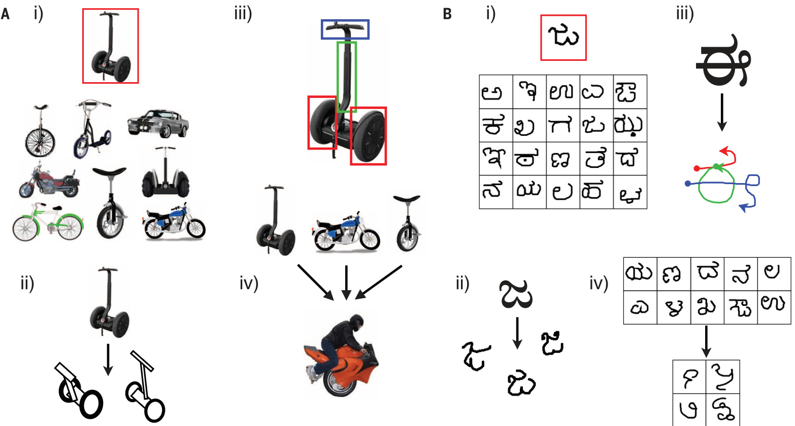
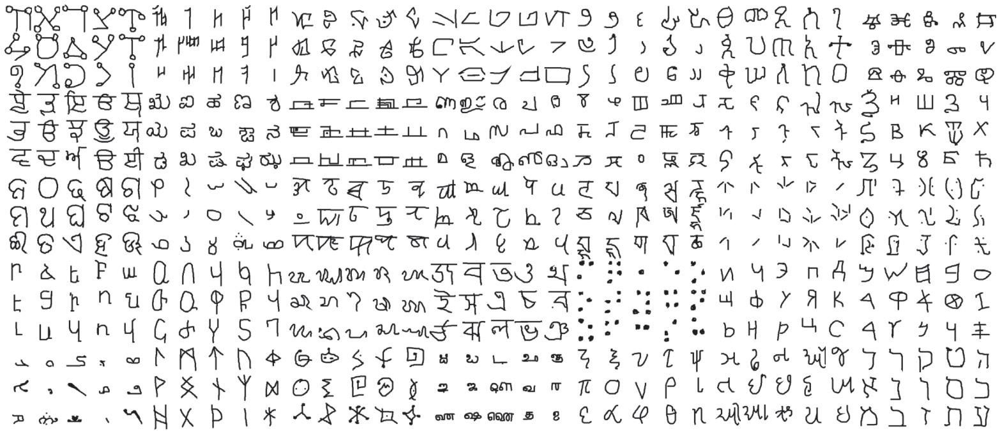
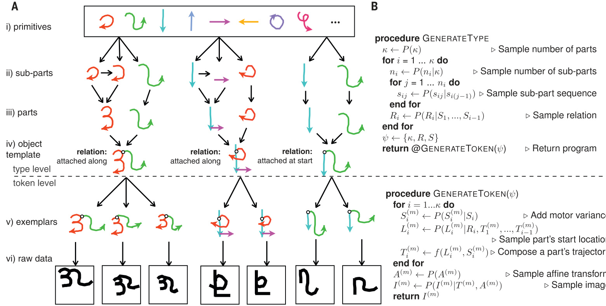
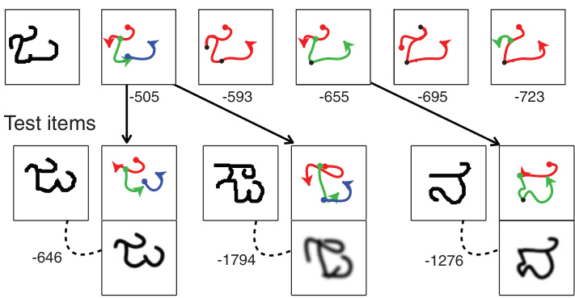
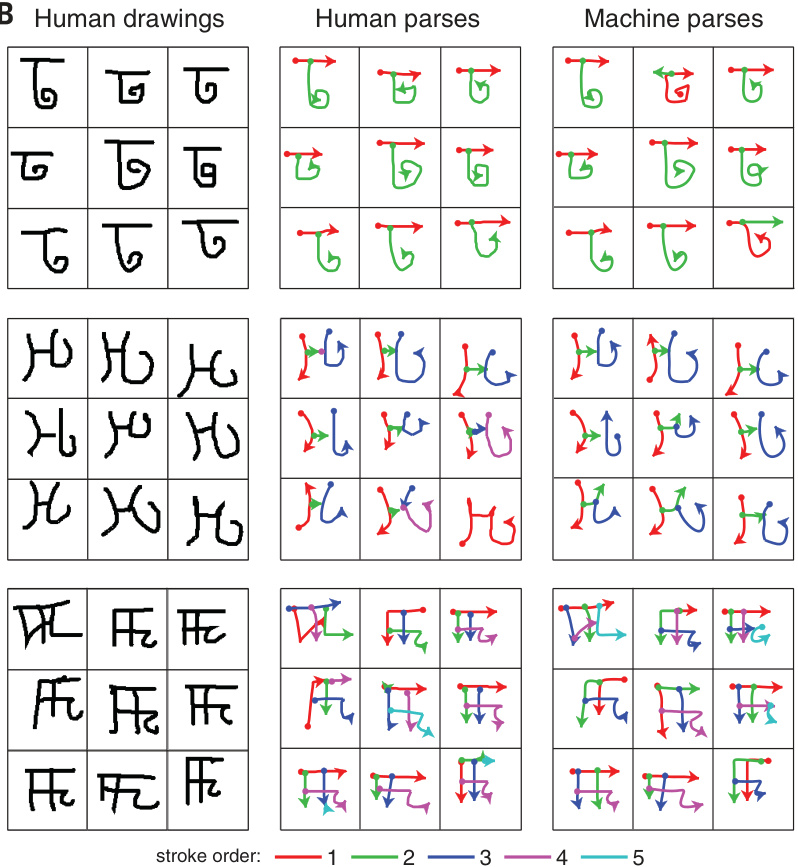
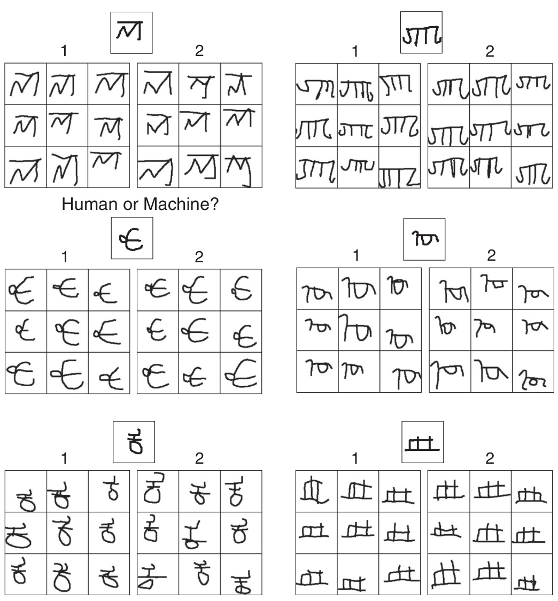
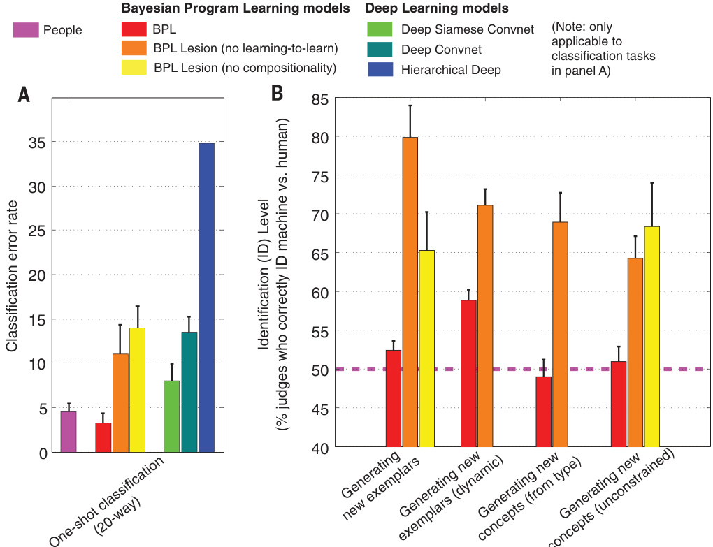
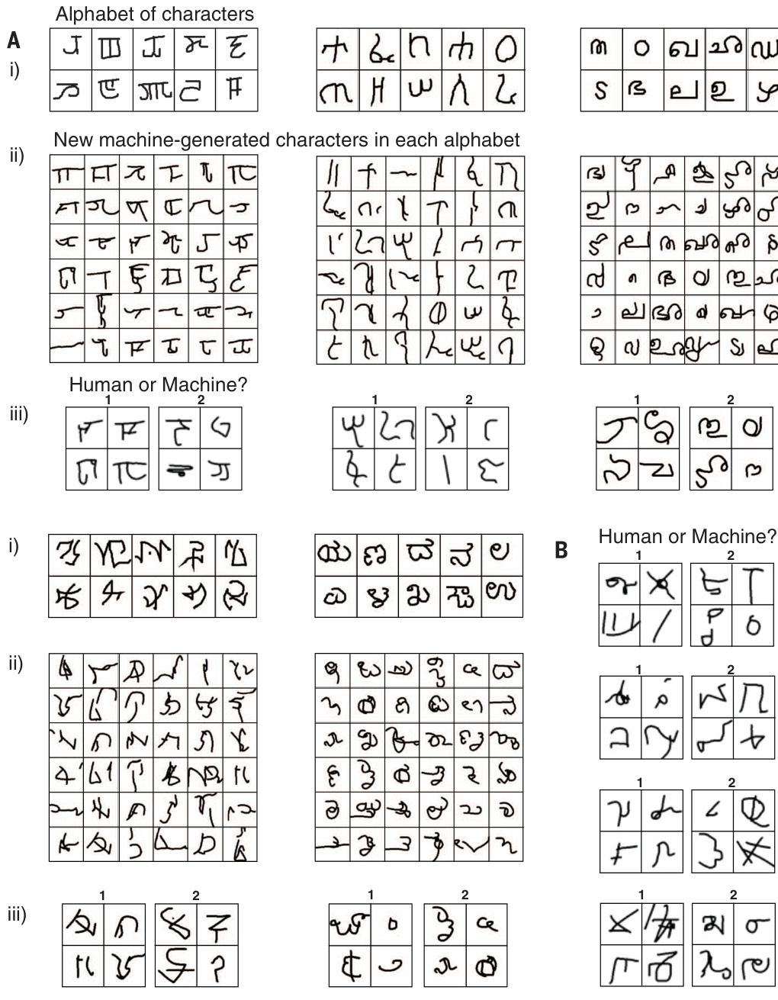

# COGNITIVE SCIENCE  

# Human-level concept learning through probabilistic program induction  

Brenden M. Lake,1\* Ruslan Salakhutdinov,2 Joshua B. Tenenbaum3  

People learning new concepts can often generalize successfully from just a single example, yet machine learning algorithms typically require tens or hundreds of examples to perform with similar accuracy. People can also use learned concepts in richer ways than conventional algorithms—for action, imagination, and explanation. We present a computational model that captures these human learning abilities for a large class of simple visual concepts: handwritten characters from the world’s alphabets. The model represents concepts as simple programs that best explain observed examples under a Bayesian criterion. On a challenging one-shot classification task, the model achieves human-level performance while outperforming recent deep learning approaches. We also present several “visual Turing tests” probing the model’s creative generalization abilities, which in many cases are indistinguishable from human behavior.  

D espite remarkable advances in artificial intelligence and machine learning, two aspects of human conceptual knowledge have eluded machine systems. First, for most interesting kinds of natural and manmade categories, people can learn a new concept from just one or a handful of examples, whereas standard algorithms in machine learning require tens or hundreds of examples to perform similarly. For instance, people may only need to see one example of a novel two-wheeled vehicle (Fig. 1A) in order to grasp the boundaries of the new concept, and even children can make meaningful generalizations via “one-shot learning” (1–3). In contrast, many of the leading approaches in machine learning are also the most data-hungry, especially “deep learning” models that have achieved new levels of performance on object and speech recognition benchmarks (4–9). Second, people learn richer representations than machines do, even for simple concepts (Fig. 1B), using them for a wider range of functions, including (Fig. 1, ii) creating new exemplars (10), (Fig. 1, iii) parsing objects into parts and relations $$ , and (Fig. 1, iv) creating new abstract categories of objects based on existing categories (12, 13). In contrast, the best machine classifiers do not perform these additional functions, which are rarely studied and usually require specialized algorithms. A central challenge is to explain these two aspects of human-level concept learning: How do people learn new concepts from just one or a few examples? And how do people learn such abstract, rich, and flexible representations? An even greater challenge arises when putting them together: How can learning succeed from such sparse data yet also produce such rich representations? For any theory of learning (4, 14–16), fitting a more complicated model requires more data, not less, in order to achieve some measure of good generalization, usually the difference in performance between new and old examples. Nonetheless, people seem to navigate this trade-off with remarkable agility, learning rich concepts that generalize well from sparse data.  

  
Fig. 1. People can learn rich concepts from limited data. (A and B) A single example of a new concept (red boxes) can be enough information to support the (i) classification of new examples, (ii) generation of new examples, (iii) parsing an object into parts and relations (parts segmented by color), and (iv) generation of new concepts from related concepts. [Image credit for (A), iv, bottom: With permission from Glenn Roberts and Motorcycle Mojo Magazine]  

This paper introduces the Bayesian program learning (BPL) framework, capable of learning a large class of visual concepts from just a single example and generalizing in ways that are mostly indistinguishable from people. Concepts are represented as simple probabilistic programs—that is, probabilistic generative models expressed as structured procedures in an abstract description language (17, 18). Our framework brings together three key ideas—compositionality, causality, and learning to learn—that have been separately influential in cognitive science and machine learning over the past several decades (19–22). As programs, rich concepts can be built “compositionally” from simpler primitives. Their probabilistic semantics handle noise and support creative generalizations in a procedural form that (unlike other probabilistic models) naturally captures the abstract “causal” structure of the real-world processes that produce examples of a category. Learning proceeds by constructing programs that best explain the observations under a Bayesian criterion, and the model “learns to learn” (23, 24) by developing hierarchical priors that allow previous experience with related concepts to ease learning of new concepts (25, 26). These priors represent a learned inductive bias (27) that abstracts the key regularities and dimensions of variation holding across both types of concepts and across instances (or tokens) of a concept in a given domain. In short, BPL can construct new programs by reusing the pieces of existing ones, capturing the causal and compositional properties of real-world generative processes operating on multiple scales.  

In addition to developing the approach sketched above, we directly compared people, BPL, and other computational approaches on a set of five challenging concept learning tasks (Fig. 1B). The tasks use simple visual concepts from Omniglot, a data set we collected of multiple examples of 1623 handwritten characters from 50 writing systems (Fig. 2) (see acknowledgments). Both images and pen strokes were collected (see below) as detailed in section S1 of the online supplementary materials. Handwritten characters are well suited for comparing human and machine learning on a relatively even footing: They are both cognitively natural and often used as a benchmark for comparing learning algorithms. Whereas machine learning algorithms are typically evaluated after hundreds or thousands of training examples per class (5), we evaluated the tasks of classification, parsing (Fig. 1B, iii), and generation (Fig. 1B, ii) of new examples in their most challenging form: after just one example of a new concept. We also investigated more creative tasks that asked people and computational models to generate new concepts (Fig. 1B, iv). BPL was compared with three deep learning models, a classic pattern recognition algorithm, and various lesioned versions of the model—a breadth of comparisons that serve to isolate the role of each modeling ingredient (see section S4 for descriptions of alternative models). We compare with two varieties of deep convolutional networks (28), representative of the current leading approaches to object recognition (7), and a hierarchical deep (HD) model (29), a probabilistic model needed for our more generative tasks and specialized for one-shot learning.  

# Bayesian Program Learning  

The BPL approach learns simple stochastic programs to represent concepts, building them compositionally from parts (Fig. 3A, iii), subparts (Fig. 3A, ii), and spatial relations (Fig. 3A, iv). BPL defines a generative model that can sample new types of concepts (an “A,” “B,” etc.) by combining parts and subparts in new ways. Each new type is also represented as a generative model, and this lower-level generative model produces new examples (or tokens) of the concept (Fig. 3A, v), making BPL a generative model for generative models. The final step renders the token-level variables in the format of the raw data (Fig. 3A, vi). The joint distribution on types y, a set of M tokens of that type q(1), . . ., q(M), and the corresponding binary images I(1), . . ., I(M) factors as  

$$
\begin{array} { c } { { P ( \boldsymbol { \Psi } , \boldsymbol { \Theta } ^ { ( 1 ) } , . . . , \boldsymbol { \Theta } ^ { ( M ) } , { \cal I } ^ { ( 1 ) } , . . . , { \cal I } ^ { ( M ) } ) } } \\ { { \displaystyle = P ( \boldsymbol { \Psi } ) \prod _ { m = 1 } ^ { M } P ( { \cal I } ^ { ( m ) } | \boldsymbol { \Theta } ^ { ( m ) } ) P ( \boldsymbol { \Theta } ^ { ( m ) } | \boldsymbol { \Psi } ) } } \end{array}
$$  

The generative process for types $$ and tokens $$ are described by the pseudocode in Fig. 3B and detailed along with the image model $P ( { I } ^ { ( m ) } | { \boldsymbol { \theta } } ^ { ( m ) } )$ in section S2. Source code is available online (see acknowledgments). The model learns to learn by fitting each conditional distribution to a background set of characters from 30 alphabets, using both the image and the stroke data, and this image set was also used to pretrain the alternative deep learning models. Neither the production data nor any alphabets from this set are used in the subsequent evaluation tasks, which provide the models with only raw images of novel characters.  

Handwritten character types $$ are an abstract schema of parts, subparts, and relations. Reflecting the causal structure of the handwriting process, character parts $$ are strokes initiated by pressing the pen down and terminated by lifting it up (Fig. 3A, iii), and subparts $$ ..., $$ are more primitive movements separated by brief pauses of the pen (Fig. 3A, ii). To construct a new character type, first the model samples the number of parts $$ and the number of subparts $$ for each part $$ , from their empirical distributions as measured from the background set. Second, a template for a part $$ is constructed by sampling subparts from a set of discrete primitive actions learned from the background set (Fig. 3A, i), such that the probability of the next action depends on the previous. Third, parts are then grounded as parameterized curves (splines) by sampling the control points and scale parameters  

  
Fig. 2. Simple visual concepts for comparing human and machine learning. 525 (out of 1623) character concepts, shown with one example each  

  
Fig. 3. A generative model of handwritten characters. (A) New types are generated by choosing primitive actions (color coded) from a library (i), combining these subparts (ii) to make parts (iii), and combining parts with relations to define simple programs (iv). New tokens are generated by running these programs (v), which are then rendered as raw data (vi). (B) Pseudocode for generating new types $$ and new token images $$ for $$ . The function $$ transforms a subpart sequence and start location into a trajectory.  

Training item with model’s five best parses for each subpart. Last, parts are roughly positioned to begin either independently, at the beginning, at the end, or along previous parts, as defined by relation $$ (Fig. 3A, iv).  

  
Fig. 4. Inferring motor programs from images. Parts are distinguished by color, with a colored dot indicating the beginning of a stroke and an arrowhead indicating the end. (A) The top row shows the five best programs discovered for an image along with their log-probability scores (Eq. 1). Subpart breaks are shown as black dots. For classification, each program was refit to three new test images (left in image triplets), and the best-fitting parse (top right) is shown with its image reconstruction (bottom right) and classification score (log posterior predictive probability). The correctly matching test item receives a much higher classification score and is also more cleanly reconstructed by the best programs induced from the training item. (B) Nine human drawings of three characters (left) are shown with their ground truth parses (middle) and best model parses (right).  

  

Character tokens $$ are produced by executing the parts and the relations and modeling how ink flows from the pen to the page. First, motor noise is added to the control points and the scale of the subparts to create token-level stroke trajectories $$ . Second, the trajectory’s precise start location $$ is sampled from the schematic provided by its relation $$ to previous strokes. Third, global transformations are sampled, including an affine warp $$ and adaptive noise parameters that ease probabilistic inference (30). Last, a binary image $$ is created by a stochastic rendering function, lining the stroke trajectories with grayscale ink and interpreting the pixel values as independent Bernoulli probabilities.  

Posterior inference requires searching the large combinatorial space of programs that could have generated a raw image $$ . Our strategy uses fast bottom-up methods (31) to propose a range of candidate parses. The most promising candidates are refined by using continuous optimization and local search, forming a discrete approximation to the posterior distribution $P ( \psi , \bar { \theta } ^ { ( m ) } | I ^ { ( m ) } )$ (section S3). Figure 4A shows the set of discovered programs for a training image $$ and how they are refit to different test images $$ to compute a classification score lo $\mathrm { g } P ( I ^ { ( 2 ) } | I ^ { ( 1 ) } )$ (the log posterior predictive probability), where higher scores indicate that they are more likely to belong to the same class. A high score is achieved when at least one set of parts and relations can successfully explain both the training and the test images, without violating the soft constraints of the learned within-class variability model. Figure 4B compares the model’s best-scoring parses with the ground-truth human parses for several characters.  

# Results  

People, $$ and alternative models were compared side by side on five concept learning tasks that examine different forms of generalization from just one or a few examples (example task Fig. 5). All behavioral experiments were run through Amazon’s Mechanical Turk, and the experimental procedures are detailed in section S5.  

The main results are summarized by Fig. 6, and additional lesion analyses and controls are reported in section S6.  

One-shot classification was evaluated through a series of within-alphabet classification tasks for 10 different alphabets. As illustrated in Fig. 1B, i, a single image of a new character was presented, and participants selected another example of that same character from a set of 20 distinct characters produced by a typical drawer of that alphabet. Performance is shown in Fig. 6A, where chance is $$ errors. As a baseline, the modified Hausdorff distance (32) was computed between centered images, producing $$ errors. People were skilled one-shot learners, achieving an average error rate of $$ $$ . BPL showed a similar error rate of $$ achieving better performance than a deep convolutional network (convnet; $$ errors) and the HD model $$ )—each adapted from deep learning methods that have performed well on a range of computer vision tasks. A deep Siamese convolutional network optimized for this one-shot learning task achieved $$ errors (33), still about twice as high as humans or our model. BPL’s advantage points to the benefits of modeling the underlying causal process in learning concepts, a strategy different from the particular deep learning approaches examined here. BPL’s other key ingredients also make positive contributions, as shown by higher error rates for BPL lesions without learning to learn (token-level only) or compositionality $$ errors and $$ , respectively). Learning to learn was studied separately at the type and token level by disrupting the learned hyperparameters of the generative model. Compositionality was evaluated by comparing BPL to a matched model that allowed just one spline-based stroke, resembling earlier analysisby-synthesis models for handwritten characters that were similarly limited (34, 35).  

  
Fig. 5. Generating new exemplars. Humans and machines were given an image of a novel character (top) and asked to produce new exemplars.The nine-character grids in each pair that were generated by a machine are (by row) 1, 2; 2, 1; 1, 1.  

The human capacity for one-shot learning is more than just classification. It can include a suite of abilities, such as generating new examples of a concept. We compared the creative outputs produced by humans and machines through “visual Turing tests,” where naive human judges tried to identify the machine, given paired examples of human and machine behavior. In our most basic task, judges compared the drawings from nine humans asked to produce a new instance of a concept given one example with nine new examples drawn by BPL (Fig. 5). We evaluated each model based on the accuracy of the judges, which we call their identification (ID) level: Ideal model performance is $$ ID level, indicating that they cannot distinguish the model’s behavior from humans; worst-case performance is $$ . Each judge $$ completed 49 trials with blocked feedback, and judges were analyzed individually and in aggregate. The results are shown in Fig. 6B (new exemplars). Judges had only a $$ ID level on average for discriminating human versus BPL behavior. As a group, this performance was barely better than chance $[ t ( 4 7 ) = 2 . 0 3 , P = 0 . 0 4 8 ] _ { \mathrm { { \Omega } } }$ , and only 3 of 48 judges had an ID level reliably above chance. Three lesioned models were evaluated by different groups of judges in separate conditions of the visual Turing test, examining the necessity of key model ingredients in BPL. Two lesions, learning to learn (token-level only) and compositionality, resulted in significantly easier Turing test tasks $$ ID level with 17 of 19 judges above chance and $$ with 14 of 26, respectively), indicating that this task is a nontrivial one to pass and that these two principles each contribute to BPL’s human-like generative proficiency. To evaluate parsing more directly (Fig. 4B), we ran a dynamic version of this task with a different set of judges $$ ), where each trial showed paired movies of a person and BPL drawing the same character. BPL performance on this visual Turing test was not perfect $$ average ID level; new exemplars (dynamic) in Fig. 6B), although randomizing the learned prior on stroke order and direction significantly raises the ID level $$ , showing the importance of capturing the right causal dynamics for BPL.  

Although learning to learn new characters from 30 background alphabets proved effective, many human learners will have much less experience: perhaps familiarity with only one or a few alphabets, along with related drawing tasks. To see how the models perform with more limited experience, we retrained several of them by using two different subsets of only five background alphabets. BPL achieved similar performance for oneshot classification as with 30 alphabets $$ and $$ errors, for the two sets, respectively); in contrast, the deep convolutional net performed notably worse than before $$ and $$ errors). BPL performance on a visual Turing test of exemplar generation $$ ) was also similar on the first set $$ average ID level that was not significantly different from chance $$ , $$ , with only 3 of 27 judges reliably above chance, although performance on the second set was slightly worse $$ ID level; $t ( 3 1 ) = 4 . 3 5 , P <$ 0.001; 7 of 32 judges reliably above chance]. These results suggest that although learning to learn is important for BPL’s success, the model’s structure allows it to take nearly full advantage of comparatively limited background training.  

The human productive capacity goes beyond generating new examples of a given concept: People can also generate whole new concepts. We tested this by showing a few example characters from 1 of 10 foreign alphabets and asking participants to quickly create a new character that appears to belong to the same alphabet (Fig. 7A). The BPL model can capture this behavior by placing a nonparametric prior on the type level, which favors reusing strokes inferred from the example characters to produce stylistically consistent new characters (section S7). Human judges compared people versus BPL in a visual Turing test $$ , viewing a series of displays in the format of Fig. 7A, i and iii. The judges had only a $$ ID level on average [Fig. 6B, new concepts (from type)], which is not significantly different from chance $[ t ( 3 4 ) = 0 . 4 5 , P > 0 . 0 5 ]$ . Individually, only 8 of 35 judges had an ID level significantly above chance. In contrast, a model with a lesion to (type-level) learning to learn was successfully detected by judges on $$ of trials in a separate condition of the visual Turing test, and was significantly easier to detect than BPL (18 of 25 judges above chance). Further comparisons in section S6 suggested that the model’s ability to produce plausible novel characters, rather than stylistic consistency per se, was the crucial factor for passing this test. We also found greater variation in individual judges’ comparisons of people and the BPL model on this task, as reflected in their ID levels: 10 of 35 judges had individual ID levels significantly below chance; in contrast, only two participants had below-chance ID levels for BPL across all the other experiments shown in Fig. 6B. Last, judges $$ ) compared people and models on an entirely free-form task of generating novel character concepts, unconstrained by a particular alphabet (Fig. 7B). Sampling from the prior distribution on character types $$ in BPL led to an average ID level of $$ correct in a visual Turing test (11 of 32 judges above chance); with the nonparametric prior that reuses inferred parts from background characters, BPL achieved a $$ ID level [Fig. 7B and new concepts (unconstrained) in Fig. 6B; ID level not significantly different from chance $$ , $$ ; 2 of 25 judges above chance]. A lesion analysis revealed that both compositionality $$ and 15 of 22) and learning to learn $$ and 22 of 45) were crucial in passing this test.  

# Discussion  

Despite a changing artificial intelligence landscape, people remain far better than machines at learning new concepts: They require fewer examples and use their concepts in richer ways. Our work suggests that the principles of compositionality, causality, and learning to learn will be critical in building machines that narrow this gap. Machine learning and computer vision researchers are beginning to explore methods based on simple program induction (36–41), and our results show that this approach can perform one-shot learning in classification tasks at human-level accuracy and fool most judges in visual Turing tests of its more creative abilities. For each visual Turing test, fewer than $$ of judges performed significantly better than chance.  

Although successful on these tasks, BPL still sees less structure in visual concepts than people do. It lacks explicit knowledge of parallel lines, symmetry, optional elements such as cross bars in “7”s, and connections between the ends of strokes and other strokes. Moreover, people use their concepts for other abilities that were not studied here, including planning (42), explanation (43), communication $$ , and conceptual combination (45). Probabilistic programs could capture these richer aspects of concept learning and use, but only with more abstract and complex structure than the programs studied here. Moresophisticated programs could also be suitable for learning compositional, causal representations of many concepts beyond simple perceptual categories. Examples include concepts for physical artifacts, such as tools, vehicles, or furniture, that are well described by parts, relations, and the functions these structures support; fractal structures, such as rivers and trees, where complexity arises from highly iterated but simple generative processes; and even abstract knowledge, such as natural number, natural language semantics, and intuitive physical theories (17, 46–48).  

  
Fig. 6. Human and machine performance was compared on (A) one-shot classification and (B) four generative tasks. The creative outputs for humans and models were compared by the percent of human judges to correctly identify the machine. Ideal performance is $$ , where the machine is perfectly confusable with humans in these two-alternative forced choice tasks (pink dotted line). Bars show the mean $$ SEM $$ alphabets in (A)]. The no learning-to-learn lesion is applied at different levels (bars left to right): (A) token; (B) token, stroke order, type, and type.  

Capturing how people learn all these concepts at the level we reached with handwritten characters is a long-term goal. In the near term, applying our approach to other types of symbolic concepts may be particularly promising. Human cultures produce many such symbol systems, including gestures, dance moves, and the words of spoken and signed languages. As with characters, these concepts can be learned to some extent from one or a few examples, even before the symbolic meaning is clear: Consider seeing a “thumbs up,”  

“fist bump,” or “high five” or hearing the names “Boutros Boutros-Ghali,” “Kofi Annan,” or “Ban Ki-moon” for the first time. From this limited experience, people can typically recognize new examples and even produce a recognizable semblance of the concept themselves. The BPL principles of compositionality, causality, and learning to learn may help to explain how.  

To illustrate how BPL applies in the domain of speech, programs for spoken words could be constructed by composing phonemes (subparts) systematically to form syllables (parts), which compose further to form morphemes and entire words. Given an abstract syllable-phoneme parse of a word, realistic speech tokens can be generated from a causal model that captures aspects of speech motor articulation. These part and subpart components are shared across the words in a language, enabling children to acquire them through a long-term learning-to-learn process. We have already found that a prototype model exploiting compositionality and learning to learn, but not causality, is able to capture some aspects of the human ability to learn and generalize new spoken words (e.g., English speakers learning words in Japanese) (49). Further progress may come from adopting a richer causal model of speech generation, in the spirit of classic “analysisby-synthesis” proposals for speech perception and language comprehension (20, 50).  

  
Fig. 7. Generating new concepts. (A) Humans and machines were given a novel alphabet (i) and asked to produce new characters for that alphabet. New machine-generated characters are shown in (ii). Human and machine productions can be compared in (iii). The four-character grids in each pair that were generated by the machine are (by row) 1, 1, 2; 1, 2. (B) Humans and machines produced new characters without a reference alphabet. The grids that were generated by a machine are 2; 1; 1; 2.  

Although our work focused on adult learners, it raises natural developmental questions. If children learning to write acquire an inductive bias similar to what BPL constructs, the model could help explain why children find some characters difficult and which teaching procedures are most effective (51). Comparing children’s parsing and generalization behavior at different stages of learning and BPL models given varying background experience could better evaluate the model’s learning-to-learn mechanisms and suggest improvements. By testing our classification tasks on infants who categorize visually before they begin drawing or scribbling (52), we can ask whether children learn to perceive characters more causally and compositionally based on their own proto-writing experience. Causal representations are prewired in our current BPL models, but they could conceivably be constructed through learning to learn at an even deeper level of model hierarchy (53).  

Last, we hope that our work may shed light on the neural representations of concepts and the development of more neurally grounded learning models. Supplementing feedforward visual processing $$ , previous behavioral studies and our results suggest that people learn new handwritten characters in part by inferring abstract motor programs (55), a representation grounded in production yet active in purely perceptual tasks, independent of specific motor articulators and potentially driven by activity in premotor cortex (56–58). Could we decode representations structurally similar to those in BPL from brain imaging of premotor cortex (or other action-oriented regions) in humans perceiving and classifying new characters for the first time? Recent large-scale brain models (59) and deep recurrent neural networks (60–62) have also focused on character recognition and production tasks—but typically learning from large training samples with many examples of each concept. We see the one-shot learning capacities studied here as a challenge for these neural models: one we expect they might rise to by incorporating the principles of compositionality, causality, and learning to learn that BPL instantiates.  

# REFERENCES AND NOTES  

1. B. Landau, L. B. Smith, S. S. Jones, Cogn. Dev. 3, 299–321 (1988).   
2. E. M. Markman, Categorization and Naming in Children (MIT Press, Cambridge, MA, 1989).   
3. F. Xu, J. B. Tenenbaum, Psychol. Rev. 114, 245–272 (2007).   
4. S. Geman, E. Bienenstock, R. Doursat, Neural Comput. 4, 1–58 (1992).   
5. Y. LeCun, L. Bottou, Y. Bengio, P. Haffner, Proc. IEEE 86, 2278–2324 (1998).   
8. Y. LeCun, Y. Bengio, G. Hinton, Nature 521, 436–444 (2015).   
9. V. Mnih et al., Nature 518, 529–533 (2015).   
10. J. Feldman, J. Math. Psychol. 41, 145–170 (1997).   
11. I. Biederman, Psychol. Rev. 94, 115–147 (1987).   
12. T. B. Ward, Cognit. Psychol. 27, 1–40 (1994).   
13. A. Jern, C. Kemp, Cognit. Psychol. 66, 85–125 (2013).   
14. L. G. Valiant, Commun. ACM 27, 1134–1142 (1984).   
15. D. McAllester, in Proceedings of the 11th Annual Conference on Computational Learning Theory (COLT), Madison, WI, 24 to 26 July 1998 (Association for Computing Machinery, New York, 1998), pp. 230–234.   
16. V. N. Vapnik, IEEE Trans. Neural Netw. 10, 988–999 (1999).   
17. N. D. Goodman, J. B. Tenenbaum, T. Gerstenberg, Concepts: New Directions, E. Margolis, S. Laurence, Eds. (MIT Press, Cambridge, MA, 2015).   
18. Z. Ghahramani, Nature 521, 452–459 (2015).   
19. P. H. Winston, The Psychology of Computer Vision, P. H. Winston, Ed. (McGraw-Hill, New York, 1975).   
20. T. G. Bever, D. Poeppel, Biolinguistics 4, 174 (2010).   
21. L. B. Smith, S. S. Jones, B. Landau, L. Gershkoff-Stowe, L. Samuelson, Psychol. Sci. 13, 13–19 (2002).   
22. R. L. Goldstone, in Perceptual Organization in Vision: Behavioral and Neural Perspectives, R. Kimchi, M. Behrmann, C. Olson, Eds. (Lawrence Erlbaum, City, NJ, 2003), pp. 233–278.   
23. H. F. Harlow, Psychol. Rev. 56, 51–65 (1949).   
24. D. A. Braun, C. Mehring, D. M. Wolpert, Behav. Brain Res. 206, 157–165 (2010).   
25. C. Kemp, A. Perfors, J. B. Tenenbaum, Dev. Sci. 10, 307–321 (2007).   
26. R. Salakhutdinov, J. Tenenbaum, A. Torralba, in JMLR Workshop and Conference Proceedings, vol. 27, Unsupervised and Transfer Learning Workshop, I. Guyon, G. Dror, V. Lemaire, G. Taylor, D. Silver, Eds. (Microtome, Brookline, MA, 2012), pp. 195–206.   
27. J. Baxter, J. Artif. Intell. Res. 12, 149 (2000).   
28. Y. LeCun et al., Neural Comput. 1, 541–551 (1989).   
29. R. Salakhutdinov, J. B. Tenenbaum, A. Torralba, IEEE Trans. Pattern Anal. Mach. Intell. 35, 1958–1971 (2013).   
30. V. K. Mansinghka, T. D. Kulkarni, Y. N. Perov, J. B. Tenenbaum, Adv. Neural Inf. Process. Syst. 26, 1520–1528 (2013).   
31. K. Liu, Y. S. Huang, C. Y. Suen, IEEE Trans. Pattern Anal. Mach. Intell. 21, 1095–1100 (1999).   
32. M.-P. Dubuisson, A. K. Jain, in Proceedings of the 12th IAPR International Conference on Pattern Recognition, Vol. 1, Conference A: Computer Vision and Image Processing, Jerusalem, Israel, 9 to 13 October 1994 (IEEE, New York, 1994), pp. 566–568.   
33. G. Koch, R. S. Zemel, R. Salakhutdinov, paper presented at ICML Deep Learning Workshop, Lille, France, 10 and 11 July 2015.   
34. M. Revow, C. K. I. Williams, G. E. Hinton, IEEE Trans. Pattern Anal. Mach. Intell. 18, 592–606 (1996).   
35. G. E. Hinton, V. Nair, Adv. Neural Inf. Process. Syst. 18, 515–522 (2006).   
36. S.-C. Zhu, D. Mumford, Foundations Trends Comput. Graphics Vision 2, 259–362 (2006).   
37. P. Liang, M. I. Jordan, D. Klein, in Proceedings of the 27th International Conference on Machine Learning, Haifa, Israel, 21 to 25 June 2010 (International Machine Learning Society, Princeton, NJ, 2010), pp. 639–646.   
38. P. F. Felzenszwalb, R. B. Girshick, D. McAllester, D. Ramanan, IEEE Trans. Pattern Anal. Mach. Intell. 32, 1627–1645 (2010).   
39. I. Hwang, A. Stuhlmüller, N. D. Goodman, http://arxiv.org/abs/ 1110.5667 (2011).   
40. E. Dechter, J. Malmaud, R. P. Adams, J. B. Tenenbaum, in Proceedings of the 23rd International Joint Conference on Artificial Intelligence, F. Rossi, Ed., Beijing, China, 3 to 9 August 2013 (AAAI Press/International Joint Conferences on Artificial Intelligence, Menlo Park, CA, 2013), pp. 1302–1309.   
41. J. Rule, E. Dechter, J. B. Tenenbaum, in Proceedings of the 37th Annual Conference of the Cognitive Science Society, D. C. Noelle et al., Eds., Pasadena, CA, 22 to 25 July 2015 (Cognitive Science Society, Austin, TX, 2015), pp. 2051–2056.   
42. L. W. Barsalou, Mem. Cognit. 11, 211–227 (1983).   
43. J. J. Williams, T. Lombrozo, Cogn. Sci. 34, 776–806 (2010).   
44. A. B. Markman, V. S. Makin, J. Exp. Psychol. Gen. 127, 331–354 (1998).   
45. D. N. Osherson, E. E. Smith, Cognition 9, 35–58 (1981).   
46. S. T. Piantadosi, J. B. Tenenbaum, N. D. Goodman, Cognition 123, 199–217 (2012).   
47. G. A. Miller, P. N. Johnson-Laird, Language and Perception (Belknap, Cambridge, MA, 1976).   
48. T. D. Ullman, A. Stuhlmuller, N. Goodman, J. B. Tenenbaum, in Proceedings of the 36th Annual Conference of the Cognitive Science Society, Quebec City, Canada, 23 to 26 July 2014 (Cognitive Science Society, Austin, TX, 2014), pp. 1640–1645.   
49. B. M. Lake, C.-y. Lee, J. R. Glass, J. B. Tenenbaum, in Proceedings of the 36th Annual Conference of the Cognitive Science Society, Quebec City, Canada, 23 to 26 July 2014 (Cognitive Science Society, Austin, TX, 2014), pp. 803–808.   
50. U. Neisser, Cognitive Psychology (Appleton-Century-Crofts, New York, 1966).   
51. R. Treiman, B. Kessler, How Children Learn to Write Words (Oxford Univ. Press, New York, 2014).   
52. A. L. Ferry, S. J. Hespos, S. R. Waxman, Child Dev. 81, 472–479 (2010).   
53. N. D. Goodman, T. D. Ullman, J. B. Tenenbaum, Psychol. Rev. 118, 110–119 (2011).   
54. S. Dehaene, Reading in the Brain (Penguin, New York, 2009).   
55. M. K. Babcock, J. J. Freyd, Am. J. Psychol. 101, 111–130 (1988).   
56. M. Longcamp, J. L. Anton, M. Roth, J. L. Velay, Neuroimage 19, 1492–1500 (2003).   
57. K. H. James, I. Gauthier, Neuropsychologia 44, 2937–2949 (2006).   
58. K. H. James, I. Gauthier, J. Exp. Psychol. Gen. 138, 416–431 (2009).   
59. C. Eliasmith et al., Science 338, 1202–1205 (2012).   
60. A. Graves, http://arxiv.org/abs/1308.0850 (2014).   
61. K. Gregor, I. Danihelka, A. Graves, D. J. Rezende, D. Wierstra, in Proceedings of the International Conference on Machine Learning (ICML), Lille, France, 6 to 11 July 2015 (International  

Machine Learning Society, Princeton, NJ, 2015), pp. 1462–1471. 62. J. Chung et al., Adv. Neural Inf. Process. Syst. 28, (2015).  

# ACKNOWLEDGMENTS  

This work was supported by a NSF Graduate Research Fellowship to B.M.L.; the Center for Brains, Minds, and Machines funded by NSF Science and Technology Center award CCF-1231216; Army Research Office and Office of Naval Research contracts W911NF-08-1-0242, W911NF-13-1-2012, and N000141310333; the Natural Sciences and Engineering Research Council of Canada; the Canadian Institute for Advanced Research; and the Moore-Sloan Data Science Environment at NYU. We thank J. McClelland, T. Poggio and L. Schulz for many valuable contributions and N. Kanwisher for helping us elucidate the three key principles. We are grateful to J. Gross and the Omniglot. com encyclopedia of writing systems for helping to make this data set possible. Online archives are available for visual Turing tests (http://github.com/brendenlake/visual-turing-tests), Omniglot data set (http://github.com/brendenlake/omniglot), and BPL source code (http://github.com/brendenlake/BPL).  

# PHYSICAL CHEMISTRY  

# SUPPLEMENTARY MATERIALS  

www.sciencemag.org/content/350/6266/1332/suppl/DC1   
Materials and Methods   
Supplementary Text   
Figs. S1 to S11   
References (63–80)   
1 June 2015; accepted 15 October 2015   
10.1126/science.aab3050  

# Spectroscopic characterization of isomerization transition states  

Joshua H. Baraban,1\* P. Bryan Changala,1† Georg Ch. Mellau,2 John F. Stanton,3 Anthony J. Merer,4,5 Robert W. Field1‡  

Transition state theory is central to our understanding of chemical reaction dynamics. We demonstrate a method for extracting transition state energies and properties from a characteristic pattern found in frequency-domain spectra of isomerizing systems. This pattern—a dip in the spacings of certain barrier-proximal vibrational levels—can be understood using the concept of effective frequency, $$ .The method is applied to the cis-trans conformational change in the $$ state of $$ and the bond-breaking HCN-HNC isomerization. In both cases, the barrier heights derived from spectroscopic data agree extremely well with previous ab initio calculations. We also show that it is possible to distinguish between vibrational modes that are actively involved in the isomerization process and those that are passive bystanders.  

he central concept of the transition state in chemical kinetics is familiar to all students of chemistry. Since its inception by Arrhenius $$ and later development into a full theory by Eyring, Wigner, Polanyi, and Evans   
(2–5), the idea that the thermal rate depends   
primarily on the highest point along the lowest  

energy path from reactants to products has remained essentially unchanged. Most of chemical dynamics is now firmly based on this idea of the transition state, notwithstanding the emergence of unconventional reactions such as roaming $$ where a photodissociated atom wanders before abstracting from the parent fragment. Despite the clear importance of the transition state to the field of chemistry, direct experimental studies of the transition state and its properties are scarce (8).  

Here, we report the observation of a vibrational pattern, a dip in the trend of quantum level spacings, which occurs at the energy of the saddle point. This phenomenon is expected to provide a generally applicable and accurate method for characterizing transition states. Only a subset of vibrational states exhibit a dip; these states contain excitation along the reaction coordinate and are barrier-proximal, meaning that they are more  

Human-level concept learning through probabilistic program induction   
Brenden M. Lake et al.   
Science 350, 1332 (2015);   
DOI: 10.1126/science.aab3050  

This copy is for your personal, non-commercial use only.  

If you wish to distribute this article to others, you can order high-quality copies for your colleagues, clients, or customers by clicking here.  

Permission to republish or repurpose articles or portions of articles can be obtained by following the guidelines here.  

The following resources related to this article are available online at www.sciencemag.org (this information is current as of December 10, 2015 ):  

Updated information and services, including high-resolution figures, can be found in the online   
version of this article at:   
http://www.sciencemag.org/content/350/6266/1332.full.html  

Supporting Online Material can be found at: http://www.sciencemag.org/content/suppl/2015/12/09/350.6266.1332.DC1.html  

A list of selected additional articles on the Science Web sites related to this article can be found at: http://www.sciencemag.org/content/350/6266/1332.full.html#related  

This article cites 50 articles, 2 of which can be accessed free: http://www.sciencemag.org/content/350/6266/1332.full.html#ref-list-1  