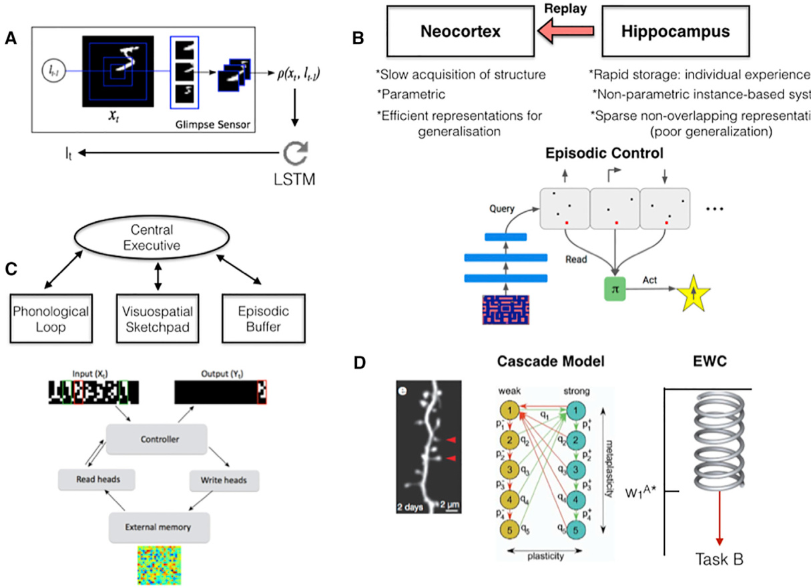
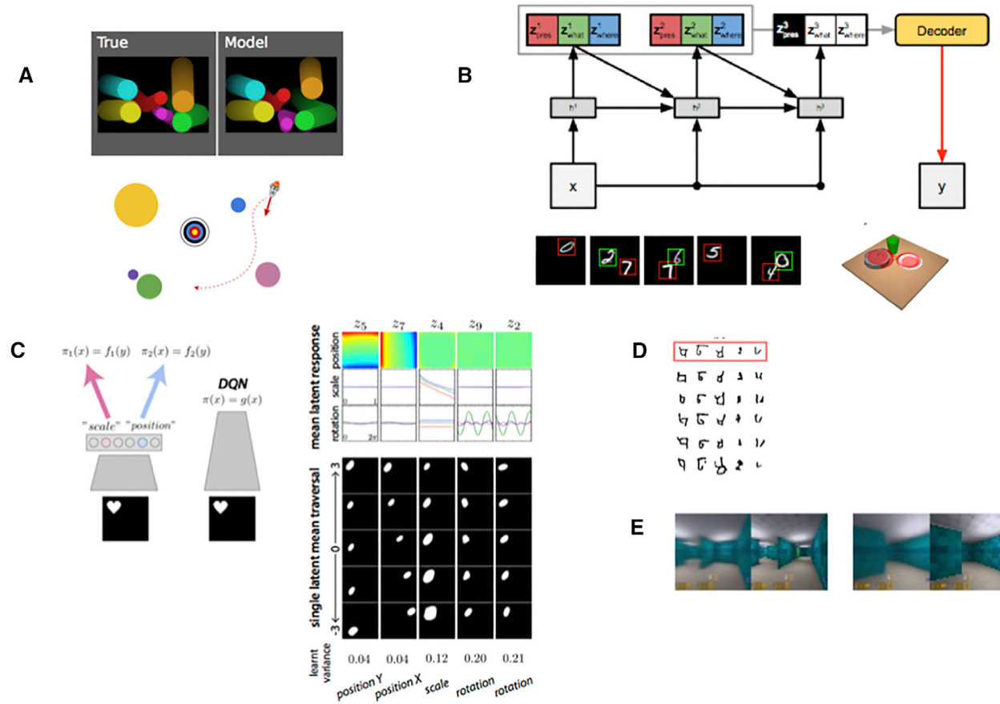

# Neuroscience-Inspired Artificial Intelligence  

Demis Hassabis,1,2,\* Dharshan Kumaran,1,3 Christopher Summerfield,1,4 and Matthew Botvinick1,2   
1DeepMind, 5 New Street Square, London, UK   
2Gatsby Computational Neuroscience Unit, 25 Howland Street, London, UK   
3Institute of Cognitive Neuroscience, University College London, 17 Queen Square, London, UK   
4Department of Experimental Psychology, University of Oxford, Oxford, UK   
\*Correspondence: dhcontact@google.com   
http://dx.doi.org/10.1016/j.neuron.2017.06.011  

The fields of neuroscience and artificial intelligence (AI) have a long and intertwined history. In more recent times, however, communication and collaboration between the two fields has become less commonplace. In this article, we argue that better understanding biological brains could play a vital role in building intelligent machines. We survey historical interactions between the AI and neuroscience fields and emphasize current advances in AI that have been inspired by the study of neural computation in humans and other animals. We conclude by highlighting shared themes that may be key for advancing future research in both fields.  

In recent years, rapid progress has been made in the related fields of neuroscience and artificial intelligence (AI). At the dawn of the computer age, work on AI was inextricably intertwined with neuroscience and psychology, and many of the early pioneers straddled both fields, with collaborations between these disciplines proving highly productive (Churchland and Sejnowski, 1988; Hebb, 1949; Hinton et al., 1986; Hopfield, 1982; McCulloch and Pitts, 1943; Turing, 1950). However, more recently, the interaction has become much less commonplace, as both subjects have grown enormously in complexity and disciplinary boundaries have solidified. In this review, we argue for the critical and ongoing importance of neuroscience in generating ideas that will accelerate and guide AI research (see Hassabis commentary in Brooks et al., 2012).  

We begin with the premise that building human-level general AI (or ‘‘Turing-powerful’’ intelligent systems; Turing, 1936) is a daunting task, because the search space of possible solutions is vast and likely only very sparsely populated. We argue that this therefore underscores the utility of scrutinizing the inner workings of the human brain— the only existing proof that such an intelligence is even possible. Studying animal cognition and its neural implementation also has a vital role to play, as it can provide a window into various important aspects of higherlevel general intelligence.  

The benefits to developing AI of closely examining biological intelligence are two-fold. First, neuroscience provides a rich source of inspiration for new types of algorithms and architectures, independent of and complementary to the mathematical and logic-based methods and ideas that have largely dominated traditional approaches to AI. For example, were a new facet of biological computation found to be critical to supporting a cognitive function, then we would consider it an excellent candidate for incorporation into artificial systems. Second, neuroscience can provide validation of AI techniques that already exist. If a known algorithm is subsequently found to be implemented in the brain, then that is strong support for its plausibility as an integral component of an overall general intelligence system. Such clues can be critical to a long-term research program when determining where to allocate resources most productively. For example, if an algorithm is not quite attaining the level of performance required or expected, but we observe it is core to the functioning of the brain, then we can surmise that redoubled engineering efforts geared to making it work in artificial systems are likely to pay off.  

Of course from a practical standpoint of building an AI system, we need not slavishly enforce adherence to biological plausibility. From an engineering perspective, what works is ultimately all that matters. For our purposes then, biological plausibility is a guide, not a strict requirement. What we are interested in is a systems neuroscience-level understanding of the brain, namely the algorithms, architectures, functions, and representations it utilizes. This roughly corresponds to the top two levels of the three levels of analysis that Marr famously stated are required to understand any complex biological system (Marr and Poggio, 1976): the goals of the system (the computational level) and the process and computations that realize this goal (the algorithmic level). The precise mechanisms by which this is physically realized in a biological substrate are less relevant here (the implementation level). Note this is where our approach to neuroscience-inspired AI differs from other initiatives, such as the Blue Brain Project (Markram, 2006) or the field of neuromorphic computing systems (Esser et al., 2016), which attempt to closely mimic or directly reverse engineer the specifics of neural circuits (albeit with different goals in mind). By focusing on the computational and algorithmic levels, we gain transferrable insights into general mechanisms of brain function, while leaving room to accommodate the distinctive opportunities and challenges that arise when building intelligent machines in silico.  

The following sections unpack these points by considering the past, present, and future of the AI-neuroscience interface. Before beginning, we offer a clarification. Throughout this article, we employ the terms ‘‘neuroscience’’ and ‘‘AI.’’ We use these terms in the widest possible sense. When we say neuroscience, we mean to include all fields that are involved with the study of the brain, the behaviors that it generates, and the mechanisms by which it does so, including cognitive neuroscience, systems neuroscience and psychology. When we say AI, we mean work in machine learning, statistics, and AI research that aims to build intelligent machines (Legg and Hutter, 2007).  

We begin by considering the origins of two fields that are pivotal for current AI research, deep learning and reinforcement learning, both of which took root in ideas from neuroscience. We then turn to the current state of play in AI research, noting many cases where inspiration has been drawn (sometimes without explicit acknowledgment) from concepts and findings in neuroscience. In this section, we particularly emphasize instances where we have combined deep learning with other approaches from across machine learning, such as reinforcement learning (Mnih et al., 2015), Monte Carlo tree search (Silver et al., 2016), or techniques involving an external content-addressable memory (Graves et al., 2016). Next, we consider the potential for neuroscience to support future AI research, looking at both the most likely research challenges and some emerging neuroscience-inspired AI techniques. While our main focus will be on the potential for neuroscience to benefit AI, our final section will briefly consider ways in which AI may be helpful to neuroscience and the broader potential for synergistic interactions between these two fields.  

# The Past Deep Learning  

As detailed in a number of recent reviews, AI has been revolutionized over the past few years by dramatic advances in neural network, or ‘‘deep learning,’’ methods (LeCun et al., 2015; Schmidhuber, 2014). As the moniker ‘‘neural network’’ might suggest, the origins of these AI methods lie directly in neuroscience. In the 1940s, investigations of neural computation began with the construction of artificial neural networks that could compute logical functions (McCulloch and Pitts, 1943). Not long after, others proposed mechanisms by which networks of neurons might learn incrementally via supervisory feedback (Rosenblatt, 1958) or efficiently encode environmental statistics in an unsupervised fashion (Hebb, 1949). These mechanisms opened up the field of artificial neural network research, and they continue to provide the foundation for contemporary research on deep learning (Schmidhuber, 2014).  

Not long after this pioneering work, the development of the backpropagation algorithm allowed learning to occur in networks composed of multiple layers (Rumelhart et al., 1985; Werbos, 1974). Notably, the implications of this method for understanding intelligence, including AI, were first appreciated by a group of neuroscientists and cognitive scientists, working under the banner of parallel distributed processing (PDP) (Rumelhart et al., 1986). At the time, most AI research was focused on building logical processing systems based on serial computation, an approach inspired in part by the notion that human intelligence involves manipulation of symbolic representations (Haugeland, 1985). However, there was a growing sense in some quarters that purely symbolic approaches might be too brittle and inflexible to solve complex real-world problems of the kind that humans routinely handle. Instead, a growing foundation of knowledge about the brain seemed to point in a very different direction, highlighting the role of stochastic and highly parallelized information processing. Building on this, the PDP movement proposed that human cognition and behavior emerge from dynamic, distributed interactions within networks of simple neuron-like processing units, interactions tuned by learning procedures that adjust system parameters in order to minimize error or maximize reward.  

Although the PDP approach was at first applied to relatively small-scale problems, it showed striking success in accounting for a wide range of human behaviors (Hinton et al., 1986). Along the way, PDP research introduced a diverse collection of ideas that have had a sustained influence on AI research. For example, current machine translation research exploits the notion that words and sentences can be represented in a distributed fashion (i.e., as vectors) (LeCun et al., 2015), a principle that was already ingrained in early PDP-inspired models of sentence processing (St. John and McClelland, 1990). Building on the PDP movement’s appeal to biological computation, current stateof-the-art convolutional neural networks (CNNs) incorporate several canonical hallmarks of neural computation, including nonlinear transduction, divisive normalization, and maximumbased pooling of inputs (Yamins and DiCarlo, 2016). These operations were directly inspired by single-cell recordings from the mammalian visual cortex that revealed how visual input is filtered and pooled in simple and complex cells in area V1 (Hubel and Wiesel, 1959). Moreover, current network architectures replicate the hierarchical organization of mammalian cortical systems, with both convergent and divergent information flow in successive, nested processing layers (Krizhevsky et al., 2012; LeCun et al., 1989; Riesenhuber and Poggio, 1999; Serre et al., 2007), following ideas first advanced in early neural network models of visual processing (Fukushima, 1980). In both biological and artificial systems, successive non-linear computations transform raw visual input into an increasingly complex set of features, permitting object recognition that is invariant to transformations of pose, illumination, or scale.  

As the field of deep learning evolved out of PDP research into a core area within AI, it was bolstered by new ideas, such as the development of deep belief networks (Hinton et al., 2006) and the introduction of large datasets inspired by research on human language (Deng et al., 2009). During this period, it continued to draw key ideas from neuroscience. For example, biological considerations informed the development of successful regularization schemes that support generalization beyond training data. One such scheme, in which only a subset of units participate in the processing of a given training example (‘‘dropout’’), was motivated by the stochasticity that is inherent in biological systems populated by neurons that fire with Poisson-like statistics (Hinton et al., 2012). Here and elsewhere, neuroscience has provided initial guidance toward architectural and algorithmic constraints that lead to successful neural network applications for AI.  

# Reinforcement Learning  

Alongside its important role in the development of deep learning, neuroscience was also instrumental in erecting a second pillar of contemporary AI, stimulating the emergence of the field of reinforcement learning (RL). RL methods address the problem of how to maximize future reward by mapping states in the environment to actions and are among the most widely used tools in AI research (Sutton and Barto, 1998). Although it is not widely appreciated among AI researchers, RL methods were originally inspired by research into animal learning. In particular, the development of temporal-difference (TD) methods, a critical component of many RL models, was inextricably intertwined with research into animal behavior in conditioning experiments. TD methods are real-time models that learn from differences between temporally successive predictions, rather than having to wait until the actual reward is delivered. Of particular relevance was an effect called second-order conditioning, where affective significance is conferred on a conditioned stimulus (CS) through association with another CS rather than directly via association with the unconditioned stimulus (Sutton and Barto, 1981). TD learning provides a natural explanation for second-order conditioning and indeed has gone on to explain a much wider range of findings from neuroscience, as we discuss below.  

Here, as in the case of deep learning, investigations initially inspired by observations from neuroscience led to further developments that have strongly shaped the direction of AI research. From their neuroscience-informed origins, TD methods and related techniques have gone on to supply the core technology for recent advances in AI, ranging from robotic control (Hafner and Riedmiller, 2011) to expert play in backgammon (Tesauro, 1995) and Go (Silver et al., 2016).  

# The Present  

Reading the contemporary AI literature, one gains the impression that the earlier engagement with neuroscience has diminished. However, if one scratches the surface, one can uncover many cases in which recent developments have been inspired and guided by neuroscientific considerations. Here, we look at four specific examples.  

# Attention  

The brain does not learn by implementing a single, global optimization principle within a uniform and undifferentiated neural network (Marblestone et al., 2016). Rather, biological brains are modular, with distinct but interacting subsystems underpinning key functions such as memory, language, and cognitive control (Anderson et al., 2004; Shallice, 1988). This insight from neuroscience has been imported, often in an unspoken way, into many areas of current AI.  

One illustrative example is recent AI work on attention. Up until quite lately, most CNN models worked directly on entire images or video frames, with equal priority given to all image pixels at the earliest stage of processing. The primate visual system works differently. Rather than processing all input in parallel, visual attention shifts strategically among locations and objects, centering processing resources and representational coordinates on a series of regions in turn (Koch and Ullman, 1985; Moore and Zirnsak, 2017; Posner and Petersen, 1990). Detailed neurocomputational models have shown how this piecemeal approach benefits behavior, by prioritizing and isolating the information that is relevant at any given moment (Olshausen et al., 1993; Salinas and Abbott, 1997). As such, attentional mechanisms have been a source of inspiration for AI architectures that take ‘‘glimpses’’ of the input image at each step, update internal state representations, and then select the next location to sample (Larochelle and Hinton, 2010; Mnih et al., 2014) (Figure 1A). One such network was able to use this selective attentional mechanism to ignore irrelevant objects in a scene, allowing it to perform well in challenging object classification tasks in the presence of clutter (Mnih et al., 2014). Further, the attentional mechanism allowed the computational cost (e.g., number of network parameters) to scale favorably with the size of the input image. Extensions of this approach were subsequently shown to produce impressive performance at difficult multi-object recognition tasks, outperforming conventional CNNs that process the entirety of the image, both in terms of accuracy and computational efficiency (Ba et al., 2015), as well as enhancing image-to-caption generation (Xu et al., 2015).  

While attention is typically thought of as an orienting mechanism for perception, its ‘‘spotlight’’ can also be focused internally, toward the contents of memory. This idea, a recent focus in neuroscience studies (Summerfield et al., 2006), has also inspired work in AI. In some architectures, attentional mechanisms have been used to select information to be read out from the internal memory of the network. This has helped provide recent successes in machine translation (Bahdanau et al., 2014) and led to important advances on memory and reasoning tasks (Graves et al., 2016). These architectures offer a novel implementation of content-addressable retrieval, which was itself a concept originally introduced to AI from neuroscience (Hopfield, 1982).  

One further area of AI where attention mechanisms have recently proven useful focuses on generative models, systems that learn to synthesize or ‘‘imagine’’ images (or other kinds of data) that mimic the structure of examples presented during training. Deep generative models (i.e., generative models implemented as multi-layered neural networks) have recently shown striking successes in producing synthetic outputs that capture the form and structure of real visual scenes via the incorporation of attention-like mechanisms (Hong et al., 2015; Reed et al., 2016). For example, in one state-of-the-art generative model known as DRAW, attention allows the system to build up an image incrementally, attending to one portion of a ‘‘mental canvas’’ at a time (Gregor et al., 2015).  

# Episodic Memory  

A canonical theme in neuroscience is that that intelligent behavior relies on multiple memory systems (Tulving, 1985). These will include not only reinforcement-based mechanisms, which allow the value of stimuli and actions to be learned incrementally and through repeated experience, but also instancebased mechanisms, which allow experiences to be encoded rapidly (in ‘‘one shot’’) in a content-addressable store (Gallistel and King, 2009). The latter form of memory, known as episodic memory (Tulving, 2002), is most often associated with circuits in the medial temporal lobe, prominently including the hippocampus (Squire et al., 2004).  

One recent breakthrough in AI has been the successful integration of RL with deep learning (Mnih et al., 2015; Silver et al., 2016). For example, the deep Q-network (DQN) exhibits expert play on Atari 2600 video games by learning to transform a vector of image pixels into a policy for selecting actions (e.g., joystick movements). One key ingredient in DQN is ‘‘experience replay,’ whereby the network stores a subset of the training data in an instance-based way, and then ‘‘replays’’ it offline, learning anew from successes or failures that occurred in the past. Experience replay is critical to maximizing data efficiency, avoids the  

  
Figure 1. Parallels between AI Systems and Neural Models of Behavior  

(A) Attention. Schematic of recurrent attention model (Mnih et al., 2014). Given an input image (xt) and foveal location $( \mathsf { I } _ { \mathsf { t } \mathrm { ~ - ~ } 1 } )$ , the glimpse sensor extracts a multiesolution ‘‘retinal’’ representation $\left( \boldsymbol { \mathrm { { p } ( \mathsf { x } _ { \mathrm { { t } } } , \mathsf { I } _ { \mathrm { { t } - { \ 1 } } } ) } } \right)$ . This is the input to a glimpse network, which produces a representation that is passed to the LSTM core, which defines the next location to attend to $( \boldsymbol { \mathrm { l _ { t } } } )$ (and classification decision).  

(B) Schematic of complementary learning systems and episodic control. Top: non-parametric fast learning hippocampal system and parametric slow-learning neocortical system (i.e., parametric: a fixed number of parameters; non-parametric: the number of parameters can grow with the amount of data). Hippocampus/ instance-based system supports rapid behavioral adjustment (i.e., episodic control; Blundell et al., 2016) and experience replay, which supports interleaved training (i.e., on random subsets of experiences) of deep neural network (Mnih et al., 2015) or neocortex. Bottom: episodic control (from Blundell et al., 2016). Game states (Atari shown) are stored within buffers (one for each possible action) together with the highest (discounted) return experienced from that state (i.e., Q-value). When experiencing a new state, the policy $( \pi )$ is determined by averaging the Q-value across the k nearest neighbors in each action buffer and selecting the action with the highest expected return.  

(C) Illustration of parallels between macroscopic organization of models of working memory and the differentiable neural computer (Graves et al., 2016) (or Neural Turing Machine). The network controller (typically recurrent) is analogous to the central executive (typically viewed to be instantiated in the prefrontal cortex) and attends/reads/writes to an external memory matrix (phonological loo /sketchpad in working memory model). Architecture is shown performing copy task.  

(D) Illustration of parallel between neurobiological models of synaptic consolidation and the elastic weight consolidation (EWC) algorithm. Left: two-photon structural imaging data showing learning-related increase in size of dendrites (each corresponding approximately to a single excitatory synapse) that persists for months (from Yang et al., 2009). Middle: schematic of Cascade model of synaptic consolidation (adapted with permission from Fusi et al., 2005). Binary synapses transition between metaplastic states which are more/less plastic (least plastic states at bottom of diagram), as a function of prior potentiation/depression events. Right panel: schematic of elastic weight consolidation (EWC) algorithm. After training on the first task (A), network parameters are optimized for good performance: single weight $( w _ { 1 } ^ { \mathsf { A } \star }$ illustrated). EWC implements a constraint analogous to a spring that anchors weights to the previously found solution (i.e., for task A), when training on a new task (e.g., task B), with the stiffness of the spring proportional to the importance of that parameter for task A performance (Kirkpatrick et al., 2017).  

destabilizing effects of learning from consecutive correlated experiences, and allows the network to learn a viable value function even in complex, highly structured sequential environments such as video games.  

Critically, experience replay was directly inspired by theories that seek to understand how the multiple memory systems in the mammalian brain might interact. According to a prominent view, animal learning is supported by parallel or ‘‘complementary’’ learning systems in the hippocampus and neocortex (Kumaran et al., 2016; McClelland et al., 1995). The hippocampus acts to encode novel information after a single exposure (oneshot learning), but this information is gradually consolidated to the neocortex in sleep or resting periods that are interleaved with periods of activity. This consolidation is accompanied by replay in the hippocampus and neocortex, which is observed as a reinstatement of the structured patterns of neural activity that accompanied the learning event (O’Neill et al., 2010; Skaggs and McNaughton, 1996) (Figure 1B). This theory was originally proposed as a solution to the well-known problem that in conventional neural networks, correlated exposure to sequential task settings leads to mutual interference among policies, resulting in catastrophic forgetting of one task as a new one is learned. The replay buffer in DQN might thus be thought of as a very primitive hippocampus, permitting complementary learning in silico much as is proposed for biological brains. Later work showed that the benefits of experience replay in DQN are enhanced when replay of highly rewarding events is prioritized (Schaul et al., 2015), just as hippocampal replay seems to favor events that lead to high levels of reinforcement (Singer and Frank, 2009).  

Experiences stored in a memory buffer can not only be used to gradually adjust the parameters of a deep network toward an optimal policy, as in DQN, but can also support rapid behavioral change based on an individual experience. Indeed, theoretical neuroscience has argued for the potential benefits of episodic control, whereby rewarded action sequences can be internally re-enacted from a rapidly updateable memory store, implemented in the biological case in the hippocampus (Gershman and Daw, 2017). Further, normative accounts show that episodic control is particularly advantageous over other learning mechanisms when limited experience of the environment has been obtained (Lengyel and Dayan, 2007).  

Recent AI research has drawn on these ideas to overcome the slow learning characteristics of deep RL networks, developing architectures that implement episodic control (Blundell et al., 2016). These networks store specific experiences (e.g., actions and reward outcomes associated with particular Atari game screens) and select new actions based on the similarity between the current situation input and the previous events stored in memory, taking the reward associated with those previous events into account (Figure 1B). As predicted from the initial, neuroscience-based work (Lengyel and Dayan, 2007), artificial agents employing episodic control show striking gains in performance over deep RL networks, particularly early on during learning (Blundell et al., 2016). Further, they are able to achieve success on tasks that depend heavily on one-shot learning, where typical deep RL architectures fail. Moreover, episodic-like memory systems more generally have shown considerable promise in allowing new concepts to be learned rapidly based on only a few examples (Vinyals et al., 2016). In the future, it will be interesting to harness the benefits of rapid episodic-like memory and more traditional incremental learning in architectures that incorporate both of these components within an interacting framework that mirrors the complementary learning systems in mammalian brain. We discuss these future perspectives below in more detail later, in ‘‘Imagination and planning.’’  

# Working Memory  

Human intelligence is characterized by a remarkable ability to maintain and manipulate information within an active store, known as working memory, which is thought to be instantiated within the prefrontal cortex and interconnected areas (Goldman-Rakic, 1990). Classic cognitive theories suggest that this functionality depends on interactions between a central controller (‘‘executive’’) and separate, domain-specific memory buffers (e.g., visuo-spatial sketchpad) (Baddeley, 2012). AI research has drawn inspiration from these models, by building architectures that explicitly maintain information over time. Historically, such efforts began with the introduction of recurrent neural network architectures displaying attractor dynamics and rich sequential behavior, work directly inspired by neuroscience (Elman, 1990; Hopfield and Tank, 1986; Jordan, 1997). This work enabled later, more detailed modeling of human working memory (Botvinick and Plaut, 2006; Durstewitz et al., 2000), but it also laid the foundation for further technical innovations that have proved pivotal in recent AI research. In particular, one can see close parallels between the learning dynamics in these early, neuroscience-inspired networks and those in long-short-term memory (LSTM) networks, which subsequently achieved state of the art performance across a variety of domains. LTSMs allow information to be gated into a fixed activity state and maintained until an appropriate output is required (Hochreiter and Schmidhuber, 1997). Variants of this type of network have shown some striking behaviors in challenging domains, such as learning to respond to queries about the latent state of variables after training on computer code (Zaremba and Sutskever, 2014).  

In ordinary LSTM networks, the functions of sequence control and memory storage are closely intertwined. This contrasts with classic models of human working memory, which, as mentioned above, separate these two. This neuroscience-based schema has recently inspired more complex AI architectures where control and storage are supported by distinct modules (Graves et al., 2014, 2016; Weston et al., 2014). For example, the differential neural computer (DNC) involves a neural network controller that attends to and reads/writes from an external memory matrix (Graves et al., 2016). This externalization allows the network controller to learn from scratch (i.e., via end-to-end optimization) to perform a wide range of complex memory and reasoning tasks that currently elude LSTMs, such as finding the shortest path through a graph-like structure, such as a subway map, or manipulating blocks in a variant of the Tower of Hanoi task (Figure 1C). These types of problems were previously argued to depend exclusively on symbol processing and variable binding and therefore beyond the purview of neural networks (Fodor and Pylyshyn, 1988; Marcus, 1998). Of note, although both LSTMs and the DNC are described here in the context of working memory, they have the potential to maintain information over many thousands of training cycles and so may thus be suited to longer-term forms of memory, such as retaining and understanding the contents of a book.  

# Continual Learning  

Intelligent agents must be able to learn and remember many different tasks that are encountered over multiple timescales. Both biological and artificial agents must thus have a capacity for continual learning, that is, an ability to master new tasks without forgetting how to perform prior tasks (Thrun and Mitchell, 1995). While animals appear relatively adept at continual learning, neural networks suffer from the problem of catastrophic forgetting (French, 1999; McClelland et al., 1995). This occurs as the network parameters shift toward the optimal state for performing the second of two successive tasks, overwriting the configuration that allowed them to perform the first. Given the importance of continual learning, this liability of neural networks remains a significant challenge for the development of AI.  

In neuroscience, advanced neuroimaging techniques (e.g., two-photon imaging) now allow dynamic in vivo visualization of the structure and function of dendritic spines during learning, at the spatial scale of single synapses (Nishiyama and Yasuda, 2015). This approach can be used to study neocortical plasticity during continual learning (Cichon and Gan, 2015; Hayashi-Takagi et al., 2015; Yang et al., 2009). There is emerging evidence for specialized mechanisms that protect knowledge about previous tasks from interference during learning on a new task. These include decreased synaptic lability (i.e., lower rates of plasticity) in a proportion of strengthened synapses, mediated by enlargements to dendritic spines that persist despite learning of other tasks (Cichon and Gan, 2015; Yang et al., 2009) (Figure 1D). These changes are associated with retention of task performance over several months, and indeed, if they are ‘‘erased’’ with synaptic optogenetics, this leads to forgetting of the task (Hayashi-Takagi et al., 2015). These empirical insights are consistent with theoretical models that suggest that memories can be protected from interference through synapses that transition between a cascade of states with different levels of plasticity (Fusi et al., 2005) (Figure 1D).  

Together, these findings from neuroscience have inspired the development of AI algorithms that address the challenge of continual learning in deep networks by implementing of a form of ‘‘elastic’’ weight consolidation (EWC) (Kirkpatrick et al., 2017), which acts by slowing down learning in a subset of network weights identified as important to previous tasks, thereby anchoring these parameters to previously found solutions (Figure 1D). This allows multiple tasks to be learned without an increase in network capacity, with weights shared efficiently between tasks with related structure. In this way, the EWC algorithm allows deep RL networks to support continual learning at large scale.  

# The Future  

In AI, the pace of recent research has been remarkable. Artificial systems now match human performance in challenging object recognition tasks (Krizhevsky et al., 2012) and outperform expert humans in dynamic, adversarial environments such as Atari video games (Mnih et al., 2015), the ancient board game of Go (Silver et al., 2016), and imperfect information games such as heads-up poker (Moravcı´k et al., 2017). Machines can autonomously generate synthetic natural images and simulations of human speech that are almost indistinguishable from their realworld counterparts (Lake et al., 2015; van den Oord et al., 2016), translate between multiple languages (Wu et al., 2016), and create ‘‘neural art’’ in the style of well-known painters (Gatys et al., 2015).  

However, much work is still needed to bridge the gap between machine and human-level intelligence. In working toward closing this gap, we believe ideas from neuroscience will become increasingly indispensable. In neuroscience, the advent of new tools for brain imaging and genetic bioengineering have begun to offer a detailed characterization of the computations occurring in neural circuits, promising a revolution in our understanding of mammalian brain function (Deisseroth and Schnitzer, 2013). The relevance of neuroscience, both as a roadmap for the AI research agenda and as a source of computational tools is particularly salient in the following key areas.  

# Intuitive Understanding of the Physical World  

Recent perspectives emphasize key ingredients of human intelligence that are already well developed in human infants but lacking in most AI systems (Gilmore et al., 2007; Gopnik and Schulz, 2004; Lake et al., 2016). Among these capabilities are knowledge of core concepts relating to the physical world, such as space, number, and objectness, which allow people to construct compositional mental models that can guide inference and prediction (Battaglia et al., 2013; Spelke and Kinzler, 2007).  

AI research has begun to explore methods for addressing this challenge. For example, novel neural network architectures have been developed that interpret and reason about scenes in a humanlike way, by decomposing them into individual objects and their relations (Battaglia et al., 2016; Chang et al., 2016; Eslami et al., 2016) (Figures 2A and 2B). In some cases, this has resulted in human-level performance on challenging reasoning tasks (Santoro et al., 2017). In other work, deep RL has been used to capture the processes by which children gain commonsense understanding of the world through interactive experiments (Denil et al., 2016). Relatedly, deep generative models have been developed that are able to construct rich object models from raw sensory inputs (Higgins et al., 2016). These leverage constraints first identified in neuroscience, such as redundancy reduction (Barlow, 1959), which encourage the emergence of disentangled representations of independent factors such as shape and position (Figure 2C). Importantly, the latent representations learned by such generative models exhibit compositional properties, supporting flexible transfer to novel tasks (Eslami et al., 2016; Higgins et al., 2016; Rezende et al., 2016a). In the caption associated with Figure 2, we provide more detailed information about these networks.  

# Efficient Learning  

Human cognition is distinguished by its ability to rapidly learn about new concepts from only a handful of examples, leveraging prior knowledge to enable flexible inductive inferences. In order to highlight this human ability as a challenge for AI, Lake and colleagues recently posed a ‘‘characters challenge’’ (Lake et al., 2016). Here, an observer must distinguish novel instances of an unfamiliar handwritten character from other, similar items after viewing only a single exemplar. Humans can perform this task well, but it is difficult for classical AI systems.  

Encouragingly, recent AI algorithms have begun to make progress on tasks like the characters challenge, through both structured probabilistic models (Lake et al., 2015) and deep generative models based on the abovementioned DRAW model (Rezende et al., 2016b). Both classes of system can make inferences about a new concept despite a poverty of data and generate new samples from a single example concept (Figure 2D). Further, recent AI research has developed networks that ‘‘learn to learn,’’ acquiring knowledge on new tasks by leveraging prior experience with related problems, to support one-shot concept learning (Santoro et al., 2016; Vinyals et al., 2016) and accelerating learning in RL tasks (Wang et al., 2016). Once again, this builds on concepts from neuroscience: learning to learn was first explored in studies of animal learning (Harlow, 1949), and has subsequently been studied in developmental psychology (Adolph, 2005; Kemp et al., 2010; Smith, 1995).  

# Transfer Learning  

Humans also excel at generalizing or transferring generalized knowledge gained in one context to novel, previously unseen domains (Barnett and Ceci, 2002; Holyoak and Thagard, 1997). For  

  
Figure 2. Examples of Recent AI Systems that Have Been Inspired by Neuroscience   
(A) Intuitive physics knowledge. Illustration of the ability of the interaction network (Battaglia et al., 2016) to reason and make predictions about the physical nteraction between objects in the bouncing ball problem (top) and spaceship problem (bottom: Hamrick et al., 2017). The network takes as input objects and thei relations and accurately simulates their trajectories by modeling collisions, gravitational forces, etc., effectively acting as a learned physics engine. (B) Scene understanding through structured generative models (Eslami et al., 2016). Top: iterative inference in a variational auto-encoder architecture. The recurrent network attends to one object at a time, infers its attributes, and performs the appropriate number of inference steps for each input image (x). Scenes are described in terms of groups of latent variables (Z) that specify presence/absence $( z _ { \mathsf { p r e s } } )$ , properties such as position $( z _ { \mathrm { w h e r e } } )$ , and shape $( z _ { \mathrm { w h a t } } )$ . Inference network (black connections), and the generator network (red arrow), which produces reconstructed image (y). Bottom: illustration of iterative inference in multiple MNIST images (green indicates the first step and red the second step). Right: inference about the position/shape of multiple objects in realistic scene (note that inference is accurate, and hence it is difficult to distinguish inferred positions [red line] from ground truth). Latent representations in this network speed learning on downstream tasks (e.g., addition of MNIST digits) (not depicted; see Eslami et al., 2016).  

(C) Unsupervised learning of core object properties (Higgins et al., 2016) is shown. Left: schematic illustrating learning of disentangled factors of sensory input by deep generative model (left: variational auto-encoder [VAE]), whose representations can speed learning on downstream tasks (Eslami et al., 2016), as compared to relatively entangled representation learned by typical deep network (e.g., DQN: right). Right panel illustrates latent representation of VAE; latent units coding for factors of variation, such as object position, rotation, and scale, are shown by effect of independently changing the activity of one latent unit. Such networks can learn intuitive concepts such as ‘‘objectness,’’ being able to support zero-shot transfer (i.e., reasoning about position or scale of an unseen object with a novel shape; Higgins et al., 2016).  

(D) One-shot generalization in deep sequential generative models (Rezende et al., 2016b) is shown. Deep generative models specify a causal process for generating the observed data using a hierarchy of latent variables, with attentional mechanisms supporting sequential inference. Illustrated are generated samples from the Rezende et al. model, conditioned on a single novel character from a held-out alphabet from the Omniglot dataset (Lake et al., 2015), demonstrating abilities that mirror human abilities to generalize from a single concept.  

(E) Imagination of realistic environments in deep networks (Chiappa et al., 2017) is shown. Generated (left) and real (right) frames from procedural mazes (i.e., new maze layout on each episode) produced by an action-conditional recurrent network model $\sim 1 5 0$ and 200 frames after the last observed image, respectively.  

example, a human who can drive a car, use a laptop computer, or chair a committee meeting is usually able act effectively when confronted with an unfamiliar vehicle, operating system, or social situation. Progress is being made in developing AI architectures capable of exhibiting strong generalization or transfer, for example by enabling zero-shot inferences about novel shapes outside the training distribution based on compositional representations (Higgins et al., 2016; Figure 2C). Others have shown that a new class of architecture, known as a progressive network, can leverage knowledge gained in one video game to learn rapidly in another, promising the sort of ‘‘far transfer’’ that is characteristic of human skill acquisition (Rusu et al., 2016a). Progressive networks have also been successfully employed to transfer knowledge for a simulated robotic environment to a real robot arm, massively reducing the training time required on the real world (Rusu et al., 2016b). Intriguingly, the proposed architecture bears some resemblance to a successful computational model of sequential task learning in humans (Collins and Koechlin, 2012; Donoso et al., 2014). In the neuroscience literature, one hallmark of transfer learning has been the ability to reason relationally, and AI researchers have also begun to make progress in building deep networks that address problems of this nature, for example by solving visual analogies (Reed et al., 2015). More generally however, how humans or other animals achieve this sort of high-level transfer learning is unknown, and remains a relatively unexplored topic in neuroscience. New advances on this front could provide critical insights to spur AI research toward the goal of lifelong learning in agents, and we encourage neuroscientists to engage more deeply with this question.  

At the level of neural coding, this kind of transfer of abstract structured knowledge may rely on the formation of conceptual representations that are invariant to the objects, individuals, or scene elements that populate a sensory domain but code instead for abstract, relational information among patterns of inputs (Doumas et al., 2008). However, we currently lack direct evidence for the existence of such codes in the mammalian brain. Nevertheless, one recent report made the very interesting claim that neural codes thought to be important in the representation of allocentric (map-like) spaces might be critical for abstract reasoning in more general domains (Constantinescu et al., 2016). In the mammalian entorhinal cortex, cells encode the geometry of allocentric space with a periodic ‘‘grid’’ code, with receptive fields that tile the local space in a hexagonal pattern (Rowland et al., 2016). Grid codes may be an excellent candidate for organizing conceptual knowledge, because they allow state spaces to be decomposed efficiently, in a way that could support discovery of subgoals and hierarchical planning (Stachenfeld et al., 2014). Using functional neuroimaging, the researchers provide evidence for the existence of such codes while humans performed an abstract categorization task, supporting the view that periodic encoding is a generalized hallmark of human knowledge organization (Constantinescu et al., 2016). However, much further work is required to substantiate this interesting claim.  

# Imagination and Planning  

Despite their strong performance on goal-directed tasks, deep RL systems such as DQN operate mostly in a reactive way, learning the mapping from perceptual inputs to actions that maximize future value. This ‘‘model-free’’ RL is computationally inexpensive but suffers from two major drawbacks: it is relatively data inefficient, requiring large amounts of experience to derive accurate estimates, and it is inflexible, being insensitive to changes in the value of outcomes (Daw et al., 2005). By contrast, humans can more flexibly select actions based on forecasts of long-term future outcomes through simulation-based planning, which uses predictions generated from an internal model of the environment learned through experience (Daw et al., 2005; Dolan and Dayan, 2013; Tolman, 1948). Moreover, planning is not a uniquely human capacity. For example, when caching food, scrub jays consider the future conditions under which it is likely to be recovered (Raby et al., 2007), and rats use a ‘‘cognitive map’’ when navigating, allowing inductive inferences during wayfinding and facilitating one-shot learning behaviors in maze-like environments (Daw et al., 2005; Tolman, 1948). Of course, this point has not been lost on AI researchers; indeed, early planning algorithms such as Dyna (Sutton, 1991) were inspired by theories that emphasized the importance of ‘‘mental models’’ in generating hypothetical experiences useful for human learning (Craik, 1943). By now, a large volume of literature exists on AI planning techniques, including model-based RL methods, which seek to implement this forecast-based method of action selection. Furthermore, simulation-based planning, particularly Monte Carlo tree search (MCTS) methods, which use forward search to update a value function and/or policy (Browne et al., 2012), played a key role in recent work in which deep RL attained expert-level performance in the game of Go (Silver et al., 2016).  

AI research on planning, however, has yet to capture some of the key characteristics that give human planning abilities their power. In particular, we suggest that a general solution to this problem will require understanding how rich internal models, which in practice will have to be approximate but sufficiently accurate to support planning, can be learned through experience, without strong priors being handcrafted into the network by the experimenter. We also argue that AI research will benefit from a close reading of the related literature on how humans imagine possible scenarios, envision the future, and carry out simulationbased planning, functions that depend on a common neural substrate in the hippocampus (Doll et al., 2015; Hassabis and Maguire, 2007, 2009; Schacter et al., 2012). Although imagination has an intrinsically subjective, unobservable quality, we have reason to believe that it has a conserved role in simulation-based planning across species (Hassabis and Maguire, 2009; Schacter et al., 2012). For example, when paused at a choice point, ripples of neural activity in the rat hippocampus resemble those observed during subsequent navigation of the available trajectories (‘‘preplay’’), as if the animal were ‘‘imagining’’ each possible alternative (Johnson and Redish, 2007; ´Olafsdo´ ttir et al., 2015; Pfeiffer and Foster, 2013). Further, recent work has suggested a similar process during non-spatial planning in humans (Doll et al., 2015; Kurth-Nelson et al., 2016). We have discussed above the ways in which the introduction of mechanisms that replay and learn offline from past experiences can improve the performance of deep RL agents such as DQN (as discussed above in Episodic Memory).  

Some encouraging initial progress toward simulation-based planning has been made using deep generative models (Eslami et al., 2016; Rezende et al., 2016a, 2016b) (Figure 2). In particular, recent work has introduced new architectures that have the capacity to generate temporally consistent sequences of generated samples that reflect the geometric layout of newly experienced realistic environments (Gemici et al., 2017; Oh et al., 2015) (Figure 2E), providing a parallel to the function of the hippocampus in binding together multiple components to create an imagined experience that is spatially and temporally coherent (Hassabis and Maguire, 2007). Deep generative models thus show the potential to capture the rich dynamics of complex realistic environments, but using these models for simulation-based planning in agents remains a challenge for future work.  

Insights from neuroscience may provide guidance that facilitates the integration of simulation with control. An emerging picture from neuroscience research suggests that the hippocampus supports planning by instantiating an internal model of the environment, with goal-contingent valuation of simulated outcomes occurring in areas downstream of the hippocampus such the orbitofrontal cortex or striatum (Redish, 2016). Notably, however, the mechanisms that guide the rolling forward of an internal model of the environment in the hippocampus remain uncertain and merit future scrutiny. One possibility is that this process is initiated by the prefrontal cortex through interactions with the hippocampus. Indeed, this notion has distinct parallels with proposals from AI research that a separate controller interacts with an internal model of the environment in a bidirectional fashion, querying the model based on task-relevant goals and receiving predicted simulated states as input (Schmidhuber, 2014). Further, recent efforts to develop agents have employed architectures that instantiate a separation between controller and environmental model to effect simulation-based planning in problems involving the interaction between physical objects (Hamrick et al., 2017).  

In enhancing agent capabilities in simulation-based planning, it will also be important to consider other salient properties of this process in humans (Hassabis and Maguire, 2007, 2009). Research into human imagination emphasizes its constructive nature, with humans able to construct fictitious mental scenarios by recombining familiar elements in novel ways, necessitating compositional/disentangled representations of the form present in certain generative models (Eslami et al., 2016; Higgins et al., 2016; Rezende et al., 2016a). This fits well with the notion that planning in humans involves efficient representations that support generalization and transfer, so that plans forged in one setting (e.g., going through a door to reach a room) can be leveraged in novel environments that share structure. Further, planning and mental simulation in humans are ‘‘jumpy,’’ bridging multiple temporal scales at a time; for example, humans seem to plan hierarchically, by considering in parallel terminal solutions, interim choice points, and piecemeal steps toward the goal (Balaguer et al., 2016; Solway et al., 2014; Huys et al., 2012). We think that ultimately these flexible, combinatorial aspects of planning will form a critical underpinning of what is perhaps the hardest challenge for AI research: to build an agent that can plan hierarchically, is truly creative, and can generate solutions to challenges that currently elude even the human mind.  

# Virtual Brain Analytics  

One rather different way in which neuroscience may serve AI is by furnishing new analytic tools for understanding computation in AI systems. Due to their complexity, the products of AI research often remain ‘‘black boxes’’; we understand only poorly the nature of the computations that occur, or representations that are formed, during learning of complex tasks. However, by applying tools from neuroscience to AI systems, synthetic equivalents of single-cell recording, neuroimaging, and lesion techniques, we can gain insights into the key drivers of successful learning in AI research and increase the interpretability of these systems. We call this ‘‘virtual brain analytics.’’  

Recent work has made some progress along these lines. For example, visualizing brain states through dimensionality reduction is commonplace in neuroscience, and has recently been applied to neural networks (Zahavy et al., 2016). Receptive field mapping, another standard tool in neuroscience, allows AI researchers to determine the response properties of units in a neural network. One interesting application of this approach in AI is known as activity maximization, in which a network learns to generate synthetic images by maximizing the activity of certain classes of unit (Nguyen et al., 2016; Simonyan et al., 2013). Elsewhere, neuroscience-inspired analyses of linearized networks have uncovered important principles that may be of general benefit in optimizing learning these networks, and understanding the benefits of network depth and representational structure (McClelland and Rogers, 2003; Saxe et al., 2013).  

While this initial progress is encouraging, more work is needed. It remains difficult to characterize the functioning of complex architectures such as networks with external memory (Graves et al., 2016). Nevertheless, AI researchers are in the unique position of having ground truth knowledge of all components of the system, together with the potential to causally manipulate individual elements, an enviable scenario from the perspective of experimental neuroscientists. As such, we encourage AI researchers to use approaches from neuroscience to explore properties of network architectures and agents through analysis, visualization, causal manipulation, not forgetting the need for carefully designed hypothesis-driven experiments (Jonas and Kording, 2017; Krakauer et al., 2017). We think that virtual brain analytics is likely to be an increasingly integral part of the pipeline of algorithmic development as the complexity of architectures increases.  

# From AI to Neuroscience  

Thus far, our review has focused primarily on the role of neuroscience in accelerating AI research rather than vice versa. Historically, however, the flow of information between neuroscience and AI has been reciprocal. Machine learning techniques have transformed the analysis of neuroimaging datasets—for example, in the multivariate analysis of fMRI and magnetoencephalographic (MEG) data (Cichy et al., 2014; ¸Cukur et al., 2013; Kriegeskorte and Kievit, 2013)—with promise for expediting connectomic analysis (Glasser et al., 2016), among other techniques. Going further, we believe that building intelligent algorithms has the potential to offer new ideas about the underpinnings of intelligence in the brains of humans and other animals. In particular, psychologists and neuroscientists often have only quite vague notions of the mechanisms that underlie the concepts they study. AI research can help, by formalizing these concepts in a quantitative language and offering insights into their necessity and sufficiency (or otherwise) for intelligent behavior.  

A key illustration of this potential is provided by RL. After ideas from animal psychology helped to give birth to reinforcement learning research, key concepts from the latter fed back to inform neuroscience. In particular, the profile of neural signals observed in midbrain dopaminergic neurons in conditioning paradigms was found to bear a striking resemblance to TDgenerated prediction errors, providing neural evidence that the brain implements a form of TD learning (O’Doherty et al., 2003; Schultz et al., 1997). This overall narrative arc provides an excellent illustration of how the exchange of ideas between AI and neuroscience can create a ‘‘virtuous circle’’ advancing the objectives of both fields.  

In another domain, work focused on enhancing the performance of CNNs has also yielded new insights into the nature of neural representations in high-level visual areas (KhalighRazavi and Kriegeskorte, 2014; Yamins and DiCarlo, 2016). For example, one group systematically compared the ability of more than 30 network architectures from AI to explain the structure of neural representations observed in the ventral visual stream of humans and monkeys, finding favorable evidence for deep supervised networks (Khaligh-Razavi and Kriegeskorte, 2014). Further, these deep convolutional network architectures offer a computational account of recent neurophysiological data demonstrating that the coding of category-orthogonal properties of objects (e.g., position, size) actually increases as one progresses higher up the ventral visual stream (Hong et al., 2016). While these findings are far from definitive as yet, it shows how state-of-the-art neural networks from AI can be used as plausible simulacra of biological brains, potentially providing detailed explanations of the computations occurring therein (Khaligh-Razavi and Kriegeskorte, 2014; Yamins and DiCarlo, 2016). Relatedly, properties of the LSTM architecture have provided key insights that motivated the development of working memory models that afford gating-based maintenance of task-relevant information in the prefrontal cortex (Lloyd et al., 2012; O’Reilly and Frank, 2006).  

We also highlight two recent strands of AI research that may motivate new research in neuroscience. First, neural networks with external memory typically allow the controller to iteratively query or ‘‘hop through’’ the contents of memory. This mechanism is critical for reasoning over multiple supporting input statements that relate to a particular query (Sukhbaatar et al., 2015). Previous proposals in neuroscience have argued for a similar mechanism in human cognition, but any potential neural substrates, potentially in the hippocampus, remain to be described (Kumaran and McClelland, 2012). Second, recent work highlights the potential benefits of ‘‘meta-reinforcement learning,’’ where RL is used to optimize the weights of a recurrent network such that the latter is able to implement a second, emergent RL algorithm that is able to learn faster than the original (Duan et al., 2016; Wang et al., 2016). Intriguingly, these ideas connect with a growing neuroscience literature indicating a role for the prefrontal cortex in RL, alongside more established dopamine-based mechanisms (Schultz et al., 1997). Specifically, they indicate how a relatively slow-learning dopaminergic RL algorithm may support the emergence of a freestanding RL algorithm instantiated with the recurrent activity dynamics of the prefrontal cortex (Tsutsui et al., 2016).  

Insights from AI research are also providing novel perspectives on how the brain might implement an algorithmic parallel to backpropagation, the key mechanism that allows weights within multiple layers of a hierarchical network to be optimized toward an objective function (Hinton et al., 1986; Werbos, 1974). Backpropagation offers a powerful solution to the problem of credit assignment within deep networks, allowing efficient representations to be learned from high dimensional data (LeCun et al., 2015). However, until recently, several aspects of the backpropagation algorithm were viewed to be biologically implausible (e.g., see Bengio et al., 2015). One important factor is that backpropagation has typically been thought to require perfectly symmetric feedback and feedforward connectivity, a profile that is not observed in mammalian brains. Recent work, however, has demonstrated that this constraint can in fact be relaxed (Liao et al., 2015; Lillicrap et al., 2016). Random backward connections, even when held fixed throughout network training, are sufficient to allow the backpropagation algorithm to function effectively through a process whereby adjustment of the forward weights allows backward projections to transmit useful teaching signals (Lillicrap et al., 2016).  

A second core objection to the biological plausibility of backpropagation is that weight updates in multi-layered networks require access to information that is non-local (i.e., error signals generated by units many layers downstream) (for review, see Bengio et al., 2015). In contrast, plasticity in biological synapses depends primarily on local information (i.e., pre- and post-synaptic neuronal activity) (Bi and Poo, 1998). AI research has begun to address this fundamental issue. In particular, recent work has shown that hierarchical auto-encoder networks and energybased networks (e.g., continuous Hopfield networks) (Scellier and Bengio, 2016; Whittington and Bogacz, 2017)—models that have strong connections to theoretical neuroscience ideas about predictive coding (Bastos et al., 2012)—are capable of approximating the backpropagation algorithm, based on weight updates that involve purely local information. Indeed, concrete connections have been drawn between learning in such networks and spike-timing dependent plasticity (Scellier and Bengio, 2016), a Hebbian mechanism instantiated widely across the brain (Bi and Poo, 1998). A different class of local learning rule has been shown to allow hierarchical supervised networks to generate high-level invariances characteristic of biological systems, including mirror-symmetric tuning to physically symmetric stimuli, such as faces (Leibo et al., 2017). Taken together, recent AI research offers the promise of discovering mechanisms by which the brain may implement algorithms with the functionality of backpropagation. Moreover, these developments illustrate the potential for synergistic interactions between AI and neuroscience: research aimed to develop biologically plausible forms of backpropagation have also been motivated by the search for alternative learning algorithms. Given the increasingly deep networks (e.g., ${ > } 2 0$ layer) used in AI research, factors such as the compounding of successive non-linearities pose challenges for optimization using backpropagation (Bengio et al., 2015).  

# Conclusions  

In this perspective, we have reviewed some of the many ways in which neuroscience has made fundamental contributions to advancing AI research, and argued for its increasingly important relevance. In strategizing for the future exchange between the two fields, it is important to appreciate that the past contributions of neuroscience to AI have rarely involved a simple transfer of full-fledged solutions that could be directly re-implemented in machines. Rather, neuroscience has typically been useful in a subtler way, stimulating algorithmic-level questions about facets of animal learning and intelligence of interest to AI researchers and providing initial leads toward relevant mechanisms. As such, our view is that leveraging insights gained from neuroscience research will expedite progress in AI research, and this will be most effective if AI researchers actively initiate collaborations with neuroscientists to highlight key questions that could be addressed by empirical work.  

The successful transfer of insights gained from neuroscience to the development of AI algorithms is critically dependent on the interaction between researchers working in both these fields, with insights often developing through a continual handing back and forth of ideas between fields. In the future, we hope that greater collaboration between researchers in neuroscience and AI, and the identification of a common language between the two fields (Marblestone et al., 2016), will permit a virtuous circle whereby research is accelerated through shared theoretical insights and common empirical advances. We believe that the quest to develop AI will ultimately also lead to a better understanding of our own minds and thought processes. Distilling intelligence into an algorithmic construct and comparing it to the human brain might yield insights into some of the deepest and the most enduring mysteries of the mind, such as the nature of creativity, dreams, and perhaps one day, even consciousness.  

# ACKNOWLEDGMENTS  

We thank Peter Battaglia, Koray Kavukcuoglu, Neil Rabinowitz, Adam Santoro, Greg Wayne, Daan Wierstra, Jane Wang, Martin Chadwick, Joel Leibo, and David Barrett for useful discussions and comments.  

# REFERENCES  

Blundell, C., Uria, B., Pritzel, A., Yazhe, L., Ruderman, A., Leibo, J.Z., Rae, J., Wierstra, D., and Hassabis, D. (2016). Model-free episodic control. arXiv, arXiv:160604460.   
Botvinick, M.M., and Plaut, D.C. (2006). Short-term memory for serial order: a recurrent neural network model. Psychol. Rev. 113, 201–233.   
Brooks, R., Hassabis, D., Bray, D., and Shashua, A. (2012). Turing centenary: is the brain a good model for machine intelligence? Nature 482, 462–463. Browne, C., Powley, E., Whitehouse, D., Lucas, S.M., Cowling, P.I., Rohlfshagen, P., Tavener, S., Perez, D., Samothrakis, S., and Colton, S. (2012). A survey of Monte-Carlo tree search methods. IEEE Trans. Comput. Intell. AI Games 4, 1–43.   
Chang, M.B., Ullman, T., Torralba, A., and Tenenbaum, J.B. (2016). A compositional object-based approach to learning physical dynamics. arXiv, arXiv:161200341.   
Chiappa, S., Racaniere, S., Wierstra, D., and Mohamed, S. (2017). Recurrent environment simulators. Proceedings of the $3 2 ^ { \mathsf { n d } }$ International Conference on Machine Learning, pp. 1–61.   
Churchland, P.S., and Sejnowski, T.J. (1988). Perspectives on cognitive neuroscience. Science 242, 741–745.   
Cichon, J., and Gan, W.B. (2015). Branch-specific dendritic $\mathsf { C a } ( 2 + )$ spikes cause persistent synaptic plasticity. Nature 520, 180–185.   
Cichy, R.M., Pantazis, D., and Oliva, A. (2014). Resolving human object recognition in space and time. Nat. Neurosci. 17, 455–462.   
Collins, A., and Koechlin, E. (2012). Reasoning, learning, and creativity: frontal lobe function and human decision-making. PLoS Biol. 10, e1001293.   
Constantinescu, A.O., O’Reilly, J.X., and Behrens, T.E. (2016). Organizing conceptual knowledge in humans with a gridlike code. Science 352, 1464–1468. Craik, K. (1943). The Nature of Explanation (Cambridge University Press). C¸ ukur, T., Nishimoto, S., Huth, A.G., and Gallant, J.L. (2013). Attention during natural vision warps semantic representation across the human brain. Nat. Neurosci. 16, 763–770.   
Daw, N.D., Niv, Y., and Dayan, P. (2005). Uncertainty-based competition between prefrontal and dorsolateral striatal systems for behavioral control. Nat. Neurosci. 8, 1704–1711.   
Deisseroth, K., and Schnitzer, M.J. (2013). Engineering approaches to illuminating brain structure and dynamics. Neuron 80, 568–577.   
Deng, J., Dong, W., Socher, R., Li, L.J., Li, K., and Fei-Fei, L. (2009). Imagenet: a large-scale hierarchical image database. In Computer Vision and Pattern Recognition, pp. 1–8.   
Denil, M., Agrawal, P., Kulkarni, T.D., Erez, T., Battaglia, P., and de Freitas, N. (2016). Learning to perform physics experiments via deep reinforcement learning. arXiv, arXiv:161101843.   
Dolan, R.J., and Dayan, P. (2013). Goals and habits in the brain. Neuron 80, 312–325.   
Doll, B.B., Duncan, K.D., Simon, D.A., Shohamy, D., and Daw, N.D. (2015). Model-based choices involve prospective neural activity. Nat. Neurosci. 18, 767–772.   
Donoso, M., Collins, A.G., and Koechlin, E. (2014). Human cognition. Foundations of human reasoning in the prefrontal cortex. Science 344, 1481–1486. Doumas, L.A., Hummel, J.E., and Sandhofer, C.M. (2008). A theory of the discovery and predication of relational concepts. Psychol. Rev. 115, 1–43. Duan, Y., Schulman, J., Chen, X., Bartlett, P.L., Sutskever, I., and Abbeel, P. (2016). RL^2: fast reinforcement learning via slow reinforcement learning. arXiv, arXiv:1611.02779.   
Durstewitz, D., Seamans, J.K., and Sejnowski, T.J. (2000). Neurocomputational models of working memory. Nat. Neurosci. 3 (Suppl ), 1184–1191. Elman, J.L. (1990). Finding structure in time. Cogn. Sci. 14, 179–211. Adolph, K. (2005). Learning to learn in the development of action. In Action as an organizer of perception and cognition during learning and development, J. Lockman, J. Reiser, and C.A. Nelson, eds. (Erlbaum Press), pp. 91–122. Anderson, J.R., Bothell, D., Byrne, M.D., Douglass, S., Lebiere, C., and Qin, Y. (2004). An integrated theory of the mind. Psychol. Rev. 111, 1036–1060. Ba, J.L., Mnih, V., and Kavukcuoglu, K. (2015). Multiple object recognition with visual attention. arXiv, arXiv:14127755.   
Baddeley, A. (2012). Working memory: theories, models, and controversies. Annu. Rev. Psychol. 63, 1–29.   
Bahdanau, D., Cho, K., and Bengio, Y. (2014). Neural machine translation by jointly learning to align and translate. arXiv, arXiv:14090473.   
Balaguer, J., Spiers, H., Hassabis, D., and Summerfield, C. (2016). Neural Mechanisms of Hierarchical Planning in a Virtual Subway Network. Neuron 90, 893–903.   
Barlow, H. (1959). Sensory mechanisms, the reduction of redundancy, and intelligence. In The Mechanisation of Thought Processes (National Physical Laboratory, UK: H.M. Stationery Office), pp. 535–539.   
Barnett, S.M., and Ceci, S.J. (2002). When and where do we apply what we learn? A taxonomy for far transfer. Psychol. Bull. 128, 612–637.   
Bastos, A.M., Usrey, W.M., Adams, R.A., Mangun, G.R., Fries, P., and Friston, K.J. (2012). Canonical microcircuits for predictive coding. Neuron 76, 695–711.   
Battaglia, P.W., Hamrick, J.B., and Tenenbaum, J.B. (2013). Simulation as an engine of physical scene understanding. Proc. Natl. Acad. Sci. USA 110, 18327–18332.   
Battaglia, P., Pascanu, R., Lai, M., Rezende, D., and Kavukcuoglu, K. (2016). Interaction networks for learning about objects, relations and physics. arXiv, arXiv:161200222.   
Bengio, Y., Lee, D.H., Bornschein, J., Mesnard, T., and Lin, Z. (2015). Towards biologically plausible deep learning. arXiv, arXiv:150204156.   
Bi, G.Q., and Poo, M.M. (1998). Synaptic modifications in cultured hippocampal neurons: dependence on spike timing, synaptic strength, and postsynaptic cell type. J. Neurosci. 18, 10464–10472. Eslami, A., Heess, N., Weber, T.Y.T., Szepesvari, D., Kavukcuoglu, K., and Hinton, G. (2016). Attend, infer, repeat: fast scene understanding with generative models. arXiv, arXiv:160308575.   
Esser, S.K., Merolla, P.A., Arthur, J.V., Cassidy, A.S., Appuswamy, R., Andreopoulos, A., Berg, D.J., McKinstry, J.L., Melano, T., Barch, D.R., et al. (2016). Convolutional networks for fast, energy-efficient neuromorphic computing. Proc. Natl. Acad. Sci. USA 113, 11441–11446.   
Fodor, J.A., and Pylyshyn, Z.W. (1988). Connectionism and cognitive architecture: a critical analysis. Cognition 28, 3–71.   
French, R.M. (1999). Catastrophic forgetting in connectionist networks. Trends Cogn. Sci. 3, 128–135.   
Fukushima, K. (1980). Neocognitron: a self organizing neural network model for a mechanism of pattern recognition unaffected by shift in position. Biol. Cybern. 36, 193–202.   
Fusi, S., Drew, P.J., and Abbott, L.F. (2005). Cascade models of synaptically stored memories. Neuron 45, 599–611.   
Gallistel, C., and King, A.P. (2009). Memory and the Computational Brain: Why Cognitive Science will Transform Neuroscience (Wiley-Blackwell).   
Gatys, L.A., Ecker, A.S., and Bethge, M. (2015). A neural algorithm of artistic style. arXiv, arXiv:1508.06576.   
Gemici, M., Hung, C., Santoro, A., Wayne, G., Mohamed, S., Rezende, D., Amos, D., and Lillicrap, T. (2017). Generative temporal models with memory. arXiv, arXiv:170204649.   
Gershman, S.J., and Daw, N.D. (2017). Reinforcement learning and episodic memory in humans and animals: an integrative framework. Annu. Rev. Psychol. 68, 101–128.   
Gilmore, C.K., McCarthy, S.E., and Spelke, E.S. (2007). Symbolic arithmetic knowledge without instruction. Nature 447, 589–591.   
Glasser, M.F., Smith, S.M., Marcus, D.S., Andersson, J.L., Auerbach, E.J., Behrens, T.E., Coalson, T.S., Harms, M.P., Jenkinson, M., Moeller, S., et al. (2016). The Human Connectome Project’s neuroimaging approach. Nat. Neurosci. 19, 1175–1187.   
Goldman-Rakic, P.S. (1990). Cellular and circuit basis of working memory in prefrontal cortex of nonhuman primates. Prog. Brain Res. 85, 325–335. Gopnik, A., and Schulz, L. (2004). Mechanisms of theory formation in young children. Trends Cogn. Sci. 8, 371–377.   
Graves, A., Wayne, G., and Danihelka, I. (2014). Neural turing machines. arXiv, arXiv:1410.5401.   
Graves, A., Wayne, G., Reynolds, M., Harley, T., Danihelka, I., Grabska-Barwinska, A., Colmenarejo, S.G., Grefenstette, E., Ramalho, T., Agapiou, J., et al. (2016). Hybrid computing using a neural network with dynamic external memory. Nature 538, 471–476.   
Gregor, K., Danihelka, I., Graves, A., Renzende, D., and Wierstra, D. (2015). DRAW: a recurrent neural network for image generation. arXiv, arXiv:150204623.   
Hafner, R., and Riedmiller, M. (2011). Reinforcement learning in feedback control. Mach. Learn. 84, 137–169.   
Hamrick, J.B., Ballard, A.J., Pascanu, R., Vinyals, O., Heess, N., and Battaglia, P.W. (2017). Metacontrol for adaptive imagination-based optimization. Proceedings of the $5 ^ { \mathrm { t h } }$ International Conference on Learning Representations (ICLR 2017), pp. 1–21.   
Harlow, H.F. (1949). The formation of learning sets. Psychol. Rev. 56, 51–65. Hassabis, D., and Maguire, E.A. (2007). Deconstructing episodic memory with construction. Trends Cogn. Sci. 11, 299–306.   
Hassabis, D., and Maguire, E.A. (2009). The construction system of the brain. Philos. Trans. R. Soc. Lond. B Biol. Sci. 364, 1263–1271.   
Haugeland, J. (1985). Artificial Intelligence: The Very Idea (MIT Press).   
Hayashi-Takagi, A., Yagishita, S., Nakamura, M., Shirai, F., Wu, Y.I., Loshbaugh, A.L., Kuhlman, B., Hahn, K.M., and Kasai, H. (2015). Labelling and optical erasure of synaptic memory traces in the motor cortex. Nature 525, 333–338.   
Hebb, D.O. (1949). The Organization of Behavior (John Wiley & Sons).   
Higgins, I., Matthey, L., Glorot, X., Pal, A., Uria, B., Blundell, C., Mohamed, S., and Lerchner, A. (2016). Early visual concept learning with unsupervised deep learning. arXiv, arXiv:160605579.   
Hinton, G.E., McClelland, J.L., and Rumelhart, D.E. (1986). Distributed Representations. In Explorations in the Microstructure of Cognition (MIT Press), pp. 77–109.   
Hinton, G.E., Osindero, S., and Teh, Y.W. (2006). A fast learning algorithm for deep belief nets. Neural Comput. 18, 1527–1554.   
Hinton, G.E., Srivastava, N., Krizhevsky, A., Sutskever, I., and Salakhutdinov, R.R. (2012). Improving neural networks by preventing co-adaptation of feature detectors. arXiv, arXiv:12070580.   
Hochreiter, S., and Schmidhuber, J. (1997). Long short-term memory. Neural Comput. 9, 1735–1780.   
Holyoak, K.J., and Thagard, P. (1997). The analogical mind. Am. Psychol. 52, 35–44.   
Hong, S., Oh, J., Bohyung, H., and Lee, H. (2015). Learning transferrable knowledge for semantic segmentation with deep convolutional neural network. arXiv, arXiv:151207928.   
Hong, H., Yamins, D.L., Majaj, N.J., and DiCarlo, J.J. (2016). Explicit information for category-orthogonal object properties increases along the ventral stream. Nat. Neurosci. 19, 613–622.   
Hopfield, J.J. (1982). Neural networks and physical systems with emergent collective computational abilities. Proc. Natl. Acad. Sci. USA 79, 2554–2558. Hopfield, J.J., and Tank, D.W. (1986). Computing with neural circuits: a model. Science 233, 625–633.   
Hubel, D.H., and Wiesel, T.N. (1959). Receptive fields of single neurones in the cat’s striate cortex. J. Physiol. 148, 574–591.   
Huys, Q.J., Eshel, N., O’Nions, E., Sheridan, L., Dayan, P., and Roiser, J.P. (2012). Bonsai trees in your head: how the pavlovian system sculpts goaldirected choices by pruning decision trees. PLoS Comput. Biol. 8, e1002410. Johnson, A., and Redish, A.D. (2007). Neural ensembles in CA3 transiently encode paths forward of the animal at a decision point. J. Neurosci. 27, 12176–12189.   
Jonas, E., and Kording, K.P. (2017). Could a neuroscientist understand a microprocessor? PLoS Comput. Biol. 13, e1005268.   
Jordan, M.I. (1997). Serial order: a parallel distributed processing approach. Adv. Psychol. 121, 471–495.   
Kemp, C., Goodman, N.D., and Tenenbaum, J.B. (2010). Learning to learn causal models. Cogn. Sci. 34, 1185–1243.   
Khaligh-Razavi, S.M., and Kriegeskorte, N. (2014). Deep supervised, but not unsupervised, models may explain IT cortical representation. PLoS Comput. Biol. 10, e1003915.   
Kirkpatrick, J., Pascanu, R., Rabinowitz, N., Veness, J., Desjardins, G., Rusu, A.A., Milan, K., Quan, J., Ramalho, T., Grabska-Barwinska, A., et al. (2017). Overcoming catastrophic forgetting in neural networks. Proc. Natl. Acad. Sci. USA 114, 3521–3526.   
Koch, C., and Ullman, S. (1985). Shifts in selective visual attention: towards the underlying neural circuitry. Hum. Neurobiol. 4, 219–227.   
Krakauer, J.W., Ghazanfar, A.A., Gomez-Marin, A., MacIver, M.A., and Poeppel, D. (2017). Neuroscience needs behavior: correcting a reductionist bias. Neuron 93, 480–490.   
Kriegeskorte, N., and Kievit, R.A. (2013). Representational geometry: integrating cognition, computation, and the brain. Trends Cogn. Sci. 17, 401–412. Krizhevsky, A., Sutskever, I., and Hinton, G. (2012). ImageNet classification with deep convolutional neural networks. In Advances in Neural Information Processing Systems 25, pp. 1097–1105. Kumaran, D., and McClelland, J.L. (2012). Generalization through the recurrent interaction of episodic memories: a model of the hippocampal system. Psychol. Rev. 119, 573–616.   
Kumaran, D., Hassabis, D., and McClelland, J.L. (2016). What learning systems do intelligent agents need? Complementary learning systems theory updated. Trends Cogn. Sci. 20, 512–534.   
Kurth-Nelson, Z., Economides, M., Dolan, R.J., and Dayan, P. (2016). Fast sequences of non-spatial state representations in humans. Neuron 91, 194–204.   
Lake, B.M., Salakhutdinov, R., and Tenenbaum, J.B. (2015). Human-level concept learning through probabilistic program induction. Science 350, 1332–1338.   
Lake, B.M., Ullman, T.D., Tenenbaum, J.B., and Gershman, S.J. (2016). Building machines that learn and think like people. arXiv, arXiv:1604.00289. Larochelle, H., and Hinton, G. (2010). Learning to combine foveal glimpses with a third-order Boltzmann machine. NIPS’10 Proceedings of the International Conference on Neural Information Processing Systems, pp. 1243–1251. LeCun, Y., Boser, B., Denker, J.S., Henderson, D., Howard, R.E., Hubbard, W., and Jackel, L.D. (1989). Backpropagation applied to handwritten zip code recognition. Neural Comput. 1, 541–551.   
LeCun, Y., Bengio, Y., and Hinton, G. (2015). Deep learning. Nature 521, 436–444.   
Leibo, J.Z., Liao, Q., Anselmi, F., Freiwald, W.A., and Poggio, T. (2017). Viewtolerant face recognition and Hebbian Learning imply mirror-symmetric neural tuning to head orientation. Curr. Biol. 27, 62–67.   
Legg, S., and Hutter, M. (2007). A collection of definitions of intelligence. In Advances in Artificial General Intelligence: Concepts, Architectures and Algorithms—Proceedings of the AGI Workshop, B. Goertzel and P. Wang, eds. (Amsterdam IOS), pp. 17–24.   
Lengyel, M., and Dayan, P. (2007). Hippocampal contributions to control: the third way. In Advances in Neural Information Processing Systems 20, pp. 889–896.   
Liao, Q., Leibo, J.Z., and Poggio, T. (2015). How important is weight symmetry in backpropagation? arXiv, arXiv:151005067.   
Lillicrap, T.P., Cownden, D., Tweed, D.B., and Akerman, C.J. (2016). Random synaptic feedback weights support error backpropagation for deep learning. Nat. Commun. 7, 13276.   
Lloyd, K., Becker, N., Jones, M.W., and Bogacz, R. (2012). Learning to use working memory: a reinforcement learning gating model of rule acquisition in rats. Front. Comput. Neurosci. 6, 87.   
Marblestone, A.H., Wayne, G., and Kording, K.P. (2016). Toward an integration of deep learning and neuroscience. Front. Comput. Neurosci. 10, 94.   
Marcus, G.F. (1998). Rethinking eliminative connectionism. Cognit. Psychol. 37, 243–282.   
Markram, H. (2006). The blue brain project. Nat. Rev. Neurosci. 7, 153–160. Marr, D., and Poggio, T. (1976). From understanding computation to understanding neural circuitry. A.I. Memo 357, 1–22.   
McClelland, J.L., and Rogers, T.T. (2003). The parallel distributed processing approach to semantic cognition. Nat. Rev. Neurosci. 4, 310–322.   
McClelland, J.L., McNaughton, B.L., and O’Reilly, R.C. (1995). Why there are complementary learning systems in the hippocampus and neocortex: insights from the successes and failures of connectionist models of learning and memory. Psychol. Rev. 102, 419–457.   
McCulloch, W., and Pitts, W. (1943). A logical calculus of ideas immanent in nervous activity. Bull. Math. Biophys. 5, 115–133.   
Mnih, V., Heess, N., Graves, A., and Kavukcuoglu, K. (2014). Recurrent models of visual attention. arXiv, arXiv:14066247.   
Mnih, V., Kavukcuoglu, K., Silver, D., Rusu, A.A., Veness, J., Bellemare, M.G., Graves, A., Riedmiller, M., Fidjeland, A.K., Ostrovski, G., et al. (2015). Humanlevel control through deep reinforcement learning. Nature 518, 529–533. Moore, T., and Zirnsak, M. (2017). Neural mechanisms of selective visual attention. Annu. Rev. Psychol. 68, 47–72.   
Moravcı´k, M., Schmid, M., Burch, N., Lisy´ , V., Morrill, D., Bard, N., Davis, T., Waugh, K., Johanson, M., and Bowling, M. (2017). DeepStack: expert-level artificial intelligence in heads-up no-limit poker. Science 356, 508–513. Nguyen, A., Dosovitskiy, A., Yosinski, J., Borx, T., and Clune, J. (2016). Synthesizing the preferred inputs for neurons in neural networks via deep generator networks. arXiv, arXiv:160509304.   
Nishiyama, J., and Yasuda, R. (2015). Biochemical computation for spine structural plasticity. Neuron 87, 63–75.   
O’Doherty, J.P., Dayan, P., Friston, K., Critchley, H., and Dolan, R.J. (2003). Temporal difference models and reward-related learning in the human brain. Neuron 38, 329–337.   
O’Neill, J., Pleydell-Bouverie, B., Dupret, D., and Csicsvari, J. (2010). Play it again: reactivation of waking experience and memory. Trends Neurosci. 33, 220–229.   
O’Reilly, R.C., and Frank, M.J. (2006). Making working memory work: a computational model of learning in the prefrontal cortex and basal ganglia. Neural Comput. 18, 283–328.   
Oh, J., Guo, X., Lee, H., Lewis, R., and Singh, S. (2015). Action-conditional video prediction using deep networks in Atari games. arXiv, arXiv:150708750. O´ lafsdo´ ttir, H.F., Barry, C., Saleem, A.B., Hassabis, D., and Spiers, H.J. (2015). Hippocampal place cells construct reward related sequences through unexplored space. eLife 4, e06063.   
Olshausen, B.A., Anderson, C.H., and Van Essen, D.C. (1993). A neurobiological model of visual attention and invariant pattern recognition based on dynamic routing of information. J. Neurosci. 13, 4700–4719.   
Pfeiffer, B.E., and Foster, D.J. (2013). Hippocampal place-cell sequences depict future paths to remembered goals. Nature 497, 74–79.   
Posner, M.I., and Petersen, S.E. (1990). The attention system of the human brain. Annu. Rev. Neurosci. 13, 25–42.   
Raby, C.R., Alexis, D.M., Dickinson, A., and Clayton, N.S. (2007). Planning for the future by western scrub-jays. Nature 445, 919–921.   
Redish, A.D. (2016). Vicarious trial and error. Nat. Rev. Neurosci. 17, 147–159. Reed, S., Zhang, Y., Zhang, Y., and Lee, S. (2015). Deep visual analogymaking. In NIPS’15 Proceedings of the $2 8 ^ { \mathrm { t h } }$ International Conference on Neural Information Processing Systems, pp. 1252–1260.   
Reed, S., Akata, Z., Mohan, S., Tenka, S., Schiele, B., and Lee, H. (2016). Learning what and where to draw. arXiv, arXiv:161002454.   
Rezende, D., Eslami, A., Mohamed, S., Battaglia, P., Jaderberg, M., and Heess, N. (2016a). Unsupervised learning of 3D structure from images. arXiv, arXiv:160700662.   
Rezende, D., Mohamed, S., Danihelka, I., Gregor, K., and Wierstra, D. (2016b). One-shot generalization in deep generative models. arXiv, arXiv:160305106. Riesenhuber, M., and Poggio, T. (1999). Hierarchical models of object recognition in cortex. Nat. Neurosci. 2, 1019–1025.   
Rosenblatt, F. (1958). The perceptron: a probabilistic model for information storage and organization in the brain. Psychol. Rev. 65, 386–408.   
Rowland, D.C., Roudi, Y., Moser, M.B., and Moser, E.I. (2016). Ten years of grid cells. Annu. Rev. Neurosci. 39, 19–40.   
Rumelhart, D.E., Hinton, G., and Williams, R.J. (1985). Learning internal representations by error propagation. In Parallel Distributed Processing: Explorations in the Microstructure of Cognition, Volume 1 (MIT Press), pp. 318–362. Rumelhart, D.E., McClelland, J.L., and Group, P.R. (1986). Parallel Distributed Processing: Explorations in the Microstructures of Cognition, Volume 1 (MIT Press).   
Rusu, A.A., Rabinowitz, N., Desjardins, G., Soyer, H., Kirkpatrick, J., Kavukcuoglu, K., Pascanu, R., and Hadsell, R. (2016a). Progressive neural networks. arXiv, arXiv:160604671. Rusu, A.A., Vecerik, M., Rothorl, T., Heess, N., Pascanu, R., and Hadsell, R. (2016b). Sim-to-real robot learning from pixels with progressive nets. arXiv, arXiv:161004286.   
Salinas, E., and Abbott, L.F. (1997). Invariant visual responses from attentional gain fields. J. Neurophysiol. 77, 3267–3272.   
Santoro, A., Bartunov, S., Botvinick, M., Wierstra, D., and Lillicrap, T. (2016). One-shot Learning with Memory-Augmented Neural Networks. arXiv, arXiv:160506065.   
Santoro, A., Raposo, D., Barrett, D.G.T., Malinowski, M., Pascanu, R., Battaglia, P., and Lillicrap. T. (2017). A simple neural network module for relational reasoning. arXiv, arXiv:1706.01427, https://arxiv.org/abs/1706.01427. Saxe, A.M., Ganguli, S., and McClelland, J.L. (2013). Exact solutions to the nonlinear dynamics of learning in deep linear neural networks. arXiv, arXiv:13126120v3.   
Scellier, B., and Bengio, Y. (2016). Equilibrium propagation: bridging the gap between energy-based models and backpropagation. arXiv, arXiv:160205179. Schacter, D.L., Addis, D.R., Hassabis, D., Martin, V.C., Spreng, R.N., and Szpunar, K.K. (2012). The future of memory: remembering, imagining, and the brain. Neuron 76, 677–694.   
Schaul, T., Quan, J., Antonoglou, I., and Silver, D. (2015). Prioritized experience replay. bioRxiv, arXiv:1511.05952.   
Schmidhuber, J. (2014). Deep learning in neural networks: an overview. arXiv, 14047828.   
Schultz, W., Dayan, P., and Montague, P.R. (1997). A neural substrate of prediction and reward. Science 275, 1593–1599.   
Serre, T., Wolf, L., Bileschi, S., Riesenhuber, M., and Poggio, T. (2007). Robust object recognition with cortex-like mechanisms. IEEE Trans. Pattern Anal. Mach. Intell. 29, 411–426.   
Shallice, T. (1988). From Neuropsychology to Mental Structure (Cambridge University Press).   
Silver, D., Huang, A., Maddison, C.J., Guez, A., Sifre, L., van den Driessche, G., Schrittwieser, J., Antonoglou, I., Panneershelvam, V., Lanctot, M., et al. (2016). Mastering the game of Go with deep neural networks and tree search. Nature 529, 484–489.   
Simonyan, K., Vedaldi, A., and Zisserman, A. (2013). Deep inside convolutional networks: visualising image classification models and saliency maps. arXiv, arXiv:13126034.   
Singer, A.C., and Frank, L.M. (2009). Rewarded outcomes enhance reactivation of experience in the hippocampus. Neuron 64, 910–921.   
Skaggs, W.E., and McNaughton, B.L. (1996). Replay of neuronal firing sequences in rat hippocampus during sleep following spatial experience. Science 271, 1870–1873.   
Smith, L.B. (1995). Self-organizing processes in learning to learn words: development is not induction. In Basic and Applied Perspectives on Learning, Cognition, and Development. The Minnesota Symposia on Child Psychology (Lawrence Erlbaum Associates), pp. 1–32.   
Solway, A., Diuk, C., C ´ordova, N., Yee, D., Barto, A.G., Niv, Y., and Botvinick, M.M. (2014). Optimal behavioral hierarchy. PLoS Comput. Biol. 10, e1003779. Spelke, E.S., and Kinzler, K.D. (2007). Core knowledge. Dev. Sci. 10, 89–96. Squire, L.R., Stark, C.E., and Clark, R.E. (2004). The medial temporal lobe. Annu. Rev. Neurosci. 27, 279–306.   
St. John, M.F., and McClelland, J.L. (1990). Learning and applying contextual constraints in sentence comprehension. Artif. Intell. 46, 217–257.   
Stachenfeld, K., Botvinick, M.M., and Gershman, S.J. (2014). Design principles of hippocampal cognitive maps. In Advances in Neural Information Processing Systems 27, pp. 2528–2536.   
Sukhbaatar, S., Szlam, A., Weston, J., and Fergus, R. (2015). End-to-end memory networks. arXiv, arXiv:150308895. Summerfield, J.J., Lepsien, J., Gitelman, D.R., Mesulam, M.M., and Nobre, A.C. (2006). Orienting attention based on long-term memory experience. Neuron 49, 905–916.   
Sutton, R.S. (1991). Dyna, an integrated architecture for learning, planning, and reacting. ACM SIGART Bull. 2, 160–163.   
Sutton, R.S., and Barto, A.G. (1981). Toward a modern theory of adaptive networks: expectation and prediction. Psychol. Rev. 88, 135–170.   
Sutton, R., and Barto, A. (1998). Reinforcement Learning (MIT Press).   
Tesauro, G. (1995). Temporal difference learning and TD-Gammon. Commun. ACM 38, 58–68.   
Thrun, S., and Mitchell, T.M. (1995). Lifelong robot learning. Robot. Auton. Syst. 15, 25–46.   
Tolman, E.C. (1948). Cognitive maps in rats and men. Psychol. Rev. 55, 189–208.   
Tsutsui, K., Grabenhorst, F., Kobayashi, S., and Schultz, W. (2016). A dynamic code for economic object valuation in prefrontal cortex neurons. Nat. Commun. 7, 12554.   
Tulving, E. (1985). How many memory systems are there? American Psychologist 40, 385–398.   
Tulving, E. (2002). Episodic memory: from mind to brain. Annu. Rev. Psychol. 53, 1–25.   
Turing, A.M. (1936). On computable numbers, with an application to the Entscheidungs problem. Proc. Lond. Math. Soc. 2, 230–265.   
Turing, A. (1950). Computing machinery and intelligence. Mind 236, 433–460. van den Oord, A., Dieleman, S., Zen, H., Simonyan, K., Vinyals, O., Graves, A., Kalchbrenner, N., Senior, A., and Kavukcuoglu, K. (2016). WaveNet: a generative model for raw audio. arXiv, arXiv:160903499.   
Vinyals, O., Blundell, C., Lillicrap, T., Kavukcuoglu, K., and Wierstra, D. (2016). Matching networks for one shot learning. arXiv, arXiv:160604080.   
Wang, J., Kurth-Nelson, Z., Tirumala, D., Soyer, H., Leibo, J.Z., Munos, R., Blundell, C., Kumaran, D., and Botvinick, M.M. (2016). Learning to reinforcement learn. arXiv, arXiv:161105763.   
Werbos, P.J. (1974). Beyond Regression: New Tools for Prediction and Analysis in the Behavioral Sciences (Harvard University).   
Weston, J., Chopra, S., and Bordes, A. (2014). Memory networks. arXiv, arXiv:14103916.   
Whittington, J.C.R., and Bogacz, R. (2017). An approximation of the error backpropagation algorithm in a predictive coding network with local Hebbian synaptic plasticity. Neural Comput. 29, 1229–1262.   
Wu, Y., Schuster, M., Chen, Z., Le, Q.V., Norouzi, M., Macherey, W., Krikun, M., Cao, Y., Gao, Q., Macherey, K., et al. (2016). Google’s neural machine translation system: bridging the gap between human and machine translation. arXiv, arXiv:160908144.   
Xu, K., Kiros, J., Courville, A., Salakhutdinov, R., and Bengio, Y. (2015). Show, attend and tell: neural image caption generation with visual attention. arXiv, arXiv:150203044.   
Yamins, D.L., and DiCarlo, J.J. (2016). Using goal-driven deep learning models to understand sensory cortex. Nat. Neurosci. 19, 356–365.   
Yang, G., Pan, F., and Gan, W.B. (2009). Stably maintained dendritic spines are associated with lifelong memories. Nature 462, 920–924.   
Zahavy, T., Zrihem, N.B., and Mannor, S. (2016). Graying the black box: understanding DQNs. arXiv, arXiv:160202658.   
Zaremba, W., and Sutskever, I. (2014). Learning to execute. arXiv, arXiv:1410.4615.  