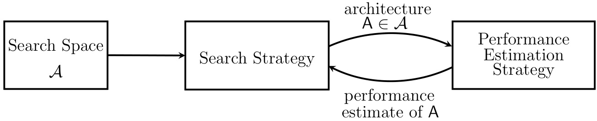
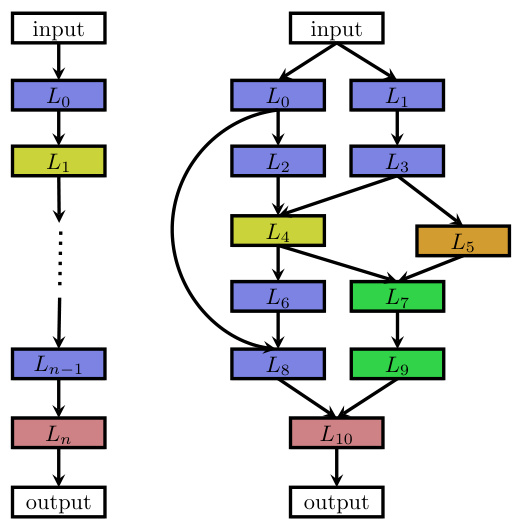
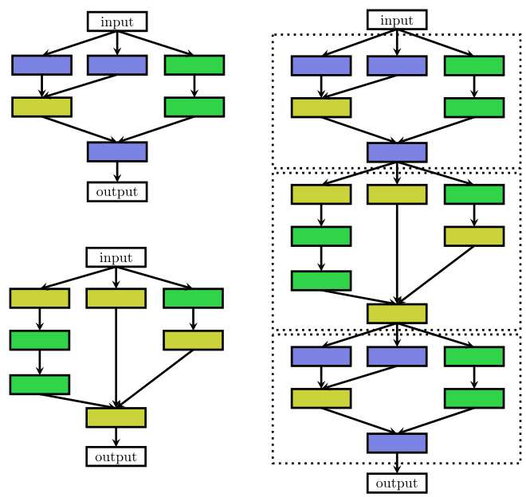
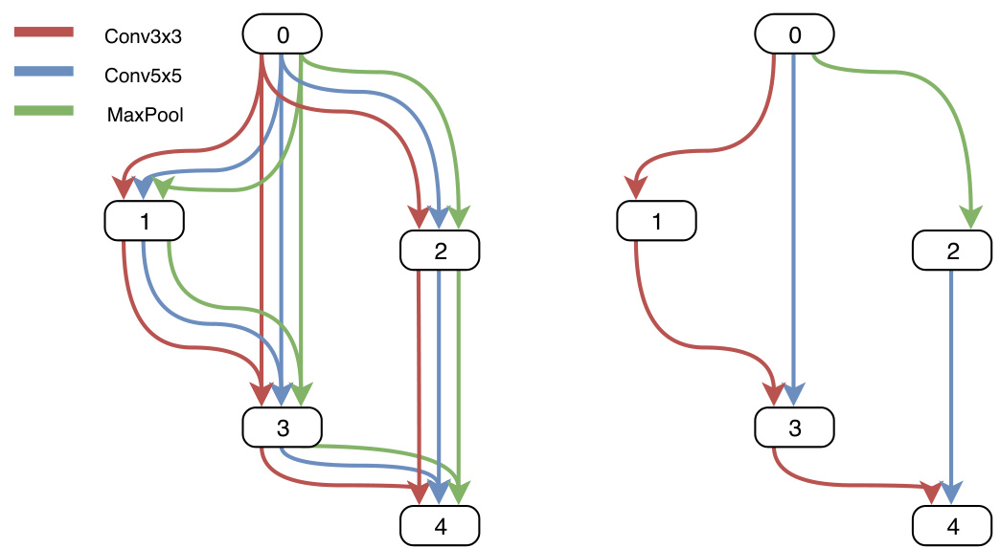

# Neural Architecture Search: A Survey  

Thomas Elsken Bosch Center for Artificial Intelligence 71272 Renningen, Germany and University of Freiburg  

thomas.elsken@de.bosch.com  

Jan Hendrik Metzen Bosch Center for Artificial Intelligence 71272 Renningen, Germany  

JanHendrik.Metzen@de.bosch.com  

Frank Hutter University of Freiburg 79110 Freiburg, Germany fh@cs.uni-freiburg.de  

Editor: Sebastian Nowozin  

# Abstract  

Deep Learning has enabled remarkable progress over the last years on a variety of tasks, such as image recognition, speech recognition, and machine translation. One crucial aspect for this progress are novel neural architectures. Currently employed architectures have mostly been developed manually by human experts, which is a time-consuming and errorprone process. Because of this, there is growing interest in automated neural architecture search methods. We provide an overview of existing work in this field of research and categorize them according to three dimensions: search space, search strategy, and performance estimation strategy.  

Keywords: Neural Architecture Search, AutoML, AutoDL, Search Space Design, Search Strategy, Performance Estimation Strategy  

# 1. Introduction  

The success of deep learning in perceptual tasks is largely due to its automation of the feature engineering process: hierarchical feature extractors are learned in an end-to-end fashion from data rather than manually designed. This success has been accompanied, however, by a rising demand for architecture engineering, where increasingly more complex neural architectures are designed manually. Neural Architecture Search (NAS), the process of automating architecture engineering, is thus a logical next step in automating machine learning. Already by now, NAS methods have outperformed manually designed architectures on some tasks such as image classification (Zoph et al., 2018; Real et al., 2019), object detection (Zoph et al., 2018) or semantic segmentation (Chen et al., 2018). NAS can be seen as subfield of AutoML (Hutter et al., 2019) and has significant overlap with hyperparameter optimization (Feurer and Hutter, 2019) and meta-learning (Vanschoren, 2019). We categorize methods for NAS according to three dimensions: search space, search strategy, and performance estimation strategy:  

  
Figure 1: Abstract illustration of Neural Architecture Search methods. A search strategy selects an architecture A from a predefined search space $$ . The architecture is passed to a performance estimation strategy, which returns the estimated performance of $$ to the search strategy.  

Search Space. The search space defines which architectures can be represented in principle. Incorporating prior knowledge about typical properties of architectures well-suited for a task can reduce the size of the search space and simplify the search. However, this also introduces a human bias, which may prevent finding novel architectural building blocks that go beyond the current human knowledge.  

Search Strategy. The search strategy details how to explore the search space (which is often exponentially large or even unbounded). It encompasses the classical exploration-exploitation trade-off since, on the one hand, it is desirable to find well-performing architectures quickly, while on the other hand, premature convergence to a region of suboptimal architectures should be avoided.  

Performance Estimation Strategy. The objective of NAS is typically to find architectures that achieve high predictive performance on unseen data. Performance Estimation refers to the process of estimating this performance: the simplest option is to perform a standard training and validation of the architecture on data, but this is unfortunately computationally expensive and limits the number of architectures that can be explored. Much recent research therefore focuses on developing methods that reduce the cost of these performance estimations.  

We refer to Figure 1 for an illustration. The article is also structured according to these three dimensions: we start with discussing search spaces in Section 2, cover search strategies in Section 3, and outline performance estimation methods in Section 4. We conclude with an outlook on future directions in Section 5.  

# 2. Search Space  

The search space defines which neural architectures a NAS approach might discover in principle. We now discuss common search spaces from recent works.  

A relatively simple search space is the space of chain-structured neural networks, as illustrated in Figure 2 (left). A chain-structured neural network architecture A can be written as a sequence of $$ layers, where the i’th layer $\boldsymbol { L } _ { i }$ receives its input from layer $i - 1$ and its output serves as the input for layer $i + 1$ , i.e., $\mathsf { A } = L _ { n } \circ . . . L _ { 1 } \circ L _ { 0 }$ . The search space is then parametrized by: (i) the (maximum) number of layers $$ (possibly unbounded); (ii) the type of operation every layer executes, e.g., pooling, convolution, or more advanced operations like depthwise separable convolutions (Chollet, 2016) or dilated convolutions (Yu and Koltun, 2016); and (iii) hyperparameters associated with the operation, e.g., number of filters, kernel size and strides for a convolutional layer (Baker et al., 2017a; Suganuma et al., 2017; Cai et al., 2018a), or simply number of units for fully-connected networks (Mendoza et al., 2016). Note that the parameters from (iii) are conditioned on (ii), hence the parametrization of the search space is not fixed-length but rather a conditional space.  

  
Figure 2: An illustration of different architecture spaces. Each node in the graphs corresponds to a layer in a neural network, e.g., a convolutional or pooling layer. Different layer types are visualized by different colors. An edge from layer $$ to layer $L _ { j }$ denotes that $L _ { j }$ receives the output of $$ as input. Left: an element of a chain-structured space. Right: an element of a more complex search space with additional layer types and multiple branches and skip connections.  

Recent work on NAS (Brock et al., 2017; Elsken et al., 2017; Zoph et al., 2018; Elsken et al., 2019; Real et al., 2019; Cai et al., 2018b) incorporates modern design elements known from hand-crafted architectures, such as skip connections, which allow to build complex, multi-branch networks, as illustrated in Figure 2 (right). In this case the input of layer $$ can be formally described as a function $g _ { i } ( L _ { i - 1 } ^ { o u t } , \dots , L _ { 0 } ^ { o u t } )$ combining previous layer outputs. Employing such a function results in significantly more degrees of freedom. Special cases of these multi-branch architectures are (i) the chain-structured networks (by setting $g _ { i } ( L _ { i - 1 } ^ { o u t } , \dots , L _ { 0 } ^ { o u t } ) = L _ { i - 1 } ^ { o u t }$ ), (ii) Residual Networks (He et al., 2016), where previous layer outputs−are summed $( g _ { i } ( L _ { i - 1 } ^ { o u t } , \ldots , L _ { 0 } ^ { o u t } ) = L _ { i - 1 } ^ { o u t } + L _ { j } ^ { o u t } , j < i - 1 )$ and (iii) DenseNets (Huang et al., 2017), where prev−ious layer outputs−are concatenated $( g _ { i } ( L _ { i - 1 } ^ { o u t } , . . . , L _ { 0 } ^ { o u t } ) =$ $c o n c a t ( L _ { i - 1 } ^ { o u t } , \dots , L _ { 0 } ^ { o u t } ) )$ .  

Motivated by hand-crafted architectures consisting of repeated motifs (Szegedy et al., 2016; He et al., 2016; Huang et al., 2017), Zoph et al. (2018) and Zhong et al. (2018a) propose to search for such motifs, dubbed cells or blocks, respectively, rather than for whole architectures. Zoph et al. (2018) optimize two different kind of cells: a normal cell that preserves the dimensionality of the input and a reduction cell which reduces the spatial dimension. The final architecture is then built by stacking these cells in a predefined manner, as illustrated in Figure 3. This search space has three major advantages compared to the ones discussed above:  

  
Figure 3: Illustration of the cell search space. Left: Two different cells, e.g., a normal cell (top) and a reduction cell (bottom) (Zoph et al., 2018). Right: an architecture built by stacking the cells sequentially. Note that cells can also be combined in a more complex manner, such as in multi-branch spaces, by simply replacing layers with cells.  

1. The size of the search space is drastically reduced since cells usually consist of significantly less layers than whole architectures. For example, Zoph et al. (2018) estimate a seven-times speed-up compared to their previous work (Zoph and Le, 2017) while achieving better performance.   
2. Architectures built from cells can more easily be transferred or adapted to other data sets by simply varying the number of cells and filters used within a model. Indeed, Zoph et al. (2018) transfer cells optimized on CIFAR-10 to ImageNet and achieve state-of-the-art performance.   
3. Creating architectures by repeating building blocks has proven a useful design principle in general, such as repeating an LSTM block in RNNs or stacking a residual block.  

Consequently, this cell-based search space is also successfully employed by many recent works (Real et al., 2019; Liu et al., 2018a; Pham et al., 2018; Elsken et al., 2019; Cai et al., 2018b; Liu et al., 2019b; Zhong et al., 2018b). However, a new design-choice arises when using a cell-based search space, namely how to choose the macro-architecture: how many cells shall be used and how should they be connected to build the actual model? For example, Zoph et al. (2018) build a sequential model from cells, in which each cell receives the outputs of the two preceding cells as input, while Cai et al. (2018b) employ the high-level structure of well-known manually designed architectures, such as DenseNet (Huang et al., 2017), and use their cells within these models. In principle, cells can be combined arbitrarily, e.g., within the multi-branch space described above, by simply replacing layers with cells. Ideally, both the macro-architecture and the micro-architecture (i.e., the structure of the cells) should be optimized jointly instead of solely optimizing the micro-architecture; otherwise, one may easily end up having to do manual macro-architecture engineering after finding a well-performing cell. One step in the direction of optimizing macro-architectures is the hierarchical search space introduced by Liu et al. (2018b), which consists of several levels of motifs. The first level consists of the set of primitive operations, the second level of different motifs that connect primitive operations via a directed acyclic graph, the third level of motifs that encode how to connect second-level motifs, and so on. The cell-based search space can be seen as a special case of this hierarchical search space where the number of levels is three, the second level motifs correspond to the cells, and the third level is the hard-coded macro-architecture.  

The choice of the search space largely determines the difficulty of the optimization problem: even for the case of the search space based on a single cell with fixed macroarchitecture, the optimization problem remains (i) non-continuous and (ii) relatively highdimensional (since more complex models tend to perform better, resulting in more design choices).  

We note that the architectures in many search spaces can be written as fixed-length vectors; e.g., the search space for each of the two cells by Zoph et al. (2018) can be written as a 40-dimensional $$ search space with categorical dimensions, each of which chooses between a small number of different building blocks and inputs. Unbounded search spaces can be constrained to have a (potentially very large, but finite) number of layers, which again gives rise to fixed-size search spaces with (potentially many) conditional dimensions.  

In the next section, we discuss Search Strategies that are well-suited for these kinds of search spaces.  

# 3. Search Strategy  

Many different search strategies can be used to explore the space of neural architectures, including random search, Bayesian optimization, evolutionary methods, reinforcement learning (RL), and gradient-based methods. Historically, evolutionary algorithms were already used by many researchers to evolve neural architectures (and often also their weights) decades ago (see, e.g., Angeline et al., 1994; Stanley and Miikkulainen, 2002; Floreano et al., 2008; Stanley et al., 2009; Jozefowicz et al., 2015). Yao (1999) provides a literature review of work earlier than 2000.  

Bayesian optimization celebrated several early successes in NAS since 2013, leading to state-of-the-art vision architectures (Bergstra et al., 2013), state-of-the-art performance for CIFAR-10 without data augmentation (Domhan et al., 2015), and the first automaticallytuned neural networks to win on competition data sets against human experts (Mendoza et al., 2016). NAS became a mainstream research topic in the machine learning community after Zoph and Le (2017) obtained competitive performance on the CIFAR-10 and Penn Treebank benchmarks with a search strategy based on reinforcement learning. While Zoph and Le (2017) used vast computational resources to achieve this result (800 GPUs for three to four weeks), after their work, a wide variety of methods have been published in quick succession to reduce the computational costs and achieve further improvements in performance.  

To frame NAS as a reinforcement learning (RL) problem (Baker et al., 2017a; Zoph and Le, 2017; Zhong et al., 2018a; Zoph et al., 2018), the generation of a neural architecture can be considered to be the agent’s action, with the action space identical to the search space. The agent’s reward is based on an estimate of the performance of the trained architecture on unseen data (see Section 4). Different RL approaches differ in how they represent the agent’s policy and how they optimize it: Zoph and Le (2017) use a recurrent neural network (RNN) policy to sequentially sample a string that in turn encodes the neural architecture. They initially trained this network with the REINFORCE policy gradient algorithm (Williams, 1992), but in their follow-up work (Zoph et al., 2018) use Proximal Policy Optimization (Schulman et al., 2017) instead. Baker et al. (2017a) use Q-learning to train a policy which sequentially chooses a layer’s type and corresponding hyperparameters.  

An alternative view of these approaches is as sequential decision processes in which the policy samples actions to generate the architecture sequentially, the environment’s “state” contains a summary of the actions sampled so far, and the (undiscounted) reward is obtained only after the final action. However, since no interaction with an environment occurs during this sequential process (no external state is observed, and there are no intermediate rewards), we find it more intuitive to interpret the architecture sampling process as the sequential generation of a single action; this simplifies the RL problem to a stateless multi-armed bandit problem.  

A related approach was proposed by Cai et al. (2018a), who frame NAS as a sequential decision process: in their approach the state is the current (partially trained) architecture, the reward is an estimate of the architecture’s performance, and the action corresponds to an application of function-preserving mutations, dubbed network morphisms (Chen et al., 2016; Wei et al., 2017), see also Section 4, followed by a training phase of the network. In order to deal with variable-length network architectures, they use a bi-directional LSTM to encode architectures into a fixed-length representation. Based on this encoded representation, actor networks decide on the sampled action. The combination of these two components constitute the policy, which is trained end-to-end with the REINFORCE policy gradient algorithm. We note that this approach will not visit the same state (architecture) twice.  

An alternative to using RL are neuro-evolutionary approaches that use evolutionary algorithms for optimizing the neural architecture. The first such approach for designing neural networks we are aware of dates back almost three decades: Miller et al. (1989)  

use genetic algorithms to propose architectures and use backpropagation to optimize their weights. Many neuro-evolutionary approaches since then (Angeline et al., 1994; Stanley and Miikkulainen, 2002; Stanley et al., 2009) use genetic algorithms to optimize both the neural architecture and its weights; however, when scaling to contemporary neural architectures with millions of weights for supervised learning tasks, SGD-based weight optimization methods currently outperform evolutionary ones.2 More recent neuro-evolutionary approaches (Real et al., 2017; Suganuma et al., 2017; Liu et al., 2018b; Real et al., 2019; Miikkulainen et al., 2017; Xie and Yuille, 2017; Elsken et al., 2019) therefore again use gradient-based methods for optimizing weights and solely use evolutionary algorithms for optimizing the neural architecture itself. Evolutionary algorithms evolve a population of models, i.e., a set of (possibly trained) networks; in every evolution step, at least one model from the population is sampled and serves as a parent to generate offsprings by applying mutations to it. In the context of NAS, mutations are local operations, such as adding or removing a layer, altering the hyperparameters of a layer, adding skip connections, as well as altering training hyperparameters. After training the offsprings, their fitness (e.g., performance on a validation set) is evaluated and they are added to the population.  

Neuro-evolutionary methods differ in how they sample parents, update populations, and generate offsprings. For example, Real et al. (2017), Real et al. (2019), and Liu et al. (2018b) use tournament selection (Goldberg and Deb, 1991) to sample parents, whereas Elsken et al. (2019) sample parents from a multi-objective Pareto front using an inverse density. Real et al. (2017) remove the worst individual from a population, while Real et al. (2019) found it beneficial to remove the oldest individual (which decreases greediness), and Liu et al. (2018b) do not remove individuals at all. To generate offspring, most approaches initialize child networks randomly, while Elsken et al. (2019) employ Lamarckian inheritance, i.e, knowledge (in the form of learned weights) is passed on from a parent network to its children by using network morphisms. Real et al. (2017) also let an offspring inherit all parameters of its parent that are not affected by the applied mutation; while this inheritance is not strictly function-preserving it might also speed up learning compared to a random initialization. Moreover, they also allow mutating the learning rate which can be seen as a way for optimizing the learning rate schedule during NAS. We refer to Stanley et al. (2019) for a recent in-depth review on neuro-evolutionary methods.  

Real et al. (2019) conduct a case study comparing RL, evolution, and random search (RS), concluding that RL and evolution perform equally well in terms of final test accuracy, with evolution having better anytime performance and finding smaller models. Both approaches consistently perform better than RS in their experiments, but with a rather small margin: RS achieved test errors of approximately 4% on CIFAR-10, while RL and evolution reached approximately $3 . 5 \%$ (after “model augmentation” where depth and number of filters was increased; the difference on the non-augmented space actually used for the search was approx. $2 \%$ ). The difference was even smaller for Liu et al. (2018b), who reported a test error of $3 . 9 \%$ on CIFAR-10 and a top-1 validation error of $2 1 . 0 \%$ on ImageNet for RS, compared to $3 . 7 5 \%$ and $2 0 . 3 \%$ for their evolution-based method, respectively.  

Bayesian Optimization (BO, see, e.g., (Shahriari et al., 2016)) is one of the most popular methods for hyperparameter optimization, but it has not been applied to NAS by many groups since typical BO toolboxes are based on Gaussian processes and focus on lowdimensional continuous optimization problems. Swersky et al. (2013) and Kandasamy et al. (2018) derive kernel functions for architecture search spaces in order to use classic GP-based BO methods. In contrast, several works use tree-based models (in particular, tree Parzen estimators (Bergstra et al., 2011), or random forests (Hutter et al., 2011)) to effectively search high-dimensional conditional spaces and achieve state-of-the-art performance on a wide range of problems, optimizing both neural architectures and their hyperparameters jointly (Bergstra et al., 2013; Domhan et al., 2015; Mendoza et al., 2016; Zela et al., 2018). While a full comparison is lacking, there is preliminary evidence that these approaches can also outperform evolutionary algorithms (Klein et al., 2018).  

Negrinho and Gordon (2017) and Wistuba (2017) exploit the tree-structure of their search space and use Monte Carlo Tree Search. Elsken et al. (2017) propose a simple yet well performing hill climbing algorithm that discovers high-quality architectures by greedily moving in the direction of better performing architectures without requiring more sophisticated exploration mechanisms.  

While the methods above employ a discrete search space, Liu et al. (2019b) propose a continuous relaxation to enable direct gradient-based optimization: instead of fixing a single operation $$ (e.g., convolution or pooling) to be executed at a specific layer, the authors compute a convex combination from a set of operations $\left\{ o _ { 1 } , \ldots , o _ { m } \right\}$ . More specifically, given a layer input $$ , the layer output $$ is computed as $\begin{array} { r } { y = \sum _ { i = 1 } ^ { m } \alpha _ { i } o _ { i } ( x ) , \alpha _ { i } \geq 0 , \sum _ { i = 1 } ^ { m } \alpha _ { i } = 1 } \end{array}$ , where the convex coefficients $$ effectively parametrize the network architecture. Liu et al. (2019b) then optimize both the network weights and the network architecture by alternating gradient descent steps on training data for weights and on validation data for architectural parameters such as $$ . Eventually, a discrete architecture is obtained by choosing the operation $$ with $i ^ { * } = \arg \operatorname* { m a x } _ { i } \alpha _ { i }$ for every layer. Instead of optimizing a weighting $$ of possible operations, Xie et al. (2019); Cai et al. (2019) propose to optimize a parametrized distribution over the possible operations. Shin et al. (2018) and Ahmed and Torresani (2018) also employ gradient-based optimization of neural architectures, however focusing on optimizing layer hyperparameters or connectivity patterns, respectively.  

# 4. Performance Estimation Strategy  

The search strategies discussed in Section 3 aim at finding a neural architecture A that maximizes some performance measure, such as accuracy on unseen data. To guide their search process, these strategies need to estimate the performance of a given architecture A they consider. The simplest way of doing this is to train A on training data and evaluate its performance on validation data. However, training each architecture to be evaluated from scratch frequently yields computational demands in the order of thousands of GPU days for NAS (Zoph and Le, 2017; Real et al., 2017; Zoph et al., 2018; Real et al., 2019). This naturally leads to developing methods for speeding up performance estimation, which we will now discuss. We refer to Table 4 for an overview of existing methods.  

Performance can be estimated based on lower fidelities of the actual performance after full training (also denoted as proxy metrics). Such lower fidelities include shorter training times (Zoph et al., 2018; Zela et al., 2018), training on a subset of the data (Klein et al., 2017b), on lower-resolution images (Chrabaszcz et al., 2017), or with less filters per layer and less cells (Zoph et al., 2018; Real et al., 2019). While these low-fidelity approximations reduce the computational cost, they also introduce bias in the estimate as performance will typically be underestimated. This may not be problematic as long as the search strategy only relies on ranking different architectures and the relative ranking remains stable. However, recent results indicate that this relative ranking can change dramatically when the difference between the cheap approximations and the “full” evaluation is too big (Zela et al., 2018), arguing for a gradual increase in fidelities (Li et al., 2017; Falkner et al., 2018).  

Table 1: Overview of different methods for speeding up performance estimation in NAS.   

<html><body><table><tr><td>Speed-up method</td><td>How are speed-ups achieved?</td><td>References</td></tr><tr><td>Lower fidelity</td><td>training for fewer epochs,on</td><td>Zoph et al. (2018), Zela et al. (2018), Falkner et al. (2018),</td></tr><tr><td>Learning Curve Extrapolation</td><td>performance can be extrapolated</td><td>Domhan et al. (2015), Klein et al. (2017a),</td></tr><tr><td>Weight Inheritance/ Network Morphisms</td><td>scratch, they are warm-started by inheriting weights of, e.g., a</td><td>Elsken et al. (2017), Elsken et al. (2019),</td></tr><tr><td>Weight Sharing</td><td>then shared across different architectures that are just</td><td>Bender et al. (2018), Liu et al. (2019b), Cai et al. (2019),</td></tr></table></body></html>  

Another possible way of estimating an architecture’s performance builds upon learning curve extrapolation (Swersky et al., 2014; Domhan et al., 2015; Klein et al., 2017a; Baker et al., 2017b; Rawal and Miikkulainen, 2018). Domhan et al. (2015) propose to extrapolate initial learning curves and terminate those predicted to perform poorly to speed up the architecture search process. Swersky et al. (2014), Klein et al. (2017a), Baker et al. (2017b), and Rawal and Miikkulainen (2018) also consider architectural hyperparameters for predicting which partial learning curves are most promising. Training a surrogate model for predicting the performance of novel architectures is also proposed by Liu et al. (2018a), who do not employ learning curve extrapolation but support predicting performance based on architectural/cell properties and extrapolate to architectures/cells with larger size than seen during training. The main challenge for predicting the performances of neural architectures is that, in order to speed up the search process, good predictions in a relatively large search space need to be made based on relatively few evaluations.  

Another approach to speed up performance estimation is to initialize the weights of novel architectures based on weights of other architectures that have been trained before. One way of achieving this, dubbed network morphisms (Wei et al., 2016), allows modifying an architecture while leaving the function represented by the network unchanged, resulting in methods that only require a few GPU days (Elsken et al., 2017; Cai et al., 2018a,b; Jin et al., 2018). This allows increasing the capacity of networks successively and retaining high performance without requiring training from scratch. Continuing training for a few epochs can also make use of the additional capacity introduced by network morphisms. An advantage of these approaches is that they allow search spaces without an inherent upper bound on the architecture’s size (Elsken et al., 2017); on the other hand, strict network morphisms can only make architectures larger and may thus lead to overly complex architectures. This can be attenuated by employing approximate network morphisms that allow shrinking architectures (Elsken et al., 2019).  

One-Shot Architecture Search (see Figure 4) treats all architectures as different subgraphs of a supergraph (the one-shot model) and shares weights between architectures that have edges of this supergraph in common (Saxena and Verbeek, 2016; Brock et al., 2017; Pham et al., 2018; Liu et al., 2019b; Bender et al., 2018; Cai et al., 2019; Xie et al., 2019). Only the weights of a single one-shot model need to be trained (in one of various ways), and architectures (which are just subgraphs of the one-shot model) can then be evaluated without any separate training by inheriting trained weights from the one-shot model. This greatly speeds up performance estimation of architectures, since no training is required (only evaluating performance on validation data), again resulting in methods that only require a few GPU days. The one-shot model typically incurs a large bias as it underestimates the actual performance of the best architectures severely; nevertheless, it allows ranking architectures, which would be sufficient if the estimated performance correlates strongly with the actual performance. However, it is currently not clear if this is actually the case (Bender et al., 2018; Sciuto et al., 2019).  

Different one-shot NAS methods differ in how the one-shot model is trained: ENAS (Pham et al., 2018) learns a RNN controller that samples architectures from the search space and trains the one-shot model based on approximate gradients obtained through REINFORCE. DARTS (Liu et al., 2019b) optimizes all weights of the one-shot model jointly with a continuous relaxation of the search space, obtained by placing a mixture of candidate operations on each edge of the one-shot model. Instead of optimizing real-valued weights on the operations as in DARTS, SNAS (Xie et al., 2019) optimizes a distribution over the candidate operations. The authors employ the concrete distribution (Maddison et al., 2017; Jang et al., 2017) and reparametrization (Kingma and Welling, 2014) to relax the discrete distribution and make it differentiable, enabling optimization via gradient descent. To overcome the necessity of keeping the entire one-shot model in the GPU memory, ProxylessNAS (Cai et al., 2019) “binarizes” the architectural weights, masking out all but one edge per operation. The probabilities for an edge being either masked out or not are then learned by sampling a few binarized architectures and using BinaryConnect (Courbariaux et al., 2015) to update the corresponding probabilities. Bender et al. (2018) only train the one-shot model once and show that this is sufficient when deactivating parts of this model stochastically during training using path dropout.  

  
Figure 4: Illustration of one-shot architecture search. Simple network with an input node (denoted as $$ ), three hidden nodes (denoted as 1,2,3) and one output node (denoted as 4). Instead of applying a single operation (such as a 3x3 convolution) to a node, the one-shot model (left) contains several candidate operations for every node, namely 3x3 convolution (red edges), 5x5 convolution (blue edges) and MaxPooling (green edges) in the above illustration. Once the one-shot model is trained, its weights are shared across different architectures, which are simply subgraphs of the one-shot model (right). Figure inspired by Liu et al. (2019b).  

While the previously mentioned approaches optimize a distribution over architectures during training, the approach of Bender et al. (2018) can be seen as using a fixed distribution. The high performance obtainable by the latter indicates that the combination of weight sharing and a fixed (carefully chosen) distribution might (perhaps surprisingly) be the only required ingredients for one-shot NAS. Related to these approaches is metalearning of hypernetworks that generate weights for novel architectures and thus requires only training the hypernetwork but not the architectures themselves (Brock et al., 2017; Zhang et al., 2019). The main difference here is that weights are not strictly shared but generated by the shared hypernetwork (conditional on the sampled architecture).  

A general limitation of one-shot NAS is that the supergraph defined a priori restricts the search space to its subgraphs. Moreover, approaches which require that the entire supergraph resides in GPU memory during architecture search will be restricted to relatively small supergraphs and search spaces accordingly, and are thus typically used in combination with cell-based search spaces. While approaches based on weight sharing have substantially reduced the computational resources required for NAS (from thousands to a few GPU days), it is currently not well understood which biases they introduce into the search if the sampling distribution of architectures is optimized along with the one-shot model instead of fixing it (Bender et al., 2018). For instance, an initial bias in exploring certain parts of the search space more than others might lead to the weights of the one-shot model being better adapted for these architectures, which in turn would reinforce the bias of the search to these parts of the search space. This might result in premature convergence of NAS or little correlation between the one-shot and true performance of an architecture (Sciuto et al.,  

2019). In general, a more systematic analysis of biases introduced by different performance estimators would be a desirable direction for future work.  

# 5. Future Directions  

In this section, we discuss several current and future directions for research on NAS. Most existing work has focused on NAS for image classification. On the one hand, this provides a challenging benchmark since a lot of manual engineering has been devoted to finding architectures that perform well in this domain and are not easily outperformed by NAS. On the other hand, it is relatively easy to define a well-suited search space by exploiting knowledge from manual engineering. This in turn makes it unlikely that NAS will find architectures that substantially outperform existing ones considerably since the found architectures cannot differ fundamentally. We thus consider it important to go beyond image classification problems by applying NAS to less explored domains. Notable first steps in this direction have been taken in image restoration (Suganuma et al., 2018), semantic segmentation (Chen et al., 2018; Nekrasov et al., 2018; Liu et al., 2019a), transfer learning (Wong et al., 2018), machine translation (So et al., 2019), reinforcement learning (Runge et al., 2019)3, as well as optimizing recurrent neural networks (Greff et al., 2015; Jozefowicz et al., 2015; Zoph and Le, 2017; Rawal and Miikkulainen, 2018), e.g., for language or music modeling. Further promising application areas for NAS would be generative adversarial networks or sensor fusion.  

An additional promising direction is to develop NAS methods for multi-task problems (Liang et al., 2018; Meyerson and Miikkulainen, 2018) and for multi-objective problems (Elsken et al., 2019; Dong et al., 2018; Zhou et al., 2018), in which measures of resource efficiency are used as objectives along with the predictive performance on unseen data. We highlight that multi-objective NAS is closely related to network compression (Han et al., 2016; Cheng et al., 2018): both aim at finding well-performing but efficient architectures. Hence, some compression methods can also be seen as NAS methods (Han et al., 2015; Liu et al., 2017; Gordon et al., 2018; Liu et al., 2019c; Cao et al., 2019) and vice versa (Saxena and Verbeek, 2016; Liu et al., 2019b; Xie et al., 2019).  

Likewise, it would be interesting to extend RL/bandit approaches, such as those discussed in Section 3, to learn policies that are conditioned on a state that encodes task properties/resource requirements (i.e., turning the setting into a contextual bandit). A similar direction was followed by Ramachandran and Le (2018) in extending one-shot NAS to generate different architectures depending on the task or instance on-the-fly. Moreover, applying NAS to searching for architectures that are more robust to adversarial examples (Cubuk et al., 2017) is an intriguing recent direction.  

Related to this is research on defining more general and flexible search spaces. For instance, while the cell-based search space provides high transferability between different image classification tasks, it is largely based on human experience on image classification and does not generalize easily to other domains where the hard-coded hierarchical structure (repeating the same cells several times in a chain-like structure) does not apply (e.g., semantic segmentation or object detection). A search space which allows representing and identifying more general hierarchical structure would thus make NAS more broadly applicable, see Liu et al. (2018b, 2019a) for first work in this direction. Moreover, common search spaces are also based on predefined building blocks, such as different kinds of convolutions and pooling, but do not allow identifying novel building blocks on this level; going beyond this limitation might substantially increase the power of NAS.  

The comparison of different methods for NAS and even the reproducibility of published results $$ is complicated by the fact that measurements of an architecture’s performance depend on many factors other than the architecture itself. While most authors report results on the CIFAR-10 data set, experiments often differ with regard to search space, computational budget, data augmentation, training procedures, regularization, and other factors. For example, for CIFAR-10, performance substantially improves when using a cosine annealing learning rate schedule (Loshchilov and Hutter, 2017), data augmentation by CutOut (Devries and Taylor, 2017), by MixUp (Zhang et al., 2017) or by a combination of factors (Cubuk et al., 2018), and regularization by Shake-Shake regularization (Gastaldi, 2017) or ScheduledDropPath (Zoph et al., 2018). It is therefore conceivable that improvements in these ingredients have a larger impact on reported performance numbers than the better architectures found by NAS. We thus consider the definition of common benchmarks to be crucial for a fair comparison of different NAS methods. A first step in this direction is the benchmark proposed by Ying et al. (2019), where a search space consisting of approximately 423,000 unique convolutional architectures is considered. Each element of this space was pre-trained and evaluated multiple times, resulting in a data set containing training, validation and test accuracies as well as training times and model sizes for different training budgets for multiple runs. Different search strategies can hence be compared with low computational resources on this benchmark by simply querying the pre-computed data set. In a smaller previous study, Klein et al. (2018) pre-evaluated the joint space of neural architectures and hyperparameters. It would also be interesting to evaluate NAS methods not in isolation but as part of a full open-source AutoML system, where also hyperparameters (Mendoza et al., 2016; Real et al., 2017; Zela et al., 2018), and data augmentation pipeline (Cubuk et al., 2018) are optimized along with NAS.  

While NAS has achieved impressive performance, so far it provides little insights into why specific architectures work well and how similar the architectures derived in independent runs would be. Identifying common motifs, providing an understanding why those motifs are important for high performance, and investigating if these motifs generalize over different problems would be desirable.  

# Acknowledgments  

We would like to thank Arber Zela, Esteban Real, Gabriel Bender, Kenneth Stanley, Thomas Pfeil and the anonymous reviewers for feedback on this survey. This work has partly been supported by the European Research Council (ERC) under the European Unions Horizon 2020 research and innovation programme under grant no. 716721.  

References   
Karim Ahmed and Lorenzo Torresani. Maskconnect: Connectivity learning by gradient descent. In European Conference on Computer Vision (ECCV), 2018.   
Peter J. Angeline, Gregory M. Saunders, and Jordan B. Pollack. An evolutionary algorithm that constructs recurrent neural networks. IEEE transactions on neural networks, 5 1: 54–65, 1994.   
Bowen Baker, Otkrist Gupta, Nikhil Naik, and Ramesh Raskar. Designing neural network architectures using reinforcement learning. In International Conference on Learning Representations, 2017a.   
Bowen Baker, Otkrist Gupta, Ramesh Raskar, and Nikhil Naik. Accelerating Neural Architecture Search using Performance Prediction. In NIPS Workshop on Meta-Learning, 2017b.   
Gabriel Bender, Pieter-Jan Kindermans, Barret Zoph, Vijay Vasudevan, and Quoc Le. Understanding and simplifying one-shot architecture search. In International Conference on Machine Learning, 2018.   
James Bergstra, Dan Yamins, and David D. Cox. Making a science of model search: Hyperparameter optimization in hundreds of dimensions for vision architectures. In ICML, 2013.   
James S. Bergstra, R´emi Bardenet, Yoshua Bengio, and Bal´azs Ke´gl. Algorithms for hyperparameter optimization. In J. Shawe-Taylor, R. S. Zemel, P. L. Bartlett, F. Pereira, and K. Q. Weinberger, editors, Advances in Neural Information Processing Systems 24, pages 2546–2554, 2011.   
Andrew Brock, Theodore Lim, James M. Ritchie, and Nick Weston. SMASH: one-shot model architecture search through hypernetworks. In NIPS Workshop on Meta-Learning, 2017.   
Han Cai, Tianyao Chen, Weinan Zhang, Yong Yu, and Jun Wang. Efficient architecture search by network transformation. In Association for the Advancement of Artificial Intelligence, 2018a.   
Han Cai, Jiacheng Yang, Weinan Zhang, Song Han, and Yong Yu. Path-Level Network Transformation for Efficient Architecture Search. In International Conference on Machine Learning, June 2018b.   
Han Cai, Ligeng Zhu, and Song Han. ProxylessNAS: Direct neural architecture search on target task and hardware. In International Conference on Learning Representations, 2019.   
Shengcao Cao, Xiaofang Wang, and Kris M. Kitani. Learnable embedding space for efficient neural architecture compression. In International Conference on Learning Representations, 2019.   
Liang-Chieh Chen, Maxwell Collins, Yukun Zhu, George Papandreou, Barret Zoph, Florian Schroff, Hartwig Adam, and Jon Shlens. Searching for efficient multi-scale architectures for dense image prediction. In S. Bengio, H. Wallach, H. Larochelle, K. Grauman, N. CesaBianchi, and R. Garnett, editors, Advances in Neural Information Processing Systems 31, pages 8713–8724. Curran Associates, Inc., 2018. URL http://papers.nips.cc/paper/ 8087-searching-for-efficient-multi-scale-architectures-for-dense-image-prediction.pdf.   
Tianqi Chen, Ian J. Goodfellow, and Jonathon Shlens. Net2net: Accelerating learning via knowledge transfer. In International Conference on Learning Representations, 2016.   
Yu Cheng, Duo Wang, Pan Zhou, and Tao Zhang. Model compression and acceleration for deep neural networks: The principles, progress, and challenges. IEEE Signal Process. Mag., 35(1):126–136, 2018.   
Franc¸ois Chollet. Xception: Deep learning with depthwise separable convolutions. arXiv:1610.02357, 2016.   
Patryk Chrabaszcz, Ilya Loshchilov, and Frank Hutter. A downsampled variant of imagenet as an alternative to the CIFAR datasets. CoRR, abs/1707.08819, 2017.   
Patryk Chrabaszcz, Ilya Loshchilov, and Frank Hutter. Back to basics: Benchmarking canonical evolution strategies for playing atari. In Proceedings of the Twenty-Seventh International Joint Conference on Artificial Intelligence, IJCAI-18, pages 1419–1426. International Joint Conferences on Artificial Intelligence Organization, July 2018.   
Matthieu Courbariaux, Yoshua Bengio, and Jean-Pierre David. Binaryconnect: Training deep neural networks with binary weights during propagations. In C. Cortes, N. D. Lawrence, D. D. Lee, M. Sugiyama, and R. Garnett, editors, Advances in Neural Information Processing Systems 28, pages 3123–3131. Curran Associates, Inc., 2015.   
Ekin D. Cubuk, Barret Zoph, Samuel S. Schoenholz, and Quoc V. Le. Intriguing Properties of Adversarial Examples. In arXiv:1711.02846, November 2017.   
Ekin D. Cubuk, Barret Zoph, Dandelion Mane, Vijay Vasudevan, and Quoc V. Le. AutoAugment: Learning Augmentation Policies from Data. In arXiv:1805.09501, May 2018.   
Terrance Devries and Graham W. Taylor. Improved regularization of convolutional neural networks with cutout. arXiv preprint, abs/1708.04552, 2017.   
T. Domhan, J. T. Springenberg, and F. Hutter. Speeding up automatic hyperparameter optimization of deep neural networks by extrapolation of learning curves. In Proceedings of the 24th International Joint Conference on Artificial Intelligence (IJCAI), 2015.   
Jin-Dong Dong, An-Chieh Cheng, Da-Cheng Juan, Wei Wei, and Min Sun. Dpp-net: Device-aware progressive search for pareto-optimal neural architectures. In European Conference on Computer Vision, 2018.   
Thomas Elsken, Jan Hendrik Metzen, and Frank Hutter. Simple And Efficient Architecture  

Search for Convolutional Neural Networks. In NIPS Workshop on Meta-Learning, 2017.  

Thomas Elsken, Jan Hendrik Metzen, and Frank Hutter. Efficient multi-objective neural architecture search via lamarckian evolution. In International Conference on Learning Representations, 2019.   
Stefan Falkner, Aaron Klein, and Frank Hutter. BOHB: Robust and efficient hyperparameter optimization at scale. In Jennifer Dy and Andreas Krause, editors, Proceedings of the 35th International Conference on Machine Learning, volume 80 of Proceedings of Machine Learning Research, pages 1436–1445, Stockholmsmssan, Stockholm Sweden, 10–15 Jul 2018. PMLR.   
Matthias Feurer and Frank Hutter. Hyperparameter optimization. In Hutter et al. (2019), pages 3–38. In press, available at http://automl.org/book.   
Dario Floreano, Peter Drr, and Claudio Mattiussi. Neuroevolution: from architectures to learning. Evolutionary Intelligence, 1(1):47–62, 2008.   
Xavier Gastaldi. Shake-shake regularization. In International Conference on Learning Representations Workshop, 2017.   
David E. Goldberg and Kalyanmoy Deb. A comparative analysis of selection schemes used in genetic algorithms. In Foundations of Genetic Algorithms, pages 69–93. Morgan Kaufmann, 1991.   
Ariel Gordon, Elad Eban, Ofir Nachum, Bo Chen, Hao Wu, Tien-Ju Yang, and Edward Choi. Morphnet: Fast and simple resource-constrained structure learning of deep networks. In The IEEE Conference on Computer Vision and Pattern Recognition (CVPR), June 2018.   
Klaus Greff, Rupesh Kumar Srivastava, Jan Koutnk, Bas R. Steunebrink, and Jrgen Schmidhuber. Lstm: A search space odyssey. IEEE transactions on neural networks and learning systems, 28, 2015.   
Song Han, Jeff Pool, John Tran, and William Dally. Learning both weights and connections for efficient neural network. In C. Cortes, N. D. Lawrence, D. D. Lee, M. Sugiyama, and R. Garnett, editors, Advances in Neural Information Processing Systems 28, pages 1135–1143. Curran Associates, Inc., 2015. URL http://papers.nips.cc/ paper/5784-learning-both-weights-and-connections-for-efficient-neural-network.pdf.   
Song Han, Huizi Mao, and William J. Dally. Deep compression: Compressing deep neural networks with pruning, trained quantization and huffman coding. In International Conference on Learning Representations, 2016.   
Kaiming He, Xiangyu Zhang, Shaoqing Ren, and Jian Sun. Deep Residual Learning for Image Recognition. In Conference on Computer Vision and Pattern Recognition, 2016.   
Gao Huang, Zhuang Liu, and Kilian Q. Weinberger. Densely Connected Convolutional Networks. In Conference on Computer Vision and Pattern Recognition, 2017.   
F. Hutter, H. Hoos, and K. Leyton-Brown. Sequential model-based optimization for general algorithm configuration. In LION, pages 507–523, 2011.   
Frank Hutter, Lars Kotthoff, and Joaquin Vanschoren, editors. Automatic Machine Learning: Methods, Systems, Challenges. Springer, 2019. In press, available at http://automl.org/book.   
Eric Jang, Shixiang Gu, and Ben Poole. Categorical reparameterization with gumbelsoftmax. In International Conference on Learning Representations, 2017.   
Haifeng Jin, Qingquan Song, and Xia Hu. Auto-keras: Efficient neural architecture search with network morphism, 2018.   
Rafal Jozefowicz, Wojciech Zaremba, and Ilya Sutskever. An empirical exploration of recurrent network architectures. In Francis Bach and David Blei, editors, Proceedings of the 32nd International Conference on Machine Learning, volume 37 of Proceedings of Machine Learning Research, pages 2342–2350, Lille, France, 07–09 Jul 2015. PMLR.   
Kirthevasan Kandasamy, Willie Neiswanger, Jeff Schneider, Barnabas Poczos, and Eric P Xing. Neural architecture search with bayesian optimisation and optimal transport. In Advances in Neural Information Processing Systems 31. 2018.   
Diederik P. Kingma and Max Welling. Auto-encoding variational bayes. In International Conference on Learning Representations, 2014.   
A. Klein, S. Falkner, J. T. Springenberg, and F. Hutter. Learning curve prediction with Bayesian neural networks. In International Conference on Learning Representations, 2017a.   
Aaron Klein, Stefan Falkner, Simon Bartels, Philipp Hennig, and Frank Hutter. Fast Bayesian Optimization of Machine Learning Hyperparameters on Large Datasets. In Aarti Singh and Jerry Zhu, editors, Proceedings of the 20th International Conference on Artificial Intelligence and Statistics, volume 54 of Proceedings of Machine Learning Research, pages 528–536, Fort Lauderdale, FL, USA, 20–22 Apr 2017b. PMLR.   
Aaron Klein, Eric Christiansen, Kevin Murphy, and Frank Hutter. Towards reproducible neural architecture and hyperparameter search. In ICML 2018 Workshop on Reproducibility in ML (RML 2018), 2018.   
Liam Li and Ameet Talwalkar. Random search and reproducibility for neural architecture search. arXiv preprint, 2019.   
Lisha Li, Kevin Jamieson, Giulia DeSalvo, Afshin Rostamizadeh, and Ameet Talwalkar. Hyperband: bandit-based configuration evaluation for hyperparameter optimization. In International Conference on Learning Representations, 2017.   
Jason Liang, Elliot Meyerson, and Risto Miikkulainen. Evolutionary Architecture Search For Deep Multitask Networks. In arXiv:1803.03745, March 2018.   
Chenxi Liu, Barret Zoph, Maxim Neumann, Jonathon Shlens, Wei Hua, Li-Jia Li, Li FeiFei, Alan Yuille, Jonathan Huang, and Kevin Murphy. Progressive Neural Architecture Search. In European Conference on Computer Vision, 2018a.  

Chenxi Liu, Liang-Chieh Chen, Florian Schroff, Hartwig Adam, Wei Hua, Alan Yuille, and Li Fei-Fei. Auto-deeplab: Hierarchical neural architecture search for semantic image segmentation. arXiv preprint, 2019a.  

Hanxiao Liu, Karen Simonyan, Oriol Vinyals, Chrisantha Fernando, and Koray Kavukcuoglu. Hierarchical Representations for Efficient Architecture Search. In International Conference on Learning Representations, 2018b.   
Hanxiao Liu, Karen Simonyan, and Yiming Yang. DARTS: Differentiable architecture search. In International Conference on Learning Representations, 2019b.   
Zhuang Liu, Jianguo Li, Zhiqiang Shen, Gao Huang, Shoumeng Yan, and Changshui Zhang. Learning efficient convolutional networks through network slimming. 2017 IEEE International Conference on Computer Vision (ICCV), pages 2755–2763, 2017.   
Zhuang Liu, Mingjie Sun, Tinghui Zhou, Gao Huang, and Trevor Darrell. Rethinking the value of network pruning. In International Conference on Learning Representations, 2019c.   
I. Loshchilov and F. Hutter. Sgdr: Stochastic gradient descent with warm restarts. In International Conference on Learning Representations, 2017.   
Chris J. Maddison, Andriy Mnih, and Yee Whye Teh. The concrete distribution: A continuous relaxation of discrete random variables. In International Conference on Learning Representations, 2017.   
H. Mendoza, A. Klein, M. Feurer, J. Springenberg, and F. Hutter. Towards AutomaticallyTuned Neural Networks. In International Conference on Machine Learning, AutoML Workshop, June 2016.   
Elliot Meyerson and Risto Miikkulainen. Pseudo-task Augmentation: From Deep Multitask Learning to Intratask Sharing and Back. In arXiv:1803.03745, March 2018.   
Risto Miikkulainen, Jason Liang, Elliot Meyerson, Aditya Rawal, Dan Fink, Olivier Francon, Bala Raju, Hormoz Shahrzad, Arshak Navruzyan, Nigel Duffy, and Babak Hodjat. Evolving Deep Neural Networks. In arXiv:1703.00548, March 2017.   
G.F. Miller, P.M. Todd, and S.U Hedge. Designing neural networks using genetic algorithms. In 3rd International Conference on Genetic Algorithms (ICGA’89), 1989.   
R. Negrinho and G. Gordon. DeepArchitect: Automatically Designing and Training Deep Architectures. arXiv:1704.08792, 2017.   
Vladimir Nekrasov, Hao Chen, Chunhua Shen, and Ian D. Reid. Fast neural architecture search of compact semantic segmentation models via auxiliary cells. arXiv preprint, 2018.   
Hieu Pham, Melody Y. Guan, Barret Zoph, Quoc V. Le, and Jeff Dean. Efficient neural architecture search via parameter sharing. In International Conference on Machine Learning, 2018.   
Prajit Ramachandran and Quoc V. Le. Dynamic Network Architectures. In AutoML 2018 (ICML workshop), 2018.   
Aditya Rawal and Risto Miikkulainen. From Nodes to Networks: Evolving Recurrent Neural Networks. In arXiv:1803.04439, March 2018.   
Esteban Real, Sherry Moore, Andrew Selle, Saurabh Saxena, Yutaka Leon Suematsu, Quoc V. Le, and Alex Kurakin. Large-scale evolution of image classifiers. International Conference on Machine Learning, 2017.   
Esteban Real, Alok Aggarwal, Yanping Huang, and Quoc V. Le. Aging Evolution for Image Classifier Architecture Search. In AAAI, 2019.   
Frederic Runge, Danny Stoll, Stefan Falkner, and Frank Hutter. Learning to design RNA. In International Conference on Learning Representations, 2019.   
Tim Salimans, Jonathan Ho, Xi Chen, and Ilya Sutskever. Evolution strategies as a scalable alternative to reinforcement learning. arXiv preprint, 2017.   
Shreyas Saxena and Jakob Verbeek. Convolutional neural fabrics. In D. D. Lee, M. Sugiyama, U. V. Luxburg, I. Guyon, and R. Garnett, editors, Advances in Neural Information Processing Systems 29, pages 4053–4061. Curran Associates, Inc., 2016.   
John Schulman, Filip Wolski, Prafulla Dhariwal, Alec Radford, and Oleg Klimov. Proximal policy optimization algorithms. arXiv preprint, 2017.   
Christian Sciuto, Kaicheng Yu, Martin Jaggi, Claudiu Musat, and Mathieu Salzmann. Evaluating the search phase of neural architecture search. arXiv preprint, 2019.   
B. Shahriari, K. Swersky, Z. Wang, R. P. Adams, and N. de Freitas. Taking the human out of the loop: A review of bayesian optimization. Proceedings of the IEEE, 104(1):148–175, Jan 2016. ISSN 0018-9219. doi: 10.1109/JPROC.2015.2494218.   
Richard Shin, Charles Packer, and Dawn Song. Differentiable neural network architecture search. In International Conference on Learning Representations Workshop, 2018.   
David R. So, Chen Liang, and Quoc V. Le. The evolved transformer. arXiv preprint, 2019.   
Kenneth Stanley, Jeff Clune, Joel Lehman, and Risto Miikkulainen. Designing neural networks through neuroevolution. volume 1, 01 2019.   
Kenneth O Stanley and Risto Miikkulainen. Evolving neural networks through augmenting topologies. Evolutionary Computation, 10:99–127, 2002.   
Kenneth O. Stanley, David B. D’Ambrosio, and Jason Gauci. A hypercube-based encoding for evolving large-scale neural networks. Artif. Life, 15(2):185–212, April 2009. ISSN 1064-5462. doi: 10.1162/artl.2009.15.2.15202. URL http://dx.doi.org/10.1162/artl.2009. 15.2.15202.  

Felipe Petroski Such, Vashisht Madhavan, Edoardo Conti, Joel Lehman, Kenneth O. Stanley, and Jeff Clune. Deep neuroevolution: Genetic algorithms are a competitive alternative for training deep neural networks for reinforcement learning. arXiv preprint, 2017.  

Masanori Suganuma, Shinichi Shirakawa, and Tomoharu Nagao. A genetic programming approach to designing convolutional neural network architectures. In Genetic and Evolutionary Computation Conference, 2017.   
Masanori Suganuma, Mete Ozay, and Takayuki Okatani. Exploiting the potential of standard convolutional autoencoders for image restoration by evolutionary search. In Jennifer Dy and Andreas Krause, editors, Proceedings of the 35th International Conference on Machine Learning, volume 80 of Proceedings of Machine Learning Research, pages 4771–4780, Stockholmsmssan, Stockholm Sweden, 10–15 Jul 2018. PMLR.   
Kevin Swersky, David Duvenaud, Jasper Snoek, Frank Hutter, and Michael Osborne. Raiders of the lost architecture: Kernels for bayesian optimization in conditional parameter spaces. In NIPS Workshop on Bayesian Optimization in Theory and Practice, 2013.   
Kevin Swersky, Jasper Snoek, and Ryan Prescott Adams. Freeze-thaw bayesian optimization. 2014.   
Christian Szegedy, Vincent Vanhoucke, Sergey Ioffe, Jonathon Shlens, and Zbigniew Wojna. Rethinking the Inception Architecture for Computer Vision. In Conference on Computer Vision and Pattern Recognition, 2016.   
Joaquin Vanschoren. Meta-learning. In Hutter et al. (2019), pages 39–68. In press, available at http://automl.org/book.   
Tao Wei, Changhu Wang, Yong Rui, and Chang Wen Chen. Network morphism. In International Conference on Machine Learning, 2016.   
Tao Wei, Changhu Wang, and Chang Wen Chen. Modularized morphing of neural networks. arXiv:1701.03281, 2017.   
Ronald J. Williams. Simple statistical gradient-following algorithms for connectionist reinforcement learning. Machine Learning, 8(3):229–256, May 1992.   
Martin Wistuba. Finding Competitive Network Architectures Within a Day Using UCT. In arXiv:1712.07420, December 2017.   
Catherine Wong, Neil Houlsby, Yifeng Lu, and Andrea Gesmundo. Transfer learning with neural automl. In S. Bengio, H. Wallach, H. Larochelle, K. Grauman, N. Cesa-Bianchi, and R. Garnett, editors, Advances in Neural Information Processing Systems 31, pages 8366–8375. Curran Associates, Inc., 2018.   
Lingxi Xie and Alan Yuille. Genetic CNN. In International Conference on Computer Vision, 2017.   
Sirui Xie, Hehui Zheng, Chunxiao Liu, and Liang Lin. SNAS: stochastic neural architecture search. In International Conference on Learning Representations, 2019.   
Xin Yao. Evolving artificial neural networks. Proceedings of the IEEE, 87(9):1423–1447, Sept 1999. ISSN 0018-9219. doi: 10.1109/5.784219.   
Chris Ying, Aaron Klein, Esteban Real, Eric Christiansen, Kevin Murphy, and Frank Hutter. Nas-bench-101: Towards reproducible neural architecture search. arXiv preprint, 2019.   
Fisher Yu and Vladlen Koltun. Multi-scale context aggregation by dilated convolutions. 2016.   
Arber Zela, Aaron Klein, Stefan Falkner, and Frank Hutter. Towards automated deep learning: Efficient joint neural architecture and hyperparameter search. In ICML 2018 Workshop on AutoML (AutoML 2018), 2018.   
Chris Zhang, Mengye Ren, and Raquel Urtasun. Graph hypernetworks for neural architecture search. In International Conference on Learning Representations, 2019.   
Hongyi Zhang, Moustapha Ciss´e, Yann N. Dauphin, and David Lopez-Paz. mixup: Beyond empirical risk minimization. arXiv preprint, abs/1710.09412, 2017.   
Zhao Zhong, Junjie Yan, Wei Wu, Jing Shao, and Cheng-Lin Liu. Practical block-wise neural network architecture generation. In Proceedings of the IEEE Conference on Computer Vision and Pattern Recognition, pages 2423–2432, 2018a.   
Zhao Zhong, Zichen Yang, Boyang Deng, Junjie Yan, Wei Wu, Jing Shao, and ChengLin Liu. Blockqnn: Efficient block-wise neural network architecture generation. arXiv preprint, 2018b.   
Yanqi Zhou, Siavash Ebrahimi, Sercan Ark, Haonan Yu, Hairong Liu, and Greg Diamos. Resource-efficient neural architect. In arXiv:1806.07912, 2018.   
Barret Zoph and Quoc V. Le. Neural architecture search with reinforcement learning. In International Conference on Learning Representations, 2017.   
Barret Zoph, Vijay Vasudevan, Jonathon Shlens, and Quoc V. Le. Learning transferable architectures for scalable image recognition. In Conference on Computer Vision and Pattern Recognition, 2018.  